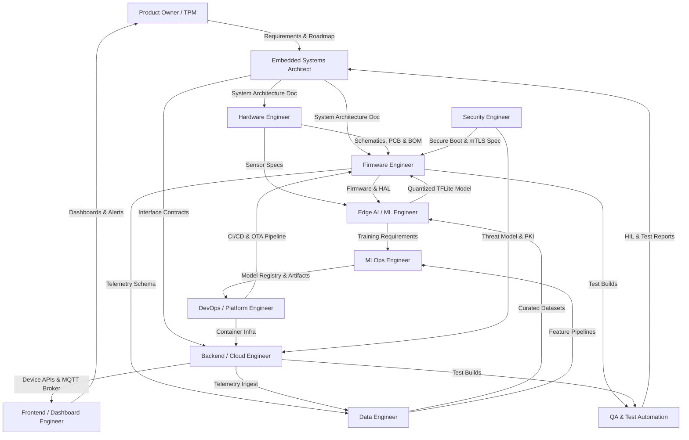

# Embedded/IoT AI Workflow Engineering Team: Roles, Skills, and Job Descriptions

## 1. Team Overview

This team researches, designs, develops, validates, deploys, and maintains a production-grade AI-driven IoT system spanning constrained edge devices (STM32, ESP32), Linux-class edge gateways (Raspberry Pi), hardware sensors, custom firmware, cloud connectivity (MQTT/CoAP), on-device ML inference (TinyML / TensorFlow Lite Micro), data infrastructure for training and monitoring, and production CI/CD with secure OTA delivery. The structure reflects the full end-to-end lifecycle and is intentionally lean: each role owns a distinct layer of the stack with explicit hand-off contracts to neighbors, so hardware, firmware, ML, data, cloud, and frontend work proceeds in parallel without overlap.

- **Embedded Systems Architect** — Defines end-to-end system architecture, compute/power budgets, protocol topology, and interface contracts across edge, gateway, and cloud.
- **Firmware Engineer** — Implements RTOS/bare-metal firmware, sensor drivers, connectivity stacks, and on-device inference integration.
- **Hardware Engineer** — Designs PCBs, power subsystems, and sensor electronics for field-deployable nodes.
- **Edge AI/ML Engineer** — Builds, trains, and compresses ML models to run within microcontroller memory/compute budgets.
- **MLOps Engineer** — Automates training-to-edge pipelines, model registry, conversion, and drift monitoring.
- **Data Engineer** — Builds telemetry ingestion, time-series storage, and reproducible training-data pipelines.
- **DevOps/Platform Engineer** — Owns CI/CD, fleet/OTA orchestration, infrastructure-as-code, and observability.
- **Backend/Cloud Engineer** — Builds the device-management plane, MQTT broker, APIs, and device twin state.
- **Frontend/Dashboard Engineer** — Builds real-time monitoring, visualization, and device-control interfaces.
- **QA & Test Automation Engineer** — Validates firmware, ML inference, and end-to-end flows via HIL and automation.
- **Product Owner / Technical Project Manager** — Owns roadmap, backlog, dependencies, and cross-functional delivery.
- **Security Engineer (Embedded/IoT Focus)** — Secures devices, transport, identity, and the fleet end-to-end.

---

## 2. Embedded Systems Architect

### 2.1 Job Description

- Defines the end-to-end system architecture across edge devices (STM32, ESP32), gateways (Raspberry Pi), and cloud, documenting compute, memory, and power budgets per node.
- Selects MCU/SoC platforms and partitions workloads between MCU-class targets (TinyML on Cortex-M) and MPU-class targets (Linux on Pi) based on inference latency, power envelope, and connectivity needs.
- Specifies the communication topology and protocols (MQTT/CoAP over Wi-Fi/BLE/LoRaWAN), defining QoS levels, payload schemas, and fallback behavior for intermittent connectivity.
- Establishes hardware abstraction boundaries and interface contracts (HAL layering, RTOS choice, message schemas) so firmware, ML, cloud, and frontend teams develop in parallel against stable interfaces.
- Defines the on-device ML deployment strategy: model format (TFLite Micro), tensor-arena sizing, and the split between edge inference and cloud-side aggregation.
- Sets non-functional requirements — real-time deadlines, power budget, OTA update path (A/B partitioning), and the security baseline — and records decisions as version-controlled ADRs.

### 2.2 Required Skills

**Hardware / Systems:**

- ARM Cortex-M and Cortex-A architecture; memory hierarchy reasoning (Flash/SRAM/PSRAM trade-offs).
- Power-domain and sleep-mode budgeting for battery/solar field nodes; sensor bus selection (I2C, SPI, UART, CAN).

**Firmware / Low-Level:**

- RTOS selection and trade-offs (Zephyr vs FreeRTOS vs bare-metal); interrupt/DMA-driven design.
- Bootloader and OTA partition design (A/B with rollback, MCUboot).

**Software / Middleware:**

- MQTT/CoAP topology design; message serialization with Protocol Buffers or CBOR.
- Edge gateway patterns (K3s, balena) and time-series data flow design.

**AI/ML Awareness:**

- TinyML deployment constraints; impact of INT8 quantization on accuracy, RAM, and flash.
- TFLite Micro operator support and latency/throughput estimation for Cortex-M targets.

**Tools & Processes:**

- Architecture modeling (C4, SysML), trade-study methodology, Architecture Decision Records (ADRs), and requirements traceability.

### 2.3 Collaboration Interfaces

- Works closely with the **Product Owner/TPM** (translates business/field requirements into technical constraints), **Hardware Engineer** (validates board feasibility and platform selection), **Edge AI/ML Engineer** (sizes memory arena and sets latency targets), and **Security Engineer** (embeds secure boot and mTLS into the design).
- Delivers to all engineering roles the **System Architecture Document**, **interface contracts**, and **protocol/schema specifications** that gate downstream development.

---

## 3. Firmware Engineer

### 3.1 Job Description

- Implements device firmware in C and C++17 (and embedded Rust where applicable) on STM32 (HAL/LL/CMSIS), ESP32 (ESP-IDF), and Raspberry Pi peripheral layers.
- Develops RTOS-based task structures under Zephyr/FreeRTOS: scheduling, IPC (queues, semaphores, mutexes), and ISR/DMA handling for deterministic, jitter-bounded sensor sampling.
- Writes peripheral and sensor drivers over I2C/SPI/UART and implements device-level sensor fusion and pre-filtering.
- Integrates the TensorFlow Lite Micro runtime: wires the inference loop, manages the tensor arena, and feeds quantized, preprocessed sensor windows to the model.
- Implements connectivity stacks (MQTT/CoAP with TLS) and a robust OTA mechanism using A/B partitions with rollback on boot failure.
- Optimizes for power and footprint: tickless idle, low-power modes, radio duty-cycling, and flash/SRAM profiling against the architect's budget.

### 3.2 Required Skills

**Hardware / Systems:**

- Register-level MCU programming; datasheet and reference-manual interpretation; oscilloscope and logic-analyzer debugging.
- Bus protocol mastery: I2C (pull-ups, clock stretching), SPI timing, UART, CAN.

**Firmware / Low-Level:**

- C, C++17, and embedded Rust; Zephyr and FreeRTOS; ESP-IDF; STM32 HAL/LL and CMSIS.
- Linker scripts and memory maps; bootloaders (MCUboot) and OTA image handling.

**Software / Middleware:**

- MQTT clients (Paho/Mosquitto), CoAP; mbedTLS/wolfSSL for transport security.
- Serialization with Protocol Buffers / CBOR.

**AI/ML Awareness:**

- TensorFlow Lite Micro integration and CMSIS-NN kernels; INT8 inference invocation; ring-buffer preprocessing matched to the ML preprocessing spec.

**Tools & Processes:**

- Git; CMake / West / PlatformIO builds; JTAG/SWD debugging (J-Link, OpenOCD, GDB); unit testing (Unity/Ceedling); static analysis (cppcheck, MISRA C).

### 3.3 Collaboration Interfaces

- Works closely with the **Hardware Engineer** (board bring-up, pin mux, errata), **Edge AI/ML Engineer** (model integration and preprocessing parity), **Embedded Systems Architect** (honors interface and memory contracts), **DevOps Engineer** (CI builds and OTA pipeline), and **QA Engineer** (HIL test builds).
- Delivers **production firmware binaries**, the **HAL/driver layer**, the **device telemetry schema**, and **OTA-ready signed images**.

---

## 4. Hardware Engineer

### 4.1 Job Description

- Designs schematics and multi-layer PCBs for sensor nodes and gateways around STM32, ESP32, and Raspberry Pi CM4, including power regulation, decoupling, and signal integrity.
- Defines the Bill of Materials, selects sensors (e.g., IMUs, environmental, current, soil-moisture for agricultural deployments), and verifies electrical compatibility with MCU I/O levels.
- Designs power subsystems for the field: battery/solar input, LDO/buck regulation, power sequencing, and quiescent/sleep-current optimization.
- Leads board bring-up jointly with firmware: validates rails, clocks, reset, and peripheral buses before software integration.
- Performs DFM/DFT, EMC pre-compliance, and environmental hardening (IP rating, operating temperature range, conformal coating) for outdoor IoT enclosures.
- Produces manufacturing and test documentation, plus bring-up and production test fixtures.

### 4.2 Required Skills

**Hardware / Systems:**

- Schematic capture and PCB layout (Altium, KiCad); mixed analog/digital design; power electronics.
- Signal integrity and basic RF/antenna layout for Wi-Fi/BLE/LoRa.

**Firmware / Low-Level Awareness:**

- MCU boot, clock-tree, and pin-mux requirements; JTAG/SWD header design; bus electrical specs (I2C pull-up sizing, SPI timing budgets).

**Software / Middleware:**

- SPICE simulation; electrical CAD tooling; BOM and PLM management.

**AI/ML Awareness:**

- Sensor selection driven by ML data needs — sampling rate, resolution, and dynamic range — so downstream model quality is achievable in hardware.

**Tools & Processes:**

- Lab instrumentation (oscilloscope, logic analyzer, multimeter, power analyzer); EMC pre-compliance; DFM/DFT; reliability testing (thermal cycling, vibration).

### 4.3 Collaboration Interfaces

- Works closely with the **Embedded Systems Architect** (validates platform feasibility), **Firmware Engineer** (board bring-up and errata), **Edge AI/ML Engineer** (sensor specs for data fidelity), and **Security Engineer** (secure-element placement, debug-port lockdown).
- Delivers **schematics**, **PCB layouts**, the **BOM**, **board specifications**, and **bring-up reports**.

---

## 5. Edge AI/ML Engineer

### 5.1 Job Description

- Designs and trains ML models (CNNs, anomaly detectors, classifiers, lightweight RNNs) targeting microcontroller deployment under tight RAM, flash, and compute budgets.
- Applies model compression: INT8 post-training quantization, quantization-aware training, structured pruning, and operator fusion to fit TFLite Micro on Cortex-M.
- Converts and validates models via TensorFlow Lite Micro / Edge Impulse, verifying operator support and confirming on-device accuracy parity against the float baseline.
- Defines on-device preprocessing and feature extraction (FFT/MFCC, windowing, normalization) and specifies it precisely for the firmware inference pipeline.
- Benchmarks inference latency, tensor-arena RAM, and flash footprint on target hardware; iterates the architecture until real-time deadlines are met.
- Analyzes field data for model drift and collaborates on labeling strategy and dataset requirements.

### 5.2 Required Skills

**Hardware / Systems Awareness:**

- Target HW constraints (SRAM/flash limits, FPU vs DSP/CMSIS-NN paths); latency and power profiling on Cortex-M.

**Firmware / Low-Level Awareness:**

- C/C++ to integrate inference into firmware; tensor-arena management; fixed-point and INT8 arithmetic behavior.

**Software / Middleware:**

- Python, NumPy, signal-processing libraries; ONNX for model interchange.

**AI/ML:**

- TensorFlow/Keras and PyTorch; TensorFlow Lite and TFLite Micro; Edge Impulse; CMSIS-NN; quantization and pruning techniques; TinyML and anomaly-detection architectures.

**Tools & Processes:**

- Jupyter; experiment tracking (MLflow / Weights & Biases); dataset versioning (DVC); rigorous model-evaluation metrics and profiling.

### 5.3 Collaboration Interfaces

- Works closely with the **Data Engineer** (datasets and engineered features), **Firmware Engineer** (model integration and preprocessing parity), **Embedded Systems Architect** (memory and latency budgets), and **MLOps Engineer** (training-to-deployment pipeline and registry).
- Delivers **quantized TFLite Micro models**, the **preprocessing specification**, **accuracy/latency benchmark reports**, and **model cards**.

---

## 6. MLOps Engineer

### 6.1 Job Description

- Builds and maintains CI/CD pipelines for ML: automated training, validation, quantization, and packaging of edge-ready models.
- Operates a model registry with full versioning (MLflow Model Registry, DVC) that links datasets, training code, and artifacts for reproducibility.
- Automates model-to-edge conversion (TFLite Micro) and integrates resulting artifacts into the firmware OTA pipeline.
- Implements drift and data-distribution monitoring using fleet telemetry, and triggers automated retraining workflows on threshold breach.
- Manages experiment tracking, hyperparameter sweeps, and reproducible, containerized training environments.
- Defines model deployment strategy across the fleet: canary rollout, staged promotion, and rollback.

### 6.2 Required Skills

**Hardware / Edge Awareness:**

- Edge deployment targets and OTA constraints; how model size affects flash budget.

**Firmware / Low-Level Awareness:**

- How model binaries are bundled into firmware/OTA images and verified on device.

**Software / Middleware:**

- Python; Docker; Kubernetes / K3s; REST and gRPC for model services.

**AI/ML:**

- MLflow, Kubeflow, DVC; drift detection (Evidently AI); TFLite conversion; training orchestration.

**Infrastructure:**

- CI/CD (GitLab CI, GitHub Actions); pipeline orchestration (Airflow, Prefect); artifact storage (S3/MinIO); Terraform for reproducible infra.

**Tools & Processes:**

- Experiment tracking, reproducibility discipline, and model-metric monitoring (Prometheus/Grafana).

### 6.3 Collaboration Interfaces

- Works closely with the **Edge AI/ML Engineer** (productionizes training and conversion), **Data Engineer** (feature/data pipelines and versioning), **DevOps Engineer** (shared CI/CD and infrastructure), and **Firmware Engineer** (model-in-OTA integration).
- Delivers **automated training/deployment pipelines**, the **model registry**, **drift-monitoring dashboards**, and **OTA-ready model artifacts**.

---

## 7. Data Engineer

### 7.1 Job Description

- Designs ingestion pipelines for high-volume device telemetry, routing MQTT/Kafka streams into time-series and object storage.
- Builds and maintains time-series databases (InfluxDB, TimescaleDB) and a data lake (Parquet on S3/MinIO) for sensor data at fleet scale.
- Implements ETL/ELT and feature-engineering pipelines (Airflow, Spark) that produce clean, labeled datasets for model training.
- Ensures data quality: schema validation, deduplication, and correct handling of out-of-order, late, or backfilled IoT data.
- Manages data versioning and lineage so every training run is reproducible and auditable.
- Optimizes retention, downsampling, and partitioning for query performance and storage cost.

### 7.2 Required Skills

**Software / Middleware:**

- Python and SQL; Spark/PySpark; MQTT/Kafka ingestion; Telegraf for metric collection.

**Infrastructure:**

- InfluxDB, TimescaleDB, PostgreSQL; object storage (S3/MinIO); Airflow/Prefect; Parquet/Avro formats.

**AI/ML Awareness:**

- Feature engineering for time-series and sensor data; labeling workflows; train/validation/test split integrity.

**Hardware / Systems Awareness:**

- Sensor data characteristics (sampling rates, units, noise floors) and edge buffering/backfill behavior under intermittent connectivity.

**Tools & Processes:**

- Data versioning (DVC, lakeFS); data-quality frameworks (Great Expectations); schema registry; Docker.

### 7.3 Collaboration Interfaces

- Works closely with the **Backend/Cloud Engineer** (telemetry ingest endpoints), **Edge AI/ML Engineer** (training datasets and features), **MLOps Engineer** (pipeline integration and versioning), and **Frontend Engineer** (query-ready data for dashboards).
- Delivers **curated datasets**, **feature pipelines**, **time-series stores**, and **data-quality reports**.

---

## 8. DevOps/Platform Engineer

### 8.1 Job Description

- Builds CI/CD pipelines for firmware (cross-compilation, unit tests, artifact signing) and for cloud services.
- Manages edge-fleet orchestration and OTA delivery (Mender, balena, K3s) with staged rollouts and automatic rollback.
- Provisions and manages cloud and edge infrastructure as code (Terraform, Ansible) and container platforms (Docker, Kubernetes, Helm).
- Implements observability across fleet and backend: metrics (Prometheus), logs (Loki), and dashboards (Grafana).
- Automates firmware and model artifact signing and secure distribution to devices.
- Maintains reproducible, containerized build toolchains for STM32, ESP-IDF, and Zephyr.

### 8.2 Required Skills

**Infrastructure:**

- Docker, Kubernetes, K3s (edge), Terraform, Ansible, Helm.

**Software / Middleware:**

- CI/CD (GitLab CI, GitHub Actions, Jenkins); scripting in Bash and Python; artifact registries.

**Firmware / Low-Level Awareness:**

- Cross-compilation toolchains (arm-none-eabi-gcc); West/PlatformIO builds; firmware signing.

**OTA / Fleet:**

- Mender, balena; A/B update orchestration; device provisioning and enrollment.

**Tools & Processes:**

- Prometheus/Grafana/Loki observability; secrets management (Vault); GitOps (ArgoCD).

### 8.3 Collaboration Interfaces

- Works closely with the **Firmware Engineer** (firmware CI and OTA), **Backend/Cloud Engineer** (service deployment), **MLOps Engineer** (shared pipelines), and **Security Engineer** (signing, secrets, hardening).
- Delivers **CI/CD pipelines**, **infrastructure-as-code**, **OTA/fleet management**, and the **observability stack**.

---

## 9. Backend/Cloud Engineer

### 9.1 Job Description

- Builds cloud services for device management, telemetry ingestion, and command/control via IoT platforms (AWS IoT Core, Azure IoT Hub) or self-hosted MQTT brokers.
- Implements scalable APIs (REST/gRPC) and a device-management plane: provisioning, device shadow/twin state, and the OTA orchestration backend.
- Operates and scales the MQTT broker (Mosquitto, EMQX, HiveMQ) and routes messages to data pipelines.
- Designs databases for device metadata, twin state, and user data (PostgreSQL, Redis).
- Implements authentication and authorization: mTLS for device identity and OAuth/JWT for users.
- Integrates with data pipelines and cloud-side model serving for aggregation and heavier inference.

### 9.2 Required Skills

**Software / Middleware:**

- Python (FastAPI), Node.js, or Go; REST and gRPC; MQTT broker operations (EMQX/Mosquitto); WebSockets.

**Infrastructure:**

- AWS IoT Core / Azure IoT Hub / GCP IoT; Docker/Kubernetes; PostgreSQL; Redis; message queues.

**Firmware / Edge Awareness:**

- Device shadow/twin patterns; OTA backend orchestration; constrained-device protocol behavior (QoS, keepalive, LWT).

**AI/ML Awareness:**

- Cloud model-serving integration and routing of telemetry into feature pipelines.

**Tools & Processes:**

- API design and OpenAPI; load testing; observability; CI/CD.

### 9.3 Collaboration Interfaces

- Works closely with the **Embedded Systems Architect** (interface contracts), **Firmware Engineer** (device-cloud protocol and shadow state), **Data Engineer** (telemetry ingest), **Frontend Engineer** (API consumption), **Security Engineer** (device identity and mTLS), and **DevOps Engineer** (deployment).
- Delivers **device-management APIs**, the **MQTT broker/backend**, **device-twin state**, and **ingest endpoints**.

---

## 10. Frontend/Dashboard Engineer

### 10.1 Job Description

- Builds web dashboards for real-time fleet monitoring, sensor visualization, and device control using React and TypeScript.
- Implements real-time data streaming to the UI via WebSockets and MQTT-over-WebSockets.
- Creates time-series visualizations and analytics views (embedded Grafana, Plotly/D3, Recharts) for sensor streams and ML-inference output.
- Builds device-management UIs: provisioning, OTA rollout control, and alert configuration.
- Implements alerting and notification surfaces tied to model outputs and threshold breaches.
- Ensures responsive, accessible UX suited to field and operations users.

### 10.2 Required Skills

**Software / Middleware:**

- React, TypeScript, JavaScript; WebSockets; MQTT.js; state management (Redux, Zustand).

**Visualization:**

- Grafana, Plotly, D3.js, Recharts; time-series charting at scale.

**Backend Awareness:**

- REST/gRPC consumption; OpenAPI; auth flows (JWT/OAuth).

**AI/ML Awareness:**

- Presenting inference results, confidence scores, and drift/alert signals in an interpretable way.

**Tools & Processes:**

- Vite/Webpack; testing (Jest, Playwright); CI/CD; responsive and accessible design practices.

### 10.3 Collaboration Interfaces

- Works closely with the **Backend/Cloud Engineer** (APIs and streaming), **Data Engineer** (visualization-ready data), **Product Owner/TPM** (UX requirements), and **Edge AI/ML Engineer** (how to surface model outputs).
- Delivers **monitoring dashboards**, the **device-management UI**, and **alerting interfaces**.

---

## 11. QA & Test Automation Engineer

### 11.1 Job Description

- Designs and operates hardware-in-the-loop (HIL) test rigs that validate firmware against real sensors and peripherals.
- Builds automated firmware test suites: Unity/Ceedling for unit tests, Renode/QEMU for emulation, and pytest for integration.
- Validates end-to-end flows — sensor → firmware → MQTT → cloud → dashboard — including OTA update and rollback paths.
- Tests on-device ML inference for accuracy, latency, and stability under field-representative and edge-case inputs.
- Implements regression, stress, soak, and power-consumption testing to qualify field reliability.
- Maintains test automation in CI and reports defects with traceability back to requirements.

### 11.2 Required Skills

**Firmware / Low-Level:**

- Unity/Ceedling; on-target debugging; Renode and QEMU emulation; serial/JTAG test harnesses.

**Software / Middleware:**

- Python, pytest, Robot Framework; MQTT test clients; API testing (Postman/pytest).

**Hardware / Systems:**

- HIL rig setup; instrument automation via SCPI (oscilloscope, power analyzer); signal injection.

**AI/ML Awareness:**

- On-device model accuracy/latency validation and edge-case dataset testing.

**Tools & Processes:**

- CI integration; test management; coverage tooling (gcov); defect tracking (Jira).

### 11.3 Collaboration Interfaces

- Works closely with the **Firmware Engineer** (test builds and defects), **Edge AI/ML Engineer** (model validation), **Backend Engineer** (end-to-end testing), **DevOps Engineer** (CI test automation), and **Embedded Systems Architect** (requirement traceability).
- Delivers **HIL rigs**, **automated test suites**, **end-to-end validation**, and **test/coverage reports**.

---

## 12. Product Owner / Technical Project Manager

### 12.1 Job Description

- Owns the product vision and roadmap for the IoT AI system and translates field/business needs into prioritized technical requirements.
- Maintains the backlog and coordinates cross-functional delivery across hardware, firmware, ML, data, cloud, and frontend.
- Manages dependencies and the critical path between hardware lead times, firmware milestones, and ML readiness — areas that frequently block one another.
- Defines acceptance criteria, success metrics (KPIs/OKRs), and field-deployment milestones.
- Runs Agile ceremonies (sprint planning, standups, retrospectives) and manages risk and scope across the lifecycle.
- Interfaces with stakeholders and aligns releases with OTA and field-rollout plans.

### 12.2 Required Skills

**Process:**

- Agile/Scrum/Kanban; roadmap and backlog management; risk management; OKRs.

**Technical Literacy:**

- Working understanding of embedded/IoT constraints (hardware lead times, OTA cycles, edge-ML limits) to set realistic timelines and arbitrate trade-offs between teams.

**Software / Middleware Awareness:**

- System architecture comprehension; protocol and data-flow basics; ML lifecycle awareness.

**Domain:**

- For agricultural automation, field-operations realities and seasonal deployment windows that constrain release timing.

**Tools & Processes:**

- Jira/Linear; Confluence; roadmap tooling; requirements traceability; stakeholder communication.

### 12.3 Collaboration Interfaces

- Works closely with **all roles**; primary interfaces are the **Embedded Systems Architect** (feasibility and trade-offs), **team leads** (delivery tracking), **Frontend Engineer** (user-facing requirements), and **external stakeholders**.
- Delivers the **product roadmap**, the **prioritized backlog**, **requirements**, **acceptance criteria**, and **release plans**.

---

## 13. Security Engineer (Embedded/IoT Focus)

### 13.1 Job Description

- Defines and implements the device security baseline: secure boot, signed firmware/OTA, and a hardware root of trust (TPM, secure element, ARM TrustZone).
- Implements device identity and transport security — X.509 certificates, mTLS for MQTT/CoAP, and key provisioning and rotation across the fleet.
- Conducts threat modeling (STRIDE) and security reviews across edge, transport, and cloud, aligned to the OWASP IoT Top 10.
- Hardens devices: locks/disables debug ports (JTAG/SWD), secures key storage, enforces anti-rollback, and encrypts sensitive storage.
- Performs penetration testing and firmware security analysis (binary analysis, fuzzing, side-channel awareness).
- Defines incident response and secure-OTA governance for the fleet.

### 13.2 Required Skills

**Hardware / Systems:**

- Secure elements (ATECC, SE050); TPM; ARM TrustZone; debug-port lockdown; fuse-based anti-rollback.

**Firmware / Low-Level:**

- Secure boot chains (MCUboot); mbedTLS/wolfSSL; secure key storage; firmware signing and verification.

**Software / Middleware:**

- TLS/mTLS; X.509 PKI; MQTT/CoAP security; OAuth/JWT for cloud-side auth.

**AI/ML Awareness:**

- Model integrity and signing; protection against model extraction or tampering on device.

**Tools & Processes:**

- Threat modeling (STRIDE); OWASP IoT Top 10; penetration-testing tooling; fuzzing; static/dynamic firmware analysis; secrets management (Vault).

### 13.3 Collaboration Interfaces

- Works closely with the **Embedded Systems Architect** (security-by-design), **Firmware Engineer** (secure boot and mTLS), **Hardware Engineer** (secure-element integration and debug lockdown), **Backend/Cloud Engineer** (PKI and device identity), and **DevOps Engineer** (artifact signing and secrets).
- Delivers the **security architecture**, **secure-boot/mTLS implementation specs**, **threat models**, and **penetration-test reports**.

---

## 14. Inter-Role Workflow Diagram (Mermaid)

