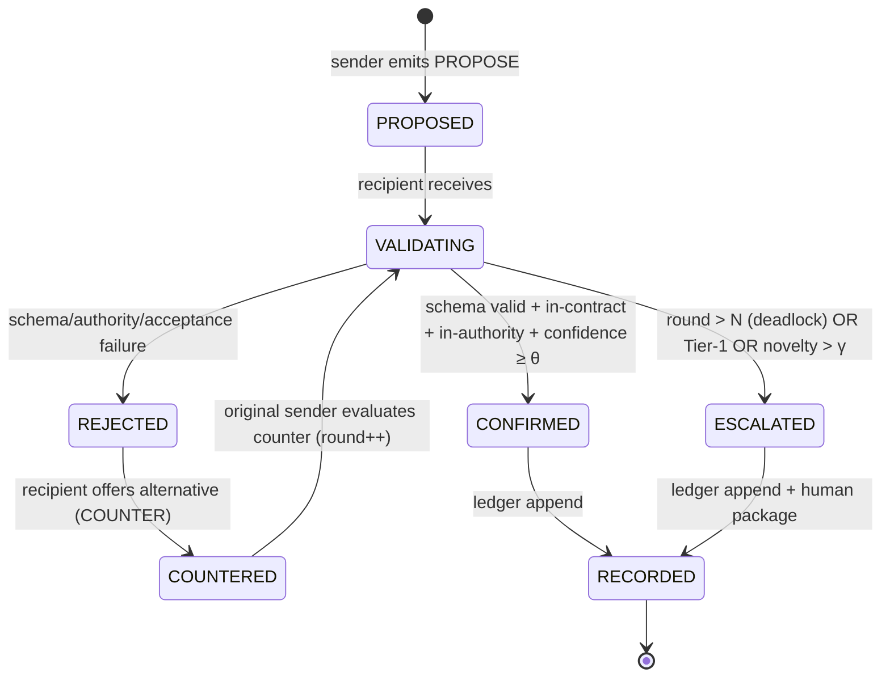

# A2A Message Schema — Structured Agent-to-Agent Messaging

> **Pillar 3 of the [[MULTI_AGENT_COORDINATION_PROTOCOL|MACP]].** Closes the most severe Phase-3 gap *"No agent-to-agent communication protocol exists"* ([[REVIEW_V2_PHASE3_AI_AGENT]] §6.3, scored **1/5**). Defines the structured, schema-validatable message format and the two-phase **Propose→Confirm** protocol.

#multi-agent #coordination-protocol #MACP #autonomy

**Acronyms (defined on first use):** A2A (Agent-to-Agent), MACP (Multi-Agent Coordination Protocol), UUID (Universally Unique Identifier), TTL (Time To Live), JWS (JSON Web Signature), Ed25519 (Edwards-curve Digital Signature Algorithm), SHA-256 (Secure Hash Algorithm, 256-bit), ADR (Architecture Decision Record), CCR (Contract Clarification Record), DQIR (Data Quality Issue Report), IRD (Integration Readiness Declaration), OCM (OTA Compatibility Manifest), SLA (Service Level Agreement), AID (Agent Identity Document), ISO 8601 (date/time standard).

---

## 1. Purpose & Principles

Agents communicate via **structured messages, not natural-language chat**. Every message is:

- **Addressed** — explicit sender and recipient agent identities.
- **Typed** — a fixed `message_type` enum drives a deterministic state machine.
- **Validatable** — the envelope validates against a JSON Schema; the payload validates against a *named* deliverable schema, so a receiving agent can programmatically verify conformance before acting.
- **Correlated** — a `correlation_id` ties every message in one coordination together; a `conversation_id` ties multi-step exchanges.
- **Accountable** — carries `confidence` and `rationale`, and is signed (Ed25519) so the [[COORDINATION_LEDGER_SCHEMA|ledger]] has non-repudiation.

**Core principle:** *No agent acts on a message it cannot validate.* Validation failure → reject and (if persistent) escalate. This is what makes machine-speed coordination safe.

---

## 2. Message Envelope Schema

```yaml
# A2A Message Schema v1.0.0

schema_version: "1.0.0"

# ── Envelope Identity ─────────────────────────────────────────────────────────
message_id: string                  # (required) UUID v4 — unique per message
correlation_id: string              # (required) UUID — shared by all messages resolving one coordination
conversation_id: string             # (optional) UUID — groups a multi-round Propose→Confirm exchange
in_reply_to: string                 # (optional) message_id this message answers (CONFIRM/REJECT/COUNTER → PROPOSE)
timestamp: string                   # (required) ISO 8601 with timezone, e.g. "2026-06-21T09:14:33Z"
ttl_seconds: integer                # (required) message validity window; after expiry the recipient must not act (triggers ESC-SLA on the obligation)

# ── Parties ───────────────────────────────────────────────────────────────────
sender:
  agent_id: string                  # (required) did:macp:<role>:<instance> — must resolve in Identity Registry
  role_code: string                 # (required) e.g. "FW"
  role_wikilink: string             # (required) e.g. "[[FIRMWARE_ENGINEER_SKILL]]"
recipient:
  agent_id: string                  # (required) did:macp:<role>:<instance>
  role_code: string                 # (required)
  role_wikilink: string             # (required)

# ── Message Type (drives the state machine, §3) ───────────────────────────────
message_type:                       # (required) enum
  type: string
  allowed_values:
    - PROPOSE       # Phase B: propose an action/artifact across a boundary
    - CONFIRM       # Phase C: validated and accepted
    - REJECT        # Phase C: validation/authority/acceptance failure, with reason
    - COUNTER       # Phase C: rejected-with-alternative (a new PROPOSE in reply)
    - INFORM        # one-way notification (no confirm required), e.g. DQIR filed
    - REQUEST       # ask for an artifact the sender requires (pull)
    - ACK           # receipt acknowledgement (delivery, not acceptance)
    - QUERY         # registry/state question (e.g., "is contract X version current?")
    - ESCALATE      # hand off to human or ARB (carries escalation_package ref)
    - VOTE          # governance ballot ([[AGENT_GOVERNANCE_PARTICIPATION]])

# ── Contract Grounding ────────────────────────────────────────────────────────
contract_ref:                       # (required for PROPOSE/CONFIRM/REJECT/COUNTER)
  contract_id: string               # (required) must exist in CONTRACT_REGISTRY, e.g. "FW↔DATA-001"
  contract_version: string          # (required) SemVer the sender is operating against
  section: string                   # (optional) e.g. "§6.8 step 3"
decision_tier: string               # (required for decision-bearing types) Tier-1|Tier-2|Tier-3|Tier-4

# ── Payload (machine-validatable) ─────────────────────────────────────────────
payload:
  payload_schema_ref: string        # (required) named schema the payload validates against, e.g. "[[CCR_SCHEMA]]" | "[[DQIR_SCHEMA]]" | "[[ADR_SCHEMA]]" | "null"
  payload_schema_version: string    # (required) version of that schema
  content: object                   # (required) the artifact instance (YAML/JSON object) — must validate against payload_schema_ref
  content_sha256: string            # (required) SHA-256 of canonical(content) — recorded in the ledger

# ── Reasoning & Confidence ────────────────────────────────────────────────────
confidence: number                  # (required for decision-bearing types) 0.0–1.0 — drives ESC-CONF
rationale: string                   # (required for PROPOSE/REJECT/COUNTER) ≥30 chars — why this action/decision
novelty_score: number               # (optional) 0.0–1.0 — distance from contracted/precedented coordination (drives ESC-NOV)

# ── Rejection Detail (required when message_type = REJECT/COUNTER) ─────────────
rejection:
  reason_code: string               # enum: SCHEMA_INVALID | OUT_OF_CONTRACT | OUT_OF_AUTHORITY | BREAKING_CHANGE | ACCEPTANCE_CRITERIA_UNMET | BLOCKING_CCR_OPEN | LOW_CONFIDENCE | TTL_EXPIRED
  detail: string                    # ≥30 chars — specific, actionable explanation
  counter_proposal_ref: string      # (optional) message_id of the COUNTER, when applicable

# ── Security ──────────────────────────────────────────────────────────────────
signature:
  algorithm: string                 # (required) "Ed25519"
  format: string                    # (required) "JWS-EdDSA"
  value: string                     # (required) signature over canonical(envelope minus signature.value)

# ── Metadata ──────────────────────────────────────────────────────────────────
tags: list[string]                  # (optional) kebab-case
```

---

## 3. The Propose→Confirm State Machine

The two-phase protocol mirrors the human CCR/ADR pattern at machine speed. It is deterministic and bounded.



### 3.1 Transition Rules

| From | Event | To | Guard |
|------|-------|----|-------|
| PROPOSED | recipient receives, signature verifies | VALIDATING | sender `ACTIVE`, signature valid, within `ttl_seconds` |
| VALIDATING | payload validates + in-contract + tier ≤ recipient authority + `confidence ≥ θ` | CONFIRMED | Tier 3–4 → Auto-Confirm; Tier 2 → produce non-binding recommendation |
| VALIDATING | any guard fails | REJECTED | `rejection.reason_code` set |
| REJECTED | recipient has a viable alternative | COUNTERED | emits COUNTER (counts as a round) |
| COUNTERED | sender re-evaluates | VALIDATING | `round += 1` |
| VALIDATING | `round > N` (default 3) | ESCALATED | deadlock (ESC-DEAD) |
| VALIDATING | `decision_tier = Tier-1` | ESCALATED | always (ESC-TIER1) |
| VALIDATING | `novelty_score > γ` (default 0.80) | ESCALATED | ESC-NOV |
| CONFIRMED / ESCALATED | terminal | RECORDED | ledger entry appended |

### 3.2 Worked Exchange — `FW↔DATA-001` Schema Change

This is the message-level view of the master spec's sequence diagram.

**Message 1 — PROPOSE (FW → DATA):**
```yaml
schema_version: "1.0.0"
message_id: "5f2a-...-9c01"
correlation_id: "c0ffee-...-0001"
conversation_id: "conv-...-77"
timestamp: "2026-06-21T09:14:33Z"
ttl_seconds: 172800            # 2 business days (Tier-2 SLA ceiling)
sender:   {agent_id: "did:macp:firmware:primary", role_code: "FW",   role_wikilink: "[[FIRMWARE_ENGINEER_SKILL]]"}
recipient:{agent_id: "did:macp:data:primary",     role_code: "DATA", role_wikilink: "[[DATA_ENGINEER_SKILL]]"}
message_type: PROPOSE
contract_ref: {contract_id: "FW↔DATA-001", contract_version: "2.1.0", section: "§6.8 step 1"}
decision_tier: "Tier-3"        # sender's classification (non-breaking, additive field)
payload:
  payload_schema_ref: "[[CCR_SCHEMA]]"
  payload_schema_version: "1.0.0"
  content: { id: "CCR-0031", ambiguity_class: MISSING_FIELD, severity: MEDIUM, proposed_clarification: "Add optional uint16 'battery_mv' field; payload +2 B; additive, backward-compatible." }
  content_sha256: "a17b...e9"
confidence: 0.88
rationale: "Additive optional field; existing decoders ignore unknown fields; payload grows 2 B, within buffer headroom."
novelty_score: 0.12
signature: {algorithm: "Ed25519", format: "JWS-EdDSA", value: "eyJ...sig"}
```

**Message 2a — CONFIRM (DATA → FW), non-breaking branch:**
```yaml
message_type: CONFIRM
in_reply_to: "5f2a-...-9c01"
correlation_id: "c0ffee-...-0001"
contract_ref: {contract_id: "FW↔DATA-001", contract_version: "2.1.0"}
decision_tier: "Tier-3"
payload:
  payload_schema_ref: "[[CCR_SCHEMA]]"
  content: { id: "CCR-0031", status: RESOLVED, resolution_type: CONTRACT_UPDATE, agreed_clarification: "battery_mv accepted as optional; ingest validates 0–5000; transition window 2 sprints." }
confidence: 0.91
rationale: "Additive field validated against ingest schema; no migration needed; within Tier-3 Auto-Confirm authority."
signature: {algorithm: "Ed25519", format: "JWS-EdDSA", value: "eyJ...sig2"}
```

**Message 2b — REJECT (DATA → FW), breaking branch (if the field had been a type change):**
```yaml
message_type: REJECT
in_reply_to: "5f2a-...-9c01"
correlation_id: "c0ffee-...-0001"
decision_tier: "Tier-2"        # recipient re-classified upward: breaking
rejection:
  reason_code: BREAKING_CHANGE
  detail: "Changing 'timestamp' from uint32 to uint64 is backward-incompatible; existing ingest rejects. Requires ADR with Architect approver per FW↔DATA-001 breaking_change_policy."
confidence: 0.94
rationale: "Type-width change breaks all deployed decoders; cannot Auto-Confirm; routing to human-ratified ADR."
signature: {algorithm: "Ed25519", format: "JWS-EdDSA", value: "eyJ...sig3"}
```

In branch 2b the FW agent then emits an **ESCALATE** with an `escalation_package` ([[MULTI_AGENT_COORDINATION_PROTOCOL]] §7.2) routed to the Architect, and an ADR is scaffolded — exactly the human boundary.

---

## 4. Message Validation Procedure

A receiving agent validates a message in this fixed order; **failure at any step halts processing** with the indicated outcome:

| Step | Check | On failure |
|------|-------|------------|
| 1 | **Envelope schema:** message validates against the A2A JSON Schema (§2) | drop + log malformed; no ACK |
| 2 | **Identity:** `sender.agent_id` resolves in Identity Registry and `status = ACTIVE` | REJECT `OUT_OF_CONTRACT` |
| 3 | **Signature:** Ed25519 signature verifies against sender's registered public key | drop (possible spoof); raise security note |
| 4 | **Freshness:** `now < timestamp + ttl_seconds` | REJECT `TTL_EXPIRED` |
| 5 | **Contract:** `contract_ref.contract_id` exists; `contract_version` matches registry (or sender is behind) | REJECT `OUT_OF_CONTRACT` |
| 6 | **Blocking CCR:** no OPEN/IN_REVIEW BLOCKING CCR on the contract | ESCALATE `ESC-BLOCK` |
| 7 | **Payload schema:** `payload.content` validates against `payload_schema_ref` at `payload_schema_version` | REJECT `SCHEMA_INVALID` |
| 8 | **Integrity:** `content_sha256 == SHA-256(canonical(content))` | REJECT `SCHEMA_INVALID` |
| 9 | **Authority:** decision tier ≤ recipient's `max_autonomous_tier`; Auto-Confirm only if enabled | escalate / produce recommendation |
| 10 | **Acceptance:** payload meets the recipient's §6 acceptance criteria; `confidence ≥ θ` | REJECT `ACCEPTANCE_CRITERIA_UNMET` / `LOW_CONFIDENCE` |

Steps 1, 7, and 8 are the **"validatable"** guarantee the constraints require: any agent can programmatically verify a message conforms to the expected schema and that its payload is intact, using a standard JSON Schema validator (`jsonschema`, `ajv`, `pykwalify`).

---

## 5. JSON Schema (Envelope) — Validation Artifact

The normative machine-validatable form of §2 is published as a JSON Schema alongside this document (`docs/agent-protocol/registry/a2a_message.schema.json`). Abbreviated:

```json
{
  "$schema": "https://json-schema.org/draft/2020-12/schema",
  "$id": "https://macp/registry/a2a_message.schema.json",
  "type": "object",
  "required": ["schema_version","message_id","correlation_id","timestamp","ttl_seconds","sender","recipient","message_type","signature"],
  "properties": {
    "message_id":   {"type":"string","format":"uuid"},
    "correlation_id":{"type":"string","format":"uuid"},
    "timestamp":    {"type":"string","format":"date-time"},
    "ttl_seconds":  {"type":"integer","minimum":1},
    "message_type": {"enum":["PROPOSE","CONFIRM","REJECT","COUNTER","INFORM","REQUEST","ACK","QUERY","ESCALATE","VOTE"]},
    "sender":   {"$ref":"#/$defs/party"},
    "recipient":{"$ref":"#/$defs/party"},
    "decision_tier":{"enum":["Tier-1","Tier-2","Tier-3","Tier-4"]},
    "confidence":{"type":"number","minimum":0,"maximum":1},
    "novelty_score":{"type":"number","minimum":0,"maximum":1},
    "payload": {
      "type":"object",
      "required":["payload_schema_ref","content","content_sha256"],
      "properties":{
        "payload_schema_ref":{"type":"string"},
        "content":{"type":"object"},
        "content_sha256":{"type":"string","pattern":"^[a-f0-9]{64}$"}
      }
    },
    "signature":{"type":"object","required":["algorithm","format","value"]}
  },
  "allOf": [
    {"if":{"properties":{"message_type":{"enum":["PROPOSE","CONFIRM","REJECT","COUNTER"]}}},
     "then":{"required":["contract_ref","decision_tier"]}},
    {"if":{"properties":{"message_type":{"enum":["REJECT","COUNTER"]}}},
     "then":{"required":["rejection"]}},
    {"if":{"properties":{"message_type":{"const":"PROPOSE"}}},
     "then":{"required":["confidence","rationale","payload"]}}
  ],
  "$defs": {
    "party": {"type":"object","required":["agent_id","role_code","role_wikilink"],
      "properties":{"agent_id":{"type":"string","pattern":"^did:macp:[a-z-]+:[A-Za-z0-9-]+$"}}}
  }
}
```

---

## 6. Validation Rules (Conformance)

| Rule | Condition |
|------|-----------|
| V-A2A-01 | `message_id` and `correlation_id` are valid UUIDs |
| V-A2A-02 | `message_type` ∈ the 10 allowed values |
| V-A2A-03 | `sender.agent_id` and `recipient.agent_id` match `^did:macp:[a-z-]+:[A-Za-z0-9-]+$` and resolve in the Identity Registry |
| V-A2A-04 | `signature` verifies (Ed25519) against the sender's registered public key |
| V-A2A-05 | For PROPOSE/CONFIRM/REJECT/COUNTER: `contract_ref.contract_id` exists in the Contract Registry |
| V-A2A-06 | `payload.content` validates against `payload_schema_ref` at `payload_schema_version` (or `payload_schema_ref = null` only for INFORM/QUERY/ACK) |
| V-A2A-07 | `content_sha256` equals SHA-256 of the canonical serialization of `payload.content` |
| V-A2A-08 | For PROPOSE: `confidence` present in [0,1] and `rationale` ≥30 chars |
| V-A2A-09 | For REJECT/COUNTER: `rejection.reason_code` ∈ the 8 allowed codes and `rejection.detail` ≥30 chars |
| V-A2A-10 | `decision_tier` present for all decision-bearing types and ∈ {Tier-1..Tier-4} |
| V-A2A-11 | `now ≤ timestamp + ttl_seconds` (message not expired) |
| V-A2A-12 | Round count on a `correlation_id` ≤ N before a CONFIRM/ESCALATE terminal (else ESC-DEAD) |
| V-A2A-13 | A CONFIRM at `decision_tier = Tier-1` is invalid (Tier-1 cannot be agent-confirmed) |

---

## 7. Transport & Delivery

- **Bus:** messages are published to the recipient's `endpoint.address` (from the AID). Initial deployment uses a Git-tracked file-drop queue; production uses NATS or MQTT (the same broker family the ecosystem already runs for telemetry).
- **Delivery semantics:** at-least-once delivery; idempotency keyed on `message_id`. Duplicate `message_id` is ACK'd but processed once.
- **Acknowledgement:** an `ACK` confirms *delivery*, not acceptance. Acceptance is a `CONFIRM`. A `PROPOSE` with no `ACK` within a delivery window is retried up to 3 times, then raises ESC-SLA.
- **Ordering:** within a `conversation_id`, `in_reply_to` reconstructs causal order even if transport reorders.

---

## 8. Machine-Actionability Notes

An agent consuming this schema should:

1. **Validate first, act second** — run the §4 procedure in order; never act on a message that fails any step.
2. **Sign every outbound message** — unsigned or mis-signed messages are dropped by conformant recipients.
3. **Carry confidence honestly** — `confidence` and `novelty_score` directly drive escalation; understating risk to avoid escalation is a forbidden action.
4. **Bound the negotiation** — track rounds per `correlation_id`; at round `> N`, stop and escalate rather than loop.
5. **Reuse existing schemas** — payloads are instances of the eight [[SCHEMA_INDEX]] schemas; do not invent payload shapes.
6. **Record outcomes** — every CONFIRM/REJECT/ESCALATE produces a [[COORDINATION_LEDGER_SCHEMA|ledger]] entry referencing this `message_id` and `content_sha256`.

---

## 9. Related Documents

- [[MULTI_AGENT_COORDINATION_PROTOCOL]] — master specification (Pillar 3 lives here); §5.2 sequence diagram
- [[AGENT_IDENTITY_SCHEMA]] — signatures verify against AID public keys
- [[CONTRACT_REGISTRY_SCHEMA]] — `contract_ref` resolves here
- [[COORDINATION_LEDGER_SCHEMA]] — message outcomes are ledgered
- [[SCHEMA_INDEX]] — the eight payload schemas ([[CCR_SCHEMA]], [[DQIR_SCHEMA]], [[ADR_SCHEMA]], [[INTEGRATION_READINESS_DECLARATION_SCHEMA]], [[OTA_COMPATIBILITY_MANIFEST_SCHEMA]], etc.)
- [[REVIEW_V2_PHASE3_AI_AGENT]] — §6.3 (the 1/5 A2A gap this closes)

#multi-agent #coordination-protocol #MACP #autonomy #a2a-messaging
