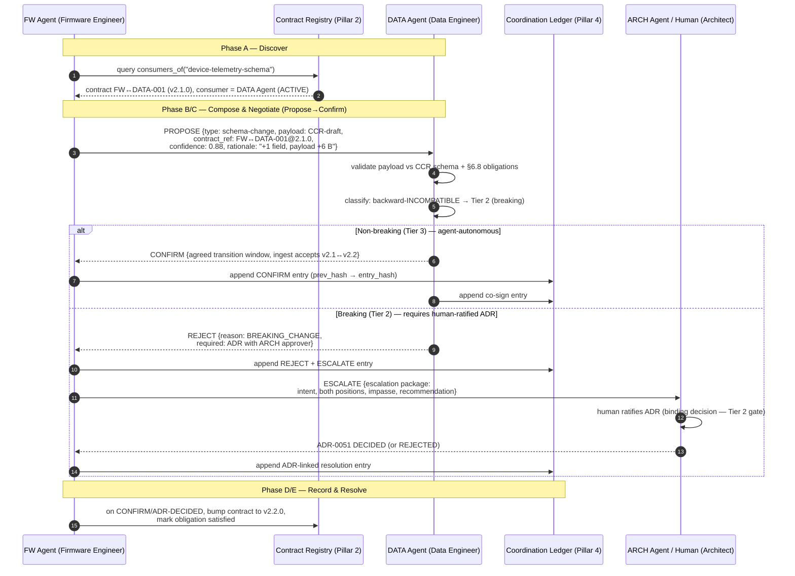

# Multi-Agent Coordination Protocol (MACP) — Master Specification

> **Multi-Agent Coordination Protocol (MACP):** the machine-speed coordination layer that lets AI agents instantiating the 14 organizational roles discover each other, exchange machine-validated artifacts, negotiate contract interpretations, participate in collective governance, and coordinate without human mediation for all Tier 2–4 decisions.

> **Addresses:** [[REVIEW_V2_PHASE3_AI_AGENT|Review V2 Phase 3 — AI Agent Autonomy Readiness]], Dimension 5 (Multi-Agent Coordination), scored **1.4/5** — the single lowest score across all autonomy dimensions.
> **Unblocks:** Remediable Barrier **RB-1** (no multi-agent coordination protocol). This is the foundational prerequisite for progression from **Human-Augmented** to **Human-Supervised** autonomy ([[REVIEW_V2_PHASE5_ROADMAP|Phase 5 Roadmap]], Phase 2 of the Evolution Roadmap).

#multi-agent #coordination-protocol #MACP #autonomy

---

## 0. Document Set

This is the **master specification**. It is normative for the architecture, the decision-tier authority model, and the coordination lifecycle. Five companion specifications define the machine-parseable schemas:

| File | Defines | Closes Phase-3 Gap |
|------|---------|--------------------|
| **MULTI_AGENT_COORDINATION_PROTOCOL.md** (this file) | Architecture, lifecycle, tier model, escalation | Coordination Protocol Maturity (was 1/5) |
| [[AGENT_IDENTITY_SCHEMA]] | Verifiable agent identity, authentication, capability declaration | Agent discovery (was 2/5) |
| [[CONTRACT_REGISTRY_SCHEMA]] | Machine-readable registry of the 91 interface contracts | Contract discovery (was 2/5) |
| [[A2A_MESSAGE_SCHEMA]] | Structured, validatable agent-to-agent message format | Agent-to-agent communication (was 1/5) |
| [[COORDINATION_LEDGER_SCHEMA]] | Append-only, SHA-256-chained coordination ledger | Audit trail (absent) |
| [[AGENT_GOVERNANCE_PARTICIPATION]] | How agents participate in ARB, EPR, and release gates | Collective decision-making (was 1/5) |

**Acronyms used throughout (defined on first use):** MACP (Multi-Agent Coordination Protocol), A2A (Agent-to-Agent), AID (Agent Identity Document), SKILL.md (the role definition / skill card), ADR (Architecture Decision Record), CCR (Contract Clarification Record), ARB (Architecture Review Board), EPR (Engineering Process Review), DQIR (Data Quality Issue Report), IRD (Integration Readiness Declaration), OCM (OTA Compatibility Manifest, where OTA = Over-the-Air), SLA (Service Level Agreement), SHA-256 (Secure Hash Algorithm, 256-bit), UUID (Universally Unique Identifier), DID (Decentralized Identifier), TTL (Time To Live), HITL (Human-in-the-Loop).

---

## 1. Design Goals & Non-Goals

### 1.1 Goals

1. **G-1 — Discovery.** Any agent can determine which other agents are active, what role each plays, what each is authorized to do, and how to reach it — without a human telling it.
2. **G-2 — Machine-validated exchange.** Every artifact crossing an agent boundary is validated against a named schema before it is accepted. No agent acts on an artifact it cannot validate.
3. **G-3 — Contract-grounded negotiation.** Agents resolve interface ambiguities at machine speed using a two-phase Propose→Confirm protocol that is the machine-speed complement to the human CCR/ADR processes — never a replacement.
4. **G-4 — Auditable coordination.** Every coordination event that produces a decision, an artifact exchange, or a dispute is recorded in an append-only ledger with cryptographic integrity.
5. **G-5 — Collective governance.** Agents contribute data, propose process improvements, and vote on **non-binding** recommendations in the ARB and EPR; binding decisions remain with humans.
6. **G-6 — Safe escalation.** When agents cannot resolve a coordination issue, they escalate to the human role-holder with a structured, complete escalation package — never silently guess.

### 1.2 Non-Goals

- **NG-1 — MACP does not replace human governance.** The ADR and CCR processes, the ARB, the EPR, and the 31 human gates ([[REVIEW_V2_PHASE3_AI_AGENT]] §5.1) remain authoritative. MACP makes them *faster to feed and easier to audit*, not optional.
- **NG-2 — MACP does not relax safety-critical gates.** The Security Engineer release veto (HG-01), the Architect production gate (HG-04), and all Tier 1 (CRITICAL) decisions remain permanent HITL gates.
- **NG-3 — MACP does not define the AI model.** It defines the *protocol* by which any sufficiently capable agent coordinates; agent reasoning quality is out of scope.
- **NG-4 — MACP does not own physical validation.** Board bring-up, Hardware-in-the-Loop (HIL) testing, and EMC (Electromagnetic Compatibility) testing remain physical, human-executed gates ([[REVIEW_V2_PHASE3_AI_AGENT]] §8.1 SB-2).

---

## 2. The Five Pillars

The Phase-3 review identified five gaps. MACP defines exactly five pillars to close them, plus a cross-cutting escalation mechanism.

```
┌─────────────────────────────────────────────────────────────────────────┐
│                     MACP — Multi-Agent Coordination Protocol              │
│                                                                           │
│  Pillar 1            Pillar 2            Pillar 3                          │
│  IDENTITY &          CONTRACT            A2A MESSAGING                     │
│  DISCOVERY           REGISTRY            + Propose→Confirm                 │
│  [[AGENT_IDENTITY_   [[CONTRACT_         [[A2A_MESSAGE_SCHEMA]]            │
│   SCHEMA]]            REGISTRY_SCHEMA]]                                    │
│  "Who is active?"    "Who needs what     "Send a validated                │
│  "What may they do?"  I produce?"         artifact, get Confirm/Reject"    │
│        │                   │                    │                         │
│        └───────────────────┴────────────────────┘                         │
│                            │                                              │
│             ┌──────────────┴───────────────┐                             │
│             │                              │                              │
│        Pillar 4                       Pillar 5                            │
│        COORDINATION LEDGER            GOVERNANCE PARTICIPATION            │
│        [[COORDINATION_LEDGER_SCHEMA]] [[AGENT_GOVERNANCE_PARTICIPATION]]  │
│        "Append-only, SHA-256 chain"   "Vote on non-binding recommends"   │
│             │                              │                              │
│             └──────────────┬───────────────┘                             │
│                            │                                              │
│                   CROSS-CUTTING: HUMAN ESCALATION (§7)                    │
│                   "confidence < θ, deadlock, novelty, Tier 1"            │
└─────────────────────────────────────────────────────────────────────────┘
```

| # | Pillar | Phase-3 Gap Closed | Companion Spec |
|---|--------|--------------------|----------------|
| 1 | Agent Identity & Discovery | "No agent discovery mechanism exists" | [[AGENT_IDENTITY_SCHEMA]] |
| 2 | Contract Registry | "No machine-readable contract registry exists" | [[CONTRACT_REGISTRY_SCHEMA]] |
| 3 | A2A Messaging + Propose→Confirm | "No agent-to-agent communication protocol exists" | [[A2A_MESSAGE_SCHEMA]] |
| 4 | Coordination Ledger | "No coordination ledger exists" | [[COORDINATION_LEDGER_SCHEMA]] |
| 5 | Governance Participation | "No agent participation in collective governance" | [[AGENT_GOVERNANCE_PARTICIPATION]] |

---

## 3. The 14 Agents & Their Role Codes

Each of the 14 roles, when instantiated as an AI agent, binds to its SKILL.md (§3, [[AGENT_IDENTITY_SCHEMA]]). The **role code** is the canonical short identifier used in contract IDs and message envelopes.

| Role Code | Role | SKILL.md Wikilink |
|-----------|------|-------------------|
| `RES` | IoT & Embedded Systems Researcher | [[IOT_EMBEDDED_SYSTEMS_RESEARCHER_SKILL]] |
| `ARCH` | Embedded Systems Architect | [[EMBEDDED_SYSTEMS_ARCHITECT_SKILL]] |
| `HW` | Hardware Engineer | [[HARDWARE_ENGINEER_SKILL]] |
| `FW` | Firmware Engineer | [[FIRMWARE_ENGINEER_SKILL]] |
| `ML` | Edge AI/ML Engineer | [[EDGE_AI_ML_ENGINEER_SKILL]] |
| `DATA` | Data Engineer | [[DATA_ENGINEER_SKILL]] |
| `MLOPS` | MLOps Engineer | [[MLOPS_ENGINEER_SKILL]] |
| `BACK` (alias `CLOUD`) | Backend/Cloud Engineer | [[BACKEND_CLOUD_ENGINEER_SKILL]] |
| `DEVOPS` | DevOps/Platform Engineer | [[DEVOPS_PLATFORM_ENGINEER_SKILL]] |
| `FE` | Frontend/Dashboard Engineer | [[FRONTEND_DASHBOARD_ENGINEER_SKILL]] |
| `QA` | QA & Test Automation Engineer (also Process Architect) | [[QA_TEST_AUTOMATION_ENGINEER_SKILL]] |
| `SEC` | Security Engineer | [[SECURITY_ENGINEER_SKILL]] |
| `PO` | Product Owner / Technical Project Manager (TPM) | [[PRODUCT_OWNER_TECHNICAL_PROJECT_MANAGER_SKILL]] |
| `BIZ` | Business Consultant | [[BUSINESS_CONSULTANT_SKILL]] |

**Fractional roles** (inherit the parent SKILL.md scope, with constrained authority — see [[AGENT_IDENTITY_SCHEMA]] §6):
- `ARCH-DEP` — Deputy Architect (non-breaking ADR authority only)
- `SEC-DEP` — Deputy Security Engineer (Standard-tier sign-off only)

**Operational coordinator:** `IC` — [[INCIDENT_COMMANDER]] (assumes coordination authority during declared cross-layer incidents; see §6.4).

With 14 primary roles, there are exactly **C(14,2) = 91 symmetric interface contract pairs** — the count cited in [[REVIEW_V2_PHASE3_AI_AGENT]]. Pillar 2 makes all 91 queryable.

---

## 4. Decision-Tier Authority Model

This is the heart of "coordinate without human mediation for all Tier 2–4 decisions." MACP inherits the four-tier decision SLA from the governance design ([[REVIEW_V2_PHASE3_AI_AGENT]] §4.3) and binds an explicit **agent authority** to each tier. Tier 1 is the permanent HITL boundary; Tiers 2–4 are agent-coordinable, with binding governance ratification still reserved to humans at Tier 2.

| Tier | Class | SLA | Agent Authority Under MACP | Human Role |
|------|-------|-----|----------------------------|------------|
| **Tier 1** | CRITICAL | 4 business hours | **Prepare escalation package only.** No autonomous resolution. Mandatory escalation (§7). Covers: security release veto (HG-01), Architect production gate (HG-04), platform/protocol/security-baseline changes, anything safety-critical. | **Decides.** Permanent HITL gate. |
| **Tier 2** | HIGH | 2 business days | **Coordinate, deliberate, and vote → produce a non-binding recommendation.** Agents run the full Propose→Confirm cycle and ARB voting (Pillar 5), but the binding decision is ratified by a human ([[AGENT_GOVERNANCE_PARTICIPATION]] §4). Covers: ARB-resolvable architecture decisions, cross-team interface deadlocks. | **Ratifies** the binding decision. |
| **Tier 3** | MEDIUM | 5 business days | **Coordinate and decide autonomously.** Auto-Confirm permitted when validation passes and confidence ≥ θ (§7.1). Recorded in ledger; human may audit/override. Covers: schema clarifications, routine contract interpretations, DQIR severity classification within rubric. | **Audits / may override.** |
| **Tier 4** | LOW | 10 business days | **Coordinate and decide autonomously.** Auto-Confirm by default. Recorded in ledger. Covers: documentation alignment, cosmetic contract clarifications, scheduling of routine deliverables. | **Audits / may override.** |

**Tier classification rule.** An agent classifies a decision by walking the decision-class lookup table maintained in the Contract Registry (`tier_classification` block, [[CONTRACT_REGISTRY_SCHEMA]] §7). If classification is ambiguous, the agent defaults **upward** (to the more conservative tier) and, if that lands on Tier 1 or Tier 2, escalates or seeks ratification. **Defaulting upward is mandatory** — an agent must never resolve a decision at a lower tier than its true classification.

---

## 5. Coordination Lifecycle

Every cross-boundary coordination follows the same five-phase lifecycle. The Propose→Confirm protocol (Phase C) mirrors the human CCR pattern at machine speed.

### 5.1 The Five Phases

1. **Phase A — Discover.** The initiating agent resolves the counterpart agent and the governing contract via the Identity registry (Pillar 1) and Contract Registry (Pillar 2). It confirms the counterpart is `ACTIVE` and authorized.
2. **Phase B — Compose.** The initiating agent constructs an A2A message (Pillar 3): `PROPOSE` type, with a payload validatable against the relevant deliverable schema (ADR/CCR/DQIR/IRD/OCM/etc.), a `correlation_id`, a `confidence` score, and a `rationale`.
3. **Phase C — Negotiate (Propose→Confirm).**
   - The recipient agent **validates** the payload against the named schema and against its own §6 contract obligations.
   - If valid and within authority → **`CONFIRM`**.
   - If invalid, out-of-contract, or below the recipient's acceptance criteria → **`REJECT`** with a structured reason and, where appropriate, a `COUNTER` proposal.
   - A `REJECT`/`COUNTER` may iterate up to **N = 3** rounds (the deadlock threshold, §7.1).
4. **Phase D — Record.** The outcome (`CONFIRM`, `REJECT`, `COUNTER`, or `ESCALATE`) is written to the Coordination Ledger (Pillar 4) as an append-only, hash-chained entry. If the outcome requires a durable governance artifact (a breaking change → ADR; an ambiguity → CCR), the agent scaffolds it and links the ledger entry to the artifact ID.
5. **Phase E — Resolve or Escalate.** On `CONFIRM`, the obligation is marked satisfied in the registry. On deadlock, Tier 1 classification, low confidence, or novelty, the agent assembles a human escalation package (§7) and routes it to the human role-holder.

### 5.2 Representative Flow — Mermaid Sequence Diagram

The following models a real coordination from the Firmware Engineer's [[FIRMWARE_ENGINEER_SKILL]] §6.8 **Schema-Change Coordination Process**: the Firmware agent proposes a device-telemetry schema change to the Data agent. If the change is backward-incompatible (breaking), it must escalate to an ADR with the Architect as approver — exactly the boundary between agent-speed coordination and human governance.

**Participant legend (Mermaid labels use clean text; full role wikilinks here):** `FW Agent` = [[FIRMWARE_ENGINEER_SKILL]] · `DATA Agent` = [[DATA_ENGINEER_SKILL]] · `ARCH` = [[EMBEDDED_SYSTEMS_ARCHITECT_SKILL]].



**Reading the diagram:** the **non-breaking** branch is fully agent-autonomous (Tier 3, Auto-Confirm) — no human is involved, and two ledger entries make it auditable. The **breaking** branch correctly stops at the human boundary: the Data agent *detects* the breaking change and *refuses to auto-confirm*, the Firmware agent escalates with a complete package, and a human ratifies the ADR. MACP did the discovery, validation, classification, negotiation, and recording at machine speed; the human did only the irreducible judgment.

---

## 6. Architecture & Deployment

### 6.1 Logical Components

| Component | Responsibility | Backing Store (initial) |
|-----------|----------------|--------------------------|
| **Identity Registry** | Map `agent_id` → AID (role binding, public key, capabilities, status) | Git-tracked `docs/agent-protocol/registry/AGENT_REGISTRY.yaml` |
| **Contract Registry** | Map role-pair → contract (provides/requires/cadence, version, open CCRs, next due) | Generated `docs/agent-protocol/registry/CONTRACT_REGISTRY.yaml` |
| **Message Bus** | Route, queue, and deliver A2A messages; enforce TTL and acknowledgement | Pluggable (file-drop queue → NATS/MQTT in production) |
| **Coordination Ledger** | Append-only, SHA-256-chained event log | Append-only `docs/agent-protocol/ledger/COORDINATION_LEDGER.jsonl` |
| **Schema Validator** | Validate message envelopes and payloads against named schemas | Library (`jsonschema` / `pykwalify`) shared by all agents |
| **Escalation Router** | Detect escalation triggers, assemble packages, notify humans | Hooks into existing notification channels |

### 6.2 Source of Truth & Synchronization

- The **SKILL.md files remain the human-authored source of truth** for role scope, authority, and the §6 contracts.
- The **Contract Registry is a generated, read-only artifact** derived from the §6 sections (transformation defined in [[CONTRACT_REGISTRY_SCHEMA]] §4). Agents never hand-edit it; a synchronization job regenerates it and detects drift (§5 of that spec).
- The **Identity Registry** binds each agent to a specific SKILL.md content hash, so an agent that drifts from its role definition is detectable.

### 6.3 Conformance Levels

An agent is **MACP-conformant** at one of three levels:

- **Level 0 — Observer:** can read the Identity Registry, Contract Registry, and Ledger; cannot send messages. (Suitable for read-only analytics agents and dashboards.)
- **Level 1 — Participant:** can send/receive A2A messages, run Propose→Confirm for Tier 3–4, and append to the ledger. Must pass schema validation and signature verification.
- **Level 2 — Governance Participant:** Level 1 plus eligibility to submit ARB/EPR data and cast non-binding votes (Pillar 5). Requires an AID with `governance_eligible: true`.

### 6.4 Incident Mode

During a declared cross-layer incident, the [[INCIDENT_COMMANDER]] (`IC`) holds elevated coordination authority. Under MACP, incident mode:
- raises the message-bus priority for `IC`-tagged conversations,
- permits a temporary, ledger-recorded deviation from standard Propose→Confirm cadence (the "emergency tempo" noted in [[FIRMWARE_ENGINEER_SKILL]] §3.6),
- requires retroactive ADR formalization of any deviation within **5 business days** of incident closure, exactly as the role cards already mandate.

---

## 7. Human Escalation (Cross-Cutting)

Escalation is the safety valve that keeps MACP inside the Human-Supervised envelope. Triggers are **specific and measurable**; an agent that hits any trigger MUST escalate rather than proceed.

### 7.1 Escalation Triggers

| Trigger ID | Condition | Threshold | Rationale |
|------------|-----------|-----------|-----------|
| **ESC-CONF** | Decision confidence below tier threshold | Tier 3/4: confidence `< 0.70`; Tier 2: `< 0.85` | Low-confidence autonomous action is unsafe; conservative thresholds rise with stakes. |
| **ESC-DEAD** | Propose→Confirm deadlock | `> N = 3` Reject/Counter rounds on the same `correlation_id` | A bilateral impasse needs a human or ARB arbiter, mirroring "CCR escalated to ADR when not resolved within 3 business days." |
| **ESC-NOV** | Novelty score above threshold | `novelty_score > 0.80` (situation not matched by any §6 contract, schema, or prior ledger precedent) | Novel coordination outside the contracted surface must not be improvised. |
| **ESC-TIER1** | Decision classifies as Tier 1 (CRITICAL) | Always | Safety-critical and security-veto decisions are permanent HITL gates. |
| **ESC-BLOCK** | A `BLOCKING`-severity CCR references the contract under coordination and is `OPEN`/`IN_REVIEW` | Always | Matches CCR validation rule V-CCR-11: integration is held until resolved. |
| **ESC-SLA** | A contract obligation breaches its cadence SLA with no Confirm | At SLA expiry | Missed obligations need human attention before they cascade. |
| **ESC-SEC** | Coordination touches the security baseline, threat model, or a security-relevant release | Always | Security-baseline changes are owned by [[SECURITY_ENGINEER_SKILL]] via ADR; agents may only propose. |

`θ` (confidence threshold) and `N` (deadlock rounds) are configurable per deployment in the Identity Registry's `escalation_policy` block, but may only be made **stricter**, never looser, than the defaults above.

### 7.2 Escalation Package Schema

Every escalation carries a complete, machine-parseable package so the human can decide without reconstructing context:

```yaml
escalation_package:
  schema_version: "1.0.0"
  escalation_id: string            # ESC-NNNN
  trigger: string                  # one of ESC-CONF | ESC-DEAD | ESC-NOV | ESC-TIER1 | ESC-BLOCK | ESC-SLA | ESC-SEC
  raised_by: string                # agent_id (wikilink to SKILL.md)
  routed_to: string                # human role-holder (wikilink) per §7 escalation path
  correlation_id: string           # links to the A2A conversation
  contract_ref:
    contract_id: string            # e.g. "FW↔DATA-001"
    version: string
    section: string
  intent: string                   # what the initiating agent was trying to accomplish (≥50 chars)
  positions:                       # what each agent proposed
    - agent_id: string
      proposal: string
      confidence: number           # 0.0–1.0
      rationale: string
  impasse: string                  # where, precisely, coordination stalled (≥30 chars)
  recommendation: string           # the agents' recommended resolution for the human to accept/modify/reject
  ledger_refs: list[string]        # ledger entry hashes for the full coordination trail
  decision_tier: string            # Tier 1 | Tier 2 | Tier 3 | Tier 4
  sla_deadline: date               # when a human response is needed
```

### 7.3 Escalation Routing

Routing follows the existing §7 escalation paths already defined in every SKILL.md — MACP does not invent new ones:

```
Technical / contract impasse  → [[EMBEDDED_SYSTEMS_ARCHITECT_SKILL]] → CTO
Security conflict             → [[SECURITY_ENGINEER_SKILL]] → CTO
Resourcing / schedule         → [[PRODUCT_OWNER_TECHNICAL_PROJECT_MANAGER_SKILL]] → CTO
ARB-class (Tier 2)            → ARB (quorum) → [[EMBEDDED_SYSTEMS_ARCHITECT_SKILL]] → CTO
```

---

## 8. Compatibility with Existing Governance

MACP is the **machine-speed complement** to human governance, not a replacement (Constraint: "compatible with the existing CCR and ADR processes").

| Human Process | MACP Relationship |
|---------------|-------------------|
| **ADR** ([[ADR_SCHEMA]]) | A2A `PROPOSE` payloads for architecture-affecting changes carry an ADR-draft. Breaking changes always route to a human-ratified ADR (Tier 1/2). The ledger links to the resulting `ADR-NNNN`. |
| **CCR** ([[CCR_SCHEMA]]) | The Propose→Confirm cycle *is* the machine-speed CCR for Tier 3–4 ambiguities. When agents cannot converge in `N` rounds, the agent files a formal CCR for human/ARB resolution. A `BLOCKING` CCR halts coordination (ESC-BLOCK). |
| **IRD** ([[INTEGRATION_READINESS_DECLARATION_SCHEMA]]) | Co-signature becomes an A2A `CONFIRM` pair recorded in the ledger, once smoke-test criteria are machine-verified (automating HG-08). |
| **DQIR** ([[DQIR_SCHEMA]]) | A `DQIR` filed by the ML agent to the Data agent is an A2A `INFORM`+`PROPOSE` carrying a DQIR-schema payload; severity within rubric is Tier 3 (agent-autonomous). |
| **ARB / EPR** | Agents become Level-2 Governance Participants: they supply data and cast **non-binding** votes; humans retain binding authority ([[AGENT_GOVERNANCE_PARTICIPATION]]). |
| **Schema Index** ([[SCHEMA_INDEX]]) | Every A2A payload validates against one of the eight existing machine-parseable schemas, reusing their validation rules verbatim. |

**Invariant:** No MACP message can change a contract, schema, resource budget, security baseline, or OTA strategy by itself. Those changes require the ADR process with the correct human approver — MACP only *carries and records* the proposal.

---

## 9. Phased Rollout

Aligned to the [[REVIEW_V2_PHASE5_ROADMAP|Phase 5 Roadmap]] "measure-first, delegate-second" principle.

| Wave | Scope | Exit Criterion |
|------|-------|----------------|
| **W1 — Registries (weeks 1–4)** | Stand up Identity Registry + Contract Registry generated from §6; Observer (Level 0) agents only. | All 91 contracts queryable; drift detection green for 2 weeks. |
| **W2 — Messaging (weeks 4–8)** | A2A schema + Propose→Confirm for Tier 4 only; ledger live. | 100% of Tier-4 coordinations validated and ledgered; chain verification passes. |
| **W3 — Tier 3 autonomy (weeks 8–12)** | Extend Auto-Confirm to Tier 3; escalation router live with all 7 triggers. | Escalation precision/recall measured; zero unescalated Tier-1 events. |
| **W4 — Governance (weeks 12+)** | Level-2 participation: ARB/EPR data submission + non-binding voting. | First agent-supplied ARB recommendation ratified by a human; EPR dashboard agent-fed. |

This sequencing keeps a human in the loop for every consequential decision while D5 climbs from **1.4 → target 4.0** ([[EVALUATION_HARNESS_SPEC]] scoring).

---

## 10. Success Metrics

| Metric | Target | Source |
|--------|--------|--------|
| Contract discoverability | 91/91 contracts queryable in registry | Pillar 2 |
| A2A schema-validation pass rate | 100% of accepted messages validate against a named schema | Pillar 3 |
| Ledger integrity | SHA-256 chain verifies end-to-end on every audit | Pillar 4 |
| Tier-1 escalation completeness | 100% of Tier-1 decisions escalated (zero auto-resolved) | §7 |
| Deadlock resolution | 100% of `>N`-round impasses escalated within SLA | ESC-DEAD |
| Autonomous Tier 3–4 coordination | ≥80% of Tier 3–4 coordinations complete without human touch | §4 |
| Audit reconstructability | Any coordination reconstructable from ledger + linked ADR/CCR | Pillars 4 + §8 |

---

## 11. Glossary

| Term | Definition |
|------|------------|
| **MACP** | Multi-Agent Coordination Protocol — this specification set. |
| **A2A** | Agent-to-Agent — direct, structured machine communication between agents. |
| **AID** | Agent Identity Document — the verifiable identity record for one agent ([[AGENT_IDENTITY_SCHEMA]]). |
| **Propose→Confirm** | The two-phase negotiation protocol: an agent proposes, the counterpart validates and confirms or rejects. |
| **Tier 1–4** | Decision SLA/authority tiers; Tier 1 is the permanent human-in-the-loop boundary. |
| **Coordination Ledger** | The append-only, SHA-256-chained record of all decision/exchange/dispute events. |
| **Auto-Confirm** | An agent's authority to confirm a valid Tier 3–4 proposal without human involvement. |
| **Novelty score** | A 0–1 measure of how far a situation lies outside contracted/precedented coordination. |
| **Role code** | The canonical short identifier for a role (e.g., `FW`, `DATA`) used in contract IDs and envelopes. |

---

## 12. Related Documents

- [[REVIEW_V2_PHASE3_AI_AGENT]] — the assessment that scored D5 at 1.4/5
- [[REVIEW_V2_PHASE5_ROADMAP]] — the Evolution Roadmap this protocol unblocks
- [[EVALUATION_HARNESS_SPEC]] — scoring harness that measures D5 progress
- [[SCHEMA_INDEX]] — the eight machine-parseable deliverable schemas reused as A2A payloads
- [[ADR_SCHEMA]], [[CCR_SCHEMA]] — the human governance processes MACP complements
- Companion specs: [[AGENT_IDENTITY_SCHEMA]], [[CONTRACT_REGISTRY_SCHEMA]], [[A2A_MESSAGE_SCHEMA]], [[COORDINATION_LEDGER_SCHEMA]], [[AGENT_GOVERNANCE_PARTICIPATION]]

#multi-agent #coordination-protocol #MACP #autonomy #agent-protocol
