# Reciprocity Audit — Automated Contract-Integrity Checker Specification

#reciprocity-audit #contract-integrity #automation

> **Closes:** [[docs/review_v2/REVIEW_V2_PHASE4_EMERGENT|P4-M2]] — "Institute a reciprocity audit. Mechanically diff every §6 'Provides' against its paired 'Requires' to catch the next B1–B4-class asymmetry before it ships."
>
> **Merge gate:** Any pull request that introduces a new unallowlisted asymmetry in any §6 interface contract across the 14-role ecosystem is **blocked from merging** until the asymmetry is resolved or formally allowlisted with an ADR reference.

> **Owner:** [[DEVOPS_PLATFORM_ENGINEER_SKILL|DevOps/Platform Engineer]] (builds and maintains the tool)
> **Governance:** [[QA_TEST_AUTOMATION_ENGINEER_SKILL|QA & Test Automation Engineer]] (reviews audit results, approves allowlist entries)
> **Origin:** [[docs/review_v2/REVIEW_V2_PHASE1_VALUE_CHAIN|Phase 1 Value Chain Validation]] (B1–B4), [[docs/review_v2/REVIEW_V2_PHASE4_EMERGENT|Phase 4 Emergent Properties]] (DEBT-DOC2)

---

## 1. Purpose & Background

### 1.1 Why This Tool Exists

[[docs/review_v2/REVIEW_V2_PHASE1_VALUE_CHAIN|Review V2 Phase 1]] identified four structural breaks in the 14-role interface contract ecosystem — cases where one role's §6 declared a Provides/Requires relationship that the reciprocal role did not acknowledge:

| Break ID | Edge | Nature |
|---|---|---|
| **B1** | [[BUSINESS_CONSULTANT_SKILL\|Business Consultant]] → [[IOT_EMBEDDED_SYSTEMS_RESEARCHER_SKILL\|Researcher]] | Market-driven research priorities flowed informally; no artifact format, no acknowledgment |
| **B2** | [[BUSINESS_CONSULTANT_SKILL\|Business Consultant]] → Research-to-Planning Gate | Gate concurrence obligation defined only in the Researcher's card; Business Consultant had no reciprocal entry |
| **B3** | [[FRONTEND_DASHBOARD_ENGINEER_SKILL\|Frontend]] ↔ [[DATA_ENGINEER_SKILL\|Data]] | Frontend required visualization-ready data views; Data had no producer-side §6 entry for Frontend |
| **B4** | [[QA_TEST_AUTOMATION_ENGINEER_SKILL\|QA]] ↔ [[SECURITY_ENGINEER_SKILL\|Security]] | Threat-derived test cases named on both sides but with no defined format, so the deliverable was structurally ambiguous |

These were surgically repaired. The underlying vulnerability persists: **as contracts evolve, new asymmetries can emerge silently, in any PR, without detection until the next manual review cycle.**

Review V2 Phase 4 named this explicitly as DEBT-DOC2: *"91 edges asserted symmetric; Phase 1 found four already broken. Nothing enforces symmetry."* P4-M2 mandated an automated fix.

This specification defines that fix — a deterministic, CI-integrated tool that mechanically verifies bidirectional symmetry across all 91 interface edges on every pull request that touches a §6 section.

### 1.2 What "Reciprocity" Means

For any two roles A and B that share an interface:

- If A's §6 entry for B lists a **Provides** item P, then B's §6 entry for A must list a **Requires** item R such that R and P describe the same deliverable.
- If A's §6 entry for B lists a **Requires** item R, then B's §6 entry for A must list a **Provides** item P such that P and R describe the same deliverable.
- Both entries must name at least one shared **Cadence** checkpoint.
- If A has a §6 entry for B, B must have a §6 entry for A (no one-sided entries).

Violation of any of these four conditions is an **asymmetry**. The audit detects asymmetries mechanically and blocks merge on any new one.

### 1.3 Scope

| Parameter | Value |
|---|---|
| Roles covered | 14 primary roles |
| Interface edges | 91 (all unique pairs in a fully connected 14-role graph: 14×13÷2) |
| Files scanned | All `*_SKILL.md` files in the repository root |
| Sections analyzed | `## 6. Interface Contracts` and all `### 6.X` subsections |
| Run trigger | Any PR where the diff includes a line in `## 6.` or `### 6.` in any `*_SKILL.md` |
| Merge gate | Blocks merge on any new unallowlisted asymmetry |

---

## 2. Architecture Overview

### 2.1 Audit Flow Diagram

```mermaid
flowchart TD
    subgraph TRIGGER["CI Trigger"]
        PR["Pull Request\n(diff includes §6 change\nin any *_SKILL.md)"]
    end

    subgraph PARSE["Phase 1 — Parse"]
        SCAN["File Scanner\nGlob *_SKILL.md\n14 files"]
        EXTRACT["§6 Extractor\nRegex: ## 6. Interface Contracts\nuntil next ## heading"]
        ENTRY["Entry Parser\nPer ### 6.X block:\nProvides / Requires / Cadence\nbullet extraction"]
        RESOLVE["Role Resolver\nNormalize counterpart name\nto canonical file key"]
    end

    subgraph MODEL["Phase 2 — Build Graph"]
        GRAPH["Contract Graph\n14 ContractRole nodes\n91 InterfaceEdge objects"]
        MISSING["Missing Entry Detector\nFlag edges where one side\nhas no §6 entry for the other"]
    end

    subgraph MATCH["Phase 3 — Match"]
        NORMALIZE["Text Normalizer\nLowercase, strip markdown,\nremove stop words,\nexpand acronyms"]
        ALIGN["Item Aligner\nFor each A.Provides item:\nfind best match in B.Requires\nJaccard similarity on key terms"]
        CADENCE["Cadence Checker\nVerify shared checkpoint\nbetween A.Cadence and B.Cadence"]
        SCORE["Asymmetry Scorer\nClassify: MATCH / PARTIAL / MISMATCH\nper item pair"]
    end

    subgraph ALLOWLIST["Phase 4 — Allowlist Filter"]
        LOAD["Load .reciprocity-allowlist.yaml"]
        FILTER["Filter out known accepted\nasymmetries with valid ADR ref"]
        EXPIRE["Flag expired or missing\nADR references as BLOCKED"]
    end

    subgraph REPORT["Phase 5 — Report & Gate"]
        OUTPUT["Audit Report\nMarkdown + JSON\nPer-edge status table\nFull asymmetry list"]
        GATE["Merge Gate\nExit 0: pass (all symmetric)\nExit 1: fail (new asymmetry)\nExit 2: warn (all allowlisted)\nExit 3: error (parse failure)"]
        ANNOTATE["PR Annotation\nInline comment on each\nchanged SKILL.md file\nidentifying asymmetric edges"]
    end

    PR --> SCAN
    SCAN --> EXTRACT
    EXTRACT --> ENTRY
    ENTRY --> RESOLVE
    RESOLVE --> GRAPH
    GRAPH --> MISSING
    MISSING --> NORMALIZE
    NORMALIZE --> ALIGN
    ALIGN --> CADENCE
    CADENCE --> SCORE
    SCORE --> LOAD
    LOAD --> FILTER
    FILTER --> EXPIRE
    EXPIRE --> OUTPUT
    OUTPUT --> GATE
    OUTPUT --> ANNOTATE
```



### 2.2 Component Summary

| Component | Responsibility | Implementation |
|---|---|---|
| **File Scanner** | Discover all 14 `*_SKILL.md` files | `glob("*_SKILL.md", root_only=True)` |
| **§6 Extractor** | Isolate the `## 6. Interface Contracts` block | Regex-based section splitter (§4.1) |
| **Entry Parser** | Extract per-role `### 6.X` entries with Provides/Requires/Cadence | Recursive markdown parser (§4.2) |
| **Role Resolver** | Map entry header text to canonical role file | Role registry lookup (§4.3) |
| **Contract Graph** | In-memory bidirectional graph of all 91 edges | Adjacency dict keyed by canonical role IDs |
| **Text Normalizer** | Canonical form for matching | NLP pipeline (§5.2) |
| **Item Aligner** | Match Provides↔Requires across each edge | Jaccard similarity with key-term weighting (§5.3) |
| **Cadence Checker** | Verify shared checkpoint exists | Token overlap, threshold 0.30 (§5.5) |
| **Allowlist Filter** | Suppress known accepted asymmetries | YAML allowlist with ADR validation (§7) |
| **Report Generator** | Emit Markdown + JSON audit report | Template renderer (§6) |
| **Merge Gate** | Set CI exit code | Exit code definitions (§8.3) |

---

## 3. Data Model

### 3.1 Core Types

```python
from dataclasses import dataclass, field
from typing import Optional

@dataclass
class ContractItem:
    """A single bullet-point text from Provides, Requires, or Cadence."""
    raw: str           # original markdown text, e.g. "- **Provides:** broker endpoint and topology..."
    text: str          # stripped text without markdown bold markers
    normalized: str    # post-normalization form for matching (set by normalizer)
    key_terms: list[str]  # extracted noun phrases / technical terms (set by normalizer)

@dataclass
class ContractEntry:
    """One role's §6.X block declaring its interface to a specific counterpart."""
    source_file: str          # "BACKEND_CLOUD_ENGINEER_SKILL.md"
    source_role_id: str       # canonical role ID, e.g. "BACK"
    section_id: str           # "6.2" (the subsection number)
    counterpart_raw: str      # raw header text, e.g. "Firmware Engineer"
    counterpart_role_id: str  # canonical role ID, e.g. "FW" (resolved by Role Resolver)
    provides: list[ContractItem]
    requires: list[ContractItem]
    cadence: list[ContractItem]
    raw_block: str            # full markdown text of the ### 6.X block

@dataclass
class ItemMatch:
    """Result of matching one item from A against B's list."""
    item_a: ContractItem
    best_match_b: Optional[ContractItem]  # None if no match found
    similarity: float          # Jaccard score, 0.0–1.0
    verdict: str               # "MATCH" | "PARTIAL" | "MISMATCH" | "NO_COUNTERPART"

@dataclass
class EdgeResult:
    """Audit result for one directed interface edge (A → B direction)."""
    role_a_id: str
    role_b_id: str
    entry_a: Optional[ContractEntry]   # A's §6 entry for B
    entry_b: Optional[ContractEntry]   # B's §6 entry for A
    missing_entry_a: bool              # True if A has no §6 entry for B
    missing_entry_b: bool              # True if B has no §6 entry for A
    provides_matches: list[ItemMatch]  # A.Provides vs B.Requires
    requires_matches: list[ItemMatch]  # A.Requires vs B.Provides
    cadence_shared: bool
    asymmetries: list["Asymmetry"]

@dataclass
class Asymmetry:
    """A single detected contract asymmetry."""
    id: str                    # "ASYM-NNN" (sequential within run)
    edge: str                  # "BACK → FW"
    asym_type: str             # See §3.2 Asymmetry Types
    severity: str              # "CRITICAL" | "HIGH" | "MEDIUM" | "LOW"
    direction: str             # "provides" | "requires" | "cadence" | "entry"
    item_a: Optional[ContractItem]
    item_b: Optional[ContractItem]
    similarity: float
    description: str
    remediation: str
    allowlisted: bool
    allowlist_ref: Optional[str]   # ADR reference if allowlisted
```

### 3.2 Asymmetry Types

| Code | Name | Condition | Severity |
|---|---|---|---|
| `MISSING_ENTRY` | No reciprocal §6 entry | Role A has §6.X for B; Role B has no §6.Y for A | CRITICAL |
| `PROVIDES_UNMATCHED` | Provides item with no Requires match | A.Provides item has no match in B.Requires (similarity < threshold) | HIGH |
| `REQUIRES_UNMATCHED` | Requires item with no Provides match | A.Requires item has no match in B.Provides (similarity < threshold) | HIGH |
| `CADENCE_MISMATCH` | No shared cadence checkpoint | A.Cadence and B.Cadence share no checkpoint above overlap threshold | MEDIUM |
| `PARTIAL_MATCH` | Weak alignment between paired items | Best match exists but similarity is in partial-match zone [0.25, 0.35) | LOW |

### 3.3 Role Registry

The canonical role ID → file mapping. The Role Resolver uses this to normalize counterpart names found in `### 6.X` headers.

```yaml
# Embedded in tool source as role_registry.yaml
roles:
  ARCH:
    id: ARCH
    file: EMBEDDED_SYSTEMS_ARCHITECT_SKILL.md
    aliases:
      - "Embedded Systems Architect"
      - "Architect"
      - "EMBEDDED_SYSTEMS_ARCHITECT_SKILL"
  FW:
    id: FW
    file: FIRMWARE_ENGINEER_SKILL.md
    aliases:
      - "Firmware Engineer"
      - "FIRMWARE_ENGINEER_SKILL"
  HW:
    id: HW
    file: HARDWARE_ENGINEER_SKILL.md
    aliases:
      - "Hardware Engineer"
      - "HARDWARE_ENGINEER_SKILL"
  ML:
    id: ML
    file: EDGE_AI_ML_ENGINEER_SKILL.md
    aliases:
      - "Edge AI/ML Engineer"
      - "Edge AI ML Engineer"
      - "EDGE_AI_ML_ENGINEER_SKILL"
  MLOPS:
    id: MLOPS
    file: MLOPS_ENGINEER_SKILL.md
    aliases:
      - "MLOps Engineer"
      - "MLOPS_ENGINEER_SKILL"
  DATA:
    id: DATA
    file: DATA_ENGINEER_SKILL.md
    aliases:
      - "Data Engineer"
      - "DATA_ENGINEER_SKILL"
  BACK:
    id: BACK
    file: BACKEND_CLOUD_ENGINEER_SKILL.md
    aliases:
      - "Backend/Cloud Engineer"
      - "Backend Cloud Engineer"
      - "Backend"
      - "BACKEND_CLOUD_ENGINEER_SKILL"
  DEVOPS:
    id: DEVOPS
    file: DEVOPS_PLATFORM_ENGINEER_SKILL.md
    aliases:
      - "DevOps/Platform Engineer"
      - "DevOps Platform Engineer"
      - "DevOps"
      - "DEVOPS_PLATFORM_ENGINEER_SKILL"
  FRONT:
    id: FRONT
    file: FRONTEND_DASHBOARD_ENGINEER_SKILL.md
    aliases:
      - "Frontend/Dashboard Engineer"
      - "Frontend Dashboard Engineer"
      - "Frontend"
      - "FRONTEND_DASHBOARD_ENGINEER_SKILL"
  QA:
    id: QA
    file: QA_TEST_AUTOMATION_ENGINEER_SKILL.md
    aliases:
      - "QA & Test Automation Engineer"
      - "QA and Test Automation Engineer"
      - "QA"
      - "QA_TEST_AUTOMATION_ENGINEER_SKILL"
  SEC:
    id: SEC
    file: SECURITY_ENGINEER_SKILL.md
    aliases:
      - "Security Engineer"
      - "SECURITY_ENGINEER_SKILL"
  PO:
    id: PO
    file: PRODUCT_OWNER_TECHNICAL_PROJECT_MANAGER_SKILL.md
    aliases:
      - "Product Owner / TPM"
      - "Product Owner / Technical Project Manager"
      - "PO/TPM"
      - "PO"
      - "TPM"
      - "PRODUCT_OWNER_TECHNICAL_PROJECT_MANAGER_SKILL"
  BIZ:
    id: BIZ
    file: BUSINESS_CONSULTANT_SKILL.md
    aliases:
      - "Business Consultant"
      - "BUSINESS_CONSULTANT_SKILL"
  RES:
    id: RES
    file: IOT_EMBEDDED_SYSTEMS_RESEARCHER_SKILL.md
    aliases:
      - "IoT & Embedded Systems Researcher"
      - "IoT and Embedded Systems Researcher"
      - "Researcher"
      - "IOT_EMBEDDED_SYSTEMS_RESEARCHER_SKILL"
```

Role Resolver algorithm: strip `[[…|` prefix and `]]` suffix from wiki-link headers; then run exact match, then case-insensitive match, then substring match against all aliases. If unresolved, emit a `PARSE_WARNING` and exclude the entry from matching (it will appear as a `MISSING_ENTRY` asymmetry for the counterpart).

---

## 4. Parsing Algorithm

### 4.1 §6 Section Extraction

```
Input:  Full SKILL.md file text
Output: Markdown text of the ## 6. Interface Contracts section only

Algorithm:
1. Split file on lines beginning with "^## "
2. Find the section whose heading matches regex: ^## 6\.?\s+Interface Contracts
3. Extract text from start of that heading to (but not including) the next "^## " heading
4. If no matching section found: emit PARSE_ERROR("missing_section_6") and abort for this file
```

Regex for step 2: `^##\s+6\.?\s+Interface\s+Contracts`  
(handles both `## 6. Interface Contracts` and `## 6 Interface Contracts`)

### 4.2 Entry Block Extraction

```
Input:  §6 section text
Output: List of raw ### 6.X blocks

Algorithm:
1. Split §6 text on lines matching regex: ^###\s+6\.\d+
2. Each chunk from a "### 6.X" line to (but not including) the next "### 6." line is one entry block
3. Entry block header = first line of chunk (the ### 6.X line)
4. Entry body = remaining lines of chunk
```

For each entry block, extract the three fields:

```
Provides extraction:
  Regex: ^-\s+\*\*Provides:\*\*\s*(.+)$  (single-line capture)
  If no match: scan for a line containing "**Provides:**" and capture remainder

Requires extraction:
  Regex: ^-\s+\*\*Requires:\*\*\s*(.+)$

Cadence extraction:
  Regex: ^-\s+\*\*Cadence:\*\*\s*(.+)$
```

Each captured value is split into individual items at semicolons (`;`) and at terminal commas before conjunctions ("and the", "and its"). Each resulting clause becomes one `ContractItem`. Clauses shorter than 3 words after normalization are merged back into the previous clause.

If any of the three fields is absent from an entry block, emit `PARSE_WARNING("missing_field", field_name, section_id)`. A missing Cadence field is a `LOW` asymmetry. Missing Provides or Requires is a `CRITICAL` parse error that aborts matching for that edge.

### 4.3 Counterpart Name Extraction

The `### 6.X` heading has two forms:

1. `### 6.2 Firmware Engineer` — plain text
2. `### 6.2 [[FIRMWARE_ENGINEER_SKILL|Firmware Engineer]]` — wiki-link

Strip the `### 6.X ` prefix, then:
- If text matches `\[\[(.+?)\|(.+?)\]\]`, extract the display name (group 2) and the wiki target (group 1) — use both as alias candidates for role resolution
- Otherwise, use the full remaining text as the alias candidate

Apply Role Registry lookup (§3.3) to produce a canonical `counterpart_role_id`.

---

## 5. Matching Algorithm

### 5.1 Overview

The matching algorithm determines whether a given `Provides` item from Role A is "the same deliverable" as a `Requires` item from Role B. It operates in three stages:

1. **Text Normalization** — canonical form that strips surface variation (acronym expansions, markdown, minor phrasing differences)
2. **Key-Term Extraction** — noun phrases and technical identifiers that carry semantic meaning
3. **Jaccard Similarity** — unweighted overlap of key-term sets, with thresholds for MATCH / PARTIAL / MISMATCH

The algorithm is intentionally deterministic and requires no LLM or external API. This ensures CI runs are reproducible, fast (< 30 seconds for all 14 files), and auditable.

### 5.2 Text Normalization

```
normalize(text: str) -> str:

Step 1 — Strip markdown:
  Remove: **bold**, *italic*, `code`, [[wiki|links]] (keep display text), #hashtags, (parenthetical — acronym) patterns
  Regex for parenthetical: \([A-Z][A-Z\s/\-]+\)  (remove if all caps — these are spelled-out acronyms)
  Result: plain English text

Step 2 — Lowercase

Step 3 — Expand canonical contractions:
  "authn/authz" → "authentication authorization"
  "mTLS" → "mutual tls"
  "OTA" → "ota"
  "REST/gRPC" → "rest grpc"
  "CI/CD" → "ci cd"
  (Expansion table defined in normalizer_config.yaml; extendable without code change)

Step 4 — Remove stop words:
  Remove: a, an, the, and, or, for, to, with, from, of, in, on, at, by, its, their,
          including, within, per, plus, via, using, against, across, between, both

Step 5 — Stemming:
  Apply Porter stemmer (Python: nltk.PorterStemmer)
  This makes "implementations" = "implement", "provisioned" = "provision", etc.

Step 6 — Collapse whitespace
```

### 5.3 Key-Term Extraction

After normalization, extract key terms as the set of:
- All 1-grams with character length ≥ 4 (excludes trivial words that survived stop-word removal)
- All 2-grams (bigrams) where both tokens have length ≥ 3
- Known technical identifiers explicitly preserved before normalization (extracted by regex before Step 1):
  `mqtt|coap|tls|mtls|jwt|oauth|grpc|rest|ota|fota|adr|slo|kpi|sla|qos|lwt|pki`

The key-term set for a `ContractItem` is stored in `item.key_terms`.

### 5.4 Jaccard Similarity

```
jaccard(a: ContractItem, b: ContractItem) -> float:
  A = set(a.key_terms)
  B = set(b.key_terms)
  if len(A) == 0 and len(B) == 0:
    return 1.0  # both empty — treat as matched (edge case: empty field)
  if len(A) == 0 or len(B) == 0:
    return 0.0
  return len(A & B) / len(A | B)
```

### 5.5 Matching Thresholds

| Zone | Similarity Range | Verdict | Meaning |
|---|---|---|---|
| **MATCH** | ≥ 0.35 | `MATCH` | Items describe the same deliverable. No asymmetry. |
| **PARTIAL** | [0.25, 0.35) | `PARTIAL` | Probable match with surface drift. Advisory warning, does not block merge, but is logged. |
| **MISMATCH** | < 0.25 | `MISMATCH` | Items do not correspond. Asymmetry detected. |

Threshold rationale: A Jaccard of 0.35 means 35% of the combined key-term vocabulary is shared. Given the stemmed, de-stopped key-term sets, this reliably captures pairs like:

| A.Provides | B.Requires | Expected Jaccard |
|---|---|---|
| "broker endpoint and topology, device shadow/twin contract, command/control interface" | "broker endpoint and topology, device shadow/twin contract, command/control interface definition" | ~0.85 → MATCH |
| "REST/gRPC APIs, WebSocket real-time streams, user authentication OAuth/JWT" | "dashboard API and data requirements, real-time streaming needs" | ~0.38 → MATCH |
| "cloud operational cost estimates, compute storage data transfer IoT platform fees" | "API monetization requirements derived from data strategy" | ~0.18 → MISMATCH |

The 0.35 threshold was validated against all repaired B1–B4 pairs, which all score ≥ 0.42 after repair.

### 5.6 Item Alignment Algorithm

```
align_items(a_items: list[ContractItem], b_items: list[ContractItem]) -> list[ItemMatch]:
  results = []
  for item_a in a_items:
    if not b_items:
      results.append(ItemMatch(item_a, None, 0.0, "NO_COUNTERPART"))
      continue
    scores = [(jaccard(item_a, item_b), item_b) for item_b in b_items]
    best_score, best_b = max(scores, key=lambda x: x[0])
    if best_score >= 0.35:
      verdict = "MATCH"
    elif best_score >= 0.25:
      verdict = "PARTIAL"
    else:
      verdict = "MISMATCH"
    results.append(ItemMatch(item_a, best_b, best_score, verdict))
  return results
```

Note: this is a greedy one-directional alignment. The full edge check runs alignment in both directions: A.Provides vs B.Requires, AND B.Provides vs A.Requires. An edge passes only when both directions pass.

### 5.7 Cadence Check

```
cadence_shared(a_entry: ContractEntry, b_entry: ContractEntry) -> bool:
  a_terms = set of all key_terms across all a_entry.cadence items
  b_terms = set of all key_terms across all b_entry.cadence items
  if len(a_terms) == 0 or len(b_terms) == 0:
    return False
  overlap = len(a_terms & b_terms) / len(a_terms | b_terms)
  return overlap >= 0.30
```

Cadence mismatch is `MEDIUM` severity. It does not block merge by default (see §8.3), but does appear in the audit report and is subject to allowlisting.

### 5.8 Full Edge Evaluation

```
evaluate_edge(role_a_id, role_b_id, contract_graph) -> EdgeResult:
  entry_a = contract_graph.get_entry(role_a_id, role_b_id)  # A's §6 entry for B
  entry_b = contract_graph.get_entry(role_b_id, role_a_id)  # B's §6 entry for A
  
  asymmetries = []
  
  # Check 1: Missing entries
  if entry_a is None:
    asymmetries.append(Asymmetry(type="MISSING_ENTRY", direction="entry",
      description=f"{role_a_id} has no §6 entry for {role_b_id}", severity="CRITICAL"))
  if entry_b is None:
    asymmetries.append(Asymmetry(type="MISSING_ENTRY", direction="entry",
      description=f"{role_b_id} has no §6 entry for {role_a_id}", severity="CRITICAL"))
  if entry_a is None or entry_b is None:
    return EdgeResult(..., asymmetries=asymmetries)  # cannot match without both entries
  
  # Check 2: A.Provides vs B.Requires
  for match in align_items(entry_a.provides, entry_b.requires):
    if match.verdict == "MISMATCH":
      asymmetries.append(Asymmetry(type="PROVIDES_UNMATCHED", direction="provides",
        severity="HIGH", item_a=match.item_a, item_b=match.best_match_b,
        similarity=match.similarity, ...))
  
  # Check 3: A.Requires vs B.Provides
  for match in align_items(entry_a.requires, entry_b.provides):
    if match.verdict == "MISMATCH":
      asymmetries.append(Asymmetry(type="REQUIRES_UNMATCHED", direction="requires",
        severity="HIGH", item_a=match.item_a, item_b=match.best_match_b,
        similarity=match.similarity, ...))
  
  # Check 4: B.Provides vs A.Requires (reverse direction — catches items B has that A doesn't require)
  for match in align_items(entry_b.provides, entry_a.requires):
    if match.verdict == "MISMATCH":
      asymmetries.append(Asymmetry(type="PROVIDES_UNMATCHED", direction="provides",
        severity="HIGH", item_a=match.item_a, item_b=match.best_match_b,
        similarity=match.similarity, ...))
  
  # Check 5: Cadence
  if not cadence_shared(entry_a, entry_b):
    asymmetries.append(Asymmetry(type="CADENCE_MISMATCH", direction="cadence",
      severity="MEDIUM", ...))
  
  return EdgeResult(...)
```

---

## 6. Audit Report Format

### 6.1 Output Files

The audit produces two output files per run, written to `.ci/reciprocity-audit/`:

| File | Format | Purpose |
|---|---|---|
| `audit-report.md` | Markdown | Human-readable report for PR review |
| `audit-report.json` | JSON | Machine-readable for CI parsing and dashboards |
| `audit-summary.txt` | Plain text | Single-line summary for CI log header |

### 6.2 JSON Schema

```json
{
  "run_id": "string (ISO 8601 timestamp + git SHA short)",
  "timestamp": "string (ISO 8601)",
  "branch": "string",
  "commit": "string",
  "files_scanned": 14,
  "edges_analyzed": 91,
  "items_checked": "integer",
  "parse_warnings": ["list of ParseWarning objects"],
  "edges": [
    {
      "edge_id": "BACK↔FW",
      "role_a": "BACK",
      "role_b": "FW",
      "status": "PASS | FAIL | WARN | ALLOWLISTED",
      "asymmetries": [
        {
          "id": "ASYM-001",
          "type": "PROVIDES_UNMATCHED",
          "severity": "HIGH",
          "direction": "provides",
          "role_source": "BACK",
          "item_a_text": "string",
          "item_b_text": "string or null",
          "similarity": 0.0,
          "description": "string",
          "remediation": "string",
          "allowlisted": false,
          "allowlist_ref": null
        }
      ]
    }
  ],
  "summary": {
    "total_asymmetries": "integer",
    "new_asymmetries": "integer",
    "allowlisted_asymmetries": "integer",
    "critical": "integer",
    "high": "integer",
    "medium": "integer",
    "low": "integer",
    "exit_code": 0
  }
}
```

### 6.3 Markdown Report Sections

```markdown
# Reciprocity Audit Report

**Run:** {run_id}
**Branch:** {branch} | **Commit:** {commit}
**Date:** {timestamp}
**Files scanned:** 14 | **Edges analyzed:** 91 | **Items checked:** {n}

## Summary

| Metric | Value |
|---|---|
| Total asymmetries | N |
| New (blocking) | N |
| Allowlisted (advisory) | N |
| Parse warnings | N |
| **Verdict** | **PASS / FAIL** |

## Edge Status Table

| Edge | Status | Asymmetries |
|---|---|---|
| ARCH ↔ FW | ✅ PASS | — |
| ARCH ↔ HW | ✅ PASS | — |
| BACK ↔ FW | ❌ FAIL | ASYM-001 (HIGH) |
...

## Asymmetry Details

### ASYM-001 — PROVIDES_UNMATCHED [HIGH]
**Edge:** BACK → FW
**Type:** A role's Provides item has no matching Requires in the counterpart.
**A.Provides (BACK §6.2):** "…"
**Best match in FW.Requires (FW §6.7):** "…" (similarity: 0.21)
**Description:** BACK §6.2 declares it provides "…" to Firmware. FW §6.7 does not require this deliverable (best match score 0.21, threshold 0.35).
**Remediation:** Update FW §6.7 Requires to explicitly name "…", or update BACK §6.2 Provides to align with what FW declares it needs.

## Parse Warnings
(none)

## Allowlisted Asymmetries
| ID | Edge | ADR | Approved |
|---|---|---|---|
| ASYM-003 | QA ↔ SEC | ADR-031 | 2026-06-18 |
```

---

## 7. Allowlist Mechanism

### 7.1 Purpose

Certain asymmetries may be intentional, pending repair, or represent an accepted organizational trade-off. These are documented in a version-controlled allowlist rather than silently suppressed. Every allowlist entry requires an ADR reference — a known, accepted asymmetry with no documented rationale is never silently skipped.

### 7.2 Allowlist File Location

`.reciprocity-allowlist.yaml` in the repository root.

This file is version-controlled alongside the SKILL.md files. Changes to it require the same PR approval process as changes to §6 sections.

### 7.3 Allowlist Entry Format

```yaml
# .reciprocity-allowlist.yaml
# Each entry suppresses exactly one asymmetry from blocking merge.
# REQUIRED: adr field — every allowed asymmetry must cite an ADR.
# OPTIONAL: expires — if set, the entry stops suppressing after this date and becomes BLOCKED.

version: 1
entries:
  - id: "AL-001"
    edge: "QA → SEC"                     # "RoleA → RoleB" using canonical role IDs or display names
    role_a_file: "QA_TEST_AUTOMATION_ENGINEER_SKILL.md"
    role_b_file: "SECURITY_ENGINEER_SKILL.md"
    direction: "provides"                 # "provides" | "requires" | "cadence" | "entry"
    item_fingerprint: "threat-deriv test case format schema"  # normalized key terms of the asymmetric item
    reason: >
      The Threat-Derived Test Case format is currently being defined in ADR-031.
      The §6 entries name the deliverable but the format specification is pending.
      This asymmetry is accepted until ADR-031 is finalized and both §6 entries updated.
    adr: "ADR-031"
    approved_by: "QA & Test Automation Engineer + Security Engineer"
    approved_date: "2026-06-18"
    expires: "2026-09-18"                 # 90-day maximum; must be renewed after ADR is finalized
```

### 7.4 Allowlist Validation Rules

1. **ADR required:** Any entry without a valid `adr` field is treated as if not allowlisted — the asymmetry still blocks merge.
2. **Expiry enforcement:** If `expires` is set and the current date is past the expiry date, the entry is treated as expired and the asymmetry blocks merge. The audit report flags the expired entry explicitly: `[ALLOWLIST EXPIRED — AL-001 expired 2026-09-18]`.
3. **Fingerprint matching:** The allowlist engine normalizes the `item_fingerprint` using the same normalizer as the matching algorithm (§5.2) and computes Jaccard similarity against the flagged asymmetry's item. Match threshold: 0.40. If the fingerprint no longer matches any active asymmetry on the edge (because the underlying §6 text was updated), the entry is flagged as `STALE` in the report (advisory, does not block).
4. **Maximum 90-day expiry:** No entry may have an `expires` value more than 90 days from `approved_date`. This prevents indefinite suppression without review.
5. **Entry limit per edge:** No more than 3 active allowlist entries per directed edge. Exceeding this limit is a CI error that blocks merge, requiring TSC review of the edge.

### 7.5 Allowlist Governance

New allowlist entries require:
1. An existing or newly filed ADR that documents the asymmetry and the plan to resolve it
2. Sign-off from both role owners (the two roles on the edge) or their delegates
3. Review by the [[QA_TEST_AUTOMATION_ENGINEER_SKILL|QA & Test Automation Engineer]] (acting as Process Architect)
4. The ADR number is written into the allowlist entry before merge

---

## 8. CI Integration Specification

### 8.1 Trigger Conditions

```yaml
# .github/workflows/reciprocity-audit.yml (or equivalent CI platform config)

on:
  pull_request:
    paths:
      - "*_SKILL.md"
      - ".reciprocity-allowlist.yaml"
```

The audit always scans **all 14 SKILL.md files**, not just the changed ones. Interface contracts form a global graph; a change to one role's §6 can create an asymmetry in a counterpart role's §6 that was not modified in the same PR.

The audit also runs when `.reciprocity-allowlist.yaml` is changed, to detect stale or incorrectly fingerprinted entries.

### 8.2 CI Job Definition (GitHub Actions)

```yaml
jobs:
  reciprocity-audit:
    name: "Contract Reciprocity Audit"
    runs-on: ubuntu-latest
    timeout-minutes: 5

    steps:
      - name: Checkout
        uses: actions/checkout@v4

      - name: Set up Python
        uses: actions/setup-python@v5
        with:
          python-version: "3.12"

      - name: Install dependencies
        run: pip install -r tools/reciprocity-audit/requirements.txt

      - name: Run Reciprocity Audit
        id: audit
        run: |
          python tools/reciprocity-audit/audit.py \
            --root . \
            --allowlist .reciprocity-allowlist.yaml \
            --output .ci/reciprocity-audit/ \
            --format markdown,json
        continue-on-error: true   # always produce the report, even on failure

      - name: Upload Audit Report
        uses: actions/upload-artifact@v4
        with:
          name: reciprocity-audit-report
          path: .ci/reciprocity-audit/

      - name: Annotate PR
        if: always()
        uses: actions/github-script@v7
        with:
          script: |
            const fs = require('fs');
            const report = JSON.parse(fs.readFileSync('.ci/reciprocity-audit/audit-report.json'));
            // Post summary comment on the PR
            // Post inline annotations on changed files with asymmetric edges

      - name: Enforce Gate
        run: |
          EXIT_CODE=$(cat .ci/reciprocity-audit/exit-code.txt)
          exit $EXIT_CODE
```

### 8.3 Exit Codes and Merge Gate Behavior

| Exit Code | Label | Meaning | Merge Behavior |
|---|---|---|---|
| **0** | `PASS` | Zero unallowlisted asymmetries | Merge allowed |
| **1** | `FAIL` | ≥1 new unallowlisted CRITICAL or HIGH asymmetry | **Merge blocked** |
| **2** | `WARN` | Only MEDIUM or LOW asymmetries (unallowlisted) | Merge allowed; advisory warning in PR |
| **3** | `ERROR` | Parse failure in ≥1 SKILL.md (missing §6, unresolved role, malformed entry) | **Merge blocked** |
| **4** | `ALLOWLIST_EXPIRED` | ≥1 allowlist entry past its `expires` date | **Merge blocked** |
| **5** | `ALLOWLIST_INVALID` | ≥1 allowlist entry missing required `adr` field | **Merge blocked** |

**CRITICAL and HIGH asymmetries always block merge.** MEDIUM (cadence mismatch) and LOW (partial match) asymmetries produce advisory warnings but do not block merge. This is intentional: cadence drift is common during active development and should be surfaced but not block feature work; structural Provides/Requires asymmetries are the dangerous class.

### 8.4 PR Annotation Behavior

For each SKILL.md file changed in the PR, if any asymmetric edge involves that file, the CI job posts an inline annotation on the file with:

```
⚠️ RECIPROCITY AUDIT: 2 asymmetries detected on edges involving this role.
  ASYM-001 [HIGH] BACK→FW: Provides item "broker endpoint and topology" 
    unmatched in FW §6.7 Requires (similarity 0.21 < threshold 0.35).
  ASYM-002 [CRITICAL] BACK: Missing reciprocal §6 entry for Business Consultant.
See full report: .ci/reciprocity-audit/audit-report.md
```

### 8.5 Performance Requirements

| Metric | Target |
|---|---|
| Total audit runtime | < 30 seconds on a standard CI runner |
| Memory usage | < 256 MB |
| Output report size | < 500 KB (Markdown), < 1 MB (JSON) |

The tool must not call any external API. All matching is done locally. The `nltk` Porter stemmer operates fully offline.

---

## 9. Implementation Guidance

### 9.1 Repository Layout

```
tools/
  reciprocity-audit/
    audit.py              # entry point — CLI driver
    parser.py             # §6 extraction and ContractEntry construction
    normalizer.py         # text normalization pipeline (§5.2)
    matcher.py            # Jaccard alignment and edge evaluation (§5.3–5.8)
    graph.py              # ContractGraph construction and edge enumeration
    allowlist.py          # .reciprocity-allowlist.yaml loading and validation
    reporter.py           # Markdown + JSON report generation
    role_registry.yaml    # canonical role ID → file mapping (§3.3)
    normalizer_config.yaml  # stop words, expansion table, preserved terms
    requirements.txt      # nltk==3.8.x (for PorterStemmer), PyYAML==6.x
    tests/
      test_parser.py
      test_matcher.py
      test_allowlist.py
      fixtures/
        sample_section6.md      # representative §6 block for unit tests
        sample_asymmetric.md    # §6 block with known asymmetry for test assertions
```

### 9.2 Implementation Language

Python 3.12+. Dependencies are intentionally minimal: `nltk` (stemmer only, no model downloads required) and `PyYAML`. No LLM, no embedding model, no network calls.

### 9.3 Critical Implementation Notes

1. **Preserve all original line numbers during parsing.** Every `ContractItem` should carry a `source_line` integer so that parse warnings and asymmetry reports can cite `BACKEND_CLOUD_ENGINEER_SKILL.md:253` rather than a section ID alone. This is what makes PR annotations actionable.

2. **The §6 extractor must handle both `## 6. Interface Contracts` and `## 6 Interface Contracts` headings** (some files may omit the trailing dot). Use the regex in §4.1.

3. **The entry body may contain extended blocks** (e.g., OTA coordination blocks, schema-change coordination processes) between the Provides/Requires/Cadence bullets and the next `### 6.` heading. These are contract annotations, not structural fields. The parser must skip them when extracting the three fields but preserve them in `raw_block`.

4. **Some §6 entries span multiple roles under one heading.** For example, `### 6.12 [[FRONTEND_DASHBOARD_ENGINEER_SKILL|Frontend/Dashboard Engineer]] — Visualization-Ready Data Interface` (Data Engineer §6.12). The parser must handle the ` — Subtitle` suffix when resolving the counterpart name. Strip everything after ` — ` (em dash + space) before alias lookup.

5. **Jaccard thresholds are empirically tuned.** If the team finds an unacceptable false-positive rate (legitimate items flagged as MISMATCH) or false-negative rate (asymmetries not caught), the thresholds can be adjusted in `normalizer_config.yaml` without code change. Document any threshold change in an ADR.

6. **The matching algorithm is greedy.** For roles with many Provides items (e.g., Researcher §6.1 has 5+ distinct provides to the Architect), each item is matched independently. This can produce false positives when two items share many terms but mean different deliverables. The recommended mitigation is to keep Provides/Requires bullet points single-concern — one deliverable per bullet.

7. **Roles that interface with external stakeholders** (Business Consultant §6.9 "Executive Leadership / C-Suite", Business Consultant §6.10 "External Clients & Investors", PO/TPM §6.12 "External Stakeholders") have counterparts that are not in the 14-role ecosystem and therefore have no SKILL.md. These entries will fail role resolution and produce `PARSE_WARNING("external_counterpart")`. They must be permanently allowlisted in `.reciprocity-allowlist.yaml` with `adr: "ECOSYSTEM-SCOPE"` (a synthetic ADR ID meaning "by design — external stakeholder, no SKILL.md exists"). The audit must not flag these as CRITICAL asymmetries.

### 9.4 Test Strategy

| Test Type | Coverage Target | Test File |
|---|---|---|
| Parser unit tests | All §6 extraction code paths | `test_parser.py` |
| Normalizer unit tests | All 6 normalization steps; known acronym expansions | `test_normalizer.py` |
| Matcher unit tests | MATCH, PARTIAL, MISMATCH cases; cadence check; empty item edge cases | `test_matcher.py` |
| Allowlist unit tests | Valid entry, expired entry, missing ADR, stale fingerprint | `test_allowlist.py` |
| Integration tests (B1–B4 regression) | Run audit against the pre-repair SKILL.md snapshots; assert each B1–B4 asymmetry is detected | `test_integration_b1b4.py` |
| Golden-file test | Run audit against current HEAD; assert exit code 0; compare JSON output against golden file | `test_golden.py` |

The B1–B4 regression tests are the acceptance criteria for the tool's initial release. The tool is not considered ready for CI integration until all four historical breaks are detected when the pre-repair snapshots are fed as input.

### 9.5 Implementation Phases

| Phase | Deliverable | Owner | Done When |
|---|---|---|---|
| **P1** | Parser + Role Resolver, all unit tests passing | [[DEVOPS_PLATFORM_ENGINEER_SKILL\|DevOps]] | All 14 files parse without error on HEAD |
| **P2** | Matcher + Normalizer, B1–B4 regression tests passing | [[DEVOPS_PLATFORM_ENGINEER_SKILL\|DevOps]] | Historical breaks detected; no false positives on HEAD |
| **P3** | Allowlist engine, report generator, exit codes | [[DEVOPS_PLATFORM_ENGINEER_SKILL\|DevOps]] | Audit produces valid JSON + Markdown on HEAD |
| **P4** | CI integration, PR annotations, allowlist for external-stakeholder entries | [[DEVOPS_PLATFORM_ENGINEER_SKILL\|DevOps]] | Audit runs on every PR; merge gate active |
| **P5** | Golden-file test, runbook, monitoring | [[QA_TEST_AUTOMATION_ENGINEER_SKILL\|QA]] | Audit failure rate < 1% false positive over 30 days |

---

## 10. Sample Audit Outputs

### 10.1 Sample A — Passing Audit

```
━━━━━━━━━━━━━━━━━━━━━━━━━━━━━━━━━━━━━━━━━━━━━━━━━━
RECIPROCITY AUDIT — PASS ✅
━━━━━━━━━━━━━━━━━━━━━━━━━━━━━━━━━━━━━━━━━━━━━━━━━━
Run:       2026-06-21T09:14:32Z | a3f7c1d
Branch:    fix/backend-contract-update
Files:     14 | Edges: 91 | Items checked: 847

Asymmetries: 0 new   0 allowlisted   0 total
Parse warnings: 2
  [WARN] BUSINESS_CONSULTANT_SKILL.md §6.9: counterpart "Executive Leadership / C-Suite"
         resolved as external stakeholder — skipped (expected)
  [WARN] PRODUCT_OWNER_TECHNICAL_PROJECT_MANAGER_SKILL.md §6.12: counterpart
         "External Stakeholders" resolved as external stakeholder — skipped (expected)

All 91 interface edges are bidirectionally symmetric.
━━━━━━━━━━━━━━━━━━━━━━━━━━━━━━━━━━━━━━━━━━━━━━━━━━
Exit code: 0 — Merge allowed.
━━━━━━━━━━━━━━━━━━━━━━━━━━━━━━━━━━━━━━━━━━━━━━━━━━
```

### 10.2 Sample B — Audit with 3 Flagged Asymmetries

```
━━━━━━━━━━━━━━━━━━━━━━━━━━━━━━━━━━━━━━━━━━━━━━━━━━
RECIPROCITY AUDIT — FAIL ❌
━━━━━━━━━━━━━━━━━━━━━━━━━━━━━━━━━━━━━━━━━━━━━━━━━━
Run:       2026-06-21T14:47:08Z | b8e2d4f
Branch:    feature/backend-biz-contract
Files:     14 | Edges: 91 | Items checked: 854

Asymmetries: 2 new (blocking)   1 allowlisted (advisory)   3 total
Parse warnings: 2 (external stakeholders, expected)

────────────────────────────────────────────────────
[ASYM-001] MISSING_ENTRY — CRITICAL
  Edge:    BACK ↔ BIZ
  File:    BACKEND_CLOUD_ENGINEER_SKILL.md §6.11
  Issue:   BACK §6.11 declares a contract with Business Consultant (Provides cloud
           operational cost estimates; Requires cloud platform business rationale).
           BUSINESS_CONSULTANT_SKILL.md has no reciprocal §6.X entry for
           Backend/Cloud Engineer.
  Impact:  One-sided contract. BACK is making delivery commitments to a counterpart
           that has not acknowledged the interface exists.
  Action:  Add §6.X to BUSINESS_CONSULTANT_SKILL.md with Provides/Requires/Cadence
           that matches BACK §6.11. Both entries must be in the same PR.
────────────────────────────────────────────────────
[ASYM-002] PROVIDES_UNMATCHED — HIGH
  Edge:    DATA → FRONT
  File:    DATA_ENGINEER_SKILL.md §6.12 → FRONTEND_DASHBOARD_ENGINEER_SKILL.md §6.2
  A.Provides (DATA §6.12):
    "visualization-ready data views with configurable time-window aggregation
     and export endpoints"
  Best match in FRONT §6.2 Requires:
    "API endpoints for fetching device telemetry summaries"
  Similarity: 0.21 (threshold: 0.35) — MISMATCH
  Impact:  DATA declares it provides visualization-ready views with configurable
           time-window aggregation. FRONT's Requires does not acknowledge this
           specific deliverable — it only mentions telemetry-summary endpoints.
           The production guarantee for freshness/staleness SLA on the
           farmer-facing disease-alert surface is absent.
  Action:  Update FRONT §6.2 Requires to explicitly name "visualization-ready
           data views with configurable time-window aggregation" or update
           DATA §6.12 Provides to align with what FRONT declares it needs.
           Align on whether a freshness SLA exists and in which §6 it lives.
────────────────────────────────────────────────────
[ASYM-003] CADENCE_MISMATCH — MEDIUM — ⚠️ ALLOWLISTED (not blocking)
  Edge:    QA ↔ SEC
  Allowlist entry: AL-001 | ADR: ADR-031
  Approved: 2026-06-18 | Expires: 2026-09-18
  Advisory: Cadence overlap score 0.19 (threshold 0.30). Threat-derived test
            case format is under definition in ADR-031. Review before expiry.
────────────────────────────────────────────────────

Summary:
  ❌ ASYM-001 [CRITICAL] BACK ↔ BIZ: missing reciprocal entry — blocking merge
  ❌ ASYM-002 [HIGH]     DATA → FRONT: provides item unmatched — blocking merge
  ⚠️ ASYM-003 [MEDIUM]   QA ↔ SEC: cadence mismatch — allowlisted (advisory)

━━━━━━━━━━━━━━━━━━━━━━━━━━━━━━━━━━━━━━━━━━━━━━━━━━
Exit code: 1 — Merge BLOCKED. Resolve ASYM-001 and ASYM-002 before merging.
━━━━━━━━━━━━━━━━━━━━━━━━━━━━━━━━━━━━━━━━━━━━━━━━━━
```

---

## 11. Governance & Maintenance

### 11.1 Ownership

| Responsibility | Owner |
|---|---|
| Tool implementation and CI integration | [[DEVOPS_PLATFORM_ENGINEER_SKILL\|DevOps/Platform Engineer]] |
| Threshold calibration and false-positive review | [[QA_TEST_AUTOMATION_ENGINEER_SKILL\|QA & Test Automation Engineer]] |
| Allowlist entry approval | QA & Test Automation Engineer + both role owners on the edge |
| ADR required for every allowlist entry | [[EMBEDDED_SYSTEMS_ARCHITECT_SKILL\|Embedded Systems Architect]] (ADR process owner) |
| Tool retirement or replacement decision | TSC |

### 11.2 Failure Mode: False Positive

If the audit flags a legitimate symmetric contract as asymmetric, the team has two options:

1. **Update the §6 text** to use more aligned phrasing — the preferred fix, since it also improves human readability of the contract.
2. **Add an allowlist entry** with a `reason` explaining why the phrasing mismatch is intentional and an ADR documenting the accepted divergence.

Option 1 is strongly preferred. Option 2 with a permanent (no `expires`) entry should be used only when the intentional divergence in phrasing is permanently load-bearing (e.g., a deliberate asymmetry of scope between a provider and consumer).

### 11.3 Threshold Review Cadence

The [[QA_TEST_AUTOMATION_ENGINEER_SKILL|QA & Test Automation Engineer]] reviews the audit's false-positive and false-negative rate at the end of each quarter. If false-positive rate exceeds 5% or false-negative rate exceeds 2% of items checked, a threshold recalibration is performed and documented in an ADR.

### 11.4 Tool Versioning

The audit tool is versioned independently of the SKILL.md files. Its version is embedded in the `run_id` field of every audit report. This allows historical reports to be compared against the tool version that produced them. Breaking changes to the matching algorithm (threshold changes, new asymmetry types) increment the minor version; changes to the output format increment the major version.

### 11.5 Relationship to P4-M2

This specification directly implements P4-M2 from [[docs/review_v2/REVIEW_V2_PHASE4_EMERGENT|Review V2 Phase 4]]:

> "Institute a reciprocity audit and a doc-currency gate. Addresses EN-5 / DEBT-DOC1/DOC2 / Phase 1 B1–B4: mechanically diff every §6 'Provides' against its paired 'Requires,' and diff As-Built against reality at release."

P4-M2 is considered closed when:
1. The tool passes its golden-file test on the current HEAD (exit code 0)
2. The B1–B4 regression tests pass (historical breaks detected)
3. The CI job is active on `main` and blocking merges
4. The allowlist for external-stakeholder entries is in place

The doc-currency gate (As-Built vs. reality diff) is a separate P4-M2 sub-item and is out of scope for this specification.

---

## Appendix A — Complete Role Pair Table

All 91 interface edges. Cells marked ✓ indicate that both SKILL.md files have a §6 entry for the other role as of the specification date (2026-06-21). Cells marked ✗ are known gaps (external stakeholder entries are excluded from this table).

| | ARCH | FW | HW | ML | MLOPS | DATA | BACK | DEVOPS | FRONT | QA | SEC | PO | BIZ | RES |
|---|---|---|---|---|---|---|---|---|---|---|---|---|---|---|
| **ARCH** | — | ✓ | ✓ | ✓ | ✓ | ✓ | ✓ | ✓ | ✓ | ✓ | ✓ | ✓ | ✓ | ✓ |
| **FW** | ✓ | — | ✓ | ✓ | ✓ | ✓ | ✓ | ✓ | — | ✓ | ✓ | ✓ | ✓ | ✓ |
| **HW** | ✓ | ✓ | — | ✓ | — | — | — | ✓ | — | ✓ | ✓ | ✓ | ✓ | ✓ |
| **ML** | ✓ | ✓ | ✓ | — | ✓ | ✓ | — | — | ✓ | ✓ | — | ✓ | ✓ | ✓ |
| **MLOPS** | ✓ | ✓ | — | ✓ | — | ✓ | ✓ | ✓ | — | ✓ | ✓ | ✓ | ✓ | ✓ |
| **DATA** | ✓ | ✓ | — | ✓ | ✓ | — | ✓ | ✓ | ✓ | ✓ | ✓ | ✓ | ✓ | ✓ |
| **BACK** | ✓ | ✓ | — | — | ✓ | ✓ | — | ✓ | ✓ | ✓ | ✓ | ✓ | ✓ | ✓ |
| **DEVOPS** | ✓ | ✓ | ✓ | — | ✓ | ✓ | ✓ | — | ✓ | ✓ | ✓ | ✓ | ✓ | ✓ |
| **FRONT** | ✓ | — | — | ✓ | — | ✓ | ✓ | ✓ | — | ✓ | ✓ | ✓ | — | ✓ |
| **QA** | ✓ | ✓ | ✓ | ✓ | ✓ | ✓ | ✓ | ✓ | ✓ | — | ✓ | ✓ | — | ✓ |
| **SEC** | ✓ | ✓ | ✓ | ✓ | ✓ | ✓ | ✓ | ✓ | ✓ | ✓ | — | ✓ | ✓ | ✓ |
| **PO** | ✓ | ✓ | ✓ | ✓ | ✓ | ✓ | ✓ | ✓ | ✓ | ✓ | ✓ | — | ✓ | ✓ |
| **BIZ** | ✓ | ✓ | ✓ | ✓ | — | ✓ | ✓ | — | — | — | ✓ | ✓ | — | ✓ |
| **RES** | ✓ | ✓ | ✓ | ✓ | ✓ | ✓ | ✓ | ✓ | ✓ | ✓ | ✓ | ✓ | — | — |

> **Note:** A blank cell (—) means no interface was declared in either role's §6. This is not necessarily an asymmetry — it may mean the two roles have no direct interface in the ecosystem design. The audit checks declared interfaces for reciprocity; it does not flag the absence of an interface as an error.

---

## Appendix B — Normalizer Configuration Reference

```yaml
# normalizer_config.yaml

stop_words:
  - a, an, the, and, or, for, to, with, from, of, in, on, at, by, its, their
  - including, within, per, plus, via, using, against, across, between, both
  - any, all, each, every, this, that, these, those, when, where, which, who
  - provide, provides, providing, require, requires, requiring  # verb forms — removed to focus on nouns

acronym_expansions:
  "authn/authz": "authentication authorization"
  "authn": "authentication"
  "authz": "authorization"
  "mTLS": "mutual tls"
  "TLS": "tls"
  "PKI": "pki"
  "OTA": "ota"
  "FOTA": "fota"
  "MQTT": "mqtt"
  "CoAP": "coap"
  "gRPC": "grpc"
  "REST": "rest"
  "JWT": "jwt"
  "OAuth": "oauth"
  "CI/CD": "ci cd"
  "SLO": "slo"
  "SLA": "sla"
  "KPI": "kpi"
  "QoS": "qos"
  "LWT": "lwt"
  "ADR": "adr"
  "RTOS": "rtos"
  "HIL": "hil"
  "MCU": "mcu"
  "SRAM": "sram"

preserved_technical_terms:
  # These are extracted before normalization and added directly to key_terms
  - mqtt
  - coap
  - tls
  - mtls
  - jwt
  - oauth
  - grpc
  - rest
  - ota
  - fota
  - adr
  - slo
  - kpi
  - sla
  - qos
  - lwt
  - pki
  - rtos
  - hil

# Jaccard thresholds (adjustable; change requires ADR)
thresholds:
  match: 0.35
  partial: 0.25
  cadence_shared: 0.30
  allowlist_fingerprint: 0.40
```

---

*This specification closes [[docs/review_v2/REVIEW_V2_PHASE4_EMERGENT|P4-M2]] from Review V2 Phase 4. Implementation owner: [[DEVOPS_PLATFORM_ENGINEER_SKILL|DevOps/Platform Engineer]]. Governance: [[QA_TEST_AUTOMATION_ENGINEER_SKILL|QA & Test Automation Engineer]]. ADR required before any allowlist entry is accepted.*
