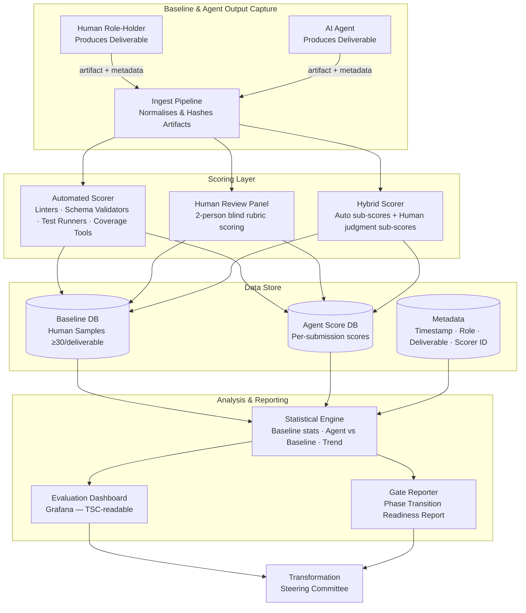

# Evaluation Harness Specification — AI Agent Performance Measurement

#evaluation-harness #measure-first #transformation #ai-agent #phase-5

> **Hard Gate:** No AI agent activates for any role until this harness is operational and has captured ≥30 human baseline samples for every deliverable in that role's Wave. Activation without a populated baseline is a Phase 5 protocol violation.

> **Owner:** [[QA_TEST_AUTOMATION_ENGINEER_SKILL|QA & Test Automation Engineer]] (Process Architect)
> **Builder:** [[DEVOPS_PLATFORM_ENGINEER_SKILL|DevOps/Platform Engineer]]
> **Governance:** [[docs/review_v2/REVIEW_V2_PHASE5_ROADMAP|Phase 5 Evolution Roadmap]] — §2.1, §7, §9, §10

---

## 1. Purpose & Hard Gate Status

### 1.1 Why This Document Exists

The [[docs/review_v2/REVIEW_V2_PHASE5_ROADMAP|Phase 5 Evolution Roadmap]] establishes a single, non-negotiable prerequisite before any AI agent is activated for any of the 14 primary roles: **"Measure first, delegate second."** (Roadmap §1.1, Principle 8.)

This document is the operational specification for that measurement infrastructure — the **Evaluation Harness**. It defines:

1. **What to measure** — the top-5 routine deliverables per role, selected for frequency (≥30 samples achievable), objective scorability, and representativeness of routine performance.
2. **How to measure it** — specific, pre-defined scoring methods per deliverable type, distinguishing automated scoring (code artifacts, schemas, configs) from human-reviewed scoring (architecture decisions, threat models, business cases).
3. **When measurement gates agent activation** — the harness must be operational and baselines populated before the first agent in a Wave is turned on.
4. **Who builds and operates it** — [[DEVOPS_PLATFORM_ENGINEER_SKILL|DevOps/Platform Engineer]] builds the infrastructure; [[QA_TEST_AUTOMATION_ENGINEER_SKILL|QA & Test Automation Engineer]] (as Process Architect) operates it and feeds results to the Transformation Steering Committee (TSC).

### 1.2 Hard Gate Definition

The following conditions must all be GREEN before any agent activation in a given Wave:

| Gate ID | Condition | Responsible |
|---|---|---|
| **HG-1** | Harness infrastructure deployed and smoke-tested | [[DEVOPS_PLATFORM_ENGINEER_SKILL\|DevOps]] |
| **HG-2** | ≥30 human baseline samples captured per deliverable for every role in the Wave | [[QA_TEST_AUTOMATION_ENGINEER_SKILL\|QA]] |
| **HG-3** | Per-deliverable scoring rubrics validated on held-out human samples (inter-rater reliability ≥0.80 for human-reviewed items) | [[QA_TEST_AUTOMATION_ENGINEER_SKILL\|QA]] |
| **HG-4** | Evaluation Dashboard operational and readable by TSC | [[DEVOPS_PLATFORM_ENGINEER_SKILL\|DevOps]] |
| **HG-5** | Baseline statistical report accepted by TSC (mean, p25, p75, and p95 per deliverable) | [[QA_TEST_AUTOMATION_ENGINEER_SKILL\|QA]] + TSC |

**Gate authority:** The TSC Chair (CTO) issues Wave activation clearance only after all five gates are GREEN. Gate status is reported on the Evaluation Dashboard (§8).

### 1.3 Activation Wave Schedule

Per [[docs/review_v2/REVIEW_V2_PHASE5_ROADMAP|Phase 5 Roadmap §2.2]]:

| Wave | Roles | Agent Activation Target | Harness Readiness Deadline |
|---|---|---|---|
| **Wave 1** | Data Engineer, Frontend Engineer, MLOps Engineer | Month 1–2 | End of Month 0 foundation sprint |
| **Wave 2** | Firmware Engineer, Backend/Cloud Engineer, DevOps/Platform Engineer | Month 2–3 | End of Month 1 |
| **Wave 3** | Hardware Engineer, Edge AI/ML Engineer, QA/Test Automation Engineer | Month 3–4 | End of Month 2 |
| **Wave 4** | Researcher, Security Engineer, Architect, Business Consultant, PO/TPM | Month 5–6 | End of Month 4 |

---

## 2. Architecture

### 2.1 System Overview



### 2.2 Component Responsibilities

| Component | Owner (Build) | Owner (Operate) | Technology |
|---|---|---|---|
| Ingest Pipeline | [[DEVOPS_PLATFORM_ENGINEER_SKILL\|DevOps]] | [[QA_TEST_AUTOMATION_ENGINEER_SKILL\|QA]] | Python FastAPI + MinIO storage |
| Automated Scorer | [[DEVOPS_PLATFORM_ENGINEER_SKILL\|DevOps]] | [[QA_TEST_AUTOMATION_ENGINEER_SKILL\|QA]] | pytest + per-tool plugins |
| Human Review Portal | [[DEVOPS_PLATFORM_ENGINEER_SKILL\|DevOps]] | [[QA_TEST_AUTOMATION_ENGINEER_SKILL\|QA]] | Lightweight web form (FastAPI/React) |
| Baseline DB | [[DEVOPS_PLATFORM_ENGINEER_SKILL\|DevOps]] | [[DATA_ENGINEER_SKILL\|Data Engineer]] | PostgreSQL (TimescaleDB extension for time-series scoring trends) |
| Statistical Engine | [[DEVOPS_PLATFORM_ENGINEER_SKILL\|DevOps]] | [[QA_TEST_AUTOMATION_ENGINEER_SKILL\|QA]] | Python (scipy, pandas) scheduled job |
| Evaluation Dashboard | [[DEVOPS_PLATFORM_ENGINEER_SKILL\|DevOps]] | [[QA_TEST_AUTOMATION_ENGINEER_SKILL\|QA]] | Grafana (config-as-code) |
| Gate Reporter | [[QA_TEST_AUTOMATION_ENGINEER_SKILL\|QA]] | [[QA_TEST_AUTOMATION_ENGINEER_SKILL\|QA]] | Python → Markdown report auto-generated |

### 2.3 Data Flow

1. A human role-holder or AI agent submits an artifact to the **Ingest Pipeline** via API, CI/CD hook, or file upload. Submission includes: `role`, `deliverable_id`, `producer_type` (HUMAN/AGENT), `artifact_uri`, `metadata_json`.
2. The Ingest Pipeline normalises the artifact (extracts the scorable representation) and routes it to the appropriate scorer(s).
3. The Automated Scorer runs deterministic checks and returns a structured score object: `{deliverable_id, metric_id, score, max_score, pass_fail, detail}`.
4. Human Review Portal presents artifacts to the 2-person blind review panel; each reviewer submits rubric scores. The system averages the two scores; if divergence > 20%, a third reviewer adjudicates.
5. All scores are written to the appropriate DB with full provenance metadata.
6. The Statistical Engine runs hourly; the Evaluation Dashboard and Gate Reporter update in near-real-time.

---

## 3. Per-Role Evaluation Design

> **Selection criteria for top-5 deliverables per role:**
> (a) Produced frequently enough to gather ≥30 samples per year in normal operations.
> (b) Objectively scorable via pre-defined rubric or automated check.
> (c) Representative of routine (not exceptional or once-per-product) performance.
> (d) Has a clear format specification in the role's SKILL.md §5.

> **Scoring type key:** `AUTO` = fully automated; `HR` = human-reviewed (blind rubric); `HYB` = hybrid (automated sub-scores + human judgment sub-scores).

> **Sample target:** ≥30 per deliverable before any agent activation. Statistical significance threshold: Welch's t-test p < 0.05 when comparing agent mean to human baseline mean.

---

### 3.1 Wave 1 — Data Engineer

**Activation target:** Month 1–2 | **Baseline readiness deadline:** End Month 0

| # | Deliverable | Scoring Type | Key Metrics | Automated Tools | Human Rubric Dimensions | Min Sample |
|---|---|---|---|---|---|---|
| D1-DE-1 | **Ingestion Pipeline** (Python/YAML DAG) | AUTO | (a) Linting pass rate (flake8/ruff, 0 errors), (b) DAG import success, (c) Unit test pass rate ≥90%, (d) Schema validation against contract: pass/fail, (e) P99 ingestion latency vs SLO | flake8, ruff, pytest, Great Expectations schema check | — | 30 |
| D1-DE-2 | **Data-Quality Report** (per pipeline run) | HYB | AUTO: (a) All required sections present (completeness %, accuracy %, timeliness %, deduplication rate, schema conformance %), (b) Values within defined SLO thresholds flagged correctly; HR: (c) Root-cause analysis clarity for any SLO breach (0–3 scale) | Markdown section parser, threshold check script | RCA clarity (0–3), actionability of findings (0–3) | 30 |
| D1-DE-3 | **ETL/ELT + Feature Pipeline** (Spark/Airflow DAG) | AUTO | (a) DAG execution success rate, (b) Output schema matches downstream contract (Great Expectations), (c) Unit test coverage ≥80% (pytest-cov), (d) No data-loss events in test run (sample count in == count out ±expected), (e) Feature distribution within expected statistical bounds (KS test p > 0.05) | pytest-cov, Great Expectations, scipy KS test | — | 30 |
| D1-DE-4 | **Curated/Labeled Dataset** (DVC-versioned) | AUTO | (a) Schema compliance (all required columns present, correct types), (b) Completeness rate ≥99% (non-null rate per required field), (c) Deduplication rate (duplicate records / total), (d) Label coverage rate (labeled / total samples), (e) DVC version tag present with lineage pointer | DVC CLI, pandas profiling, schema checker | — | 30 |
| D1-DE-5 | **Data Catalog + Lineage Record** | HYB | AUTO: (a) All datasets registered (coverage %), (b) Lineage pointer present per dataset, (c) Schema version recorded; HR: (d) Lineage accuracy (spot-check 5 records, 0–3 per record), (e) Discoverability of entries (0–3) | Catalog completeness script | Lineage accuracy (0–3), discoverability (0–3) | 30 |

**Composite score formula:** Each deliverable scored 0–100. Composite = weighted average: D1=20%, D2=20%, D3=25%, D4=25%, D5=10%.

---

### 3.2 Wave 1 — Frontend/Dashboard Engineer

**Activation target:** Month 1–2 | **Baseline readiness deadline:** End Month 0

| # | Deliverable | Scoring Type | Key Metrics | Automated Tools | Human Rubric Dimensions | Min Sample |
|---|---|---|---|---|---|---|
| D1-FE-1 | **Fleet Monitoring Dashboard** (React/TypeScript build) | AUTO | (a) Lighthouse Performance score ≥85, (b) Lighthouse Accessibility score ≥90, (c) Core Web Vitals: LCP ≤2.5 s, CLS ≤0.1, FID ≤100 ms, (d) TypeScript build 0 errors, (e) Jest unit test pass rate ≥90% | Lighthouse CI, tsc, Jest | — | 30 |
| D1-FE-2 | **Real-Time Data Client Module** (WebSocket/MQTT abstraction) | AUTO | (a) TypeScript strict-mode: 0 errors, (b) Unit test coverage ≥85% (Jest, jest-coverage), (c) E2E reconnection test: pass (connection drop → reconnect within 5 s), (d) Message-parsing round-trip: 100% parity with schema, (e) ESLint 0 errors | tsc --strict, jest, Playwright | — | 30 |
| D1-FE-3 | **Frontend Test Suite** (Jest + Playwright) | HYB | AUTO: (a) All tests pass (0 failures), (b) Line coverage ≥80%, (c) E2E scenario coverage (% of user flows in acceptance criteria covered); HR: (d) Test quality (are edge cases meaningfully covered? 0–3), (e) Test maintainability (clear structure, no brittle selectors; 0–3) | jest-coverage, Playwright report | Test quality (0–3), maintainability (0–3) | 30 |
| D1-FE-4 | **Component Library / Design System** (Storybook) | AUTO | (a) Storybook build success (0 errors), (b) Each exported component has ≥1 story, (c) axe-core accessibility: 0 critical/serious violations per component, (d) TypeScript types exported (0 `any` in public API), (e) npm package publishes without error | Storybook CLI, axe-storybook, tsc | — | 30 |
| D1-FE-5 | **API/Streaming Contract Requirement Spec** (Markdown + OpenAPI annotations) | HR | (a) All required endpoints described (coverage vs API surface), (b) Payload shapes fully specified (no "TBD" fields), (c) Update-frequency and latency expectations stated, (d) Breaking-change notification process described, (e) Reviewed and accepted by Backend/Cloud Engineer | — | Completeness (0–3), specificity of payload shapes (0–3), acceptance by counterpart (pass/fail) | 30 |

**Composite score formula:** D1=25%, D2=20%, D3=20%, D4=20%, D5=15%.

---

### 3.3 Wave 1 — MLOps Engineer

**Activation target:** Month 1–2 | **Baseline readiness deadline:** End Month 0

| # | Deliverable | Scoring Type | Key Metrics | Automated Tools | Human Rubric Dimensions | Min Sample |
|---|---|---|---|---|---|---|
| D1-ML-1 | **Automated Training/Deployment Pipeline** (YAML pipeline-as-code) | AUTO | (a) Pipeline executes end-to-end without manual intervention (pass/fail), (b) All stage tests pass (0 failures), (c) Artifact signing step present and passes, (d) Pipeline lint (YAML schema, 0 errors), (e) Rollback trigger test: rollback invoked correctly on injected failure | Pipeline CI execution, signing verifier, YAML linter | — | 30 |
| D1-ML-2 | **Model Registry Entry** (MLflow, per registered model version) | AUTO | (a) All required metadata fields populated (model version, data version, code commit SHA, hyperparameters, metrics, training date), (b) Lineage chain complete (data DVC ref → code Git ref → artifact), (c) Stage tag set correctly (Staging/Production), (d) Artifact URI valid and artifact present, (e) Drift-monitoring spec linked | MLflow API checks, lineage validator script | — | 30 |
| D1-ML-3 | **Drift-Monitoring Dashboard + Alerting Config** | HYB | AUTO: (a) Grafana dashboard config valid JSON (0 parse errors), (b) All required panels present (feature drift, label drift, prediction drift, model latency), (c) Alert rules syntax valid (Alertmanager config check), (d) Alert fires on injected drift signal (integration test); HR: (e) Alert threshold appropriateness (0–3) | grafana-validator, alertmanager dry-run | Alert threshold appropriateness (0–3) | 30 |
| D1-ML-4 | **OTA-Ready Model Artifact** (TFLite Micro + manifest) | AUTO | (a) Artifact schema compliance (manifest fields: model version, hardware ID, firmware compatibility range, tensor arena size, flash budget, SHA-256 hash), (b) MLOps signature valid (signature verifier), (c) SHA-256 hash in manifest matches actual artifact, (d) Flash size ≤ declared budget, (e) Tensor arena size ≤ declared budget | Manifest parser, signature verifier, size checker | — | 30 |
| D1-ML-5 | **Reproducibility/Audit (Lineage) Report** (per release) | HYB | AUTO: (a) Rebuildability job result: binary-identical rebuild success (SHA-256 match, pass/fail), (b) All required lineage fields present (data version, code version, hyperparameters, environment hash), (c) Report generated within 24 h of model registration; HR: (d) Clarity of audit trail for a third party (0–3) | Rebuildability CI job, section parser | Audit trail clarity (0–3) | 30 |

**Composite score formula:** D1=25%, D2=20%, D3=20%, D4=25%, D5=10%.

---

### 3.4 Wave 2 — Firmware Engineer

**Activation target:** Month 2–3 | **Baseline readiness deadline:** End Month 1

| # | Deliverable | Scoring Type | Key Metrics | Automated Tools | Human Rubric Dimensions | Min Sample |
|---|---|---|---|---|---|---|
| D2-FW-1 | **Production Firmware Binary** (.bin/.hex + .elf) | AUTO | (a) CI build success (0 errors, 0 warnings treated as errors), (b) Flash usage ≤ Architect's declared budget (from `.map` file), (c) SRAM usage ≤ budget, (d) Stack usage ≤ budget, (e) SemVer tag present and incremented correctly | arm-none-eabi-size, map-parser script, CI exit code | — | 30 |
| D2-FW-2 | **Unit Test Suite + Coverage Report** (Unity/Ceedling) | AUTO | (a) All unit tests pass (0 failures), (b) Line coverage ≥80% (lcov), (c) Branch coverage ≥70% (lcov), (d) New module: ≥1 test per public function, (e) Test run completes in CI without timeout | Unity/Ceedling runner, lcov | — | 30 |
| D2-FW-3 | **Static-Analysis Report** (cppcheck/clang-tidy/MISRA) | AUTO | (a) 0 MISRA C:2012 mandatory violations, (b) 0 cppcheck errors (severity: error), (c) 0 clang-tidy errors (selected checks), (d) Advisory violations count (tracked for trend), (e) Report generated in CI (not manual) | cppcheck, clang-tidy, MISRA checker | — | 30 |
| D2-FW-4 | **Firmware Memory Map / Resource Report** (Markdown + .map excerpt) | HYB | AUTO: (a) All budget categories present (Flash, SRAM, stack, tensor arena if applicable), (b) Explicit units in every row (KB/bytes), (c) Δ from previous version computed; HR: (d) Accuracy of interpretation (budget headroom correctly identified; 0–3), (e) Proactive risk flagging (approaching budget flagged? 0–3) | map-parser, unit checker script | Accuracy of interpretation (0–3), risk flagging (0–3) | 30 |
| D2-FW-5 | **Device Telemetry Schema Implementation** (Protobuf .proto / CBOR encoder) | AUTO | (a) Protobuf compiles without error (`protoc`), (b) Schema version matches schema registry entry, (c) Round-trip encode/decode test: 100% field parity on test vector set, (d) Schema is additive-only (no breaking field removals vs previous minor version), (e) CBOR/protobuf output size ≤ declared per-message budget | protoc, round-trip test suite, schema diff tool | — | 30 |

**Composite score formula:** D1=25%, D2=25%, D3=20%, D4=15%, D5=15%.

---

### 3.5 Wave 2 — Backend/Cloud Engineer

**Activation target:** Month 2–3 | **Baseline readiness deadline:** End Month 1

| # | Deliverable | Scoring Type | Key Metrics | Automated Tools | Human Rubric Dimensions | Min Sample |
|---|---|---|---|---|---|---|
| D2-BE-1 | **Device-Management API** (OpenAPI spec + implementation) | AUTO | (a) OpenAPI spec validates (openapi-validator, 0 errors), (b) API contract tests pass (dredd or schemathesis, ≥95% pass rate), (c) P99 latency ≤ SLO under load-test (k6, 500 req/s, 10 min), (d) Error rate ≤0.1% under load, (e) Auth enforcement: all unauthed requests rejected (100%) | openapi-validator, schemathesis, k6 | — | 30 |
| D2-BE-2 | **Database Schema + Migrations** (PostgreSQL/Redis) | AUTO | (a) All migrations apply cleanly on empty DB (Alembic/Flyway 0 errors), (b) All migrations roll back cleanly, (c) Schema drift: 0 differences between ORM model and DB schema (detected by sqlacodegen/diff tool), (d) All FK constraints and indexes declared explicitly, (e) Migration is idempotent (run twice → same result) | Alembic, sqlacodegen diff, psql | — | 30 |
| D2-BE-3 | **Authn/Authz Implementation** (mTLS + OAuth/JWT) | AUTO | (a) mTLS handshake success rate: 100% with valid cert, 0% with invalid cert (integration test), (b) JWT signature validation: 100% reject invalid tokens, (c) OAuth token expiry enforced (test: expired token rejected), (d) RBAC: role-over-permission test matrix pass rate 100%, (e) Security test suite (from [[SECURITY_ENGINEER_SKILL\|Security Engineer]]'s Threat-Derived Test Case Schema) pass rate ≥ baseline | mTLS integration test, JWT test suite, RBAC matrix test | — | 30 |
| D2-BE-4 | **API Documentation** (OpenAPI/Swagger) | HYB | AUTO: (a) OpenAPI spec present for all endpoints (coverage 100%), (b) All parameters and response schemas defined (0 `{}` or undefined), (c) Spec generates valid Swagger UI (0 render errors); HR: (d) Clarity of descriptions for non-trivial endpoints (0–3), (e) Example responses provided and accurate (0–3) | openapi-validator, Swagger render check | Description clarity (0–3), example accuracy (0–3) | 30 |
| D2-BE-5 | **Service Observability + SLO Definitions** (OpenTelemetry + dashboards) | HYB | AUTO: (a) All defined SLO metrics exported (OpenTelemetry: 0 missing metric names), (b) Grafana dashboard config valid (0 parse errors), (c) Alert fires within 60 s of injected SLO breach (integration test); HR: (d) SLO target appropriateness vs Architect's NFR targets (0–3) | otel-sdk metrics check, grafana-validator, alert integration test | SLO target appropriateness (0–3) | 30 |

**Composite score formula:** D1=30%, D2=20%, D3=25%, D4=10%, D5=15%.

---

### 3.6 Wave 2 — DevOps/Platform Engineer

**Activation target:** Month 2–3 | **Baseline readiness deadline:** End Month 1

| # | Deliverable | Scoring Type | Key Metrics | Automated Tools | Human Rubric Dimensions | Min Sample |
|---|---|---|---|---|---|---|
| D2-DO-1 | **CI/CD Pipeline** (firmware + cloud, YAML) | AUTO | (a) End-to-end pipeline execution success rate (pass/fail per run, target ≥95%), (b) Artifact signing step present and succeeds, (c) All test stages must pass before artifact promotion (gate enforcement: 0 bypasses), (d) YAML lint (0 errors), (e) Build time ≤ declared SLO (pipeline duration metric) | CI/CD platform, yaml-lint, signing verifier | — | 30 |
| D2-DO-2 | **Infrastructure-as-Code** (Terraform/Ansible) | AUTO | (a) `terraform plan` exits 0 (0 errors), (b) Terraform fmt: 0 formatting violations, (c) tfsec/tflint: 0 high/critical violations, (d) Checkov policy compliance: 0 critical failures, (e) IaC applies idempotently (apply twice → 0 changes on second apply) | terraform, tfsec, tflint, checkov | — | 30 |
| D2-DO-3 | **Fleet OTA / Device-Management System Config** (Mender/balena, staging-tested) | AUTO | (a) OTA delivery success rate in staging ≥99% (test: deploy to 10+ device simulators), (b) Automatic rollback triggers correctly on injected failure (100%), (c) Staged rollout config present (canary % defined, per-stage gates defined), (d) Rollback completes within 5 min (measured in staging test), (e) Artifact signature verified before apply (0 unsigned artifact applications) | Mender/balena API integration test, OTA simulator | — | 30 |
| D2-DO-4 | **Observability Stack** (Prometheus + Loki + Grafana) | AUTO | (a) All required metric names scraped (coverage vs declared metric catalog: 100%), (b) Loki log ingestion: 0 dropped log lines in soak test, (c) Grafana dashboards render without errors (0 panel errors), (d) Alert fires within SLO window on injected signal, (e) Observability stack itself monitored (meta-monitoring: 0 undetected stack outages in test) | prometheus-query, grafana-validator, alert integration test | — | 30 |
| D2-DO-5 | **Runbook** (deploy/rollback/incident/DR — Markdown) | HR | (a) All required sections present: trigger conditions, prerequisites, step-by-step procedure, rollback steps, escalation path, (b) Steps are executable without prior context (can a new on-call follow them?), (c) Rollback procedure is tested and dated, (d) Escalation contacts and SLAs specified, (e) Reviewed by ≥1 consumer role | — | Section completeness (0–3), executability by new on-call (0–3), rollback testability (0–3) | 30 |

**Composite score formula:** D1=25%, D2=20%, D3=25%, D4=20%, D5=10%.

---

### 3.7 Wave 3 — Hardware Engineer

**Activation target:** Month 3–4 | **Baseline readiness deadline:** End Month 2

| # | Deliverable | Scoring Type | Key Metrics | Automated Tools | Human Rubric Dimensions | Min Sample |
|---|---|---|---|---|---|---|
| D3-HW-1 | **Schematic** (Altium/KiCad source + PDF) | HYB | AUTO: (a) ERC (Electrical Rule Check) 0 errors, (b) DRC (Design Rule Check) 0 errors, (c) All required peripherals present (checklist vs Board Spec); HR: (d) Net naming clarity and consistency (0–3), (e) Power decoupling completeness for all ICs (0–3) | KiCad ERC/DRC, peripheral checklist | Net naming (0–3), decoupling completeness (0–3) | 30 |
| D3-HW-2 | **Bill of Materials (BOM)** (CSV/PLM export) | AUTO | (a) All schematic components present in BOM (BOM-to-schematic match rate: 100%), (b) All required fields populated: Manufacturer Part Number, Description, Value, Package, Reference Designator, (c) ≥1 second-source per component rated Critical or High (supply chain risk), (d) Rohs/compliance status field populated, (e) Total BOM cost field present | BOM diff script, field completeness checker | — | 30 |
| D3-HW-3 | **Bring-Up Report** (Markdown + measurement data) | HR | (a) All 7 joint DoD items addressed (power rails, clocks, reset, buses, sensors, debug/programming, power budget) — per [[FIRMWARE_ENGINEER_SKILL\|FW]]/HW Shared Bring-Up DoD, (b) Measured values present for each item (not just pass/fail), (c) Report is co-signed by both HW and FW, (d) Items not passing explicitly blocked and tracked, (e) Measurement instrument and date recorded | — | DoD completeness (0–3), measurement evidence quality (0–3), co-sign present (pass/fail) | 30 |
| D3-HW-4 | **Power Tree / Power Budget** (Markdown + diagram) | HYB | AUTO: (a) Explicit units in every row (mA/mW), (b) Sum of per-rail budgets ≤ Architect's total power budget, (c) Per-rail current margin ≥10% (actual vs declared), (d) Diagram present (file attached or embedded); HR: (e) Correctness of worst-case current estimates (0–3) | Unit checker, budget sum validator | Worst-case estimate correctness (0–3) | 30 |
| D3-HW-5 | **Sensor Characterization Data** (dataset + Markdown summary) | HYB | AUTO: (a) All required measurement fields present per sensor (SNR dB, resolution bits, sampling rate Hz, drift ppm, noise floor), (b) Measurements taken at defined temperature points (min/typ/max per spec), (c) Dataset file present with correct format (CSV/HDF5 with header); HR: (d) Test methodology adequacy (are test conditions representative? 0–3) | Field completeness checker, dataset schema validator | Test methodology adequacy (0–3) | 30 |

**Composite score formula:** D1=25%, D2=20%, D3=20%, D4=20%, D5=15%.

---

### 3.8 Wave 3 — Edge AI/ML Engineer

**Activation target:** Month 3–4 | **Baseline readiness deadline:** End Month 2

| # | Deliverable | Scoring Type | Key Metrics | Automated Tools | Human Rubric Dimensions | Min Sample |
|---|---|---|---|---|---|---|
| D3-AI-1 | **Quantized TFLite Micro Model** (.tflite / C array) | AUTO | (a) Model accuracy on held-out validation set ≥ declared acceptance threshold (from model card), (b) On-device latency ≤ Architect's latency budget (ms, measured on target), (c) Flash footprint ≤ declared flash budget (KB), (d) INT8 quant correctness: output difference vs FP32 reference ≤ 1 LSB on test vector set, (e) Model loads without error in TFLite Micro runtime | TFLite Micro runtime test, accuracy eval script, size checker | — | 30 |
| D3-AI-2 | **Preprocessing Specification** (Markdown + Python golden reference + test vectors) | AUTO | (a) Python golden reference executes without error, (b) Test vector set size ≥100 samples, (c) Firmware preprocessing output matches golden reference to bit-level precision: parity pass rate 100%, (d) All preprocessing steps documented (list completeness vs declared pipeline), (e) Fixed-point parameters explicit (no floating-point in device path) | Preprocessing parity test runner | — | 30 |
| D3-AI-3 | **Accuracy/Latency/Footprint Benchmark Report** (Markdown tables) | HYB | AUTO: (a) All three metric categories present (accuracy, latency, footprint), (b) Explicit units in every row, (c) On-device measurements present (not simulation only), (d) Delta from previous model version computed; HR: (e) Interpretation of results vs architectural budgets (did the author correctly diagnose any budget exceedances? 0–3) | Section parser, unit checker | Result interpretation quality (0–3) | 30 |
| D3-AI-4 | **Model Card** (Markdown) | HR | (a) All required sections present: intended use, performance metrics, training data description, known limitations, out-of-scope uses, fairness/bias considerations, (b) Quantitative performance claims backed by measured data, (c) Training dataset DVC reference present, (d) Applicable hardware constraints documented, (e) Authored before production registration (date check vs registry) | — | Completeness (0–3), honesty about limitations (0–3), data reference quality (0–3) | 30 |
| D3-AI-5 | **Reproducible Training Recipe** (code + config + Dockerfile) | AUTO | (a) Clean rebuild from recorded lineage succeeds (binary-identical artifact: SHA-256 match), (b) Docker build completes without error, (c) All hyperparameters pinned in config (0 random seeds unset), (d) Data version (DVC ref) and code version (Git SHA) recorded, (e) Training script exits 0 on dry-run with dummy data | Reproducibility CI job, docker build, config completeness checker | — | 30 |

**Composite score formula:** D1=30%, D2=20%, D3=20%, D4=15%, D5=15%.

---

### 3.9 Wave 3 — QA & Test Automation Engineer

**Activation target:** Month 3–4 | **Baseline readiness deadline:** End Month 2

| # | Deliverable | Scoring Type | Key Metrics | Automated Tools | Human Rubric Dimensions | Min Sample |
|---|---|---|---|---|---|---|
| D3-QA-1 | **End-to-End Validation Suite + Results** (pytest/Robot Framework/Playwright) | AUTO | (a) All E2E tests pass (0 failures), (b) Critical-path scenario coverage: 100% of acceptance-criteria scenarios represented, (c) OTA/rollback scenario present and passing, (d) Test execution is non-interactive (CI-runnable without human), (e) Results report generated automatically per run | pytest, Robot Framework, Playwright CLI | — | 30 |
| D3-QA-2 | **NFR Verification Matrix (Populated)** (Markdown/structured) | AUTO | (a) 0 TBD values in Target column (per Architect's §5.1 NFR matrix gate), (b) Every NFR ID has a corresponding test result (coverage 100%), (c) Measurement method field non-empty for all rows, (d) Validation owner field populated for all rows, (e) Last-updated date present and within current release cycle | NFR matrix parser, TBD detector, ID coverage checker | — | 30 |
| D3-QA-3 | **Defect Report** (Jira issue) | HR | (a) Reproducible steps present (numbered, executable by another QA engineer), (b) Evidence attached (log snippet, screenshot, or trace), (c) Severity classification correct (CRITICAL/HIGH/MEDIUM/LOW per project taxonomy, validated by peer), (d) Traced to requirement or contract clause, (e) Assigned to correct owning role | — | Reproducibility (0–3), evidence quality (0–3), severity accuracy (pass/fail via peer review) | 30 |
| D3-QA-4 | **Release-Readiness Report** (Markdown) | HR | (a) All required sections present: scope, test results summary, open defects with severity, go/no-go recommendation with explicit rationale, sign-off authority, (b) Go/no-go recommendation supported by measured data (not judgment alone), (c) All Critical/High defects dispositioned (fixed, deferred with risk acceptance, or blocking), (d) NFR verification matrix link included, (e) Produced within the release window (date vs release date) | — | Rationale quality (0–3), defect disposition completeness (0–3), actionability (0–3) | 30 |
| D3-QA-5 | **Requirements Traceability Matrix** (Markdown/spreadsheet) | AUTO | (a) Coverage: every stated requirement has ≥1 linked test case, (b) No orphan tests (tests with no requirement link), (c) Requirements source (SKILL.md clause, ADR ID, or user story ID) cited per row, (d) Test-result column populated per current release, (e) Matrix generated from CI data (not manually maintained) | RTM coverage script, orphan-test detector | — | 30 |

**Composite score formula:** D1=25%, D2=25%, D3=20%, D4=20%, D5=10%.

---

### 3.10 Wave 4 — IoT Embedded Systems Researcher

**Activation target:** Month 5–6 | **Baseline readiness deadline:** End Month 4

| # | Deliverable | Scoring Type | Key Metrics | Automated Tools | Human Rubric Dimensions | Min Sample |
|---|---|---|---|---|---|---|
| D4-RE-1 | **Research Proposal Document** (Markdown/LaTeX) | HR | (a) Hypothesis stated explicitly and falsifiably, (b) Experimental methodology described (DoE structure or equivalent), (c) Novelty assessment: prior art cited and gap identified, (d) Resource requirements (time, equipment, personnel) estimated, (e) Success criteria defined quantitatively | — | Hypothesis clarity (0–3), novelty credibility (0–3), resource estimate realism (0–3) | 30 |
| D4-RE-2 | **Statistical Analysis Report** (Jupyter Notebook / MATLAB) | HYB | AUTO: (a) Notebook executes end-to-end without error (`jupyter nbconvert --execute`), (b) All claims include confidence intervals or p-values, (c) Sample size reported per analysis; HR: (d) Appropriate statistical test selection for data distribution (0–3), (e) Uncertainty quantification adequacy (0–3) | Jupyter execute, section parser | Statistical test appropriateness (0–3), uncertainty adequacy (0–3) | 30 |
| D4-RE-3 | **Feasibility Assessment Report** (Markdown) | HR | (a) TRL (Technology Readiness Level) assessment present with justification, (b) Known limitations enumerated (≥3 for any non-trivial technology), (c) Estimated engineering effort quantified (person-months or ranges), (d) Open questions that would block productization listed, (e) Recommendation: productize / monitor / abandon — with rationale | — | TRL justification quality (0–3), limitation honesty (0–3), effort estimate realism (0–3) | 30 |
| D4-RE-4 | **Literature Survey / State-of-the-Art Report** (Markdown/LaTeX) | HR | (a) ≥20 primary sources cited (peer-reviewed or authoritative), (b) Coverage of key sub-domains assessed (completeness vs stated scope), (c) Research gaps explicitly identified (≥3 gaps), (d) Implications for the team's product direction stated, (e) Bibliography in consistent citation format | — | Coverage breadth (0–3), gap identification quality (0–3), product relevance (0–3) | 30 |
| D4-RE-5 | **Technology Transfer Pack** (ZIP archive) | HYB | AUTO: (a) All 7 required components present: paper/report, datasets, PoC schematic, BOM, firmware, feasibility report, annotated bibliography, (b) Archive unpacks without error, (c) DVC/Git version references present for datasets and code; HR: (d) Sufficiency for engineering team to begin productization without author present (0–3) | Archive component checker, DVC ref validator | Productization sufficiency (0–3) | 30 |

**Composite score formula:** D1=20%, D2=25%, D3=25%, D4=15%, D5=15%.

---

### 3.11 Wave 4 — Security Engineer

**Activation target:** Month 5–6 | **Baseline readiness deadline:** End Month 4

> **Note:** Security deliverables have a higher human-review weighting than other roles. An AI agent that scores well on structural completeness but misses a threat class is more dangerous than an agent with lower structural scores and better threat coverage. The human-review panel for Security deliverables must include ≥1 certified security professional (CISSP, OSCP, or equivalent) as one of the two reviewers.

| # | Deliverable | Scoring Type | Key Metrics | Automated Tools | Human Rubric Dimensions | Min Sample |
|---|---|---|---|---|---|---|
| D4-SE-1 | **Threat Model (STRIDE)** (Markdown + DFD) | HR | (a) All trust boundaries identified and documented (completeness vs system DFD), (b) All 6 STRIDE threat categories addressed for each trust boundary, (c) Mitigations mapped to each identified threat (0 unmitigated Critical/High threats), (d) Data-flow diagram present and current with architecture, (e) Reviewed and accepted by [[EMBEDDED_SYSTEMS_ARCHITECT_SKILL\|Architect]] | — | Trust boundary completeness (0–3), STRIDE category coverage depth (0–3), mitigation quality (0–3) | 30 |
| D4-SE-2 | **Security Baseline Specification** (Markdown) | HR | (a) All required domains covered: secure boot, mTLS, PKI design, key management, device hardening, data classification, (b) Specific, implementable requirements (not aspirational statements — each requirement actionable by the implementing role), (c) CVSS scoring applied to each baseline requirement violation class, (d) Referenced to NIST SP 800-53 or equivalent, (e) Co-reviewed by [[EMBEDDED_SYSTEMS_ARCHITECT_SKILL\|Architect]] | — | Specificity of requirements (0–3), implementability by consuming role (0–3), standards traceability (0–3) | 30 |
| D4-SE-3 | **Penetration-Test Report** (Markdown/PDF) | HYB | AUTO: (a) All required sections present: scope, methodology, findings list, severity (CVSS scores), remediation guidance, (b) CVSS scores parseable and within 9.0/10 scale; HR: (c) Finding completeness relative to scope (were all attack surfaces covered? 0–3), (d) Remediation guidance quality (actionable for implementing role? 0–3) | Section parser, CVSS validator | Finding completeness (0–3), remediation quality (0–3) | 30 |
| D4-SE-4 | **Vulnerability Assessment + Remediation Register** (live register) | AUTO | (a) All required fields populated per entry: CVE/finding ID, description, CVSS score, affected component, remediation status, owner, due date, (b) No entries with CVSS ≥9.0 in status "Open" beyond 2-business-day SLA, (c) Register last-updated date within 7 days, (d) Remediation status transitions logged (not overwritten), (e) All High/Critical entries have mitigation owner assigned | Register field completeness script, SLA breach detector, status log checker | — | 30 |
| D4-SE-5 | **Secure-OTA Governance Policy** (Markdown) | HR | (a) Artifact signing requirements specified (algorithm, key storage, rotation period), (b) Integrity verification requirements specified per OTA hop, (c) Anti-rollback mechanism requirements specified, (d) Approval requirements for OTA push to production fleet defined (who, what evidence), (e) Policy references the [[EMBEDDED_SYSTEMS_ARCHITECT_SKILL\|Architect]]'s OTA Strategy Specification and OTA Model Artifact Contract | — | Completeness of signing requirements (0–3), anti-rollback specificity (0–3), approval process clarity (0–3) | 30 |

**Composite score formula:** D1=30%, D2=25%, D3=20%, D4=15%, D5=10%.

---

### 3.12 Wave 4 — Embedded Systems Architect

**Activation target:** Month 5–6 | **Baseline readiness deadline:** End Month 4

> **Note:** Architect deliverables carry the highest impact and require the highest-caliber human reviewers. The human review panel for Architect deliverables must include both the [[SECURITY_ENGINEER_SKILL|Security Engineer]] and the [[QA_TEST_AUTOMATION_ENGINEER_SKILL|QA/Process Architect]] as the two required reviewers for any HR-type deliverable.

| # | Deliverable | Scoring Type | Key Metrics | Automated Tools | Human Rubric Dimensions | Min Sample |
|---|---|---|---|---|---|---|
| D4-AR-1 | **Architecture Decision Record (ADR)** (Markdown, per ADR) | HYB | AUTO: (a) All required sections present (Status, Context, Decision, Consequences, Consulted, ADR tier), (b) File is append-only (no in-place edits vs previous version in Git diff), (c) Consulted roles wikilinked, (d) Status is a valid state (Proposed/Accepted/Superseded/Deprecated); HR: (e) Decision rationale quality — does the decision follow from the stated context? (0–3), (f) Consequences section identifies risks, not just benefits (0–3) | ADR section parser, Git diff mutability check | Decision rationale quality (0–3), consequences completeness (0–3) | 30 |
| D4-AR-2 | **Interface Contract Specification** (Markdown + schema files) | HYB | AUTO: (a) Integration Readiness Criteria appendix present (≥3 scenarios: happy path, degraded, failure/recovery), (b) Pass/fail criteria defined per scenario, (c) Integration Readiness Declaration template present, (d) Schema files parseable (proto compile / JSON Schema validate); HR: (e) Boundary clarity (is the ownership boundary unambiguous? 0–3), (f) Failure mode coverage in scenarios (0–3) | Proto compile, JSON Schema validator, section parser | Boundary clarity (0–3), failure mode coverage (0–3) | 30 |
| D4-AR-3 | **Per-Node Resource Budget** (Markdown tables) | AUTO | (a) All declared nodes covered, (b) All 4 resource categories present per node: compute, Flash/SRAM, power, latency, (c) Explicit units in every cell (KB, mA, ms — no bare numbers), (d) 0 TBD values, (e) Budgets re-baselined at each integration milestone (date of last update within declared cycle) | Budget table parser, unit checker, TBD detector | — | 30 |
| D4-AR-4 | **System Architecture Document (SAD)** (Markdown + C4/Mermaid diagrams) | HR | (a) C4 model: all 4 levels present (Context, Container, Component, Code) or explicit rationale for omission, (b) Data-flow diagram present and current with telemetry flow, (c) All deployment targets represented (MCU nodes, gateways, cloud, edge), (d) Architecture rationale present (why this topology, not just what), (e) Production-accurate (as-built marker at release gate) | — | View completeness (0–3), rationale depth (0–3), production-accuracy (0–3) | 30 |
| D4-AR-5 | **NFR Verification Matrix** (Markdown structured table) | AUTO | (a) 0 TBD in Target column, (b) All NFR categories from §5.1 covered (Reliability, Robustness, Scalability, Performance, Security, Safety, Maintainability), (c) Measurement method column non-empty for all rows, (d) Validation owner assigned for all rows, (e) Each category has ≥1 quantified target (not qualitative) | NFR matrix parser, TBD detector, category coverage checker | — | 30 |

**Composite score formula:** D1=20%, D2=25%, D3=20%, D4=25%, D5=10%.

---

### 3.13 Wave 4 — Business Consultant

**Activation target:** Month 5–6 | **Baseline readiness deadline:** End Month 4

| # | Deliverable | Scoring Type | Key Metrics | Automated Tools | Human Rubric Dimensions | Min Sample |
|---|---|---|---|---|---|---|
| D4-BC-1 | **Business Case Document** (Excel model + PowerPoint summary) | HYB | AUTO: (a) Financial model file present and parseable (Excel/CSV), (b) All 4 required financial metrics computable from model: NPV, IRR, ROI, payback period, (c) Scenario tabs present (base/optimistic/pessimistic), (d) Assumptions tab with source citations; HR: (e) Assumption defensibility (are key assumptions grounded in market data? 0–3), (f) Sensitivity analysis present and meaningful (0–3) | Model field extractor, Excel parser | Assumption defensibility (0–3), sensitivity analysis quality (0–3) | 30 |
| D4-BC-2 | **Market Opportunity Report** (PowerPoint/PDF) | HR | (a) TAM/SAM/SOM sizing present with methodology, (b) Competitive landscape: ≥5 direct/indirect competitors assessed, (c) Segment prioritization with scoring rationale, (d) Market entry recommendation with supporting evidence, (e) Data sources cited (not "industry estimates" alone) | — | TAM/SAM/SOM methodology rigor (0–3), competitive assessment depth (0–3), recommendation credibility (0–3) | 30 |
| D4-BC-3 | **Financial Model** (Excel/Google Sheets) | HYB | AUTO: (a) All required P&L line items present: BOM, NRE, certification, manufacturing, cloud OpEx, revenue streams, (b) Change log tab present, (c) No circular references (Excel formula check), (d) Model projects ≥3 years; HR: (e) Unit economics accuracy (are per-device economics correctly calculated? 0–3) | Excel/Sheets parser, formula integrity check | Unit economics accuracy (0–3) | 30 |
| D4-BC-4 | **Go-to-Market Plan** (PowerPoint + Gantt) | HR | (a) Channel strategy defined (direct/indirect/partner), (b) Pricing approved and documented, (c) Launch timeline with milestone dates, (d) Certification schedule included (CE/FCC/SDPPI as applicable), (e) Sales enablement roadmap present | — | Channel strategy completeness (0–3), timeline realism (0–3), certification plan adequacy (0–3) | 30 |
| D4-BC-5 | **Competitive Landscape Report** (PowerPoint/Confluence) | HR | (a) ≥10 competitors mapped (direct + indirect), (b) Feature-price matrix present (structured table), (c) Differentiation analysis: our product vs top 3 competitors explicitly stated, (d) Sources cited and dated (within 90 days), (e) Strategic recommendations derived from analysis | — | Competitor coverage completeness (0–3), differentiation analysis depth (0–3), recommendation actionability (0–3) | 30 |

**Composite score formula:** D1=30%, D2=20%, D3=20%, D4=15%, D5=15%.

---

### 3.14 Wave 4 — Product Owner / TPM

**Activation target:** Month 5–6 | **Baseline readiness deadline:** End Month 4

| # | Deliverable | Scoring Type | Key Metrics | Automated Tools | Human Rubric Dimensions | Min Sample |
|---|---|---|---|---|---|---|
| D4-PO-1 | **Prioritized Product Backlog** (Jira/Linear export) | HYB | AUTO: (a) All stories have acceptance criteria (0 empty AC fields), (b) AC format compliance: Given/When/Then present for ≥90% of stories, (c) Priority score present for all items, (d) Dependency links present where cross-role dependency exists; HR: (e) AC testability (are the ACs measurable and unambiguous? 0–3) | Jira/Linear export parser, AC format checker | AC testability (0–3) | 30 |
| D4-PO-2 | **Risk Register** (Confluence/spreadsheet) | AUTO | (a) All required fields per entry: risk description, probability (1–5), impact (1–5), risk score (P×I), mitigation action, mitigation owner, due date, status, (b) No entry with risk score ≥12 without a mitigation owner, (c) Register last-updated within 7 days, (d) All HIGH/CRITICAL risks have a mitigation status (not "Identified" only), (e) Historical risk closure rate tracked | Risk register parser, field completeness checker, SLA breach detector | — | 30 |
| D4-PO-3 | **Release Plan / Release Notes** (Confluence + template) | HR | (a) Scope section: all committed features listed with completion status, (b) OTA rollout strategy defined (cohorts, staged %, rollback criteria), (c) Rollback criteria explicitly stated (not implied), (d) QA sign-off reference included, (e) External-stakeholder communication plan present | — | OTA rollout strategy completeness (0–3), rollback criteria specificity (0–3), stakeholder plan adequacy (0–3) | 30 |
| D4-PO-4 | **OKRs (Objectives and Key Results)** (per quarter) | HR | (a) ≥3 Objectives per quarter, (b) Each Objective has ≥2 quantitative Key Results, (c) Key Results are measurable (have a numeric target and a measurement method), (d) KRs align to engineering output measurable in this cycle, (e) Previous quarter KR outcomes reported before new KRs issued | — | KR measurability (0–3), alignment to engineering milestones (0–3) | 30 |
| D4-PO-5 | **Stakeholder Status Report** (slide deck/Confluence) | HR | (a) Progress update covers all active workstreams, (b) Risk visibility: at least 1 risk surfaced or explicitly confirmed "no new risks", (c) Upcoming decisions that require stakeholder input identified, (d) Produced on the declared cadence (weekly/biweekly — date vs schedule), (e) Action items from previous report dispositioned | — | Progress update completeness (0–3), risk visibility quality (0–3), decision framing clarity (0–3) | 30 |

**Composite score formula:** D1=20%, D2=20%, D3=25%, D4=20%, D5=15%.

---

## 4. Scoring Methodology

### 4.1 Automated Scoring

Automated scoring is applied to all deliverables whose acceptance criteria are deterministic and tool-verifiable. It is the primary scoring method for code, configs, schemas, pipelines, and structured data artifacts.

**Principles:**
- Each automated metric is **binary** (pass/fail) or **continuous** (a measured value compared to a threshold from the role's SKILL.md or Architect's NFR matrix).
- Automated checks run in the Evaluation Harness CI — they are **not** re-run manually.
- A new threshold value requires a TSC-approved change to this spec (not a unilateral tool-config change).
- Automated score per deliverable = `(passed_checks / total_checks) × 100` for binary metrics; continuous metrics are scored as `max(0, min(100, 100 × (value / threshold)))` where threshold is the SLO target.

**Common automated checks library:**

| Check Category | Tools | Applies To |
|---|---|---|
| Code linting | flake8, ruff, ESLint, tsc --strict | Python, TypeScript |
| Schema validation | protoc, openapi-validator, JSON Schema, Great Expectations | Protobuf, OpenAPI, JSON, data schemas |
| Test pass rate | pytest, Unity/Ceedling, Jest, Robot Framework | All test suites |
| Coverage | pytest-cov, lcov, jest-coverage | Python, C/C++, TypeScript |
| IaC compliance | tfsec, tflint, checkov, terraform plan | Terraform/Ansible |
| Artifact signing | Custom verifier (SHA-256 + key check) | Firmware/model artifacts |
| Binary size | arm-none-eabi-size, size-checker script | Firmware binaries |
| Document structure | Markdown section parser (custom, open-sourced) | All Markdown deliverables |
| Load testing | k6, emqtt-bench, wrk | APIs, MQTT broker |
| Reproducibility | SHA-256 compare on clean rebuild | Training recipes, pipelines |

### 4.2 Human-Reviewed Scoring

Human-reviewed scoring is applied to deliverables where quality depends on judgment, creativity, interpretive accuracy, or domain expertise that cannot be reduced to deterministic checks (e.g., threat model threat coverage, architecture rationale depth, research novelty, business case assumption defensibility).

**Process:**
1. The Ingest Pipeline presents the artifact to the **Human Review Portal**, anonymised of producer identity (human or agent) to ensure blind scoring.
2. **Two reviewers** from the Human Review Panel independently score each dimension on a 0–3 rubric. Reviewers are assigned from the Human Review Panel roster (see §4.3).
3. Final score per dimension = mean of two reviewers' scores. If `|score_A − score_B| > 1`, a third reviewer adjudicates and the median of three is used.
4. Composite HR score = mean of all dimension scores, normalised to 0–100.
5. **Intra-rater reliability** is monitored quarterly: Cohen's κ ≥ 0.70 required for each reviewer to remain on the panel.

**Rubric scale (0–3):**

| Score | Meaning |
|---|---|
| 0 | Absent / Not addressed |
| 1 | Partially addressed; significant gaps |
| 2 | Adequately addressed; minor gaps |
| 3 | Fully addressed; exceeds expectation |

### 4.3 Human Review Panel Composition

| Deliverable Domain | Required Reviewer Qualifications |
|---|---|
| Security deliverables (D4-SE-*) | ≥1 certified security professional (CISSP, OSCP, CEH, or equivalent); ≥1 senior engineer familiar with the system |
| Architecture deliverables (D4-AR-*) | [[SECURITY_ENGINEER_SKILL\|Security Engineer]] + [[QA_TEST_AUTOMATION_ENGINEER_SKILL\|QA/Process Architect]] as required reviewers |
| Research deliverables (D4-RE-*) | ≥1 reviewer with research/PhD background; ≥1 senior engineer from a consuming role |
| Business deliverables (D4-BC-*) | ≥1 reviewer with finance/business background; ≥1 reviewer from Engineering Lead/CTO office |
| All other deliverables | Any 2 qualified senior engineers from the team, excluding the author's immediate role |

### 4.4 Hybrid Scoring

Hybrid scoring combines automated sub-scores and human-reviewed sub-scores. The composite is:

```
hybrid_score = (auto_weight × auto_score) + (hr_weight × hr_score)
```

Weights are defined per deliverable in §3 (e.g., a deliverable with `AUTO: 60%, HR: 40%` has `auto_weight=0.6, hr_weight=0.4`). Weights are declared in the deliverable definition and cannot be changed without a spec revision.

### 4.5 Score Normalisation

All scores are normalised to 0–100 before comparison. The **Composite Role Score** for a given agent vs. a given role is the weighted average of the 5 deliverable scores (weights defined per role in §3).

```
composite_role_score = Σ (deliverable_weight_i × deliverable_score_i)
```

The **Phase Gate Metric** is derived directly from this composite: an agent "matches or exceeds the human baseline" for a role when:

```
agent_composite_role_score_mean ≥ human_baseline_composite_role_score_mean
AND Welch's t-test: p < 0.05 (one-tailed, agent ≥ baseline)
```

---

## 5. Baseline Capture Protocol

### 5.1 Task Selection for Baseline Capture

Baseline tasks must be **real, representative, and comparable** — not cherry-picked best-work, not synthetic benchmarks.

**Selection criteria:**
1. **Real work:** Drawn from actual project tasks completed in the past 6 months or actively running in the next 3 months.
2. **Representative:** Routine deliverables of the type defined in §3 — not the most complex 10% or the most trivial 10%.
3. **Blind-scored:** The baseline artifact is scored by the harness without the scorer knowing it is a baseline (human) vs agent submission.
4. **Not cherry-picked:** The task selection is determined by the QA Process Architect using stratified random sampling from the task backlog (stratified by task type, not difficulty).
5. **Stable:** The deliverable type and its scoring rubric must not change during baseline capture. If the rubric changes, affected baselines must be recaptured.

### 5.2 Baseline Capture Procedure

```
For each role in the current Wave:
  For each of the 5 deliverables defined in §3:
    1. QA Process Architect identifies ≥30 real tasks of the correct type
       from the backlog or recent history.
    2. Human role-holder produces the deliverable on each task under
       normal working conditions (no additional review pressure).
    3. Each artifact is submitted to the Ingest Pipeline with
       producer_type=HUMAN and anonymised before scoring.
    4. Harness scores the artifact per the §3 and §4 scoring rules.
    5. Scores are stored in the Baseline DB.
    6. After ≥30 samples: QA Process Architect generates the
       Baseline Statistical Report (mean, SD, p25, p75, p95).
    7. TSC reviews and accepts the Baseline Statistical Report (Gate HG-5).
```

### 5.3 Baseline Statistical Report Contents

Per deliverable per role:

- `n` — number of samples
- `mean` — mean composite deliverable score
- `sd` — standard deviation
- `p25`, `p75`, `p95` — percentile anchors
- `min`, `max` — observed range
- `trend` — slope of score over time (detect learning curves)
- `temporal_stability_flag` — if `sd > 15` or `trend slope > 2 points/month`, flag for review before accepting as stable baseline

### 5.4 Baseline Validity and Refresh

| Condition | Action |
|---|---|
| >6 months since baseline capture for a role | Recapture ≥15 new samples; recompute statistics; notify TSC |
| Significant process change (new toolchain, SKILL.md major revision) | Full recapture of affected deliverables (≥30 samples) before next evaluation cycle |
| Human score trend detected (human getting better at the task) | Flag for TSC; update baseline; do not hold agents to a superseded standard |
| Human score degradation detected | Flag for TSC; investigate; do not update baseline until root cause is resolved |

### 5.5 Baseline Sovereignty

The human baseline is **not** the minimum acceptable bar — it is the **reference standard**. An agent that consistently scores below baseline is not ready to assist. An agent that consistently scores above baseline earns expanded authority per the Phase 2 gate criteria (§7). The baseline itself is protected: it cannot be lowered to make an agent look better. Any proposal to lower a baseline requires a formal TSC decision with documented rationale.

---

## 6. Agent Evaluation Protocol

### 6.1 Submission Protocol

When an AI agent produces a deliverable during human-supervised operation (Phase 1), the human reviewer submits the artifact to the Evaluation Harness:

```
POST /api/v1/submissions
{
  "role": "DATA_ENGINEER",
  "deliverable_id": "D1-DE-1",
  "producer_type": "AGENT",
  "agent_id": "data-engineer-agent-v1.2",
  "task_id": "TASK-4421",
  "artifact_uri": "s3://eval-harness/submissions/TASK-4421/D1-DE-1.zip",
  "human_reviewer_id": "rafli.triwijaya",
  "human_accepted": true,   // did the human accept this artifact for use?
  "human_edit_required": false,  // did the human edit before acceptance?
  "metadata_json": { "sprint": "2026-Q3-S4", "wave": 1 }
}
```

**Key tracked fields per agent submission:**
- `human_accepted` — binary: did the human accept the artifact as-is?
- `human_edit_required` — binary: did the human need to edit the artifact before it was usable?
- `edit_effort_minutes` — estimated time the human spent editing (if `human_edit_required=true`)
- `harness_score` — automated composite score from the harness
- `draft_acceptance_rate` — rolling average of `human_accepted` over last 30 submissions

### 6.2 Blind Scoring

All artifacts submitted to the harness (human baseline and agent) are scored blind: the scorer (human reviewer and automated tools) does not know `producer_type` until scoring is complete. The Ingest Pipeline strips producer identity from the artifact before forwarding to scorers.

### 6.3 Evaluation Frequency

| Context | Frequency |
|---|---|
| Phase 1 (Human-Supervised) | Every agent deliverable is evaluated |
| Phase 2 (Human-Supervised, expanded) | Every agent deliverable is evaluated |
| Phase 3+ | Sampled evaluation (≥30% of deliverables, randomly sampled per sprint) |

### 6.4 Agent Acceptance Rate Threshold

The **draft acceptance rate** is the primary Phase gate metric:

```
draft_acceptance_rate = 
  (submissions where human_accepted=true AND human_edit_required=false) /
  total_submissions
```

Phase 1→2 exit criterion: `draft_acceptance_rate ≥ 80%` org-wide, and `≥ 70%` per role.

The **harness score alignment** tracks the correlation between harness scores and human acceptance:

```
harness_alignment_correlation = Pearson(harness_score, human_accepted)
```

Target: ≥ 0.75. If alignment drops below 0.60, the scoring rubric for that deliverable is reviewed and potentially revised.

### 6.5 Safety & Security Incident Tracking

Every agent submission is also evaluated for safety/security impact:

| Incident Class | Definition | Threshold |
|---|---|---|
| **Agent-attributable safety incident** | A field-safety event (incorrect actuator command, unsafe state, unintended physical action) with a direct causal link to an unreviewed agent output | **0 tolerated (hard circuit breaker)** |
| **Agent-attributable security incident** | A confirmed breach or CRITICAL vulnerability (CVSS ≥ 9.0) reaching production with agent output in scope | **0 tolerated (org-wide abort to Human-Supervised)** |
| **Agent-attributable quality escape** | A defect escaping to production that was present in an agent-produced artifact and not caught by human review | Tracked; >2× pre-transformation baseline triggers circuit breaker |

These incident metrics feed directly into the circuit breaker conditions defined in the [[docs/review_v2/REVIEW_V2_PHASE5_ROADMAP|Phase 5 Roadmap §1.3]].

---

## 7. Transformation Gate Criteria — Mapping to Harness Outputs

### 7.1 Phase 1 → Phase 2 Exit Gate

Per [[docs/review_v2/REVIEW_V2_PHASE5_ROADMAP|Phase 5 Roadmap §7.1]], the Phase 1 → Phase 2 exit requires all of the following:

| Gate Criterion | Harness Output | Source Query | GREEN Threshold |
|---|---|---|---|
| **G1** — Every activated role's agent matches/exceeds human baseline on top-5 deliverables | `agent_composite_role_score_mean ≥ human_baseline_composite_role_score_mean` (Welch's t, p < 0.05) | Baseline DB + Agent Score DB | All activated roles GREEN |
| **G2** — Org-wide draft-acceptance rate ≥ 80% | `org_draft_acceptance_rate` | Agent Score DB, rolling 90 days | ≥ 80% |
| **G3** — Per-role draft-acceptance rate ≥ 70% | `role_draft_acceptance_rate` per role | Agent Score DB, rolling 90 days | ≥ 70% for all activated roles |
| **G4** — Zero agent-attributable safety incidents | `safety_incident_count` | Incident register | = 0 |
| **G5** — Zero agent-attributable security incidents | `security_incident_count` | Incident register | = 0 |
| **G6** — Human confidence survey ≥ 65% per role | `human_confidence_score` | Quarterly survey (separate instrument) | ≥ 65% per activated role |
| **G7** — Reversibility test pass | `reversibility_test_result` | Quarterly procedure test | PASS for all activated roles |

### 7.2 Wave Activation Gates (Pre-Agent-Activation Within Phase 1)

Before the first agent in a Wave is activated, the harness must confirm:

| Wave Gate | Condition | Harness Query |
|---|---|---|
| **WG-1** | ≥ 30 human baseline samples per deliverable for all roles in Wave | `SELECT COUNT(*) FROM baseline_db WHERE role=X AND deliverable_id=Y AND producer_type='HUMAN'` ≥ 30 for all X,Y in Wave |
| **WG-2** | Baseline statistical report accepted by TSC | `baseline_report_status[role][deliverable] = 'TSC_ACCEPTED'` for all roles in Wave |
| **WG-3** | Harness infrastructure smoke test passed for Wave's deliverable types | `smoke_test_result[wave] = 'PASS'` |

### 7.3 Circuit Breaker Trigger Metrics

The following harness outputs feed the [[docs/review_v2/REVIEW_V2_PHASE5_ROADMAP|Phase 5 Roadmap §1.3]] circuit breakers:

| Circuit Breaker | Harness Metric | Trigger Value |
|---|---|---|
| **Quality cliff** | `defect_escape_rate`, `ota_failure_rate`, robustness regression flag | > 2× pre-transformation baseline for 2 consecutive periods |
| **Trust collapse** | `human_confidence_score` per role | < 50% OR `shadow_review_rate` > 40% for 2 cycles |
| **Capability stall** | `draft_acceptance_rate` per role | Below next-phase entry threshold for 2 consecutive quarters |

---

## 8. Dashboard & Reporting

### 8.1 Evaluation Dashboard (Grafana)

The Evaluation Dashboard is the primary TSC-facing view of harness outputs. It is always-on (not a report generated on request).

**Dashboard panels (config-as-code in Git):**

| Panel ID | Title | Visualization | Update Frequency |
|---|---|---|---|
| DASH-1 | **Wave Activation Gate Status** | Traffic-light table (RED/AMBER/GREEN per gate per Wave) | Hourly |
| DASH-2 | **Baseline Sample Count per Role/Deliverable** | Heatmap (role × deliverable, colored by count; RED <30) | Daily |
| DASH-3 | **Human Baseline Statistics** | Box plot per deliverable (p25/median/p75/p95) | Daily |
| DASH-4 | **Agent Score vs Baseline — All Roles** | Bar chart: agent mean vs baseline mean per deliverable | Per submission |
| DASH-5 | **Draft Acceptance Rate — Rolling 90 days** | Line chart per role + org-wide line; threshold line at 80% | Per submission |
| DASH-6 | **Human Edit Required Rate** | Stacked bar per role: accepted-as-is vs edited vs rejected | Per submission |
| DASH-7 | **Phase Gate Status** | Traffic-light table: G1–G7, each RED/AMBER/GREEN | Daily |
| DASH-8 | **Safety & Security Incident Counter** | Count gauges: 0 = GREEN, >0 = RED immediately | Real-time |
| DASH-9 | **Harness Score Alignment (Pearson r)** | Gauge per deliverable; threshold line at 0.75 | Weekly |
| DASH-10 | **Circuit Breaker Status** | Table: all 8 circuit breakers, current status, last evaluated | Daily |

**Access:** TSC members, [[QA_TEST_AUTOMATION_ENGINEER_SKILL|QA/Process Architect]], [[EMBEDDED_SYSTEMS_ARCHITECT_SKILL|Architect]], CTO. Read-only for all engineering team leads.

### 8.2 Phase Transition Readiness Report

Generated automatically 30 days before each planned phase transition date. Format: Markdown, auto-committed to `docs/evaluation/phase-transition/PTRR-PHASE-{n}-{date}.md`.

**Required sections:**
1. Executive Summary (GREEN/AMBER/RED overall)
2. Gate-by-Gate Status Table (G1–G7 with current values and trend)
3. Circuit Breaker Status
4. Baseline Drift Analysis (any baselines drifted significantly since last report?)
5. Open Incidents (all safety/security incidents to date)
6. Recommendation: PROCEED / HOLD with specific conditions

**Distribution:** TSC members automatically on generation. TSC Chair acknowledges within 5 business days.

### 8.3 Per-Sprint Evaluation Summary

Generated after each sprint by the QA Process Architect. Lighter-weight summary:
- Agent submission count by role
- Draft acceptance rate this sprint vs rolling 90-day
- Any new RED metrics on the dashboard
- Any circuit breaker triggers
- Actions required before next sprint

---

## 9. Build & Operation

### 9.1 DevOps/Platform Engineer Responsibilities (Builder)

The [[DEVOPS_PLATFORM_ENGINEER_SKILL|DevOps/Platform Engineer]] owns the build and infrastructure of the Evaluation Harness:

| Task | Deliverable | Deadline |
|---|---|---|
| Stand up Ingest Pipeline API | FastAPI service, deployed to Kubernetes, behind mTLS | Month 0, Week 2 |
| Deploy Automated Scorer toolchain | CI job per deliverable type, containerised | Month 0, Week 3 |
| Deploy Human Review Portal | Web form, role-gated access, blind scoring enforced | Month 0, Week 3 |
| Stand up Baseline DB + Agent Score DB | TimescaleDB on Kubernetes, daily backups | Month 0, Week 1 |
| Deploy Statistical Engine | Scheduled Python job (every hour), Airflow DAG | Month 0, Week 3 |
| Deploy Evaluation Dashboard | Grafana, config-as-code, all 10 panels above | Month 0, Week 4 |
| Integrate harness into CI/CD | All relevant CI pipelines auto-submit artifacts to harness | Month 1, Wave 1 activation |
| Smoke test per Wave | End-to-end smoke test of all scorers for Wave's deliverable types | Before each Wave activation |

**Infrastructure requirements:**
- Harness isolated from production systems (no shared credentials, no access to production data)
- Artifact storage: MinIO (S3-compatible), separate bucket per Wave, with 2-year retention
- All scoring results immutable once written (append-only, no updates to historical records)
- Harness itself monitored via the existing [[DEVOPS_PLATFORM_ENGINEER_SKILL|DevOps]] observability stack

### 9.2 QA & Test Automation Engineer Responsibilities (Operator)

The [[QA_TEST_AUTOMATION_ENGINEER_SKILL|QA & Test Automation Engineer]] (as Process Architect) owns the operation and integrity of the harness:

| Task | Cadence |
|---|---|
| Human Review Panel assignment and scheduling | Per Wave activation and on ongoing basis |
| Inter-rater reliability monitoring (Cohen's κ) | Quarterly |
| Baseline sample collection coordination | Per Wave, ongoing |
| Baseline Statistical Report generation and TSC submission | Per Wave activation |
| Wave Gate status certification (HG-1 through HG-5) | Per Wave activation |
| Phase Transition Readiness Report generation | 30 days before each phase transition |
| Per-Sprint Evaluation Summary | Each sprint |
| Circuit breaker metric monitoring | Daily (automated alerts configured) |
| Scoring rubric maintenance (propose revisions, track TSC approval) | As needed |
| Harness audit trail integrity check | Quarterly |

---

## 10. Maintenance

### 10.1 Scoring Rubric Change Control

Any change to a scoring metric, threshold, or rubric dimension requires:

1. Written proposal by the QA Process Architect or an affected role's lead
2. TSC review (minimum: QA/Process Architect, Architect, Security Engineer concur)
3. If accepted: new rubric version tagged in Git; all baselines captured under the old rubric are marked `rubric_version=v_old` and **not** compared to scores under `rubric_version=v_new`
4. Recapture of baselines is triggered per §5.4

Rubric changes must not be made to make an agent look better on existing scores. The change control process exists to protect the integrity of the measurement system.

### 10.2 Deliverable Evolution

When a role's SKILL.md is updated and deliverable formats change (new required sections, new schema fields):

- If the change is **additive**: add the new check to the automated scorer; existing baselines are re-scored under the new rubric (automated checks only, HR scores are grandfathered for 1 quarter)
- If the change is **breaking** (removes a required field, changes the scoring definition): trigger full baseline recapture for the affected deliverable (≥30 new samples) before the new rubric goes live for agent evaluation

### 10.3 Human Review Panel Refresh

- Review panel membership is reviewed quarterly by the QA Process Architect
- Reviewers with Cohen's κ < 0.70 for 2 consecutive quarters are removed from the panel pending recalibration training
- At least 1 panel member per domain must be active at all times; QA Process Architect escalates to TSC if panel drops below minimum

### 10.4 Harness Versioning

The evaluation harness itself is versioned (SemVer in Git). Breaking changes to the harness schema (changes that affect the comparability of historical scores to new scores) require a major version bump and a TSC decision on how to handle historical data continuity.

Current version: **v1.0.0** — established 2026-06-21.

---

## Appendix A — Deliverable ID Reference

| ID | Role | Deliverable |
|---|---|---|
| D1-DE-1 | Data Engineer | Ingestion Pipeline |
| D1-DE-2 | Data Engineer | Data-Quality Report |
| D1-DE-3 | Data Engineer | ETL/ELT + Feature Pipeline |
| D1-DE-4 | Data Engineer | Curated/Labeled Dataset |
| D1-DE-5 | Data Engineer | Data Catalog + Lineage Record |
| D1-FE-1 | Frontend Engineer | Fleet Monitoring Dashboard |
| D1-FE-2 | Frontend Engineer | Real-Time Data Client Module |
| D1-FE-3 | Frontend Engineer | Frontend Test Suite |
| D1-FE-4 | Frontend Engineer | Component Library / Design System |
| D1-FE-5 | Frontend Engineer | API/Streaming Contract Requirement Spec |
| D1-ML-1 | MLOps Engineer | Automated Training/Deployment Pipeline |
| D1-ML-2 | MLOps Engineer | Model Registry Entry |
| D1-ML-3 | MLOps Engineer | Drift-Monitoring Dashboard + Alerting Config |
| D1-ML-4 | MLOps Engineer | OTA-Ready Model Artifact |
| D1-ML-5 | MLOps Engineer | Reproducibility/Audit (Lineage) Report |
| D2-FW-1 | Firmware Engineer | Production Firmware Binary |
| D2-FW-2 | Firmware Engineer | Unit Test Suite + Coverage Report |
| D2-FW-3 | Firmware Engineer | Static-Analysis Report |
| D2-FW-4 | Firmware Engineer | Firmware Memory Map / Resource Report |
| D2-FW-5 | Firmware Engineer | Device Telemetry Schema Implementation |
| D2-BE-1 | Backend/Cloud Engineer | Device-Management API |
| D2-BE-2 | Backend/Cloud Engineer | Database Schema + Migrations |
| D2-BE-3 | Backend/Cloud Engineer | Authn/Authz Implementation |
| D2-BE-4 | Backend/Cloud Engineer | API Documentation |
| D2-BE-5 | Backend/Cloud Engineer | Service Observability + SLO Definitions |
| D2-DO-1 | DevOps/Platform Engineer | CI/CD Pipeline |
| D2-DO-2 | DevOps/Platform Engineer | Infrastructure-as-Code |
| D2-DO-3 | DevOps/Platform Engineer | Fleet OTA / Device-Management System Config |
| D2-DO-4 | DevOps/Platform Engineer | Observability Stack |
| D2-DO-5 | DevOps/Platform Engineer | Runbook |
| D3-HW-1 | Hardware Engineer | Schematic |
| D3-HW-2 | Hardware Engineer | Bill of Materials (BOM) |
| D3-HW-3 | Hardware Engineer | Bring-Up Report |
| D3-HW-4 | Hardware Engineer | Power Tree / Power Budget |
| D3-HW-5 | Hardware Engineer | Sensor Characterization Data |
| D3-AI-1 | Edge AI/ML Engineer | Quantized TFLite Micro Model |
| D3-AI-2 | Edge AI/ML Engineer | Preprocessing Specification |
| D3-AI-3 | Edge AI/ML Engineer | Accuracy/Latency/Footprint Benchmark Report |
| D3-AI-4 | Edge AI/ML Engineer | Model Card |
| D3-AI-5 | Edge AI/ML Engineer | Reproducible Training Recipe |
| D3-QA-1 | QA/Test Automation Engineer | End-to-End Validation Suite + Results |
| D3-QA-2 | QA/Test Automation Engineer | NFR Verification Matrix (Populated) |
| D3-QA-3 | QA/Test Automation Engineer | Defect Report |
| D3-QA-4 | QA/Test Automation Engineer | Release-Readiness Report |
| D3-QA-5 | QA/Test Automation Engineer | Requirements Traceability Matrix |
| D4-RE-1 | Researcher | Research Proposal Document |
| D4-RE-2 | Researcher | Statistical Analysis Report |
| D4-RE-3 | Researcher | Feasibility Assessment Report |
| D4-RE-4 | Researcher | Literature Survey / State-of-the-Art Report |
| D4-RE-5 | Researcher | Technology Transfer Pack |
| D4-SE-1 | Security Engineer | Threat Model (STRIDE) |
| D4-SE-2 | Security Engineer | Security Baseline Specification |
| D4-SE-3 | Security Engineer | Penetration-Test Report |
| D4-SE-4 | Security Engineer | Vulnerability Assessment + Remediation Register |
| D4-SE-5 | Security Engineer | Secure-OTA Governance Policy |
| D4-AR-1 | Embedded Systems Architect | Architecture Decision Record (ADR) |
| D4-AR-2 | Embedded Systems Architect | Interface Contract Specification |
| D4-AR-3 | Embedded Systems Architect | Per-Node Resource Budget |
| D4-AR-4 | Embedded Systems Architect | System Architecture Document (SAD) |
| D4-AR-5 | Embedded Systems Architect | NFR Verification Matrix |
| D4-BC-1 | Business Consultant | Business Case Document |
| D4-BC-2 | Business Consultant | Market Opportunity Report |
| D4-BC-3 | Business Consultant | Financial Model |
| D4-BC-4 | Business Consultant | Go-to-Market Plan |
| D4-BC-5 | Business Consultant | Competitive Landscape Report |
| D4-PO-1 | Product Owner/TPM | Prioritized Product Backlog |
| D4-PO-2 | Product Owner/TPM | Risk Register |
| D4-PO-3 | Product Owner/TPM | Release Plan / Release Notes |
| D4-PO-4 | Product Owner/TPM | OKRs |
| D4-PO-5 | Product Owner/TPM | Stakeholder Status Report |

---

## Appendix B — Key Definitions

| Term | Definition |
|---|---|
| **Human Baseline** | The statistical distribution (mean, SD, percentiles) of harness scores on ≥30 deliverable samples produced by a human role-holder on real tasks, scored blind. |
| **Draft Acceptance Rate** | The fraction of agent submissions accepted by the human reviewer without requiring edit, over a rolling 90-day window. |
| **Harness Score** | The normalised 0–100 composite score produced by the Evaluation Harness for a single deliverable submission. |
| **Composite Role Score** | The weighted average of the 5 deliverable harness scores for a given role, using the weights defined in §3. |
| **Wave** | A group of roles activated together per the [[docs/review_v2/REVIEW_V2_PHASE5_ROADMAP\|Phase 5 Roadmap §2.2]] sequencing. |
| **Phase Gate** | A set of measurable conditions (G1–G7) that must all be GREEN before the TSC authorises a phase transition. |
| **Circuit Breaker** | A pre-committed automatic condition that pauses, rolls back, or aborts a delegation per the [[docs/review_v2/REVIEW_V2_PHASE5_ROADMAP\|Phase 5 Roadmap §1.3]]. |
| **TSC** | Transformation Steering Committee — the governance body for the Phase 5 transformation, chaired by CTO. |
| **Process Architect** | The fractional role held by [[QA_TEST_AUTOMATION_ENGINEER_SKILL\|QA & Test Automation Engineer]], responsible for cross-role process health and evaluation harness operation. |

---

*End of Evaluation Harness Specification v1.0.0 — 2026-06-21*
