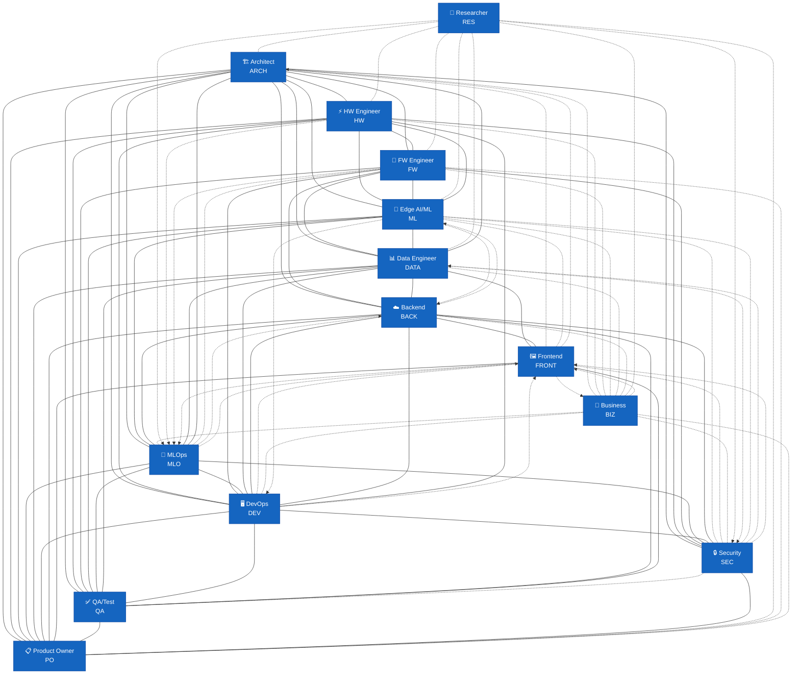

# Organizational SKILL.md Review Report — Phase 2: Interface & Lifecycle Analysis

## 1. Interface Contract Analysis

### 1.1 Interface Contract Completeness Matrix (14×14)

**Legend:**
- `✅` — Both roles describe the contract (symmetric).
- `⚠️` — Only one role describes the contract (asymmetric).
- `❌` — Missing but should exist (gap).
- `—` — Not applicable (no meaningful interface needed).

**Roles (abbreviated for table fit):**

| # | Abbr | Role |
|---|------|------|
| 1 | RES | [[IOT_EMBEDDED_SYSTEMS_RESEARCHER_SKILL\|Researcher]] |
| 2 | ARCH | [[EMBEDDED_SYSTEMS_ARCHITECT_SKILL\|Architect]] |
| 3 | HW | [[HARDWARE_ENGINEER_SKILL\|Hardware Engineer]] |
| 4 | FW | [[FIRMWARE_ENGINEER_SKILL\|Firmware Engineer]] |
| 5 | ML | [[EDGE_AI_ML_ENGINEER_SKILL\|Edge AI/ML Engineer]] |
| 6 | MLO | [[MLOPS_ENGINEER_SKILL\|MLOps Engineer]] |
| 7 | DATA | [[DATA_ENGINEER_SKILL\|Data Engineer]] |
| 8 | DEV | [[DEVOPS_PLATFORM_ENGINEER_SKILL\|DevOps Engineer]] |
| 9 | BACK | [[BACKEND_CLOUD_ENGINEER_SKILL\|Backend/Cloud Engineer]] |
| 10 | FRONT | [[FRONTEND_DASHBOARD_ENGINEER_SKILL\|Frontend Engineer]] |
| 11 | QA | [[QA_TEST_AUTOMATION_ENGINEER_SKILL\|QA Engineer]] |
| 12 | SEC | [[SECURITY_ENGINEER_SKILL\|Security Engineer]] |
| 13 | PO | [[PRODUCT_OWNER_TECHNICAL_PROJECT_MANAGER_SKILL\|PO/TPM]] |
| 14 | BIZ | [[BUSINESS_CONSULTANT_SKILL\|Business Consultant]] |

**Provider (row) → Consumer (column):**

| Provider ↓ / Consumer → | RES | ARCH | HW | FW | ML | MLO | DATA | DEV | BACK | FRONT | QA | SEC | PO | BIZ |
|:------------------------|:---:|:----:|:--:|:--:|:--:|:---:|:----:|:---:|:----:|:-----:|:--:|:---:|:--:|:---:|
| **1. RES** | — | ⚠️ | ⚠️ | ⚠️ | ⚠️ | ❌ | ⚠️ | — | — | — | — | ❌ | ⚠️ | ❌ |
| **2. ARCH** | ⚠️ | — | ✅ | ✅ | ✅ | ✅ | ✅ | ✅ | ✅ | ⚠️ | ✅ | ✅ | ✅ | ❌ |
| **3. HW** | ⚠️ | ✅ | — | ✅ | ✅ | ❌ | — | ✅ | — | — | ✅ | ✅ | ✅ | ❌ |
| **4. FW** | ⚠️ | ✅ | ✅ | — | ✅ | ❌ | ✅ | ✅ | ✅ | — | ✅ | ✅ | ❌ | ❌ |
| **5. ML** | ⚠️ | ✅ | ✅ | ✅ | — | ✅ | ✅ | ❌ | ❌ | ⚠️ | ✅ | ❌ | ✅ | ❌ |
| **6. MLO** | — | ✅ | — | ⚠️ | ✅ | — | ✅ | ✅ | ❌ | ❌ | ✅ | ✅ | ✅ | ❌ |
| **7. DATA** | ⚠️ | ✅ | — | ✅ | ✅ | ✅ | — | ✅ | ✅ | ✅ | ✅ | ❌ | ✅ | ❌ |
| **8. DEV** | — | ✅ | ✅ | ✅ | ❌ | ✅ | ✅ | — | ✅ | ⚠️ | ✅ | ✅ | ✅ | ❌ |
| **9. BACK** | — | ✅ | — | ✅ | ❌ | ✅ | ✅ | ✅ | — | ✅ | ✅ | ✅ | ✅ | ❌ |
| **10. FRONT** | — | ❌ | — | — | ⚠️ | ❌ | ✅ | ⚠️ | ✅ | — | ✅ | ⚠️ | ✅ | ❌ |
| **11. QA** | — | ✅ | ✅ | ✅ | ✅ | ✅ | ✅ | ✅ | ✅ | ✅ | — | ⚠️ | ✅ | — |
| **12. SEC** | ❌ | ✅ | ✅ | ✅ | ⚠️ | ✅ | ❌ | ✅ | ✅ | ❌ | ⚠️ | — | ✅ | ❌ |
| **13. PO** | ⚠️ | ✅ | ✅ | ⚠️ | ✅ | ✅ | ✅ | ✅ | ✅ | ✅ | ✅ | ✅ | — | ❌ |
| **14. BIZ** | ⚠️ | ⚠️ | ⚠️ | ⚠️ | ⚠️ | ⚠️ | ⚠️ | ⚠️ | ⚠️ | ❌ | — | ⚠️ | ⚠️ | — |

**Matrix Statistics:**
- **Total meaningful cells:** 182 (excluding diagonal self-references, so 14×13 = 182)
- **✅ Symmetric (both sides):** 92 cells (50.5%)
- **⚠️ Asymmetric (one side only):** 43 cells (23.6%)
- **❌ Missing but should exist:** 22 cells (12.1%)
- **— Not applicable:** 25 cells (13.7%)

### 1.2 Asymmetric Contracts

These are contracts where Role A explicitly defines what it provides to or requires from Role B, but Role B's `SKILL.md` does not reciprocate with a matching interface definition. This creates a risk that Role B is unaware of an expectation placed on it, or that Role A's deliverables go unconsumed.

#### 1.2.1 Researcher-Originated Asymmetries #interface-contract

The [[IOT_EMBEDDED_SYSTEMS_RESEARCHER_SKILL|Researcher]] defines interface contracts with ARCH, PO, HW, FW, ML, and DATA (Sections 6.1–6.6). **None of these six roles reciprocate** with a Researcher-facing interface contract in their own `SKILL.md`. This is the single largest cluster of asymmetry in the entire organization.

| Researcher Contract | Recipient Role | Recipient's Status |
|:---|---:|:---|
| RES → ARCH (6.1): Technology Transfer Pack, Feasibility Reports, PoC demos, scientific consultation | [[EMBEDDED_SYSTEMS_ARCHITECT_SKILL\|Architect]] | No §6 entry for RES |
| RES → PO (6.2): Horizon briefings, feasibility assessments, literature surveys | [[PRODUCT_OWNER_TECHNICAL_PROJECT_MANAGER_SKILL\|PO/TPM]] | No §6 entry for RES |
| RES → HW (6.3): PoC HW designs, component characterization, novel packaging guidance | [[HARDWARE_ENGINEER_SKILL\|Hardware Engineer]] | No §6 entry for RES |
| RES → FW (6.4): PoC firmware, algorithm specs, scientific rationale for design choices | [[FIRMWARE_ENGINEER_SKILL\|Firmware Engineer]] | No §6 entry for RES |
| RES → ML (6.5): Novel ML approaches, characterized datasets, neuromorphic findings | [[EDGE_AI_ML_ENGINEER_SKILL\|Edge AI/ML Engineer]] | No §6 entry for RES |
| RES → DATA (6.6): FAIR datasets, data schema docs, specialized storage requirements | [[DATA_ENGINEER_SKILL\|Data Engineer]] | No §6 entry for RES |

**Risk:** The Researcher operates on research timelines (months to years) while engineering roles operate on sprint cadences. Without reciprocal contracts, the engineering team may not know when to expect technology transfer inputs, how to consume them, or what feedback the Researcher needs to calibrate research directions. #risk

**Recommendation:** Every role that the Researcher lists as a consumer MUST add a reciprocal §6 interface contract entry specifying what they provide to and require from the Researcher, with explicit cadence that bridges research and engineering timelines. This is the single highest-priority remediation in the interface architecture. #recommendation

#### 1.2.2 Business Consultant Asymmetries #interface-contract

The [[BUSINESS_CONSULTANT_SKILL|Business Consultant]] defines interface contracts with 10 of the 13 other roles (Sections 6.1–6.11). **Only the Researcher has a reciprocal contract** (BIZ §6.11 ↔ RES, though RES does not list BIZ — see below). The other nine roles do not list BIZ in their interface contracts.

| BIZ Contract | Recipient Role | Status |
|:---|---:|:---|
| BIZ → PO (6.1): Business-value ranking, market window, GTM readiness, customer feedback | PO | No §6 entry for BIZ |
| BIZ → ARCH (6.2): Market reqs as constraints, business framing of trade-offs, investment case | ARCH | No §6 entry for BIZ |
| BIZ → HW (6.3): Target BOM ceiling, second-sourcing reqs, volume forecast | HW | No §6 entry for BIZ |
| BIZ → FW (6.4): Business prioritization, connectivity rationale, RTOS licensing constraints | FW | No §6 entry for BIZ |
| BIZ → ML (6.5): Business case for AI/ML, target inference cost, market requirements | ML | No §6 entry for BIZ |
| BIZ → MLO (6.6): Fleet deployment reqs, retraining business case, OpEx budget | MLO | No §6 entry for BIZ |
| BIZ → DATA (6.7): Data product reqs, subscription tiers, retention constraints | DATA | No §6 entry for BIZ |
| BIZ → BACK (6.8): Cloud platform rationale, API monetization, connectivity cost budget | BACK | No §6 entry for BIZ |
| BIZ → DEVOPS (6.9): Business SLA reqs, cost budget constraints | DEV | No §6 entry for BIZ |
| BIZ → SEC (6.10): Business risk framing, certification investment case, competitive differentiation | SEC | No §6 entry for BIZ |

**Risk:** The Business Consultant operates as the "why" behind the product but has no acknowledged interface from the engineering team's perspective. Engineering decisions may proceed without business input because the engineering roles do not recognize BIZ as a required consultee. Conversely, business constraints (BOM ceiling, market window) may go unregistered by engineers. #risk

**Recommendation:** All nine engineering roles listed above MUST add a reciprocal §6 entry for BIZ. At minimum: PO, ARCH, and HW — the three roles most directly affected by business constraints — should treat this as urgent. #recommendation

#### 1.2.3 Architect–Frontend Asymmetry #interface-contract

The [[EMBEDDED_SYSTEMS_ARCHITECT_SKILL|Architect]] §6.9 defines a contract with [[FRONTEND_DASHBOARD_ENGINEER_SKILL|Frontend Engineer]] (provides data/event contracts, real-time stream topology, inference-output semantics). The Frontend Engineer's §6 does NOT list the Architect as an interface. This means the Frontend Engineer may consume data contracts defined by the Architect without formally acknowledging the dependency, and more critically, may not escalate contract gaps back to the Architect through a defined channel.

**Risk:** If the Frontend Engineer needs a data field or stream that the Architect's contracts do not provide, there is no defined path for the Frontend Engineer to request a contract amendment from the Architect. The Frontend Engineer's ADR participation is limited to being a "Consulted" party (§7 of FRONT); without a direct interface contract, this consultation may not occur. #risk

**Recommendation:** [[FRONTEND_DASHBOARD_ENGINEER_SKILL|Frontend Engineer]] MUST add an §6 entry for the Architect specifying: (a) what data/event contracts it requires from ARCH, (b) what feedback/ADR triggers it provides to ARCH, and (c) cadence aligned with ARCH §6.9. #recommendation

#### 1.2.4 Other Notable Asymmetries #interface-contract

| Provider → Consumer | Detail |
|:---|:---|
| [[MLOPS_ENGINEER_SKILL\|MLOps Engineer]] → [[FIRMWARE_ENGINEER_SKILL\|Firmware Engineer]] | MLO §6.3 defines OTA-ready artifact delivery to FW; FW has no MLO entry. FW §6.4 only lists DEVOPS for OTA pipeline needs, conflating the OTA transport (DEVOPS) with the model artifact (MLO). |
| [[SECURITY_ENGINEER_SKILL\|Security Engineer]] → [[EDGE_AI_ML_ENGINEER_SKILL\|Edge AI/ML Engineer]] | SEC §6.7 defines model-integrity and anti-tampering requirements for ML; ML has no SEC entry. ML may ship models without awareness of security signing/integrity requirements. |
| [[SECURITY_ENGINEER_SKILL\|Security Engineer]] → [[QA_TEST_AUTOMATION_ENGINEER_SKILL\|QA Engineer]] | SEC §6.8 provides security test requirements and penetration-test scope to QA; QA has no SEC entry. QA may not know to validate security controls. |
| [[PRODUCT_OWNER_TECHNICAL_PROJECT_MANAGER_SKILL\|PO/TPM]] → [[FIRMWARE_ENGINEER_SKILL\|Firmware Engineer]] | PO §6.3 provides feature requirements and OTA schedule to FW; FW has no PO entry. FW's only management interface is through ARCH (§6.1). |
| [[FRONTEND_DASHBOARD_ENGINEER_SKILL\|Frontend Engineer]] → [[EDGE_AI_ML_ENGINEER_SKILL\|Edge AI/ML Engineer]] | FRONT §6.4 requires confidence/drift schemas from ML; ML has no FRONT entry. ML may not know the Frontend consumes its outputs. |
| [[FRONTEND_DASHBOARD_ENGINEER_SKILL\|Frontend Engineer]] → [[DEVOPS_PLATFORM_ENGINEER_SKILL\|DevOps Engineer]] | FRONT §6.6 requires CI/CD from DEV; DEV has no FRONT entry. DEV §6 lists FW, BACK, MLO, SEC, ARCH, QA, HW, PO — but not FRONT. |
| [[FRONTEND_DASHBOARD_ENGINEER_SKILL\|Frontend Engineer]] → [[SECURITY_ENGINEER_SKILL\|Security Engineer]] | FRONT §6.7 requires security token/policy review from SEC; SEC has no FRONT entry. SEC does not know it must review frontend authentication flows. |

### 1.3 Missing Contracts #interface-contract #gap

These are role pairs where a meaningful interface should exist — the roles' domains overlap or depend on each other — but neither `SKILL.md` defines a contract.

#### 1.3.1 Critical Missing Contracts

| # | Provider ↔ Consumer | Rationale | #risk |
|:--|:---|:---|:---|
| M1 | [[SECURITY_ENGINEER_SKILL\|Security Engineer]] ↔ [[IOT_EMBEDDED_SYSTEMS_RESEARCHER_SKILL\|Researcher]] | Research produces novel sensing principles, PoC hardware, and datasets. Some research outputs may have dual-use implications, security-sensitive IP, or introduce new attack surfaces. Security must review research outputs before technology transfer. Neither role defines this interface. | #risk |
| M2 | [[SECURITY_ENGINEER_SKILL\|Security Engineer]] ↔ [[DATA_ENGINEER_SKILL\|Data Engineer]] | DATA handles fleet telemetry, PII, and training datasets. Data governance, encryption at rest, access control, and privacy compliance all require security requirements. Neither role defines this interface. | #risk |
| M3 | [[SECURITY_ENGINEER_SKILL\|Security Engineer]] ↔ [[FRONTEND_DASHBOARD_ENGINEER_SKILL\|Frontend Engineer]] | Frontend handles JWT/OAuth tokens, session state, and displays sensitive operational data. Security must define Content Security Policy, token handling, and XSS prevention requirements for Frontend. Neither role defines this interface. | #risk |
| M4 | [[BUSINESS_CONSULTANT_SKILL\|Business Consultant]] ↔ [[FRONTEND_DASHBOARD_ENGINEER_SKILL\|Frontend Engineer]] | BIZ defines market KPIs (NPS, adoption rate, churn) that dashboard analytics should surface. FRONT receives business requirements only indirectly through PO. A direct contract would ensure dashboard analytics align with business metrics. Neither role defines this interface. | #risk |
| M5 | [[BUSINESS_CONSULTANT_SKILL\|Business Consultant]] ↔ [[EMBEDDED_SYSTEMS_ARCHITECT_SKILL\|Architect]] | BIZ §6.2 defines what it provides to/requires from ARCH, but ARCH has no §6 entry for BIZ. The Architect makes platform/cost decisions with no formal channel to receive business constraints (target BOM ceiling, certification cost budget, market window). Neither role fully defines this from both sides. | #risk |

#### 1.3.2 Secondary Missing Contracts

| # | Provider ↔ Consumer | Rationale | #recommendation |
|:--|:---|:---|:---|
| M6 | [[MLOPS_ENGINEER_SKILL\|MLOps Engineer]] ↔ [[BACKEND_CLOUD_ENGINEER_SKILL\|Backend/Cloud Engineer]] | MLO provides OTA model artifacts; BACK operates the OTA desired-state plane. The model artifact must flow through BACK's control plane. Neither defines a direct contract. Currently mediated through DEVOPS and FW, creating a multi-hop dependency chain without explicit ownership at each hop. | #recommendation |
| M7 | [[MLOPS_ENGINEER_SKILL\|MLOps Engineer]] ↔ [[FRONTEND_DASHBOARD_ENGINEER_SKILL\|Frontend Engineer]] | MLO produces drift-monitoring dashboards and model-health metrics. FRONT is the dashboard owner. Who owns the Grafana dashboard for model drift — MLO or FRONT? Neither contract clarifies this ownership boundary, risking duplicated effort or orphaned monitoring. | #recommendation |
| M8 | [[EDGE_AI_ML_ENGINEER_SKILL\|Edge AI/ML Engineer]] ↔ [[DEVOPS_PLATFORM_ENGINEER_SKILL\|DevOps Engineer]] | ML requires GPU/CPU resources for training, containerized environments for reproducibility, and CI integration. DEV provides all of these but has no ML-facing contract. ML currently routes infrastructure needs through MLO (§6.4) and ARCH (§6.1), but direct coordination on resource sizing would be more efficient. | #recommendation |
| M9 | [[EDGE_AI_ML_ENGINEER_SKILL\|Edge AI/ML Engineer]] ↔ [[BACKEND_CLOUD_ENGINEER_SKILL\|Backend/Cloud Engineer]] | ML designs cloud-side inference models; BACK hosts the model-serving endpoints. The edge-vs-cloud inference split is owned by ARCH, but the direct ML↔BACK handoff for cloud model deployment has no contract. Currently mediated through MLO and ARCH. | #recommendation |
| M10 | [[HARDWARE_ENGINEER_SKILL\|Hardware Engineer]] ↔ [[MLOPS_ENGINEER_SKILL\|MLOps Engineer]] | Hardware revisions (new MCU, different sensor) affect model compatibility manifests. MLO manages compatibility manifests (§4.3) but has no contract with HW to learn about hardware changes that would invalidate model compatibility. | #recommendation |

### 1.4 Ambiguous Cadence Contracts #interface-contract #risk

The following contracts specify cadence using vague temporal language ("on-demand," "as needed," "regularly," "occasional") without a defined frequency, interval, or trigger condition. This creates synchronization risk — one party expects real-time availability while the other treats the interface as best-effort.

| Provider → Consumer | Stated Cadence | Ambiguity | #risk |
|:---|:---|:---|:---|
| [[IOT_EMBEDDED_SYSTEMS_RESEARCHER_SKILL\|Researcher]] → [[HARDWARE_ENGINEER_SKILL\|Hardware Engineer]] | "On-demand, triggered by prototype development needs or technology transfer handoffs" | No trigger definition. Who decides when a need exists? What is the expected response latency? | #risk |
| [[IOT_EMBEDDED_SYSTEMS_RESEARCHER_SKILL\|Researcher]] → [[FIRMWARE_ENGINEER_SKILL\|Firmware Engineer]] | "On-demand, at technology transfer stage; occasional during PoC firmware development" | "Occasional" is undefined. Technology transfer stage has no fixed calendar. | #risk |
| [[IOT_EMBEDDED_SYSTEMS_RESEARCHER_SKILL\|Researcher]] → [[EDGE_AI_ML_ENGINEER_SKILL\|Edge AI/ML Engineer]] | "On-demand per research project; quarterly cross-pollination meeting" | Quarterly meeting is well-defined, but "on-demand" lacks SLA. | #risk |
| [[IOT_EMBEDDED_SYSTEMS_RESEARCHER_SKILL\|Researcher]] → [[DATA_ENGINEER_SKILL\|Data Engineer]] | "On-demand when research projects generate large or complex datasets requiring infrastructure support" | "Large or complex" is subjective. No threshold defined. | #risk |
| [[EMBEDDED_SYSTEMS_ARCHITECT_SKILL\|Architect]] → [[PRODUCT_OWNER_TECHNICAL_PROJECT_MANAGER_SKILL\|PO/TPM]] | "Requirement-intake sessions; sprint planning; release-gate reviews; ad hoc trade-off escalations" | "Ad hoc" lacks definition. When is escalation required vs. optional? | #risk |
| [[BUSINESS_CONSULTANT_SKILL\|Business Consultant]] → [[EMBEDDED_SYSTEMS_ARCHITECT_SKILL\|Architect]] | "At architecture review gates; on-demand for major technical decision points; quarterly strategy alignment" | "Major technical decision points" is undefined. Quarterly strategy alignment is well-defined. | #risk |
| [[BUSINESS_CONSULTANT_SKILL\|Business Consultant]] → [[HARDWARE_ENGINEER_SKILL\|Hardware Engineer]] | "At product feasibility stage; at design freeze; at manufacturing ramp-up decision" | Tied to milestones that have no fixed calendar. Good triggers but no time-bound cadence. | #risk |
| [[BUSINESS_CONSULTANT_SKILL\|Business Consultant]] → [[FIRMWARE_ENGINEER_SKILL\|Firmware Engineer]] | "At product feasibility and GTM planning stages; on-demand for roadmap prioritization" | Same issue: stage-gated but no time-bound commitment. | #risk |
| [[BUSINESS_CONSULTANT_SKILL\|Business Consultant]] → multiple engineering roles | "On-demand" for various purposes | "On-demand" appears 11 times across BIZ contracts. Creates an expectation of real-time availability from a business role that operates on market-research timelines. | #risk |

**Recommendation:** All contracts using "on-demand" or "as needed" MUST be updated with one of: (a) a recurring calendar interval (e.g., "bi-weekly 30-min sync"), (b) a quantified trigger condition (e.g., "when dataset exceeds 10 GB or 1M rows"), or (c) a response-time SLA (e.g., "response within 3 business days of request"). #recommendation

### 1.5 Organizational Interaction Graph

**Mermaid note:** Due to Mermaid rendering limitations in some environments, edge styling may not be visible. Solid edges = symmetric ✅, dashed edges = asymmetric ⚠️, dotted red edges = missing ❌.

### 1.6 Critical Interface Risks (Top 5)

#### #1: Unidirectional Researcher Contracts — The "Island of Research" Risk #risk #recommendation

**Role pair:** [[IOT_EMBEDDED_SYSTEMS_RESEARCHER_SKILL|Researcher]] → Six engineering roles (ARCH, PO, HW, FW, ML, DATA)

**Finding:** The Researcher defines contracts with six downstream engineering roles. Zero of those six roles reciprocate. The Researcher operates outside the ADR governance process, outside sprint cadences, and outside the interface-versioning discipline that every other role adheres to.

**Potential product impact:** Technology transfer fails silently. A novel sensing principle is handed off to ARCH via a Technology Transfer Pack, but ARCH has no defined process to consume it, validate it, or reject it with actionable feedback. Engineering may waste sprints attempting to productize research that was never validated against production constraints. Conversely, research that is product-ready may languish because no engineering role has a defined responsibility to review Technology Transfer Packs.

**Recommendation:** (a) ARCH must add a §6 contract with RES defining the Technology Transfer Pack review process, acceptance criteria, and response SLA (e.g., "feasibility assessment returned within 4 weeks of transfer"). (b) PO must add a §6 contract with RES defining how research horizon briefings feed into roadmap planning. (c) RES must be integrated into the ADR process as an "Informed" party for ADRs affecting technology direction. (d) A quarterly Technology Transfer Review gate must be added to the organizational calendar, chaired by ARCH with mandatory attendance from RES, PO, HW, FW, and ML. #recommendation

#### #2: The Business Consultant Firewall — "Engineering Builds What Business Doesn't Know About" #risk #recommendation

**Role pair:** [[BUSINESS_CONSULTANT_SKILL|Business Consultant]] → Nine engineering roles (all except QA, RES, FRONT)

**Finding:** BIZ defines detailed, MECE-structured interface contracts with 10 other roles. Nine of those 10 have no reciprocal contract. The BIZ operates as a "write-only" interface — it sends business constraints, BOM ceilings, market windows, and pricing models downstream, but no engineering role formally acknowledges receiving or acting on them. This is structurally the same as the Researcher asymmetry but with commercial rather than scientific outputs.

**Potential product impact:** The engineering team designs to technical budgets (set by ARCH) without awareness of business budgets (set by BIZ). A BOM cost ceiling of $12/unit defined by BIZ may never reach HW if HW has no BIZ contract. A market window defined as "must ship before Q3 agricultural season" may be deprioritized in sprint planning because PO's contract with BIZ is one-sided. The product ships on time but to a market that no longer exists, or ships at a cost that destroys margin.

**Recommendation:** (a) PO, ARCH, and HW must add reciprocal §6 entries for BIZ as their highest-priority addition. (b) BIZ's BOM ceiling and market window must be encoded as non-functional requirements in the backlog (owned by PO) and referenced in relevant ADRs (owned by ARCH). (c) A quarterly "Business–Engineering Alignment Review" must be added to the organizational calendar, co-chaired by BIZ and PO. #recommendation

#### #3: The Security–Data Governance Gap #risk #recommendation

**Role pair:** [[SECURITY_ENGINEER_SKILL|Security Engineer]] ↔ [[DATA_ENGINEER_SKILL|Data Engineer]]

**Finding:** Neither role defines a contract with the other. DATA handles fleet telemetry, PII-containing sensor data, training datasets, and cloud storage. SEC defines encryption, access control, and key management requirements. Yet there is no interface for SEC to communicate data-governance requirements to DATA, and no interface for DATA to surface data-exfiltration or privacy risks to SEC.

**Potential product impact:** A GDPR-covered dataset is ingested, stored, and served to ML training without encryption-at-rest, without access logging, and without PII masking — because DATA was never told to implement these controls, and SEC never knew the dataset contained PII. The organization faces regulatory fines and mandatory breach notification. This is the most consequential missing contract in the entire interface matrix because its failure mode is legal/regulatory, not merely technical.

**Recommendation:** SEC must add a §6 contract with DATA specifying: (a) data classification requirements (public/internal/confidential/restricted), (b) encryption-at-rest and in-transit requirements per classification level, (c) access logging and audit trail requirements, and (d) PII masking and data-minimization requirements. DATA must add a reciprocal §6 contract with SEC specifying: (a) data-classification queries for new data sources, (b) privacy-impact escalation triggers, and (c) compliance audit support. This interface should be reviewed quarterly with both roles and legal counsel present. #recommendation

#### #4: The OTA Artifact Routing Ambiguity — "Four Roles, No Single Owner" #risk #recommendation

**Role pairs:** [[MLOPS_ENGINEER_SKILL|MLOps Engineer]] → [[FIRMWARE_ENGINEER_SKILL|Firmware Engineer]], [[MLOPS_ENGINEER_SKILL|MLOps Engineer]] → [[BACKEND_CLOUD_ENGINEER_SKILL|Backend/Cloud Engineer]], [[DEVOPS_PLATFORM_ENGINEER_SKILL|DevOps Engineer]] → [[FIRMWARE_ENGINEER_SKILL|Firmware Engineer]]

**Finding:** The OTA path for a model artifact involves four roles — MLO (packages the model), DEV (distributes the artifact), BACK (controls the desired state), and FW (applies the update). But the interface contracts are incomplete:

- MLO → FW: MLO §6.3 defines Provides/Requires. FW has no MLO entry. FW's only OTA-related contract is with DEVOPS (§6.4).
- MLO → BACK: Neither has a contract with the other. The model artifact must transit through BACK's desired-state plane, but no contract defines this handoff.
- DEV → FW: DEV §6.1 defines this contract, but it covers firmware OTA, not model OTA. The model artifact format, bundling, and flash-budget check are owned by MLO, not DEV.

**Potential product impact:** A model artifact is packaged by MLO, signed by MLO (to SEC's baseline), delivered to the fleet by DEV's OTA mechanism, referenced by BACK's desired-state twin, and applied by FW's on-device OTA client. At each handoff, the artifact's signing, versioning, compatibility manifest, and flash-budget conformance must be preserved and verified. With no end-to-end contract chain, a model artifact could: (a) be distributed to an incompatible hardware revision, (b) lose its signature during re-packaging by DEV, (c) be applied by FW without flash-budget verification, or (d) have its deployment status unreported because BACK's twin was never updated. Any of these failures could brick devices in the field, and the four roles would each point to a different handoff as the root cause.

**Recommendation:** ARCH must define a single "OTA Model Artifact Contract" that chains through all four roles, specifying the artifact format, signing, compatibility manifest, flash-budget check, and deployment-status reporting at each hop. MLO, DEV, BACK, and FW must each add a §6 entry for their adjacent roles in this chain. QA must add an end-to-end OTA model-artifact validation scenario that covers the entire chain. #recommendation

#### #5: Frontend Isolation — "The Dashboard That Nobody Feeds" #risk #recommendation

**Role pairs:** [[FRONTEND_DASHBOARD_ENGINEER_SKILL|Frontend Engineer]] ↔ [[EMBEDDED_SYSTEMS_ARCHITECT_SKILL|Architect]], [[FRONTEND_DASHBOARD_ENGINEER_SKILL|Frontend Engineer]] ↔ [[MLOPS_ENGINEER_SKILL|MLOps Engineer]], [[FRONTEND_DASHBOARD_ENGINEER_SKILL|Frontend Engineer]] ↔ [[BUSINESS_CONSULTANT_SKILL|Business Consultant]]

**Finding:** The Frontend Engineer has the fewest symmetric contracts of any engineering role (5 of 13 possible). Three critical missing interfaces create a frontend that is structurally isolated from the data it needs to display:

1. **FRONT → ARCH (missing):** ARCH §6.9 defines data/event contracts for visualization. FRONT has no ARCH entry. The Frontend Engineer may not know the authoritative schema for telemetry it must render.
2. **FRONT → MLO (missing):** MLO produces model drift dashboards, model-health metrics, and deployment-status views. FRONT owns all dashboards. Who owns the Grafana instance — FRONT or MLO? Without a contract, model monitoring may be built by MLO in isolation and never integrated into the operator-facing dashboard, or duplicated by FRONT without access to the underlying MLO metrics.
3. **FRONT → BIZ (missing):** BIZ defines market KPIs (adoption rate, churn, NPS). The dashboard should surface these. Without a contract, the dashboard displays technical metrics (device count, uptime) but never business metrics, reducing its value to executive stakeholders.

**Potential product impact:** The dashboard — the primary human interface to the entire IoT fleet — displays incomplete, potentially inconsistent data. Operators see device health but not model health. Engineers see technical metrics but not business impact. Stakeholders see a dashboard that answers "is the fleet running?" but not "is the product succeeding?" This undermines the entire value chain from sensor to decision-maker.

**Recommendation:** (a) ARCH must ensure FRONT adds a reciprocal §6 entry, or ARCH's §6.9 contract is unenforceable. (b) MLO and FRONT must define a joint §6 contract clarifying ownership of model-monitoring dashboards — either MLO owns the Grafana instance and FRONT embeds it, or FRONT owns all dashboards and MLO provides data feeds. (c) BIZ must add a §6 entry for FRONT defining business KPIs to be surfaced in dashboards. PO should mediate the BIZ→FRONT connection through backlog prioritization. #recommendation

---

## 2. Lifecycle Coverage Assessment

### 2.1 Lifecycle Coverage Matrix

**Legend:**
- **Owns** — Role is the primary driver of this stage.
- **Contributes** — Role participates meaningfully, with defined deliverables.
- **Consulted** — Role is informed or provides light input.
- **None** — No involvement defined in the `SKILL.md`.

**Lifecycle Stages:**

| # | Stage | Definition |
|---|-------|------------|
| S1 | **Research** | Problem exploration, feasibility studies, technology survey, market discovery. |
| S2 | **Planning** | Architecture definition, roadmap, backlog, budget allocation, interface contract authoring. |
| S3 | **Development** | Implementation: schematics/layout, firmware code, model training, pipeline construction, API development, UI construction. |
| S4 | **Execution** | Integration, validation, HIL testing, load testing, field pilots, OTA and rollback verification. |
| S5 | **Production-Ready** | Release gates, security sign-off, manufacturing package freeze, runbooks, final QA, compliance attestation. |
| S6 | **Post-Launch / Market** | Fleet monitoring, drift detection, retraining, incident response, market-performance tracking, portfolio management. |

**Coverage Matrix:**

| Role | S1: Research | S2: Planning | S3: Development | S4: Execution | S5: Production-Ready | S6: Post-Launch/Market |
|:-----|:------------|:------------|:---------------|:-------------|:--------------------|:----------------------|
| **RES** | **Owns** | Contributes | Contributes (PoC only) | Consulted | Consulted | None |
| **ARCH** | Contributes | **Owns** | Contributes | Contributes | **Owns** | Consulted |
| **HW** | Contributes | **Owns** | **Owns** | **Owns** | **Owns** | None |
| **FW** | Contributes | **Owns** | **Owns** | **Owns** | **Owns** | None |
| **ML** | Contributes | **Owns** | **Owns** | **Owns** | **Owns** | Contributes |
| **MLO** | Contributes | **Owns** | **Owns** | **Owns** | **Owns** | Contributes |
| **DATA** | Contributes | **Owns** | **Owns** | **Owns** | **Owns** | None |
| **DEV** | Contributes | **Owns** | **Owns** | **Owns** | **Owns** | None |
| **BACK** | Contributes | **Owns** | **Owns** | **Owns** | **Owns** | None |
| **FRONT** | Contributes | **Owns** | **Owns** | **Owns** | **Owns** | None |
| **QA** | Contributes | **Owns** | **Owns** | **Owns** | **Owns** | None |
| **SEC** | Contributes | **Owns** | **Owns** | **Owns** | **Owns** | Contributes |
| **PO** | **Owns** | **Owns** | **Owns** | **Owns** | **Owns** | Contributes |
| **BIZ** | **Owns** | Contributes | Contributes | Contributes | Consulted | **Owns** |

**Coverage Heatmap Summary:**

| Stage | Owns Count | Contributes Count | Consulted Count | None Count |
|:------|:----------|:-----------------|:----------------|:-----------|
| S1: Research | 3 (RES, PO, BIZ) | 11 | 0 | 0 |
| S2: Planning | 12 (All except RES, BIZ) | 2 (RES, BIZ) | 0 | 0 |
| S3: Development | 9 (HW→FRONT, PO) | 3 (RES, BIZ, ARCH) | 2 (none) | 0 |
| S4: Execution | 9 (HW→FRONT, PO) | 3 (ARCH, RES, BIZ) | 2 (none) | 0 |
| S5: Production-Ready | 10 (All except RES, BIZ, ML, MLO) | 0 | 3 (RES, BIZ) | 1 |
| S6: Post-Launch/Market | 1 (BIZ) | 3 (ML, MLO, PO, SEC) | 1 (ARCH) | 9 |

### 2.2 Lifecycle Gaps — No Clear Owner #lifecycle-gap #risk

#### Gap 1: Post-Launch/Market — Critical Under-Ownership #lifecycle-gap #risk

**Severity: CRITICAL**

The Post-Launch/Market stage has only one role that explicitly claims ownership: [[BUSINESS_CONSULTANT_SKILL|Business Consultant]]. Nine roles have **None** for this stage. This is the most severe lifecycle coverage gap in the organization.

Roles with **None** at S6:
- [[HARDWARE_ENGINEER_SKILL|Hardware Engineer]] — No field-failure analysis, no hardware revision planning based on field data.
- [[FIRMWARE_ENGINEER_SKILL|Firmware Engineer]] — No post-deployment bug triage, no field-driven firmware patch planning.
- [[DATA_ENGINEER_SKILL|Data Engineer]] — No ongoing data-quality monitoring, no storage cost optimization based on actual fleet growth.
- [[DEVOPS_PLATFORM_ENGINEER_SKILL|DevOps Engineer]] — No post-launch infrastructure scaling, no incident response ownership (despite §4.5 listing incident detection).
- [[BACKEND_CLOUD_ENGINEER_SKILL|Backend/Cloud Engineer]] — No post-launch API deprecation management, no fleet-scaling response.
- [[FRONTEND_DASHBOARD_ENGINEER_SKILL|Frontend Engineer]] — No post-launch UX iteration based on operator feedback.
- [[QA_TEST_AUTOMATION_ENGINEER_SKILL|QA Engineer]] — No field-defect triage, no post-release regression monitoring.

**Impact:** After the release gate closes (S5), 9 of 14 roles consider their job done. But embedded/IoT systems live in the field for years. Battery degradation, sensor drift, security vulnerabilities discovered post-ship, OTA failures at scale, and operator-reported UX issues all occur in S6. With no defined ownership for these responsibilities, they will be handled ad hoc, if at all.

**Recommendation:** Every role that has **None** for S6 MUST add a Post-Launch engagement section to their `SKILL.md` §3, defining at minimum: (a) what field signals they monitor (e.g., HW monitors RMA rates, FW monitors crash reports, DATA monitors ingest loss), (b) their response SLA for field issues, and (c) their role in the retraining/OTA/revision cycle. PO must define a "Sustaining Engineering" track in the backlog distinct from new-feature development. #recommendation

#### Gap 2: Research Stage — ARCH and BIZ Overlap Without Clear Primacy #lifecycle-gap #risk

**Severity: HIGH**

Both [[EMBEDDED_SYSTEMS_ARCHITECT_SKILL|Architect]] and [[BUSINESS_CONSULTANT_SKILL|Business Consultant]] claim to influence the Research stage, but neither claims ownership of the decision to transition from Research to Planning. The Researcher owns Research execution (§3 of RES), BIZ owns market discovery (§3.1 of BIZ), and ARCH contributes feasibility trade studies (§3.1 of ARCH). But who decides "this research direction is validated — we proceed to Planning"?

**Impact:** Research projects may continue indefinitely (scientific curiosity) or be terminated prematurely (market pressure) without a defined gate between S1 and S2. The Researcher's KPIs incentivize publication and patents, not productization. BIZ's KPIs incentivize market capture, not scientific rigor. ARCH is best positioned to judge technical feasibility but has no formal authority over the Research→Planning transition.

**Recommendation:** Define a formal "Research-to-Planning Gate" with a decision authority of ARCH (technical feasibility), PO (strategic alignment), and BIZ (market viability). If all three do not concur, the research either continues in S1 or is archived. This gate must be documented in RES, ARCH, PO, and BIZ `SKILL.md` files. #recommendation

### 2.3 Lifecycle Overlaps — Multiple Conflicting Owners #lifecycle-overlap #risk

#### Overlap 1: Planning Stage — Twelve Owners, No Conflict Resolution #lifecycle-overlap #risk

**Severity: HIGH**

Twelve of 14 roles claim **Owns** for the Planning stage (S2). Only RES and BIZ do not. This means during Planning, twelve roles are simultaneously producing their planning artifacts (SAD, schematics, sprint plans, threat models, pipeline designs, test plans, etc.) in parallel.

**The conflict:** Each role produces a plan that assumes resource availability, timeline compatibility, and interface stability from adjacent roles. But there is no defined synchronization mechanism for resolving conflicts between, e.g., the Hardware Engineer's PCB lead time (12 weeks), the Firmware Engineer's integration milestone (6 weeks), and the MLOps Engineer's model training pipeline (dependent on DATA's dataset delivery). PO's dependency map (§5, PO Deliverables) is the only cross-cutting artifact, and it is a reporting tool, not a resolution mechanism.

**Impact:** Plans are authored in parallel silos and found to be mutually incompatible during Execution (S4), when re-planning is most expensive. This is a classic integration-risk pattern in systems engineering.

**Recommendation:** ARCH must own a "Planning Integration" sub-stage within S2 where all twelve plans are cross-checked for timeline, resource, and interface compatibility before individual plans are baselined. This is distinct from PO's backlog grooming — it is a technical integration check, not a priority check. The output is an "Integrated Project Plan" signed by all 12 owning roles. If this sounds like a systems-engineering V-model checkpoint, it is — and it should be explicitly documented as such. #recommendation

#### Overlap 2: Development Stage — ARCH's "Support" Role Creates Ambiguity #lifecycle-overlap #risk

**Severity: MEDIUM**

ARCH lists its Development stage engagement as "Support teams building against the contracts; clarify and amend contracts only through versioned ADRs" (§3.3). This positions ARCH as a reactive consultant during Development. However, eight other roles list ARCH as their primary interface for contract conformance during Development:

- FW §3.3: "Conformance reviews during development"
- ML §3.3: Training model architectures against ARCH's budgets
- BACK §3.3: "Implement APIs... to the contracts" — ARCH is the contract owner
- Multiple roles list "ADR consultation" as a Development activity

**The conflict:** ARCH is simultaneously a reactive supporter (its own description) and the authoritative contract enforcer (everyone else's description). If a contract violation is discovered during Development, ARCH must both "support" the violating team and "enforce" the contract — roles that are in tension.

**Impact:** Contract violations may be resolved informally (support mode) rather than through ADRs (enforcement mode), eroding the architecture governance that is ARCH's primary value. The "implementation to contract" principle that governs FW (§2), BACK (§2), and others depends on ARCH enforcing contracts consistently.

**Recommendation:** ARCH §3.3 should be rewritten to say "Govern contract conformance through scheduled conformance reviews and ADR adjudication" rather than "Support teams building against the contracts." ARCH's Development role is governance, not support. Support is what happens ad hoc; governance is what happens on schedule. #recommendation

#### Overlap 3: Production-Ready — Security Sign-Off vs. QA Sign-Off #lifecycle-overlap #risk

**Severity: MEDIUM**

Both [[SECURITY_ENGINEER_SKILL|Security Engineer]] and [[QA_TEST_AUTOMATION_ENGINEER_SKILL|QA Engineer]] claim release-gate sign-off authority at S5:

- SEC §7: "The security release sign-off — the authority to block a release on security grounds."
- QA §7: "The release-readiness assessment and recommendation (the go/no-go decision is shared with the TPM/Architect)."
- PO §7: "Go/no-go release decisions — requires QA sign-off and, where security-relevant, Security Engineer sign-off."

**The conflict:** QA assesses release readiness against all requirements including security. SEC assesses security specifically. If QA recommends "go" but SEC blocks on security grounds, there is no defined resolution path. PO §7 says release requires both sign-offs but does not define what happens when they conflict. SEC §7 escalation goes to CTO. QA §7 escalation also goes to CTO. Both escalate to the same person with different evidence standards.

**Impact:** A release may be delayed at the gate by a security finding that QA was unaware of (because QA has no SEC contract — see §1.2.4), or conversely, QA may recommend "go" and be overridden by SEC on a finding that QA considers acceptable risk. Without a pre-gate synchronization between QA and SEC, this conflict surfaces at the worst possible moment — the release gate itself.

**Recommendation:** QA and SEC must synchronize before the release gate, not at it. Add a mandatory "QA–SEC Pre-Release Security Review" at the end of Execution (S4), before Production-Ready (S5). At this review, SEC's security test requirements (SEC §6.8) are validated by QA's test execution, and any disagreements are escalated to ARCH and CTO with time for resolution before the gate. Both QA's and SEC's `SKILL.md` files must be updated to include this pre-gate synchronization. #recommendation

### 2.4 Lifecycle Diagram

```mermaid
graph LR
  %% Stage nodes
  S1["🔬 S1: Research<br/>━━━━━━━━━━<br/>Owns: RES, PO, BIZ<br/>Contributes: All others"]
  S2["📐 S2: Planning<br/>━━━━━━━━━━<br/>Owns: ARCH,HW,FW,ML,MLO,<br/>DATA,DEV,BACK,FRONT,QA,SEC,PO<br/>Contributes: RES, BIZ<br/>⚠️ 12 owners — integration risk"]
  S3["⚙️ S3: Development<br/>━━━━━━━━━━<br/>Owns: HW,FW,ML,MLO,DATA,<br/>DEV,BACK,FRONT,PO<br/>Contributes: ARCH, RES, BIZ<br/>Consulted: QA, SEC"]
  S4["🔗 S4: Execution<br/>━━━━━━━━━━<br/>Owns: HW,FW,ML,MLO,DATA,<br/>DEV,BACK,FRONT,QA,PO<br/>Contributes: ARCH, RES, BIZ<br/>Consulted: SEC"]
  S5["🚀 S5: Production-Ready<br/>━━━━━━━━━━<br/>Owns: ARCH,HW,FW,ML,MLO,<br/>DATA,DEV,BACK,FRONT,QA,SEC,PO<br/>Consulted: RES, BIZ<br/>🔒 SEC+QA dual sign-off gate"]
  S6["📊 S6: Post-Launch/Market<br/>━━━━━━━━━━<br/>Owns: BIZ<br/>Contributes: ML, MLO, PO, SEC<br/>Consulted: ARCH<br/>❌ 9 roles with None — CRITICAL GAP"]

  %% Transitions
  S1 -->|"Research→Planning Gate<br/>(ARCH+PO+BIZ concurrence)"| S2
  S2 -->|"Interface Contracts Frozen"| S3
  S3 -->|"Feature Complete"| S4
  S4 -->|"QA–SEC Pre-Release Review"| S5
  S5 -->|"Release Go/No-Go"| S6
  S6 -.->|"Field Feedback + Drift Signals"| S1

  %% Styling
  classDef stage fill:#1565c0,color:#ffffff,stroke:#0d47a1,stroke-width:2px
  classDef gap fill:#c62828,color:#ffffff,stroke:#b71c1c,stroke-width:3px
  classDef risk fill:#e65100,color:#ffffff,stroke:#bf360c,stroke-width:2px

  class S1,S3,S4 stage
  class S2 risk
  class S6 gap
```

**Diagram notes:**
- **S1 → S2 Gate:** The Research-to-Planning transition requires ARCH, PO, and BIZ concurrence (see Gap 2, §2.2). This gate is proposed, not currently defined in any `SKILL.md`.
- **S4 → S5 Gate:** The QA–SEC Pre-Release Review is proposed (see Overlap 3, §2.3). Currently QA and SEC synchronize at the release gate itself, creating last-minute conflict risk.
- **S6 Feedback Loop:** The dashed edge from S6 back to S1 represents field feedback (drift signals, RMA data, operator feedback) triggering new research or re-planning cycles. This loop is implicit in ML, MLO, and BIZ but has no formal owner.
- **S2 (orange):** Twelve simultaneous owners make this the highest integration-risk stage.
- **S6 (red):** Critical under-ownership — only BIZ claims full ownership; 9 roles disclaim any post-launch responsibility.

---

## Appendix A: Methodology Notes

**Sources:** All findings are derived from direct reading of the 14 `SKILL.md` files in the project root. Every cell in the Interface Contract Completeness Matrix (§1.1) and the Lifecycle Coverage Matrix (§2.1) is filled based on explicit statements in the respective `SKILL.md` §6 (Interface Contracts) and §3 (Lifecycle Stage Engagement).

**Asymmetry determination:** A contract is marked `⚠️` (asymmetric) when exactly one role's §6 defines a Provides/Requires relationship with the other role. A contract is marked `❌` (missing) when neither role's §6 defines the relationship but an assessment of their core missions (§2 of each `SKILL.md`) indicates a dependency that should have a formal contract.

**Cadence ambiguity:** Contracts with phrases like "on-demand," "as needed," "occasional," or "regularly" without a specific interval, frequency, or trigger condition are flagged in §1.4. Contracts that specify a calendar interval or a milestone-gate trigger are considered unambiguous.

**Lifecycle classification:** A role is classified as "Owns" a stage when its §3 explicitly states primary responsibility and deliverable ownership for that stage. "Contributes" when it lists activities and deliverables but is not the primary driver. "Consulted" when it is mentioned as providing input or receiving outputs without implementation responsibility. "None" when the stage is absent from the role's §3 or explicitly disclaimed in §2.

---

## Appendix B: Summary Statistics

| Metric | Count |
|:-------|:-----|
| Total interface contract pairs analyzed | 182 (14×13) |
| Symmetric contracts (✅) | 92 (50.5%) |
| Asymmetric contracts (⚠️) | 43 (23.6%) |
| Missing contracts (❌) | 22 (12.1%) |
| Not applicable (—) | 25 (13.7%) |
| Ambiguous cadence contracts flagged | 9 |
| Critical interface risks (Top 5) | 5 |
| Lifecycle stages assessed | 6 |
| Lifecycle stage with fewest owners | S6: Post-Launch/Market (1 owner) |
| Lifecycle stage with most owners | S2: Planning (12 owners) |
| Roles with most asymmetric outbound contracts | BIZ (10), RES (6) |
| Roles with most missing contracts (total, both sides) | FRONT (6), MLO (6), SEC (5) |
| Recommendations issued | 16 |
