# Review V2 Phase 1 — End-to-End Value Chain Validation

> **Part of:** [[REVIEW_V2_SKILL_REPORT|Review Report Part 2 — Holistic Validation]]
> **Reviewer:** Principal Systems Architect & AI Workflow Pioneer
> **Date:** 2026-06-20
> **Next Phase:** [[REVIEW_V2_PHASE2_QUALITY|Phase 2 — Quality Attribute Structural Guarantees]]

---

## Executive Summary

This phase conducts a structural end-to-end value chain validation of the Embedded/IoT AI Workflow Engineering ecosystem across all 14 primary roles and 2 fractional roles. The analysis traces every deliverable from its producer to its consumer, maps every interface contract defined in each role's §6, identifies all governance gates, and evaluates every feedback loop for structural completeness. The verdict: **the value chain is structurally sound with high coverage, but contains four identifiable structural breaks and seven fragile connections that require remediation before this ecosystem can be considered production-grade at organizational scale.**

The chain's key strengths are its exceptional formal governance density — the OTA Model Artifact Contract, the Research-to-Planning Gate, the Security Design Review, the Integration Readiness Declaration, and the tiered Security Sign-Off together constitute one of the most thoroughly governed embedded-AI delivery chains found in practice. The cross-cutting feedback loops (DQIR, Sensor Data Fidelity, OTA status propagation, Sustaining Engineering backlog) are well-defined and closed. The fractional Process Architect role embedded in QA creates an organizational learning loop that most teams entirely lack.

The key risks are concentrated in four areas: (1) the Frontend/Dashboard Engineer's interface to the Data Engineer lacks a formal §6 contract definition on the Data side, creating a one-sided handoff; (2) the Business Consultant's interface to the Research direction cycle has no defined upstream trigger — the Researcher receives market-driven research questions from the PO/TPM but the Business Consultant's direct influence on research direction is not structurally bound; (3) the QA–Security interface, while named in both §6 sections, lacks a defined artifact format for "threat-derived test cases," creating format ambiguity at the handoff; and (4) the Post-Launch chain has no defined re-entry mechanism when field data should trigger a new research cycle — the Sustaining Engineering backlog terminates at DevOps-delivered fixes, but there is no formal gate for "field evidence sufficient to warrant new research investment." The chain can produce products end-to-end. It cannot yet systematically learn from those products to initiate the next research cycle.

---

## 1. Value Chain Mapping

### 1.1 Complete Value Chain Diagram

```mermaid
flowchart TD
    subgraph RESEARCH["Research Layer"]
        RES["[[IOT_EMBEDDED_SYSTEMS_RESEARCHER_SKILL|Researcher]]"]
    end

    subgraph GATES["Governance Gates"]
        RTPG["Research-to-Planning Gate\n(Architect + PO/TPM + BizCon)"]
        PTSG["Pre-Transfer Security Review\n(Security Engineer)"]
        SDR["Security Design Review\n(Security Engineer → All Roles)"]
        IRD["Integration Readiness Declaration\n(Per Contract Pair)"]
        SIRC["Security Impl. Readiness Gate\n(FW + MLOps + BACK + DevOps)"]
        RELG["Release Security Gate\n(Security Engineer veto)"]
        RREADG["Release Readiness Gate\n(QA + PO/TPM)"]
    end

    subgraph ARCHITECTURE["Architecture Layer"]
        ARC["[[EMBEDDED_SYSTEMS_ARCHITECT_SKILL|Architect]]"]
    end

    subgraph IMPLEMENTATION["Implementation Layer"]
        HW["[[HARDWARE_ENGINEER_SKILL|Hardware Engineer]]"]
        FW["[[FIRMWARE_ENGINEER_SKILL|Firmware Engineer]]"]
        ML["[[EDGE_AI_ML_ENGINEER_SKILL|Edge AI/ML Engineer]]"]
    end

    subgraph DATA_ML_OPS["Data & ML Operations Layer"]
        DATA["[[DATA_ENGINEER_SKILL|Data Engineer]]"]
        MLOPS["[[MLOPS_ENGINEER_SKILL|MLOps Engineer]]"]
    end

    subgraph CLOUD_DEPLOY["Cloud & Deployment Layer"]
        BACK["[[BACKEND_CLOUD_ENGINEER_SKILL|Backend/Cloud Engineer]]"]
        DEVOPS["[[DEVOPS_PLATFORM_ENGINEER_SKILL|DevOps/Platform Engineer]]"]
    end

    subgraph PRESENTATION["Presentation & Validation Layer"]
        FRONT["[[FRONTEND_DASHBOARD_ENGINEER_SKILL|Frontend/Dashboard Engineer]]"]
        QA["[[QA_TEST_AUTOMATION_ENGINEER_SKILL|QA & Test Automation Engineer]]"]
        SEC["[[SECURITY_ENGINEER_SKILL|Security Engineer]]"]
    end

    subgraph PRODUCT_MARKET["Product & Market Layer"]
        PO["[[PRODUCT_OWNER_TECHNICAL_PROJECT_MANAGER_SKILL|PO/TPM]]"]
        BIZ["[[BUSINESS_CONSULTANT_SKILL|Business Consultant]]"]
    end

    %% Research → Gate → Architecture
    RES -->|"Technology Transfer Pack\n+ PoC + Datasets"| PTSG
    PTSG -->|"STRIDE Threat Model\n(pre-transfer)"| RTPG
    RES -->|"Feasibility Assessment\nRequest"| RTPG
    RTPG -->|"Approved Transfer"| ARC
    RTPG -->|"Strategic Alignment"| PO
    RTPG -->|"Market Viability"| BIZ

    %% Architecture → Implementation
    ARC -->|"Platform Constraints\nHAL Boundaries\nComm Topology"| HW
    ARC -->|"Resource Budgets\nInterface Contracts\nOTA Strategy Spec"| FW
    ARC -->|"Memory/Latency Budgets\nSensor Data Spec\nNFR Matrix"| ML
    ARC -->|"Telemetry Schema\nData Contracts"| DATA
    ARC -->|"Edge-Cloud Interface\nContracts"| BACK
    ARC -->|"OTA Strategy\nArtifact Format Spec"| DEVOPS
    ARC -->|"NFR Targets\nInterface Contracts"| QA
    ARC -->|"Security-by-Design\nCo-ownership"| SEC

    %% Security → All Implementing Roles
    SEC -->|"Security Baseline\nSpec + Threat Model"| FW
    SEC -->|"Hardware Root-of-Trust\nDebug Lockdown Req."| HW
    SEC -->|"PKI + mTLS + AuthN\nRequirements"| BACK
    SEC -->|"Artifact Signing\nSecrets Mgmt Req."| DEVOPS
    SEC -->|"Model Signing\nPipeline Security Req."| MLOPS
    SEC -->|"Data Security &\nGovernance Policy"| DATA
    SEC -->|"Token Handling\nCSP Requirements"| FRONT

    %% Security Design Review Gate
    SDR -->|"APPROVED/CONDITIONAL/BLOCKED\nper Role"| HW
    SDR -->|"APPROVED/CONDITIONAL/BLOCKED\nper Role"| FW
    SDR -->|"APPROVED/CONDITIONAL/BLOCKED\nper Role"| BACK
    SDR -->|"APPROVED/CONDITIONAL/BLOCKED\nper Role"| DEVOPS
    SDR -->|"APPROVED/CONDITIONAL/BLOCKED\nper Role"| MLOPS

    %% Hardware → Firmware (Bring-Up)
    HW -->|"Schematics + PCB\nBOM + Test Fixtures\nDFT Access"| FW
    HW -->|"Sensor Characterization\nData (5 biz days)"| ML

    %% Firmware → ML (Preprocessing)
    FW -->|"OTA Image Format Spec\nOn-device Resource\nMeasurements"| MLOPS
    FW -->|"Preprocessing Parity\nValidation Results"| ML

    %% ML → MLOps → Data
    ML -->|"Trained Model\n+ Model Card\n+ Preprocessing Spec"| MLOPS
    ML -->|"Sensor Data Requirements\nSpec + DQIR"| DATA
    MLOPS -->|"OTA-Ready Artifact\n+ Signing + Registry"| DEVOPS
    MLOPS -->|"Rollout Strategy\nParameters"| BACK
    MLOPS -->|"Model Metrics\n+ Drift Signals"| ML

    %% Data ↔ ML
    DATA -->|"Curated Datasets\nFeature Pipelines\nDQIR Resolution"| ML
    DATA -->|"Telemetry Ingestion\nTime-Series Store\nEngineering Metrics"| BACK

    %% Backend ↔ Firmware (MQTT/OTA)
    BACK -->|"Device Twin\nDesired-State Commands\nAPI Contracts"| FW
    FW -->|"Telemetry + OTA\nStatus Reports\nHeartbeat"| BACK

    %% DevOps → Firmware (OTA Bundle Delivery)
    DEVOPS -->|"OTA Bundle\n(model binary +\nmanifest + co-sig)"| FW
    DEVOPS -->|"CI/CD Pipelines\nFrontend Hosting\nObservability"| FRONT

    %% Backend → Frontend
    BACK -->|"REST/gRPC APIs\nWebSocket/MQTT\nOpenAPI Spec"| FRONT

    %% ML → Frontend (Inference Outputs)
    ML -->|"Confidence Score Schema\nDrift Signal Schema\nInference Metadata"| FRONT

    %% QA (validates all)
    QA -->|"Integration Test\nFrameworks + Envs"| FW
    QA -->|"API Test Suites\nLoad Test Results"| BACK
    QA -->|"NFR Verification\nMatrix (populated)"| ARC
    QA -->|"Release-Readiness\nReport + Sign-off"| PO
    QA -->|"Security Test\nExecution Results"| SEC
    QA -->|"E2E Test Suites\nDefect Reports"| FRONT

    %% Integration Readiness Gate
    IRD -->|"Co-signed Declaration\n(per contract pair)"| ARC

    %% Security Impl. Readiness Gate
    SIRC -->|"10-item Checklist\nper Role"| SEC

    %% Release Gates
    RELG -->|"Security Sign-off\n(Standard: Deputy OK\nSec-Relevant: SEC only)"| PO
    RREADG -->|"Go/No-Go\nRecommendation"| PO

    %% PO/TPM → All
    PO -->|"Backlog + Acceptance\nCriteria + OKRs"| ARC
    PO -->|"Feature Requirements\nOTA Release Calendar"| FW
    PO -->|"Model Readiness\nGate Definitions"| ML
    PO -->|"Release Schedule\nStakeholder Comms"| DEVOPS
    PO -->|"UX Requirements\nAcceptance Criteria"| FRONT

    %% Business Consultant
    BIZ -->|"BOM Cost Ceiling\nMarket Window Dates\nVolume Forecasts"| ARC
    BIZ -->|"Business-Value Ranking\nMarket Requirements\nGTM Readiness"| PO
    BIZ -->|"Market-Driven Research\nPriorities"| RES

    %% Post-Launch Feedback Loops
    FRONT -->|"Monthly Frontend\nHealth Report"| PO
    BACK -->|"Fleet OTA Health\nAPI SLO Status"| MLOPS
    DATA -->|"Engineering Metrics\nPipeline → Grafana"| PO
    QA -->|"Quarterly Field\nQuality Report"| PO
    QA -->|"Field Defect\nTriage + Fix Verify"| FW
    SEC -->|"Security Incident\nBiz Impact"| BIZ
    PO -->|"Sustaining Engineering\nBacklog"| DEVOPS

    %% OTA Closed Loop (cross-cutting)
    MLOPS -->|"Stage Promotion\nAuthorization"| BACK
    BACK -->|"Fleet Version\nDistribution Status"| MLOPS
    FW -->|"ACTIVE/ROLLED_BACK\nStatus (30s SLA)"| BACK
    BACK -->|"Rollback Trigger\nNotification"| MLOPS
```

### 1.2 Chain Segment Analysis

---

#### Segment 1: Research-to-Architecture Chain

**Roles Involved:** [[IOT_EMBEDDED_SYSTEMS_RESEARCHER_SKILL|Researcher]], [[SECURITY_ENGINEER_SKILL|Security Engineer]], [[EMBEDDED_SYSTEMS_ARCHITECT_SKILL|Architect]], [[PRODUCT_OWNER_TECHNICAL_PROJECT_MANAGER_SKILL|PO/TPM]], [[BUSINESS_CONSULTANT_SKILL|Business Consultant]]

**Key Deliverables Flowing:**

| Producer | Deliverable | Consumer |
|---|---|---|
| Researcher | Technology Transfer Pack (scientific rationale, PoC, datasets, feasibility report) | Architect |
| Researcher | Pre-Transfer Security Review Briefing (≥10 biz days before handoff) | Security Engineer |
| Security Engineer | STRIDE Threat Model of research findings | Research-to-Planning Gate |
| Researcher | Feasibility Assessment Request | Research-to-Planning Gate (Architect concurrence) |
| PO/TPM | Strategic Alignment Sign-off | Research-to-Planning Gate |
| Business Consultant | Market Viability Assessment | Research-to-Planning Gate |
| Architect | Technical Feasibility Concurrence | Research-to-Planning Gate |
| Research-to-Planning Gate | Approved Transfer → enters Planning | Architect, PO/TPM |
| Researcher (via PO/TPM) | Research-Product Alignment Document (quarterly) | PO/TPM |
| Business Consultant | Market-driven research priorities | Researcher |

**Interface Contract References:**
- Researcher §6 (Technology Transfer, Research-to-Planning Gate, Pre-Transfer Security Review)
- Architect §6 (Architect ↔ Researcher — not explicitly named as §6.X but embedded in Research-to-Planning Gate governance)
- Security §6.10 (Security Engineer ↔ Researcher)
- PO/TPM §6.14 (PO/TPM ↔ Researcher)
- Business Consultant §6.8 (Business Consultant ↔ Researcher)

**Governance Mechanism:**
- Research-to-Planning Gate: quarterly (first Tuesday Feb/May/Aug/Nov), ALL THREE signatories must APPROVE; REJECTED returns to Research; max 3 gate cycles before mandatory ARB escalation
- Pre-Transfer Security Review: mandatory concurrent gate; CRITICAL findings require signed risk acceptance from Technology Transfer Review Board; HIGH findings require time-bound remediation plan

**Cadence:**
- Research-to-Planning Gate: quarterly
- Technology Transfer: triggered by gate approval, not on a fixed calendar
- PO/TPM ↔ Researcher: Quarterly Research-Product Alignment Review (second Tuesday Feb/May/Aug/Nov)
- Business Consultant ↔ Researcher: quarterly research-to-product alignment sessions

**Structural Integrity Assessment:** CONDITIONAL PASS

**Break Analysis:**
- **B1 (Medium):** The Business Consultant's market-driven research priorities flow to the Researcher via an implicit channel. Business Consultant §6.8 states the cadence is "quarterly research-to-product alignment sessions; on-demand for technology feasibility assessments" but there is no defined artifact format for this input. The Researcher's §6 does not reciprocally define a formal receipt and acknowledgment mechanism for market-priority inputs from the Business Consultant. The directionality is stated but the handoff format and acknowledgment SLA are absent.
- **B2 (Low):** The Research-to-Planning Gate requires Business Consultant "Market Viability" concurrence, but the Business Consultant's §6.8 only specifies "quarterly research-to-product alignment sessions" with the Researcher — not a specific gate artifact. The gate is governed by the Researcher's §6 and Architect's §6; the Business Consultant's obligation at the gate is defined in the Researcher skill but not reciprocally defined in the Business Consultant skill. This creates a governance asymmetry: the gate is real, but the Business Consultant's formal deliverable INTO the gate is only specified from one side.

---

#### Segment 2: Architecture-to-Implementation Chain

**Roles Involved:** [[EMBEDDED_SYSTEMS_ARCHITECT_SKILL|Architect]], [[HARDWARE_ENGINEER_SKILL|Hardware Engineer]], [[FIRMWARE_ENGINEER_SKILL|Firmware Engineer]], [[EDGE_AI_ML_ENGINEER_SKILL|Edge AI/ML Engineer]]

**Key Deliverables Flowing:**

| Producer | Deliverable | Consumer |
|---|---|---|
| Architect | System Architecture Document (SAD) | All implementation roles |
| Architect | Platform constraints + MCU/SoC selection | Hardware Engineer |
| Architect | HAL boundary definitions | Firmware Engineer |
| Architect | Resource budgets (flash, RAM, latency, power) per node | Firmware Engineer, Edge AI/ML Engineer |
| Architect | Interface Contracts (Provides/Requires/Cadence triples) | All roles |
| Architect | OTA Strategy Specification (canonical artifact format) | Firmware Engineer, DevOps, Backend, MLOps |
| Architect | NFR Verification Matrix (targets) | QA, all roles |
| Architect | System Robustness Contract | HW, FW, SEC, BACK, DATA |
| Architect | Communication topology + protocol stack | Firmware Engineer, Backend |
| Hardware Engineer | Schematics + PCB layouts | Firmware Engineer |
| Hardware Engineer | BOM with component specs | Business Consultant, PO/TPM |
| Hardware Engineer | Test fixtures + DFT access points | QA |
| Hardware Engineer | Sensor characterization data | Edge AI/ML Engineer |
| Firmware Engineer | Firmware binaries + OTA client | DevOps (for CI/CD) |
| Firmware Engineer | OTA image format spec | MLOps, DevOps |
| Firmware Engineer | Preprocessing parity validation vectors | Edge AI/ML Engineer |
| Firmware Engineer | On-device inference resource measurements | Edge AI/ML Engineer, MLOps |
| Edge AI/ML Engineer | Quantized TFLite Micro models | MLOps (for pipeline) |
| Edge AI/ML Engineer | Canonical preprocessing specification | Firmware Engineer |
| Edge AI/ML Engineer | Sensor data requirements specification | Hardware Engineer, Data Engineer |
| Edge AI/ML Engineer | Model card | MLOps, QA |
| Edge AI/ML Engineer | Confidence score + drift signal schema | Frontend |

**Interface Contract References:**
- Architect §6 (all implementation role contracts)
- Hardware §6 (HW ↔ FW Bring-Up, HW ↔ ML Sensor Fidelity)
- Firmware §6 (FW ↔ BACK, FW ↔ ML, FW ↔ SEC, FW ↔ MLOps)
- Edge AI/ML §6 (ML ↔ DATA DQIR, ML ↔ HW Sensor Fidelity, ML ↔ FW preprocessing, ML ↔ FRONT)

**Governance Mechanism:**
- Shared Bring-Up DoD (7 items, co-signed by HW and FW)
- Sensor Data Fidelity Feedback Loop (5-step process, CONFIRMED/CONDITIONAL/REJECTED outcomes)
- ADR required for any deviation from resource budgets with measured evidence
- Integration Readiness Declaration (co-signed per contract pair before Development exit)
- Weekly integration smoke tests: FW↔BACK, FW↔ML, FW↔SEC

**Cadence:**
- Architect → Implementation roles: Planning-stage handoff, then ADR-governed changes
- HW → FW Bring-Up: milestone-driven (hardware revision delivery)
- HW → ML Sensor Characterization: within 5 business days of characterization completion
- ML → FW Preprocessing Spec: planning-stage, then ADR + version bump for changes

**Structural Integrity Assessment:** PASS

**Break Analysis:** No structural breaks. All major deliverables have defined consumers and interface contracts. The Sensor Data Fidelity Feedback Loop is one of the ecosystem's strongest bilateral interfaces — both directions defined with SLAs and escalation paths.

---

#### Segment 3: Data and ML Operations Chain

**Roles Involved:** [[EDGE_AI_ML_ENGINEER_SKILL|Edge AI/ML Engineer]], [[DATA_ENGINEER_SKILL|Data Engineer]], [[MLOPS_ENGINEER_SKILL|MLOps Engineer]]

**Key Deliverables Flowing:**

| Producer | Deliverable | Consumer |
|---|---|---|
| Data Engineer | Curated training datasets (Parquet on S3/MinIO) | Edge AI/ML Engineer, MLOps |
| Data Engineer | Feature pipelines (Airflow/Spark) | Edge AI/ML Engineer |
| Data Engineer | Time-series store (InfluxDB/TimescaleDB) | Backend, Frontend (via Backend) |
| Data Engineer | Data quality reports (Great Expectations) | Edge AI/ML Engineer (DQIR closure) |
| Data Engineer | Engineering Metrics Pipeline (Git/Jira/CI/CD/ADR) | Process Architect (QA), PO/TPM |
| Data Engineer | Schema version registry | Firmware Engineer |
| Edge AI/ML Engineer | DQIR (Data Quality Incident Report) | Data Engineer |
| Edge AI/ML Engineer | Sensor data requirements specification | Data Engineer, Hardware Engineer |
| Edge AI/ML Engineer | Trained model artifacts | MLOps |
| Edge AI/ML Engineer | Model card | MLOps, QA |
| Edge AI/ML Engineer | Preprocessing specification (canonical) | Firmware Engineer, MLOps |
| Edge AI/ML Engineer | TFLite Micro conversion validation results | MLOps |
| MLOps Engineer | OTA-ready model artifact (signed, packaged) | DevOps |
| MLOps Engineer | Model registry (MLflow + DVC) | Edge AI/ML Engineer, DevOps, Backend |
| MLOps Engineer | Drift + distribution monitoring results (Evidently AI) | Edge AI/ML Engineer, Backend |
| MLOps Engineer | Rollout strategy parameters | Backend, DevOps |
| MLOps Engineer | Model Rebuildability Verification Job results | Edge AI/ML Engineer, PO/TPM |

**Interface Contract References:**
- Data §6 (DATA ↔ ML DQIR, DATA ↔ BACK Telemetry-Integrity SLO, DATA ↔ FW Schema-Change)
- Edge AI/ML §6 (ML ↔ DATA DQIR, ML ↔ HW Sensor Fidelity, ML ↔ MLOPS)
- MLOps §6 (MLOps ↔ DevOps OTA Coordination, MLOps ↔ BACK OTA Status, MLOps ↔ ML)

**Governance Mechanism:**
- DQIR (Data Quality Incident Report): 6-step process with SLAs (Critical root-cause: 5 days, pipeline correction: 2 days)
- Model Rebuildability Verification Job: weekly CI, binary-identical SHA-256 match, consecutive failures block next release
- Schema-Change Coordination Process: 6-step joint FW↔DATA process, ADR if breaking change
- Joint Telemetry-Integrity SLO (BACK+DATA): Segment A ≥99.9%, Segment B ≥99.9%, joint ≥99.8%

**Cadence:**
- DATA → ML: training dataset refresh within 10 business days of ML request
- DQIR: ML files within 1 business day; DATA acknowledges within 1 day
- Model Rebuildability: weekly automated CI job
- Drift monitoring: continuous (Evidently AI)

**Structural Integrity Assessment:** PASS

**Break Analysis:** No structural breaks. The DQIR and Sensor Data Fidelity loops are formally closed in both directions. The Schema-Change Coordination Process is one of the few explicitly bidirectional 6-step processes in the entire ecosystem — a strong design choice.

---

#### Segment 4: Cloud, Deployment, and Presentation Chain

**Roles Involved:** [[BACKEND_CLOUD_ENGINEER_SKILL|Backend/Cloud Engineer]], [[DEVOPS_PLATFORM_ENGINEER_SKILL|DevOps/Platform Engineer]], [[FRONTEND_DASHBOARD_ENGINEER_SKILL|Frontend/Dashboard Engineer]]

**Key Deliverables Flowing:**

| Producer | Deliverable | Consumer |
|---|---|---|
| Backend | REST/gRPC APIs + OpenAPI specification | Frontend |
| Backend | WebSocket + MQTT-over-WebSockets topic structures | Frontend |
| Backend | JWT/OAuth authentication flow | Frontend |
| Backend | Device twin / shadow state | Firmware (desired-state commands), Frontend (display) |
| Backend | Telemetry ingest endpoints + routing | Data Engineer |
| Backend | Fleet OTA health dashboard data | MLOps, Frontend |
| DevOps | CI/CD pipelines (firmware + cloud + frontend) | Firmware, Backend, Frontend |
| DevOps | Fleet OTA delivery (Mender/balena) | Firmware |
| DevOps | IaC (Terraform/Ansible) | Backend (infrastructure) |
| DevOps | Observability stack (Prometheus/Loki/Grafana) | All roles |
| DevOps | Integration test infrastructure (5 environments) | QA, all integration pairs |
| DevOps | Artifact signing automation | MLOps, Firmware |
| DevOps | Engineering Metrics data sources | Data Engineer |
| Frontend | Fleet monitoring dashboard | Field operators, PO/TPM |
| Frontend | Device management UI | Field operators, DevOps |
| Frontend | Alerting + notification surfaces | Field operators, Edge AI/ML Engineer |
| Frontend | API/streaming contract requirement specs | Backend, Data Engineer |
| Frontend | Frontend test suites | QA |
| Frontend | Monthly Frontend Health Report | PO/TPM |

**Interface Contract References:**
- Backend §6 (BACK ↔ FRONT, BACK ↔ DATA, BACK ↔ FW, BACK ↔ MLOps)
- DevOps §6 (DevOps ↔ FW OTA, DevOps ↔ MLOps OTA, DevOps ↔ FRONT, DevOps ↔ DATA metrics)
- Frontend §6 (FRONT ↔ BACK, FRONT ↔ DATA, FRONT ↔ ML, FRONT ↔ QA, FRONT ↔ DevOps, FRONT ↔ SEC)

**Governance Mechanism:**
- Weekly integration smoke tests: BACK↔FW, BACK↔FRONT, BACK↔DATA
- ADR process for API contract infeasibility (Frontend files, Backend reviews)
- Frontend contract fidelity standard: deviations never silently absorbed — always ADR
- Core Web Vitals + reconnection success rate KPIs

**Cadence:**
- API contracts: planning-stage definition; ad hoc clarification during development
- Frontend Health Report: monthly
- Weekly smoke tests: every week during Development

**Structural Integrity Assessment:** CONDITIONAL PASS

**Break Analysis:**
- **B3 (High):** The Frontend/Dashboard Engineer §6.2 defines a contract with the Data Engineer (Frontend *provides* visualization requirements, *requires* visualization-ready data views). However, the Data Engineer's §6 does not contain a reciprocal entry for the Frontend Engineer as a consumer. The Data Engineer's §6 enumerates contracts with: ML (DQIR), Backend (Telemetry-Integrity SLO), Firmware (Schema-Change), Security (Data Security), and Research. Frontend is absent from the Data Engineer's §6. This means the contract is one-sided: Frontend states its requirements, but Data has no formal obligation, cadence, or acknowledgment mechanism for those requirements. The deliverable (visualization-ready data views) has a consumer but no producer-side contract. In practice, the Frontend consumes data via the Backend APIs (which query the Data store), so the break is partially masked by the BACK↔DATA contract. However, if Frontend requires custom aggregation windows or downsampling strategies that must be implemented at the data pipeline level (not at the API level), there is no formal path.

---

#### Segment 5: Validation and Security Chain

**Roles Involved:** [[QA_TEST_AUTOMATION_ENGINEER_SKILL|QA & Test Automation Engineer]], [[SECURITY_ENGINEER_SKILL|Security Engineer]], [[EMBEDDED_SYSTEMS_ARCHITECT_SKILL|Architect]]

**Key Deliverables Flowing:**

| Producer | Deliverable | Consumer |
|---|---|---|
| Architect | NFR Verification Matrix (targets) | QA |
| Architect | Interface contracts (as basis for conformance tests) | QA |
| Architect | System Robustness Contract + FMEA failure chains | QA |
| QA | Populated NFR Verification Matrix (measured results) | Architect, PO/TPM |
| QA | HIL test rigs | Firmware, Hardware |
| QA | Automated firmware test suites (Unity/Ceedling, Renode) | Firmware, DevOps |
| QA | End-to-end validation suite + results (incl. OTA + rollback) | Architect, Backend, Firmware, Frontend |
| QA | AI/ML model validation harness + results | Edge AI/ML, Architect |
| QA | Cross-Layer Robustness Validation Suite + Report | Architect, all implementation roles |
| QA | OTA End-to-End Validation Report | Architect, PO/TPM |
| QA | Release-readiness report + sign-off recommendation | PO/TPM, Architect |
| QA | Security test execution results | Security Engineer |
| QA | Engineering Process Health Dashboard | Architect, PO/TPM, ARB |
| Security Engineer | Security baseline specification | FW, HW, BACK, DevOps, MLOps, DATA |
| Security Engineer | STRIDE Threat Model | Architect, all implementing roles, QA |
| Security Engineer | Security Design Review Report (per role) | Each implementing role |
| Security Engineer | PKI/identity/key-management design | Backend, Firmware, DevOps, Hardware |
| Security Engineer | Penetration-test reports | Architect, owning roles, PO/TPM |
| Security Engineer | Security release sign-off | PO/TPM |
| Security Engineer | Data Security & Governance Policy | Data, DevOps, Backend, MLOps, QA, PO/TPM |
| Security Engineer | Threat-derived test cases | QA |

**Interface Contract References:**
- QA §6 (QA ↔ Firmware, QA ↔ ML, QA ↔ Backend, QA ↔ DevOps, QA ↔ Architect, QA ↔ HW, QA ↔ Frontend, QA ↔ PO/TPM, QA ↔ Researcher, QA ↔ Security)
- Security §6 (SEC ↔ Architect, SEC ↔ FW, SEC ↔ HW, SEC ↔ BACK, SEC ↔ DevOps, SEC ↔ MLOps, SEC ↔ ML, SEC ↔ QA, SEC ↔ PO/TPM, SEC ↔ Researcher, SEC ↔ DATA, SEC ↔ Frontend)

**Governance Mechanism:**
- Security Design Review: APPROVED/CONDITIONAL/BLOCKED per role before Development starts
- Security Implementation Readiness Gate: 10-item self-assessment per implementing role (FW, MLOps, BACK, DevOps)
- Tiered Security Sign-Off: Standard (Deputy OK) vs. Security-Relevant (Security Engineer only)
- Integration Readiness Declaration: ≥2 consecutive passing smoke tests required
- QA release-readiness report: prerequisite for PO/TPM go/no-go

**Cadence:**
- Security Design Review: planning-stage, before Development starts
- QA test execution: continuous during Development; full campaign during Execution
- Security sign-off: per release; Standard ≤3 biz days, Security-Relevant ≤10 biz days

**Structural Integrity Assessment:** CONDITIONAL PASS

**Break Analysis:**
- **B4 (High):** The QA ↔ Security interface specifies that Security provides "threat-derived test cases" to QA (Security §6.8; QA §6.10). Both sides acknowledge this deliverable. However, neither skill card defines the *format* of threat-derived test cases — there is no template, no field specification, no schema. QA §6.10 says it "requires: security test requirements, threat-derived test cases mapped to STRIDE threats." Security §6.8 says it "provides: security test requirements, threat-derived test cases, and penetration-test scope." The deliverable is named on both sides, but without a format specification, the handoff is format-ambiguous. QA cannot build conformant test automation against an undefined input format. This is a medium-to-high risk depending on team maturity — experienced teams will converge on a format informally, but the ecosystem has no governance artifact guaranteeing convergence.

---

#### Segment 6: Product and Market Chain

**Roles Involved:** [[PRODUCT_OWNER_TECHNICAL_PROJECT_MANAGER_SKILL|PO/TPM]], [[BUSINESS_CONSULTANT_SKILL|Business Consultant]], [[EMBEDDED_SYSTEMS_ARCHITECT_SKILL|Architect]]

**Key Deliverables Flowing:**

| Producer | Deliverable | Consumer |
|---|---|---|
| PO/TPM | Product roadmap + OKRs | All team leads, executive stakeholders |
| PO/TPM | Prioritized product backlog | All engineering leads |
| PO/TPM | Acceptance criteria + Definition of Done | Engineering leads, QA |
| PO/TPM | Dependency map | Architect, all team leads |
| PO/TPM | Risk register | All team leads, executive stakeholders |
| PO/TPM | Release plan + release notes | All teams, field operations |
| PO/TPM | Sprint plans | Engineering teams |
| PO/TPM | OTA release calendar | DevOps, Business Consultant, all roles |
| PO/TPM | Sustaining Engineering backlog | All engineering roles |
| Business Consultant | Market Opportunity Report | CEO, CTO, Head of Product |
| Business Consultant | Business Case Document (NPV, IRR, ROI) | CEO, CFO, Board, Investors |
| Business Consultant | Go-to-Market Plan | PO/TPM, Sales, Marketing |
| Business Consultant | Pricing Strategy Document | Sales, PO/TPM, CEO |
| Business Consultant | BOM cost ceiling + market window dates | Architect, PO/TPM |
| Business Consultant | Business Impact Assessment (for ADRs) | Architect (appended to ADR) |
| Business Consultant | Pre-sprint backlog input | PO/TPM (≥3 biz days before sprint planning) |
| Architect | BOM cost estimates + NRE per architecture option | Business Consultant |
| Architect | ADRs with #business-impact tag | Business Consultant (within 3 biz days of acceptance) |

**Interface Contract References:**
- PO/TPM §6 (all 15 sub-sections)
- Business Consultant §6.1 (BIZ ↔ PO/TPM), §6.2 (BIZ ↔ Architect), §6.3–6.8 (BIZ ↔ HW, ML, DATA, BACK, SEC, Researcher)
- Architect §6 (Architect ↔ Business Consultant — Monthly Business-Architecture Alignment, ADR Business Impact Assessment SLA)

**Governance Mechanism:**
- Weekly Business-Product Sync (every Monday, 30 min)
- Monthly Business-Product Alignment Review (first Wednesday)
- Quarterly Business-Product Strategy Session (second Thursday of Jan/Apr/Jul/Oct)
- Co-location during Planning and first 2 weeks of Development
- Business Impact Assessment SLA: 10 biz days for #business-impact ADRs; interim if delayed
- Pre-Planning Business Constraints Package: ≥2 weeks before Planning start

**Cadence:** Most rigorously cadenced segment in the ecosystem. Multiple overlapping sync rhythms with defined outputs.

**Structural Integrity Assessment:** PASS

**Break Analysis:** No structural breaks. The Business Consultant ↔ PO/TPM interface is the most formally specified bilateral interface in the entire ecosystem, with seven named cadence events and co-location requirements. The Architect ↔ Business Consultant interface includes a formal SLA for business-impact ADR assessments. One note: the Business Consultant's market-driven research priorities flow to the Researcher via an informal channel (flagged in Segment 1 as B1).

---

#### Segment 7: OTA Chain (Cross-Cutting)

**Roles Involved:** [[MLOPS_ENGINEER_SKILL|MLOps Engineer]], [[DEVOPS_PLATFORM_ENGINEER_SKILL|DevOps/Platform Engineer]], [[FIRMWARE_ENGINEER_SKILL|Firmware Engineer]], [[BACKEND_CLOUD_ENGINEER_SKILL|Backend/Cloud Engineer]], [[EMBEDDED_SYSTEMS_ARCHITECT_SKILL|Architect]] (governance)

**Key Deliverables Flowing:**

| Producer | Deliverable | Consumer |
|---|---|---|
| MLOps | OTA-ready artifact (model binary + compatibility manifest + MLOps sig) | DevOps |
| MLOps | Rollout strategy parameters + stage promotion authorization | DevOps, Backend |
| MLOps | Notification of registry stage transition to "Production" (within 1 biz hour) | DevOps, Backend |
| DevOps | Co-signed OTA bundle (model binary + manifest + MLOps sig + DevOps co-sig) | Firmware |
| DevOps | Distribution status per cohort (every 4h active / 24h observation) | MLOps, Backend |
| DevOps | Acknowledgment of MLOps handoff (within 2 biz hours; hotfix: 30 min) | MLOps |
| Firmware | VERIFIED status (within 1 min of bundle verification) | Backend |
| Firmware | ACTIVE status (after on-device sanity check) | Backend |
| Firmware | ROLLED_BACK status (within 30 sec of rollback) | Backend |
| Firmware | Active model version in every telemetry heartbeat | Backend |
| Backend | Desired-model-version command to device twin | Firmware |
| Backend | Fleet-wide version distribution (every 4h active / 24h observation) | MLOps |
| Backend | Stage promotion notification (when health metrics met) | MLOps |
| Backend | Rollback/FAILED notification (within 5 min of event) | MLOps |
| Backend | Device twin reported state update (within 1 sec of FW status) | MLOps, Frontend |

**Interface Contract References:**
- MLOps §6.2 (MLOps ↔ DevOps OTA Coordination)
- MLOps §6.9 (MLOps ↔ Backend OTA Status)
- Firmware §6.4 (FW ↔ DevOps Model Artifact OTA Coordination)
- Firmware §6.7 (FW ↔ Backend OTA Model Status Reporting)
- Backend §6.2 (BACK OTA Model Status for MLOps)
- Architect: OTA Model Artifact Contract (canonical governance document for the entire loop)
- QA §3.4 (End-to-End OTA Model Artifact Validation — all 7 hops)

**Governance Mechanism:**
- Architect's OTA Model Artifact Contract: defines artifact format at each hop, signing chain, compatibility manifest mandatory fields, full deployment-state machine (REGISTERED→DISTRIBUTING→DISTRIBUTED→DESIRED_SET→DOWNLOADING→VERIFIED→APPLYING→ACTIVE→ROLLED_BACK/FAILED)
- End-to-end timeout: 24h staged rollout, 1h urgent hotfix
- QA end-to-end OTA validation: mandatory, all 7 hops, any hop failure blocks release
- Fleet mismatch alert: >1% devices stuck >24h staged / >1h urgent hotfix triggers Backend investigation

**Cadence:** Event-driven (stage transitions), with periodic status reports (4h/24h cadence)

**Structural Integrity Assessment:** PASS — strongest cross-cutting chain in the ecosystem

**Break Analysis:** No structural breaks. This is the most tightly specified chain in the entire ecosystem. Every status transition has a defined SLA. Every hop has a defined producer, consumer, format, and verification mechanism. The QA end-to-end OTA validation covers all 7 hops and is a mandatory release gate. The only fragile point (noted in §2.2) is that the end-to-end timeout monitoring (24h staged, 1h hotfix) has no defined owner for the "chain-level timeout alert" — individual hops have SLAs, but no single role owns the chain-level wall-clock monitoring.

---

#### Segment 8: Post-Launch/Sustaining Engineering Chain

**Roles Involved:** All roles with §3.6 Post-Launch engagement, [[PRODUCT_OWNER_TECHNICAL_PROJECT_MANAGER_SKILL|PO/TPM]], [[QA_TEST_AUTOMATION_ENGINEER_SKILL|QA & Test Automation Engineer]], [[DEVOPS_PLATFORM_ENGINEER_SKILL|DevOps/Platform Engineer]], [[SECURITY_ENGINEER_SKILL|Security Engineer]]

**Key Deliverables Flowing:**

| Producer | Deliverable | Consumer |
|---|---|---|
| Frontend | Monthly Frontend Health Report | PO/TPM |
| QA | Field Defect Triage Report (per defect, within 1 biz day) | Owning engineering role |
| QA | Fix Verification Sign-Off (Critical/High: 3 biz days) | PO/TPM, DevOps (OTA) |
| QA | Quarterly Field Quality Report | PO/TPM, Architect |
| QA | Updated regression suite (per Critical field defect within 5 biz days of fix) | All roles (CI) |
| Security | Security Incident Biz Impact Assessment (within 24h) | Business Consultant |
| Security | Vulnerability remediation per SLA | Each implementing role |
| Hardware | Monthly RMA analysis + Quarterly Field Reliability Report | PO/TPM |
| Data | Continuous telemetry ingest health monitoring | Backend (joint SLO) |
| Data | Training dataset refresh (within 10 biz days of ML request) | Edge AI/ML |
| Backend | API SLO monitoring + MQTT broker health monitoring | DevOps, PO/TPM |
| Backend | Device twin state drift monitoring | PO/TPM |
| MLOps | Drift + distribution monitoring (continuous) | Edge AI/ML, Backend |
| PO/TPM | Sustaining Engineering backlog (separate track) | All engineering roles |
| PO/TPM | OTA release calendar (updated monthly) | DevOps, Business Consultant |
| PO/TPM | Field Operator Feedback Summary (monthly) | All engineering leads |
| Business Consultant | Portfolio Performance Report (quarterly) | CEO, Board, CFO |
| DevOps | Weekly infrastructure utilization review | PO/TPM |
| DevOps | OTA pipeline health monitoring (continuous) | PO/TPM |

**Interface Contract References:**
- PO/TPM §3.6 (Sustaining Engineering backlog, OTA calendar, field feedback loop)
- QA §3.6 (field defect triage, fix verification, regression maintenance)
- Security §3.5 (production-ready sign-off; §8: vulnerability management SLAs)
- Each implementation role §3.6 (role-specific post-launch monitoring obligations)

**Governance Mechanism:**
- Sustaining Engineering backlog: triage priority matrix (Safety/Security > Fleet Reliability > Operator Workflow Blockers > Feature Requests), reviewed weekly
- OTA release calendar: monthly updates, coordinates DevOps capacity and market windows
- QA Field Quality Report: quarterly, feeds back to Architect's NFR matrix review
- Engineering Process Review (QA as Process Architect): quarterly, second Friday of Jan/Apr/Jul/Oct

**Cadence:** Continuous monitoring + periodic reporting (monthly/quarterly)

**Structural Integrity Assessment:** CONDITIONAL PASS

**Break Analysis:**
- **B5 (High):** There is no defined re-entry mechanism from the Post-Launch chain back to the Research chain. The Sustaining Engineering backlog terminates at "engineering roles fix, DevOps deploys." There is no formal gate or trigger specification for "field evidence sufficient to warrant new fundamental research investment." The PO/TPM's §3.6 mentions "end-of-life and sunset planning" as the terminal state, but there is no documented path for: field anomalies or accuracy degradation that cannot be addressed by retraining → escalation to Researcher → trigger of new research direction. The Research-to-Planning Gate governs entry into the engineering chain, but nothing governs the *request* for a new research direction based on field evidence. In practice, PO/TPM might informally raise this at the Quarterly Research-Product Alignment Review, but there is no structural artifact or trigger defined. This is the single most important systemic gap in the ecosystem's learning loop.

---

### 1.3 Deliverable-Consumer Matrix

**Legend:** ✅ = Formally consumed (§6 entry exists on the consumer side) | ⚠️ = Implicitly consumed (no §6 entry, but functionally required) | ❌ = Produced but no formal consumer defined | — = Not applicable

| Deliverable (Producer) | RES | ARC | HW | FW | ML | DATA | MLOPS | BACK | DEVOPS | FRONT | QA | SEC | PO | BIZ |
|---|---|---|---|---|---|---|---|---|---|---|---|---|---|---|
| **Technology Transfer Pack** (Researcher) | — | ✅ | ⚠️ | ⚠️ | ⚠️ | ⚠️ | — | — | — | — | ✅ | ✅ | ✅ | ✅ |
| **Pre-Transfer Security Review Briefing** (Researcher) | — | — | — | — | — | — | — | — | — | — | — | ✅ | — | — |
| **Market-Driven Research Priorities** (Business Consultant) | ⚠️ | — | — | — | — | — | — | — | — | — | — | — | ✅ | — |
| **System Architecture Document** (Architect) | — | — | ✅ | ✅ | ✅ | ✅ | ✅ | ✅ | ✅ | ✅ | ✅ | ✅ | ✅ | ⚠️ |
| **Interface Contracts** (Architect) | — | — | ✅ | ✅ | ✅ | ✅ | ✅ | ✅ | ✅ | ✅ | ✅ | ✅ | ⚠️ | — |
| **Resource Budgets per Node** (Architect) | — | — | ⚠️ | ✅ | ✅ | — | — | — | — | — | — | — | — | ⚠️ |
| **OTA Strategy Specification** (Architect) | — | — | — | ✅ | — | — | ✅ | ✅ | ✅ | — | ✅ | ✅ | ⚠️ | — |
| **NFR Verification Matrix (targets)** (Architect) | — | — | — | ✅ | ✅ | ✅ | — | ✅ | ✅ | ✅ | ✅ | ✅ | ✅ | — |
| **System Robustness Contract** (Architect) | — | — | ✅ | ✅ | — | ✅ | — | ✅ | — | — | ✅ | ✅ | — | — |
| **Schematics + PCB Layouts** (Hardware) | — | ⚠️ | — | ✅ | — | — | — | — | — | — | ✅ | — | — | — |
| **BOM with Component Costs** (Hardware) | — | ⚠️ | — | — | — | — | — | — | — | — | — | — | ✅ | ✅ |
| **Sensor Characterization Data** (Hardware) | — | — | — | — | ✅ | — | — | — | — | — | ✅ | — | — | — |
| **Test Fixtures + DFT Access** (Hardware) | — | — | — | ✅ | — | — | — | — | — | — | ✅ | — | — | — |
| **Field Reliability Report** (Hardware) | — | — | — | — | — | — | — | — | — | — | — | — | ✅ | ⚠️ |
| **Firmware Binaries + OTA Client** (Firmware) | — | — | — | — | — | — | — | — | ✅ | — | ✅ | ✅ | — | — |
| **OTA Image Format Spec** (Firmware) | — | ⚠️ | — | — | — | — | ✅ | — | ✅ | — | — | — | — | — |
| **Preprocessing Parity Vectors** (Firmware) | — | — | — | — | ✅ | — | — | — | — | — | ✅ | — | — | — |
| **On-Device Inference Resource Measurements** (Firmware) | — | ✅ | — | — | ✅ | — | ✅ | — | — | — | — | — | — | — |
| **Schema Version in Telemetry** (Firmware) | — | — | — | — | — | ✅ | — | ✅ | — | — | — | — | — | — |
| **TFLite Micro Models + Model Card** (Edge AI/ML) | — | — | — | — | — | — | ✅ | — | — | — | ✅ | — | — | — |
| **Preprocessing Specification** (Edge AI/ML) | — | — | — | ✅ | — | — | ✅ | — | — | — | ✅ | — | — | — |
| **Sensor Data Requirements Spec** (Edge AI/ML) | — | ⚠️ | ✅ | — | — | ✅ | — | — | — | — | — | — | — | — |
| **DQIR (Data Quality Incident Report)** (Edge AI/ML) | — | — | — | — | — | ✅ | — | — | — | — | — | — | — | — |
| **Confidence Score + Drift Signal Schema** (Edge AI/ML) | — | — | — | — | — | — | — | — | — | ✅ | — | — | — | — |
| **Curated Training Datasets** (Data) | — | — | — | — | ✅ | — | ✅ | — | — | — | ✅ | — | — | — |
| **Feature Pipelines** (Data) | — | — | — | — | ✅ | — | ✅ | — | — | — | — | — | — | — |
| **Time-Series Store** (Data) | — | — | — | — | — | — | — | ✅ | — | ⚠️ | — | — | — | — |
| **Data Quality Reports** (Data) | — | — | — | — | ✅ | — | — | — | — | — | — | ⚠️ | — | — |
| **Engineering Metrics Pipeline** (Data) | — | ✅ | — | — | — | — | — | — | — | — | ✅ | — | ✅ | — |
| **Schema Version Registry** (Data) | — | ⚠️ | — | ✅ | — | — | — | — | — | — | — | — | — | — |
| **OTA-Ready Model Artifact** (MLOps) | — | — | — | ⚠️ | — | — | — | — | ✅ | — | ✅ | ✅ | — | — |
| **Model Registry** (MLOps) | — | — | — | — | ✅ | — | — | ✅ | ✅ | — | ✅ | ✅ | — | — |
| **Drift + Distribution Monitoring** (MLOps) | — | — | — | — | ✅ | — | — | ✅ | — | — | — | — | ⚠️ | — |
| **Rollout Strategy Parameters** (MLOps) | — | — | — | — | — | — | — | ✅ | ✅ | — | — | — | — | — |
| **Model Rebuildability Verification Results** (MLOps) | — | ⚠️ | — | — | ✅ | — | — | — | — | — | ✅ | — | ⚠️ | — |
| **REST/gRPC APIs + OpenAPI Spec** (Backend) | — | — | — | — | — | — | — | — | — | ✅ | ✅ | ✅ | ✅ | — |
| **MQTT Broker + Topic Architecture** (Backend) | — | — | — | ✅ | — | ✅ | — | — | ✅ | ✅ | ✅ | ✅ | — | — |
| **Device Twin / Shadow State** (Backend) | — | — | — | ✅ | — | — | ✅ | — | — | ✅ | ✅ | — | ✅ | — |
| **Telemetry Ingest Endpoints** (Backend) | — | — | — | ✅ | — | ✅ | — | — | — | — | ✅ | — | — | — |
| **Fleet OTA Health Dashboard Data** (Backend) | — | — | — | — | — | — | ✅ | — | — | ✅ | — | — | ✅ | — |
| **CI/CD Pipelines** (DevOps) | — | — | — | ✅ | — | — | ✅ | ✅ | — | ✅ | ✅ | — | — | — |
| **Fleet OTA Delivery (Mender/balena)** (DevOps) | — | — | — | ✅ | — | — | ✅ | — | — | — | ✅ | — | — | — |
| **IaC (Terraform/Ansible)** (DevOps) | — | — | — | — | — | — | — | ✅ | — | — | — | ✅ | — | — |
| **Observability Stack** (DevOps) | — | ✅ | — | ✅ | ✅ | ✅ | ✅ | ✅ | — | ✅ | ✅ | ✅ | ✅ | — |
| **Integration Test Infrastructure** (DevOps) | — | — | — | ✅ | ✅ | ✅ | ✅ | ✅ | — | — | ✅ | — | — | — |
| **Engineering Metrics Data Sources** (DevOps) | — | — | — | — | — | ✅ | — | — | — | — | ✅ | — | — | — |
| **Fleet Monitoring Dashboard** (Frontend) | — | — | — | — | — | — | — | — | — | — | ✅ | — | ✅ | ⚠️ |
| **Device Management UI** (Frontend) | — | — | — | — | — | — | — | — | ✅ | — | ✅ | — | ✅ | — |
| **API/Streaming Contract Requirement Specs** (Frontend) | — | ✅ | — | — | — | ⚠️ | — | ✅ | — | — | — | — | — | — |
| **Frontend Test Suites** (Frontend) | — | — | — | — | — | — | — | — | ✅ | — | ✅ | — | — | — |
| **Monthly Frontend Health Report** (Frontend) | — | — | — | — | — | — | — | — | — | — | — | — | ✅ | — |
| **Populated NFR Verification Matrix** (QA) | — | ✅ | — | — | — | — | — | — | — | — | — | — | ✅ | — |
| **HIL Test Rigs** (QA) | — | — | ✅ | ✅ | — | — | — | — | — | — | — | — | — | — |
| **E2E Validation Suite + OTA Validation Report** (QA) | — | ✅ | — | ✅ | — | — | ✅ | ✅ | — | ✅ | — | — | ✅ | — |
| **ML Model Validation Harness + Results** (QA) | — | ✅ | — | — | ✅ | — | — | — | — | — | — | — | — | — |
| **Cross-Layer Robustness Validation Report** (QA) | — | ✅ | ✅ | ✅ | — | ✅ | — | ✅ | — | — | — | ✅ | — | — |
| **Release-Readiness Report** (QA) | — | ✅ | — | — | — | — | — | — | — | — | — | — | ✅ | — |
| **Security Test Execution Results** (QA) | — | — | — | — | — | — | — | — | — | — | — | ✅ | — | — |
| **Engineering Process Health Dashboard** (QA/Process Architect) | — | ✅ | — | — | — | — | — | — | — | — | — | — | ✅ | — |
| **Security Baseline Specification** (Security) | — | ✅ | ✅ | ✅ | — | ✅ | ✅ | ✅ | ✅ | — | ✅ | — | — | — |
| **STRIDE Threat Model** (Security) | — | ✅ | ✅ | ✅ | ✅ | ✅ | ✅ | ✅ | ✅ | — | ✅ | — | — | — |
| **Security Design Review Report** (Security) | — | — | ✅ | ✅ | — | — | ✅ | ✅ | ✅ | — | — | — | ✅ | — |
| **PKI/Identity/Key-Management Design** (Security) | — | ✅ | ✅ | ✅ | — | — | — | ✅ | ✅ | — | — | — | — | — |
| **Penetration-Test Reports** (Security) | — | ✅ | — | ✅ | — | — | — | ✅ | ✅ | — | ✅ | — | ✅ | — |
| **Security Release Sign-Off** (Security) | — | — | — | — | — | — | — | — | — | — | — | — | ✅ | — |
| **Data Security & Governance Policy** (Security) | — | — | — | — | — | ✅ | ✅ | ✅ | ✅ | — | ✅ | — | ✅ | — |
| **Threat-Derived Test Cases** (Security) | — | — | — | — | — | — | — | — | — | — | ✅ | — | — | — |
| **Product Roadmap + OKRs** (PO/TPM) | ✅ | ✅ | ✅ | ✅ | ✅ | ✅ | ✅ | ✅ | ✅ | ✅ | ✅ | ✅ | — | ✅ |
| **Prioritized Backlog** (PO/TPM) | — | ✅ | ✅ | ✅ | ✅ | ✅ | ✅ | ✅ | ✅ | ✅ | ✅ | — | — | ✅ |
| **Acceptance Criteria + DoD** (PO/TPM) | — | — | ✅ | ✅ | ✅ | ✅ | ✅ | ✅ | ✅ | ✅ | ✅ | — | — | — |
| **OTA Release Calendar** (PO/TPM) | — | — | — | ✅ | — | — | — | — | ✅ | — | — | — | — | ✅ |
| **Sustaining Engineering Backlog** (PO/TPM) | — | ⚠️ | ✅ | ✅ | ✅ | ✅ | ✅ | ✅ | ✅ | ✅ | ✅ | ✅ | — | — |
| **Market Opportunity Report** (Business Consultant) | — | — | — | — | — | — | — | — | — | — | — | — | ✅ | — |
| **Business Case Document** (Business Consultant) | — | ⚠️ | — | — | — | — | — | — | — | — | — | — | ✅ | — |
| **Go-to-Market Plan** (Business Consultant) | — | — | — | — | — | — | — | — | — | — | — | — | ✅ | — |
| **BOM Cost Ceiling + Market Window Dates** (Business Consultant) | — | ✅ | ✅ | — | — | — | — | — | — | — | — | — | ✅ | — |
| **Business Impact Assessment (ADR appendix)** (Business Consultant) | — | ✅ | — | — | — | — | — | — | — | — | — | — | — | — |
| **Pre-Sprint Backlog Input** (Business Consultant) | — | — | — | — | — | — | — | — | — | — | — | — | ✅ | — |
| **Portfolio Performance Report** (Business Consultant) | — | — | — | — | — | — | — | — | — | — | — | — | ⚠️ | — |

---

## 2. Structural Break Analysis

### 2.1 Breaks Found

#### Break B1 — Business Consultant Research Direction Input: Format and Acknowledgment Gap

- **Deliverable:** Market-driven research priorities
- **Producer:** [[BUSINESS_CONSULTANT_SKILL|Business Consultant]]
- **Intended Consumer:** [[IOT_EMBEDDED_SYSTEMS_RESEARCHER_SKILL|Researcher]]
- **Nature of Break:** The Business Consultant §6.8 specifies it provides "market-driven research priorities" to the Researcher and the cadence is "quarterly research-to-product alignment sessions." However: (a) the deliverable has no defined format — no artifact template, no required fields; (b) the Researcher's §6 does not contain a reciprocal §6.X for the Business Consultant as a named input source; (c) there is no defined acknowledgment SLA from the Researcher upon receipt. The influence exists conceptually, but it is an informal push with no formal pull.
- **Impact:** The Researcher may receive commercially motivated research direction changes without a formal receipt and impact assessment mechanism. Research directions may not adjust to market signals in a timely or traceable way. There is no audit trail for "market said X → research pivoted to Y."
- **Severity:** Medium
- **Recommended Fix:** Add a §6.X entry in the Researcher skill for the Business Consultant as a named interface: define the "Market-Driven Research Priority Brief" as a formal artifact (1-page structured document: market signal, priority ranking, time horizon, commercial rationale), specify receipt within 5 business days, and Researcher response (accept/defer/escalate to PO/TPM) within 10 business days.

---

#### Break B2 — Business Consultant Gate Concurrence: One-Sided Governance

- **Deliverable:** Business Consultant "Market Viability" concurrence at the Research-to-Planning Gate
- **Producer:** [[BUSINESS_CONSULTANT_SKILL|Business Consultant]]
- **Intended Consumer:** Research-to-Planning Gate (joint body)
- **Nature of Break:** The Research-to-Planning Gate requires three-way concurrence: Architect (Technical Feasibility), PO/TPM (Strategic Alignment), Business Consultant (Market Viability). This gate is fully specified in the Researcher's §6. However, the Business Consultant's §6.8 only specifies "quarterly research-to-product alignment sessions; on-demand for technology feasibility assessments" — it does not name the Research-to-Planning Gate as a formal obligation. The gate is real, but the Business Consultant's deliverable into the gate (a Market Viability Assessment) is not defined in the Business Consultant's own skill card.
- **Impact:** At the gate, there is no defined artifact the Business Consultant must produce. A "Market Viability" concurrence could range from a verbal yes/no to a structured analysis. This is an asymmetric governance definition: the gate owner (Researcher skill) defines the gate, but the gate signatories (Architect, PO/TPM, Business Consultant) do not all formally acknowledge their obligation in their own skill cards. Architect and PO/TPM both reference the gate; Business Consultant does not.
- **Severity:** Medium
- **Recommended Fix:** Add a named reference to the Research-to-Planning Gate in Business Consultant §6.8, define the "Market Viability Assessment" as a 1-page structured artifact (market window, TAM relevance, competitive timing, commercialization risk), and specify delivery within 10 business days of Technology Transfer Pack receipt.

---

#### Break B3 — Frontend ↔ Data Engineer: One-Sided Contract

- **Deliverable:** Visualization-ready data views, aggregation windows, downsampling strategies
- **Producer:** [[DATA_ENGINEER_SKILL|Data Engineer]] (implied)
- **Intended Consumer:** [[FRONTEND_DASHBOARD_ENGINEER_SKILL|Frontend/Dashboard Engineer]]
- **Nature of Break:** Frontend §6.2 explicitly states it *requires* from the Data Engineer: "Visualization-ready data views; documentation of available query interfaces and data freshness guarantees." The cadence is specified as "planning-stage alignment on data view requirements; periodic review as new visualization needs emerge." However, the Data Engineer's §6 contains no entry for the Frontend Engineer as a consumer. The Data Engineer's §6 covers: ML (DQIR), Backend (Telemetry-Integrity SLO), Firmware (Schema-Change), Security (Data Security), Research — but not Frontend. The contract is specified only on the consumer side.
- **Impact:** In practice, Frontend accesses data through Backend APIs (which query the Data store), so the data does flow. However, when Frontend requires data transformations or aggregations at the pipeline level (Airflow/Spark), there is no formal path to request them from the Data Engineer. Custom visualization requirements (e.g., device-density heatmaps, LTTB downsampling at the pipeline level) could either block Frontend delivery or force Backend to implement data-pipeline logic outside its ownership boundary.
- **Severity:** High — because this break occurs during active development, not just planning. The absence of a producer-side contract means no SLA, no escalation path, and no guarantee of delivery.
- **Recommended Fix:** Add §6.X in the Data Engineer skill for Frontend as a named consumer. Define: Data provides visualization-ready data views (aggregation window support, query interface documentation, data freshness SLAs); Frontend provides visualization requirements spec ≥1 week before sprint commitment; cadence: planning-stage alignment + ad hoc requests with 3-business-day acknowledgment.

---

#### Break B4 — QA ↔ Security: Format-Undefined Deliverable

- **Deliverable:** Threat-derived test cases
- **Producer:** [[SECURITY_ENGINEER_SKILL|Security Engineer]]
- **Intended Consumer:** [[QA_TEST_AUTOMATION_ENGINEER_SKILL|QA & Test Automation Engineer]]
- **Nature of Break:** Both QA §6.10 and Security §6.8 name "threat-derived test cases mapped to STRIDE threats" as the key deliverable flowing from Security to QA. The deliverable name is consistent. However, neither skill card defines: (a) the format of a threat-derived test case (test ID, STRIDE element, threat statement, test precondition, test action, expected result, acceptance criterion); (b) the required fields or schema; (c) the delivery mechanism (file format, repository location); (d) the version control approach. Without a format, QA cannot build automated test frameworks against this input. Security cannot ensure their output is actionable. The deliverable is named but undefined.
- **Impact:** QA must either manually interpret unstructured threat-model findings into test cases (losing automation benefits and introducing translation errors) or must negotiate a format ad hoc with Security at the start of each release cycle (adding latency and process overhead). Security penetration test findings may not map cleanly to executable test cases, creating a quality gap at the most critical point of the chain.
- **Severity:** High
- **Recommended Fix:** Define a "Threat-Derived Test Case" template in both QA §6.10 and Security §6.8: fields include STRIDE-Element, Threat-ID, Asset, Attack-Vector, Precondition, Test-Action, Expected-Result, Acceptance-Criterion, Severity (CVSS), Reference (to threat model entry). Store in a shared repository (e.g., `/security/threat-test-cases/`) versioned alongside the threat model. Security delivers within 5 business days of threat model finalization; QA acknowledges within 3 business days.

---

#### Break B5 — Post-Launch to Research: Missing Re-Entry Trigger

- **Deliverable:** Field-evidence-driven research initiation trigger
- **Producer:** [[PRODUCT_OWNER_TECHNICAL_PROJECT_MANAGER_SKILL|PO/TPM]] / [[QA_TEST_AUTOMATION_ENGINEER_SKILL|QA & Test Automation Engineer]] (should be)
- **Intended Consumer:** [[IOT_EMBEDDED_SYSTEMS_RESEARCHER_SKILL|Researcher]]
- **Nature of Break:** The ecosystem has no defined mechanism for converting post-launch field evidence into a formal trigger for new fundamental research. The Sustaining Engineering backlog handles bug fixes and incremental improvements. The OTA release calendar handles deployment. The Quarterly Field Quality Report (QA) goes to PO/TPM and Architect. But none of these artifacts have a defined "escalation to new research cycle" path. If, for example, drift monitoring reveals that a model is failing systematically on a new crop phenotype not in the training distribution, the path is: MLOps flags drift → Edge AI/ML Engineer requests new data → Data Engineer collects → Edge AI/ML retrains. But if the problem is fundamental (e.g., the sensing modality is physically inadequate for the new use case), there is no defined path from "retraining fails" to "initiate new research direction." The Researcher has no formally defined input channel from the Post-Launch chain.
- **Impact:** The ecosystem can improve incrementally through retraining and Sustaining Engineering but cannot self-initiate fundamental research in response to field evidence. This limits the ecosystem's long-term adaptability and could result in persistent product-market fit degradation without a defined escalation path.
- **Severity:** High — not an immediate delivery risk, but a systemic learning loop gap that manifests at scale.
- **Recommended Fix:** Define a "Research Re-Entry Trigger" as a formal artifact: owned by PO/TPM (with input from QA Field Quality Report and MLOps drift monitoring), reviewed quarterly at the Quarterly Research-Product Alignment Review. Trigger conditions: (a) model accuracy degradation below NFR floor for ≥2 consecutive quarters despite retraining, (b) field failure pattern categorized as "physically fundamental" by Edge AI/ML Engineer (not solvable by data or algorithm), (c) new market requirement requiring novel sensing/compute modality. Trigger produces a formal Research Direction Request delivered to Researcher via the existing Quarterly Research-Product Alignment Review agenda.

---

### 2.2 Near-Breaks (Fragile Connections)

#### F1 — OTA Chain-Level Timeout Monitoring: No Defined Owner

The OTA Model Artifact Contract specifies end-to-end timeouts (24h staged, 1h urgent hotfix). Individual hop SLAs are owned by their respective roles. However, no single role is explicitly designated as the "chain-level watchdog" — the entity responsible for alerting if the *total* elapsed time from MLOps registry transition to Firmware ACTIVE exceeds the end-to-end timeout. Backend owns fleet-wide monitoring, but the >24h mismatch alert monitors fleet-wide adoption, not the end-to-end OTA transaction time from MLOps to ACTIVE. In a complex staged rollout, this gap could allow a stalled OTA to go undetected at the chain level even though each hop individually appears to be operating within SLA.

**Recommended Fix:** Assign Backend the explicit responsibility for chain-level OTA timeout monitoring (Backend already owns the fleet-wide mismatch alert; extend it to include OTA transaction start time from DevOps distribution notification).

---

#### F2 — Deputy Architect Succession: Annual Exercise Only

The Deputy Architect (designated from Staff FW or Staff BACK) has limited authority and undergoes an annual Succession Exercise. However, the designation "annual" means there is up to a 12-month window where the Deputy Architect may not have exercised their shadow capabilities. For a production embedded IoT AI system, a 12-month gap between exercises represents significant institutional knowledge decay. Additionally, the Deputy Architect cannot approve security-relevant ADRs, cannot sign production release gates, and cannot change budgets — meaning a sustained Architect absence during a Security-Relevant release could structurally block the release.

**Recommended Fix:** Increase Succession Exercise frequency to bi-annual (every 6 months). Define a formal "Architect Absence Protocol" specifying CTO escalation path when a Security-Relevant release requires sign-off and the Architect is unavailable beyond a defined threshold (e.g., 5 business days).

---

#### F3 — Security Champion Qualification: Training Curriculum Not Specified

The Security Engineer defines the Security Champion role across six implementing roles (FW, BACK, DevOps, MLOps, HW, DATA). Security Champions are required to complete the "organizational security training curriculum." However, the curriculum's content, duration, pass criteria, and renewal frequency are not specified in any skill card. "Annual refresher" is mentioned, but the baseline curriculum is undefined. This creates a variable-quality champion network where the Security Engineer's first-line early-warning system may have inconsistent baseline competence.

**Recommended Fix:** Define the Security Champion Qualification curriculum as a formal artifact owned by the Security Engineer: minimum modules (STRIDE threat modeling, secure coding for embedded C/Python, PKI/mTLS basics, OWASP IoT Top 10 review, incident response procedures), minimum duration, pass criteria, and a signed qualification record per champion.

---

#### F4 — ARB Quorum: Bi-Weekly Cadence vs. Urgent Decision Latency

The Architecture Review Board (ARB) meets bi-weekly with a quorum of 3 of 5 (including ≥1 Architect or Deputy). Tier 1 ADRs (urgent, within 4 hours) are handled outside ARB by the Architect directly. However, Tier 2 ADRs (bi-weekly ARB cadence, ≤2 business days) may create up to a 2-week delay between ADR submission and decision if the submission falls immediately after an ARB meeting. In fast-moving development cycles with high ADR volume, this creates a decision queue that could block development for up to 2 weeks per ADR.

**Recommended Fix:** Define an async Tier 2 ADR approval path: ≤2 business days regardless of ARB meeting schedule (e.g., async vote via documented channel with 48-hour response window for all 5 standing members; majority carries).

---

#### F5 — Researcher Interface to Architect: No Bi-Directional SLA on Feasibility Assessment Requests

The Research-to-Planning Gate requires the Architect's "Technical Feasibility Concurrence." The Researcher requests this assessment. However, there is no defined SLA on the Architect's response time to a Researcher feasibility assessment request. The Researcher's §6 says "technical feasibility concurrence" is required at the gate, but the Architect's §6 does not specify a response time for Researcher-initiated feasibility requests (as distinct from Business Consultant requests, which have a 10-business-day SLA). This asymmetry could delay gate decisions if the Architect is occupied with active development ADRs.

**Recommended Fix:** Add to Architect §6 (Researcher interface): "Technical Feasibility Assessment for Technology Transfer Pack: delivered within 15 business days of Researcher's formal request submission."

---

#### F6 — Frontend ↔ Edge AI/ML: Confidence Score Schema Cadence Gap

Frontend §6.4 requires "defined schema for confidence scores, drift signals, and inference metadata; guidance on appropriate visual thresholds for alerting." The cadence is "planning-stage alignment on output schema; review checkpoints when model output formats change." Edge AI/ML §6.10 specifies what it provides to Frontend (confidence score schema with calibration metadata, drift signals, inference metadata, visual threshold guidance). However, neither side defines how model output *format changes* are communicated to Frontend — there is no defined change-notification SLA. If a new model version changes the confidence score range or schema structure (e.g., from scalar to per-class probabilities), Frontend could silently display incorrect outputs if the change notification is not timely. This is a format-versioning gap.

**Recommended Fix:** Define a "Model Output Schema Change Notification" SLA in both Edge AI/ML §6.10 and Frontend §6.4: Edge AI/ML notifies Frontend (and QA) of any model output schema change at least 5 business days before the model artifact enters the MLOps production registry; Frontend acknowledges within 3 business days; breaking changes require an ADR.

---

#### F7 — Process Architect (QA): Cross-Role Authority Boundary in Practice

The QA Process Architect has authority to request process data from any engineering role, facilitate discussions, and propose changes to ARB. It explicitly cannot mandate changes. In practice, a team under delivery pressure may deprioritize Process Architect requests for process data (e.g., CCR logs, ADR turnaround times) in favor of feature delivery. The authority to *request* without authority to *require* creates a fragile information-gathering mechanism. The Engineering Process Health Dashboard's KPIs can only be as current as the data provided to the Data Engineer's Engineering Metrics Pipeline, which depends on DevOps exposing CI/CD metrics and roles maintaining ADR/CCR repositories. If any upstream data source is delayed, the dashboard lags and the Process Architect's quarterly review operates on stale data.

**Recommended Fix:** Formally designate the Engineering Metrics data sources (DevOps CI/CD metrics, ADR repository, CCR log, Jira velocity data) as mandatory organizational telemetry with a defined data freshness SLA (≤1 hour per the Data Engineer's §5 metric), and define a "data source non-compliance" escalation path to ARB if any source exceeds 48 hours of stale data during an active development stage.

---

## 3. Feedback Loop Analysis

### 3.1 Closed Feedback Loops

#### Loop L1 — OTA Model Artifact Status Loop

- **Forward Path:** [[MLOPS_ENGINEER_SKILL|MLOps]] packages artifact → [[DEVOPS_PLATFORM_ENGINEER_SKILL|DevOps]] distributes bundle → [[FIRMWARE_ENGINEER_SKILL|Firmware]] applies on device → [[BACKEND_CLOUD_ENGINEER_SKILL|Backend]] receives status
- **Feedback Path:** Backend reports fleet version distribution and ROLLED_BACK events (within 5 min) → MLOps updates registry stage (within 30 min of rollback notification) → MLOps may trigger retraining or rollout adjustment
- **Cadence:** Event-driven (status transitions); periodic polling (4h active / 24h observation)
- **Governance:** OTA Model Artifact Contract (Architect); Backend mismatch alerts; QA OTA end-to-end validation gate
- **Strength Assessment:** **Strong.** Every transition has a defined SLA. Every actor has a defined response obligation. The loop is fully closed with a built-in automatic rollback. This is the strongest feedback loop in the ecosystem.

---

#### Loop L2 — Data Quality Incident Report (DQIR) Loop

- **Forward Path:** [[DATA_ENGINEER_SKILL|Data Engineer]] ingests and processes telemetry → [[EDGE_AI_ML_ENGINEER_SKILL|Edge AI/ML Engineer]] trains on curated data and discovers data quality issue
- **Feedback Path:** ML files DQIR within 1 business day → DATA acknowledges within 1 day → root-cause within 5 days (Critical/High) → pipeline correction within 2 days (Critical) / 5 days (High) → dataset re-release → ML closes DQIR within 5 days
- **Cadence:** Triggered by ML discovery; SLAs defined per severity
- **Governance:** 6-step formal DQIR process defined in both DATA §6 and ML §6
- **Strength Assessment:** **Strong.** The loop is bidirectionally defined in both skill cards, has explicit SLAs per severity tier, and has a defined closure mechanism.

---

#### Loop L3 — Sensor Data Fidelity Feedback Loop

- **Forward Path:** [[HARDWARE_ENGINEER_SKILL|Hardware Engineer]] delivers sensor characterization data (within 5 business days)
- **Feedback Path:** [[EDGE_AI_ML_ENGINEER_SKILL|Edge AI/ML Engineer]] produces CONFIRMED/CONDITIONAL/REJECTED assessment (within 10 business days) → if CONDITIONAL, escalates to [[EMBEDDED_SYSTEMS_ARCHITECT_SKILL|Architect]] → Architect adjudicates HW specification revision
- **Cadence:** Milestone-driven (hardware characterization completion)
- **Governance:** 5-step process defined in both HW §6 and ML §6; CONDITIONAL escalation path to Architect
- **Strength Assessment:** **Strong.** Tristate outcome (CONFIRMED/CONDITIONAL/REJECTED) with defined escalation for ambiguous cases. Both directions defined with SLAs.

---

#### Loop L4 — Schema-Change Coordination Loop

- **Forward Path:** [[FIRMWARE_ENGINEER_SKILL|Firmware Engineer]] or [[DATA_ENGINEER_SKILL|Data Engineer]] proposes schema change
- **Feedback Path:** Joint review ≤5 days → ADR if breaking → implementation sequencing agreed → edge-buffering semantics defined → schema version registry updated → both sides implement
- **Cadence:** Triggered by change proposal; 6-step process with 5-day joint review window
- **Governance:** 6-step Schema-Change Coordination Process; ADR required for breaking changes
- **Strength Assessment:** **Strong.** Explicitly designed to prevent unilateral schema changes that break the data pipeline or telemetry ingestion.

---

#### Loop L5 — Joint Telemetry-Integrity SLO Monitoring Loop

- **Forward Path:** [[FIRMWARE_ENGINEER_SKILL|Firmware Engineer]] publishes telemetry → [[BACKEND_CLOUD_ENGINEER_SKILL|Backend]] routes to Data (Segment A: broker→routing, ≥99.9% within 5s)
- **Feedback Path:** [[DATA_ENGINEER_SKILL|Data Engineer]] ingests at routing point (Segment B: routing→storage, ≥99.9% within 10s) → counter-mismatch alerts fire within 5 minutes → joint RCA within 2 business days of SLO breach
- **Cadence:** Continuous monitoring; mismatch alerts within 5 minutes
- **Governance:** Joint Telemetry-Integrity SLO (defined in both DATA §6 and BACK §6); routing-point counter with mismatch alert; joint RCA process
- **Strength Assessment:** **Strong.** End-to-end pipeline reliability is monitored jointly, with clear segment ownership (BACK owns Segment A, DATA owns Segment B) and a defined joint response process.

---

#### Loop L6 — Integration Smoke Test / Shift-Left Defect Detection Loop

- **Forward Path:** [[DEVOPS_PLATFORM_ENGINEER_SKILL|DevOps]] provisions integration test infrastructure (by week 2 of Development) → each contract pair runs weekly smoke tests (FW↔BACK, BACK↔FRONT, DATA↔ML, MLO↔DEV, FW↔ML)
- **Feedback Path:** QA reviews results monthly → ≥2 consecutive failures flagged to [[EMBEDDED_SYSTEMS_ARCHITECT_SKILL|Architect]] → blocks Development→Execution transition
- **Cadence:** Weekly (per contract pair); monthly review (QA Process Architect)
- **Governance:** Integration Readiness Declaration (≥2 consecutive passes required); QA flags persistent failures to Architect; blocks stage transition
- **Strength Assessment:** **Adequate.** The weekly cadence is strong, but QA's monthly review of results creates a potential 4-week window between a test-pair first failing and QA flagging it to the Architect (if the failure occurs immediately after a monthly review). The 2-consecutive-failure block is the real safety net.

---

#### Loop L7 — Security Implementation Readiness / Shift-Left Security Loop

- **Forward Path:** [[SECURITY_ENGINEER_SKILL|Security Engineer]] defines Security Design Review → implementing roles plan to baseline
- **Feedback Path:** Security Champion in each implementing role conducts 10-item self-assessment ≥2 weeks before Development exit → Security Engineer reviews and confirms Implementation Start confirmation → Security Engineer verifies conformance before sign-off
- **Cadence:** Planning stage (Design Review) → Development exit (Readiness Gate) → Execution (Pen Test verification)
- **Governance:** Security Design Review Reports (APPROVED/CONDITIONAL/BLOCKED); Security Implementation Readiness Gate (10-item self-assessment); Tiered Security Sign-Off at release
- **Strength Assessment:** **Strong.** Three-stage progressive verification (design → implementation → release) with formal checkpoints at each stage.

---

#### Loop L8 — Engineering Process Health / Organizational Learning Loop

- **Forward Path:** Engineering activities generate process metrics (ADR turnaround, CCR rates, defect discovery stage, security finding stage)
- **Feedback Path:** Data Engineer's Engineering Metrics Pipeline feeds → QA Process Architect's Engineering Process Health Dashboard → Quarterly Engineering Process Review → committed process improvement initiatives → ARB approval → implementation → metric improvement
- **Cadence:** Continuous metrics collection; quarterly review (second Friday of Jan/Apr/Jul/Oct)
- **Governance:** QA Process Architect authority; ARB approval for changes; Process Improvement Initiative Tracker; KPI threshold alerts to ARB within 1 business day if exceeded for two consecutive periods
- **Strength Assessment:** **Adequate.** The loop exists and is formally governed. However, it operates on a quarterly cadence — improvements take at minimum one full quarter to be recognized and committed, and another quarter to show measurable impact. For a fast-moving product, this creates a 6-month minimum cycle time for organizational learning. The individual KPI threshold alerts (within 1 business day to ARB) partially compensate for the quarterly lag.

---

#### Loop L9 — Field Defect Triage and Fix Verification Loop

- **Forward Path:** Field defect discovered → PO/TPM receives report → QA triages within 1 business day → assigns to owning engineering role
- **Feedback Path:** Engineering role delivers fix → QA verifies within 3 business days (Critical/High) → QA signs off → DevOps deploys via OTA → QA adds regression test within 5 business days
- **Cadence:** Triggered by field defect; SLAs by severity
- **Governance:** Sustaining Engineering backlog (PO/TPM); QA triage and fix verification SLAs; OTA release calendar coordination
- **Strength Assessment:** **Adequate.** The loop closes back to OTA deployment, which is well-governed. The loop does not currently close back to the Research layer (see Break B5).

---

### 3.2 Open or Partially-Closed Feedback Loops

#### Loop PL1 — Market Signal to Research Direction (Partially Closed)

- **Forward Path:** [[BUSINESS_CONSULTANT_SKILL|Business Consultant]] conducts market research → identifies emerging technology needs
- **Feedback Path:** Business Consultant provides "market-driven research priorities" to [[IOT_EMBEDDED_SYSTEMS_RESEARCHER_SKILL|Researcher]] at "quarterly research-to-product alignment sessions"
- **What's Missing:** No formal artifact format, no receipt acknowledgment SLA, no defined impact on Researcher's active research portfolio. The Researcher may receive priorities but has no formal obligation to report back on which were accepted, deferred, or infeasible. The loop closes in one direction only.
- **Status:** Partially closed (forward direction only; no formal acknowledgment feedback)

---

#### Loop PL2 — Field Performance to Research Re-Entry (Open)

- **Forward Path:** Post-launch monitoring generates field performance data (QA Field Quality Report, MLOps drift monitoring, Backend SLO data)
- **Feedback Path:** **Does not exist.** There is no defined formal path from field performance data to a new research cycle initiation. This is Break B5.
- **Status:** Open loop — the most significant systemic gap in the ecosystem's long-term learning capacity.

---

#### Loop PL3 — Frontend UX Feedback to Edge AI/ML (Partially Closed)

- **Forward Path:** [[EDGE_AI_ML_ENGINEER_SKILL|Edge AI/ML Engineer]] provides confidence score schema, drift signal schema, inference metadata to [[FRONTEND_DASHBOARD_ENGINEER_SKILL|Frontend/Dashboard Engineer]]
- **Feedback Path:** Frontend §6.4 states it *requires* from ML: "interpretability feedback, UI display format requirements, alerting threshold feedback." Edge AI/ML §6.10 acknowledges it *requires* from Frontend: "interpretability feedback, UI display format requirements, alerting threshold feedback." Both sides acknowledge the feedback direction. However, there is no defined format for "interpretability feedback" (what exactly does Frontend return? A structured observation? A survey? A usability test result?), no cadence beyond "review checkpoints when model output formats change," and no SLA.
- **Status:** Partially closed — the feedback direction is named but not operationalized.

---

#### Loop PL4 — QA Field Quality Report to Architecture NFR Review (Partially Closed)

- **Forward Path:** [[QA_TEST_AUTOMATION_ENGINEER_SKILL|QA]] produces Quarterly Field Quality Report → sent to PO/TPM and Architect
- **Feedback Path:** If field reliability metrics exceed NFR thresholds, the Architect should revise the NFR Verification Matrix targets. However, there is no defined mechanism in Architect §6 for consuming QA Field Quality Reports as NFR revision triggers. The Architect's §6 defines the NFR matrix as flowing TO QA (for population), but does not define a formal process for QA field data flowing BACK to revise NFR targets.
- **Status:** Partially closed — the artifact flows to the Architect, but the Architect's response obligation (revise, acknowledge, or explicitly accept) is not defined.

---

## 4. Value Chain Performance Assessment

### 4.1 End-to-End Latency

The minimum, typical, and maximum end-to-end latency from research discovery to product in market is assessed across the major gates and phases:

| Phase | Minimum | Typical | Maximum | Bottleneck? |
|---|---|---|---|---|
| Research (Ideation → Technology Transfer) | 6 months | 12–18 months | 3+ years | Yes — fundamental research is irreducibly long |
| Pre-Transfer Security Review | 10 business days | 10 business days | 20 business days (high complexity) | No (parallel with gate prep) |
| Research-to-Planning Gate | 1 day (same gate cycle) | 1–3 months (if REJECTED, returns) | 9 months (max 3 gate cycles) | Yes — REJECTED finding can delay 3+ months |
| Planning Stage | 2–4 weeks | 4–6 weeks | 8 weeks | No |
| Security Design Review (per role) | 5 business days | 10 business days | 15 business days | Moderate (must complete before Development) |
| Development Stage | 2–3 months | 4–6 months | 9 months | Yes — integration smoke tests + readiness gate |
| Integration Readiness Declaration | 2 weeks (2 consecutive passes) | 3–4 weeks | 8+ weeks (if failures require rework) | Moderate |
| Execution Stage | 4–8 weeks | 8–12 weeks | 16 weeks | Moderate — HIL + E2E + OTA validation |
| Security Sign-Off | 3 business days (Standard) | 10 business days (Security-Relevant) | 15+ business days (if findings require remediation) | Moderate for Security-Relevant releases |
| Production-Ready / Release | 1–2 weeks | 2–4 weeks | 6 weeks | No |
| **Total: Research → Market** | **~9 months** | **18–30 months** | **48+ months** | Research phase dominates |

**Key observations:**
1. The Research phase dominates total latency. This is structurally appropriate for a fundamental research → product chain, but means the ecosystem is optimized for long-cycle product development, not rapid iteration on proven science.
2. The Research-to-Planning Gate's 3-cycle maximum could add up to 9 months of delay before the Architect must escalate to ARB. There is no provision for "fast-track" if research is time-sensitive relative to a market window.
3. The Security Design Review (must complete before Development starts) adds sequential latency at the Planning→Development transition. With 5 implementing roles each requiring a BLOCKED outcome to be resolved before that role can start, a single BLOCKED finding can stall Development start for an entire role domain.
4. The OTA chain itself is extremely fast (24h end-to-end for a staged rollout) — a major strength for post-launch iteration speed.

---

### 4.2 Value Chain Capacity

| Constraint | Assessment |
|---|---|
| **Security Engineer** (single role) | The Security Engineer is a capacity bottleneck. They own Security Design Reviews for all implementing roles (concurrent, pre-Development), penetration testing, Security Sign-Off for all releases, and the Pre-Transfer Security Review for all Technology Transfer Packs. For multiple simultaneous product lines, the Security Engineer is the single constraint on release cadence. The Deputy Security Engineer partially addresses this (Standard releases), but Security-Relevant releases require the Security Engineer directly. |
| **Architect** (single role) | The Architect is involved in all ADR decisions (Tier 1: direct; Tier 2–4: ARB with Architect/Deputy required for quorum). For high-ADR-volume development periods, the Architect may become a decision throughput bottleneck. The Deputy Architect mitigates this but has significant authority limitations. |
| **Research-to-Planning Gate** | The quarterly cadence of the gate limits research-to-engineering throughput to 4 potential transfer windows per year. Multiple research outputs in the same quarter must queue for the next gate cycle. |
| **QA End-to-End OTA Validation** | The QA OTA end-to-end validation covers 7 hops and must run per release. This is a sequential validation that cannot be parallelized. At scale (multiple products, multiple simultaneous releases), QA is a capacity constraint on release cadence. |
| **Parallel feature development** | The integration smoke test framework (5 contract pairs, weekly) supports parallel development reasonably well. The Infrastructure provisioning target (all environments by week 2 of Development) is a prerequisite for parallelism — if DevOps misses this, all downstream integration testing is sequentially delayed. |

**Overall capacity assessment:** The chain is designed for serial product development with some parallelism in the Development stage. At organizational scale (multiple simultaneous products or major releases), the Security Engineer and Architect roles become structural throughput constraints. The ecosystem does not yet have a defined scaling model for multi-product concurrent delivery.

---

### 4.3 Value Chain Resilience

| Segment | Resilience Assessment | Single Point of Failure? |
|---|---|---|
| Research | Low — single Researcher role; no defined backup | Yes |
| Architecture | Medium — Deputy Architect provides limited coverage; ARB provides collective governance | Partial SPOF |
| Hardware | Low — single role; no defined backup; HW failures can block entire bring-up | Yes |
| Firmware | Low — single role; no defined backup | Yes |
| Edge AI/ML | Low — single role; no defined backup | Yes |
| Data Engineering | Low — single role; no defined backup | Yes |
| MLOps | Low — single role; no defined backup | Yes |
| Backend/Cloud | Low — single role; no defined backup | Yes |
| DevOps | Low-Medium — IaC and GitOps (ArgoCD) provide infrastructure resilience; but the human role is a SPOF for custom pipeline work | Partial SPOF |
| Frontend | Low — single role; no defined backup | Yes |
| QA | Medium — Process Architect role is fractional, but test suites are in CI; test infrastructure survives role absence | Partial |
| Security | Medium — Deputy Security Engineer handles Standard releases; Security-Relevant releases require Security Engineer | Partial SPOF for Security-Relevant |
| PO/TPM | Medium — Deputy PO handles operational ceremonies; but cannot change roadmap or make go/no-go decisions | Partial SPOF |
| Business Consultant | Low — no defined backup or deputy | Yes |

**Overall resilience assessment:** The ecosystem has **12 single points of failure** at the role level. This is structurally expected for a 14-role team where each role is a specialist domain. The mitigations (Deputy Architect, Deputy PO, Deputy Security Engineer) address the three roles with the highest governance authority. All other roles are unmitigated SPOFs. At a team size where each role is one person, this is a normal organizational risk. At organizational scale, each role should have a defined backup designation in its skill card.

---

## 5. Findings and Recommendations

### 5.1 Critical Findings

#### CF-1: Missing Post-Launch to Research Re-Entry Mechanism (Break B5)
The ecosystem has no defined structural path from field performance evidence to a new fundamental research cycle. The learning loop terminates at Sustaining Engineering (incremental fixes + retraining). When retraining is insufficient — when the problem is physically fundamental — there is no governance artifact or formal trigger to initiate new research. This is the single most important systemic gap for long-term product evolution.

**Required action before Phase 2:** Define the Research Re-Entry Trigger artifact and its governance path (PO/TPM → Researcher via Quarterly Research-Product Alignment Review, with defined trigger conditions).

---

#### CF-2: Frontend ↔ Data Engineer One-Sided Contract (Break B3)
The Data Engineer has no §6 entry for the Frontend Engineer as a consumer. This means custom visualization data requirements (aggregation windows, downsampling strategies, query patterns) have no formal producer-side commitment. At scale, this gap will manifest as either Backend absorbing out-of-scope data transformation work or Frontend silently using suboptimal data representations.

**Required action before Phase 2:** Add DATA §6.X for Frontend/Dashboard Engineer.

---

### 5.2 High-Priority Recommendations

#### HR-1: Define Threat-Derived Test Case Format (Break B4)
Without a format specification for Security's threat-derived test cases, the QA–Security interface cannot support automated security test development. This must be resolved before any security-critical release cycle.

#### HR-2: Assign OTA Chain-Level Timeout Monitoring (Fragile F1)
Backend should be explicitly designated as the OTA chain-level watchdog for end-to-end transaction timeout (24h staged / 1h hotfix), distinct from the fleet-wide mismatch alert.

#### HR-3: Business Consultant Gate Obligation Formalization (Break B2)
The Business Consultant's Market Viability Assessment at the Research-to-Planning Gate must be defined in the Business Consultant's own §6.8, not only in the Researcher's §6.

#### HR-4: Business Consultant Research Direction Input Formalization (Break B1)
Market-Driven Research Priority Brief must be defined as a formal artifact with a format, acknowledgment SLA, and Researcher response obligation.

#### HR-5: Security Champion Training Curriculum Specification (Fragile F3)
The "organizational security training curriculum" referenced in the Security Engineer skill must be defined as a concrete artifact with modules, duration, pass criteria, and renewal cadence.

#### HR-6: Model Output Schema Change Notification SLA (Fragile F6)
Edge AI/ML must notify Frontend and QA of model output schema changes ≥5 business days before production registry transition; breaking changes require an ADR.

---

### 5.3 Medium-Priority Recommendations

#### MR-1: ARB Async Tier 2 ADR Approval Path (Fragile F4)
Define an async approval mechanism for Tier 2 ADRs to prevent bi-weekly meeting cadence from creating up to 2-week decision bottlenecks.

#### MR-2: Architect Response SLA for Researcher Feasibility Requests (Fragile F5)
Add a 15-business-day response SLA for Architect's Technical Feasibility Assessment when requested by the Researcher.

#### MR-3: Operationalize Frontend ↔ ML Interpretability Feedback Loop (Loop PL3)
Define the format for Frontend's "interpretability feedback" to Edge AI/ML — what observations, in what format, at what cadence, with what expected ML response.

#### MR-4: QA Field Quality Report as NFR Revision Trigger (Loop PL4)
Define a formal Architect response obligation upon receipt of QA Quarterly Field Quality Report — acknowledge, revise NFR targets if thresholds exceeded, or explicitly accept current targets with documented rationale.

#### MR-5: Deputy Architect Succession Exercise Frequency (Fragile F2)
Increase from annual to bi-annual; define Architect Absence Protocol for Security-Relevant release scenarios.

#### MR-6: Role Backup Designations at Scale
For organizational scaling beyond single-person roles, define at minimum a "backup designation" field in each skill card (who covers which role, with what authority limits) for the 12 roles currently without defined alternates.

---

## 6. Phase 1 Verdict

The value chain is **structurally complete for linear product delivery** — a research finding can flow from the Researcher through all 14 roles and produce a market-ready product without falling into an undefined structural gap. The governance density is exceptional: the OTA Model Artifact Contract, the Research-to-Planning Gate, the three-stage security verification (Design Review → Implementation Readiness → Release Gate), and the Integration Readiness Declaration together constitute one of the most formally governed embedded-AI delivery chains found in practice. The core value chain — Research → Architecture → Implementation → Data/ML/Ops → Cloud/DevOps → Frontend/QA/Security → PO/TPM → Market — has well-defined handoffs, formal interface contracts, and measurable SLAs at every major transition.

However, the chain has **five structural breaks** (B1–B5) and **seven fragile connections** (F1–F7). Three of the five breaks (B3, B4, B5) are High severity. Break B5 — the absence of a Post-Launch to Research re-entry mechanism — is the most consequential for long-term product viability. An ecosystem that cannot systematically convert field evidence into new research direction cannot evolve faster than its initial research investment allows. The other four breaks (B1, B2, B3, B4) are remediable without structural redesign — they require adding formal artifacts, format specifications, and §6 entries to existing skill cards.

**Conditions for proceeding to Phase 2:**

1. The five breaks (B1–B5) are acknowledged by the ecosystem owners and assigned remediation owners.
2. Break B5 (Research Re-Entry Trigger) has at minimum a draft specification — this represents a gap in the ecosystem's learning architecture that Phase 2 (Quality Attribute Structural Guarantees) will need to assume is in-progress resolution.
3. Break B3 (Frontend ↔ Data §6 entry) is flagged for immediate addition to the Data Engineer skill card.
4. Break B4 (Threat-Derived Test Case format) is flagged for Security Engineer and QA immediate alignment.

The value chain earns a **CONDITIONAL PASS** for Phase 1. The chain is sufficient for initial product delivery. It requires remediation of the identified breaks before it can be considered production-grade at organizational scale or capable of long-term systemic learning.

---

> **Next Phase:** [[REVIEW_V2_PHASE2_QUALITY|Phase 2 — Quality Attribute Structural Guarantees]]
