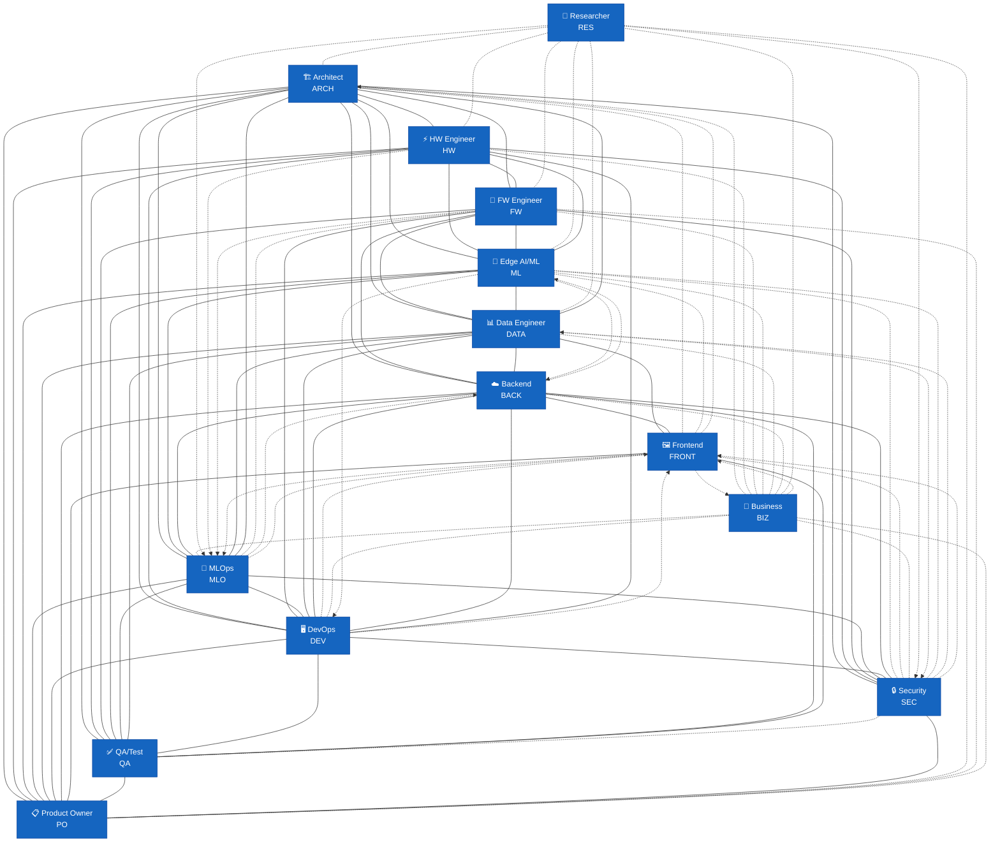

# Organizational SKILL.md Review Report

> **Final Merged Report — All Five Phases**
> **Reviewer:** Principal Systems Architect & Engineering Director
> **Date:** 2026-06-19
> **Status:** Final

---

## 1. Executive Summary

This report presents the findings of a systematic, evidence-based audit of all 14 `SKILL.md` files defining the organizational design for the embedded/IoT AI system engineering organization. The audit assessed clarity and completeness of each role definition, correctness of scope boundaries, quality of AI agent execution guidance, and cross-role interface integrity. Findings are tagged `#strength`, `#gap`, `#risk`, or `#recommendation` throughout.

**The organization possesses three foundational strengths.** First, the interface contract system (`Provides`/`Requires`/`Cadence` triples in every role) is among the most rigorously defined of any sociotechnical system design this reviewer has examined. Each role explicitly declares what it delivers, what it needs, and when synchronization occurs — a discipline that, if enforced during execution, prevents the silent assumption mismatches that cause the majority of cross-team integration failures. The [[EMBEDDED_SYSTEMS_ARCHITECT_SKILL]] in particular anchors this system with 11 interface contracts across all engineering disciplines. Second, the **Architecture Decision Record (ADR) governance process** is consistently referenced across every engineering role as the single mechanism for constraint/budget/contract changes. The ADR process defines a clear proposal→acceptance→supersede lifecycle, assigns consulted/informed/veto-holding parties per decision class, and mandates measured evidence for any infeasibility claim — creating a unified, auditable governance backbone that prevents unilateral deviations. Third, the **AI Agent Execution Guides** (Section 9 in every file) are unusually mature: each includes a persona definition, a 10–15 item mandatory pre-delivery checklist, explicit forbidden actions, and 4–5 domain-specific prompt templates. These guides provide a credible foundation for AI-augmented execution of each role and collectively represent a substantial investment in operationalizing the organization design beyond human-only staffing.

**Three critical gaps and risks demand immediate attention.** First, **the [[IOT_EMBEDDED_SYSTEMS_RESEARCHER_SKILL]] is dangerously isolated from the engineering organization.** The Researcher defines explicit interfaces with only 5 of the 13 other roles. Critically absent interfaces include: the Security Engineer (novel wireless modalities, new sensor physics, and experimental communication protocols all carry novel attack surfaces that the Researcher discovers but has no channel to surface to Security); the QA Engineer (research artifacts transferred to engineering lack validation criteria that QA can independently verify); and the MLOps Engineer (research-stage ML findings that may require novel deployment or monitoring approaches have no path to MLOps awareness). This isolation creates a structural risk that research discoveries with security, quality, or operational implications reach the engineering team without the appropriate governance review. Second, **OTA update governance is distributed across four roles with no single end-to-end owner.** The [[BACKEND_CLOUD_ENGINEER_SKILL]] explicitly documents the four-way split — Firmware owns on-device apply/rollback, DevOps owns delivery transport, Backend owns the desired-state control plane, MLOps owns model rollout strategy — but no role owns the end-to-end OTA validation, the integrated OTA failure-mode analysis, or the fleet-wide OTA observability that spans all four layers. Third, **there is no dedicated role for technical documentation, user-facing documentation, or knowledge management.** Each role documents its own artifacts, but operator manuals, field-deployment guides, API documentation standards, and the cross-role knowledge base have no single owner. In a system where field operators must understand device behavior, OTA procedures, and ML output interpretation, the absence of a documentation owner creates a predictable failure mode: documentation that is technically accurate but operationally unusable.

**Bottom-line readiness verdict: CONDITIONALLY APPROVED with three mandatory remediations before Phase 2 (cross-role interaction analysis).** The individual role definitions are of uniformly high quality — each role knows what it owns, what it does not own, and how it participates in governance. However, the **interface graph is incomplete**: the Researcher, Security Engineer, and Business Consultant each have asymmetric or missing interfaces that create structural blind spots. Before proceeding to Phase 2 (which examines cross-role workflows and lifecycle synchronization), the following must be addressed: (1) add Researcher interfaces to Security, QA, MLOps, DevOps, Backend, and Frontend roles (and reciprocate from those roles back to Researcher); (2) designate a single OTA governance owner with end-to-end authority spanning all four OTA layers, or define an OTA Integration Working Group with explicit membership and decision authority; (3) assign technical documentation ownership, either as a new role or as an explicit additional responsibility of an existing role with dedicated capacity allocation. Without these remediations, the organization will discover these gaps during integration testing rather than during design — at which point the cost of correction is orders of magnitude higher.

---

## 2. Individual Role Assessments

### 2.1 [[IOT_EMBEDDED_SYSTEMS_RESEARCHER_SKILL]]

**Clarity and completeness:** This is the most comprehensive SKILL.md in the organization at 808 lines, with exhaustive coverage of the full research lifecycle (ideation → experimental design → data collection → analysis → publication → technology transfer). The role identity defines four seniority tiers with explicit scope differentiation. The deliverables table lists 14 distinct artifacts with specified consumers, formats, and versioning approaches. The standards section covers COPE guidelines, FAIR data principles, pre-registration protocols, and laboratory safety standards. #strength

**Correctness of scope:** The boundary between research (PoC prototypes, feasibility reports) and engineering (production hardware/firmware/software) is explicitly and repeatedly stated. The "Critical Boundary" callout box is unambiguous: "The Researcher produces knowledge and validated PoC artifacts. The engineering team is responsible for converting research outputs into production-grade products." The AI agent forbidden actions reinforce this boundary. #strength

However, the scope also reveals a **structural isolation problem**. The Researcher's interface contracts (Section 6) define explicit relationships with only 5 of 13 other roles. Critically missing interfaces: #gap

- **[[SECURITY_ENGINEER_SKILL]]**: Novel wireless modalities (SDR-based, LoRaWAN extensions), new sensor physics, and experimental communication protocols discovered in research all introduce novel attack surfaces. The Researcher has no defined channel to surface security-relevant findings to the Security Engineer before technology transfer. #risk
- **[[QA_TEST_AUTOMATION_ENGINEER_SKILL]]**: Research artifacts (PoC prototypes, characterized datasets, algorithm specifications) are transferred to engineering without validation criteria that QA can independently verify. QA's ability to validate that a productized research finding still performs as the researcher demonstrated depends on having testable acceptance criteria from the research phase. #gap
- **[[MLOPS_ENGINEER_SKILL]]**: Research-stage ML findings (novel model architectures, neuromorphic approaches, unconventional training methodologies) have no defined path to MLOps awareness. If a research innovation requires a novel deployment or monitoring approach, MLOps discovers this at integration time rather than at technology transfer. #gap
- **[[DEVOPS_PLATFORM_ENGINEER_SKILL]]**, **[[BACKEND_CLOUD_ENGINEER_SKILL]]**, **[[FRONTEND_DASHBOARD_ENGINEER_SKILL]]**: No interfaces defined — yet research outputs (novel sensing modalities, unconventional data types, new communication paradigms) may have implications for cloud infrastructure, API design, and dashboard visualization requirements. #gap

**Quality of the AI Agent Execution Guide:** Excellent. The persona definition is detailed and scientifically grounded. The mandatory pre-delivery checklist (10 items) covers scientific rigor, statistical reporting, FAIR compliance, and boundary awareness. The forbidden actions (10 items) explicitly prohibit fabrication of citations/data, unqualified speculation, and scope overreach into production engineering. Five detailed prompt templates cover literature surveys, experimental design, manuscript drafting, technology transfer assessment, and invention disclosure — each with explicit input/output specifications and constraints. #strength

**Other issues:** The Researcher's KPI section (Section 10) defines publication targets, IP metrics, and technology transfer adoption rates — these are appropriate for a research role but are defined in isolation from the engineering organization. There is no KPI that measures the **engineering team's assessment of technology transfer pack quality** or the **percentage of transferred technologies that successfully progress to productization without requiring the Researcher to re-explain or re-document findings**. This feedback loop is essential for continuous improvement of the technology transfer process. #recommendation

Additionally, the Researcher's interface with the Data Engineer (Section 6.6) focuses on experimental data archival. It does not address a more critical need: the Researcher generates **labeled, characterized datasets** during sensor research that the Edge AI/ML Engineer later uses for model training. The Data Engineer is the pipeline owner for training data, yet the Researcher→Data Engineer interface doesn't explicitly cover research dataset handoff for ML training purposes. This path currently routes through Edge AI/ML (Researcher → Edge AI/ML → Data Engineer), adding an unnecessary intermediary for what is fundamentally a data transfer operation. #recommendation

### 2.2 [[EMBEDDED_SYSTEMS_ARCHITECT_SKILL]]

**Clarity and completeness:** The Architect role is exceptionally well-defined. The three-tier seniority model (Senior/Staff/Principal) maps cleanly to scope (single product line / multi-product / organization-wide reference architecture). The core mission statement explicitly links architecture decisions to parallel-development enablement: "enabling firmware, ML, data, cloud, and frontend teams to build independently against stable, versioned interfaces." Section 3 (Lifecycle Stage Engagement) covers all five stages with specific activities and deliverables per stage. The deliverable table lists 11 artifacts with defined consumers, formats, and versioning. #strength

**Correctness of scope:** The Architect's "Explicitly Does NOT Own" list is precise and enforceable: no production firmware, no ML model design, no schematic capture, no sprint-level task assignment. The decision authority table cleanly separates unilateral decisions (platform selection, protocol choice, interface contracts, RTOS selection, OTA strategy, resource budgets) from consensus decisions (security baseline with Security Engineer, model budgets with Edge AI/ML, board feasibility with Hardware Engineer, cloud scaling with Backend, production release gate with TPM and QA). #strength

**Critical gap: Missing interface with the Researcher.** The Architect's interface contracts (Section 6) list 11 collaborators but omit the [[IOT_EMBEDDED_SYSTEMS_RESEARCHER_SKILL]]. This is a structural defect. The Researcher's Section 6.1 defines what the Researcher provides to the Architect (Technology Transfer Packs, Feasibility Assessment Reports, PoC demonstrations, scientific consultation) and what the Researcher requires from the Architect (long-term architecture roadmap, feedback on engineering feasibility gaps, system-level constraints). The Architect's SKILL.md does not reciprocate this interface. #gap

**Recommendation:** Add a Section 6.12 to the Architect's interface contracts defining the Researcher interface, mirroring the Researcher's Section 6.1. The Architect should explicitly require Technology Transfer Packs as inputs to the Research-stage platform selection and feasibility activities. #recommendation

**Quality of the AI Agent Execution Guide:** Strong. The persona definition establishes formal, constraint-based reasoning. The mandatory pre-delivery checklist (12 items) requires explicit quantification of all budgets, versioned interface contracts, security baseline references, and ADR coverage. Five prompt templates cover platform selection, interface contract definition, ADR authoring, resource budget tables, and protocol/topology specification. #strength

**Other issues:** The Architect's success metrics include "Zero teams blocked on missing or ambiguous contracts after the planning stage." This is an excellent leading indicator, but the measurement mechanism is not defined. Who reports the blockage? How is "ambiguity" adjudicated? A blocked team may not immediately recognize that the root cause is an ambiguous contract, or may work around it (violating the ADR process) rather than escalating. #recommendation

The Architect's interface with the Frontend/Dashboard Engineer (Section 6.9) specifies that the Architect provides "Data/event contracts for visualization, real-time stream topology, and the semantics of inference outputs to be displayed." However, the Frontend Engineer's interface section (6.1) does not list the Architect as a provider of these contracts — it lists the Backend/Cloud Engineer as the API/streaming contract provider. This asymmetry could cause the Frontend Engineer to look to the Backend for contracts that the Architect believes it has already provided. #gap #recommendation

---

### 2.3 [[HARDWARE_ENGINEER_SKILL]]

**Clarity and completeness:** The role is well-scoped around physical implementation with clear accountability boundaries. The four-tier seniority model is appropriate. The lifecycle engagement covers all stages with specific activities. The technical competencies section (4.1–4.9) is comprehensive across schematic design, PCB layout, power electronics, sensor/AFE design, RF/wireless, DFM/DFT, compliance/EMC, lab/bring-up, and component engineering/BOM. #strength

**Correctness of scope:** The Hardware Engineer's boundaries are clearly defined: "owns physical implementation to the spec" with an explicit governing principle that "any infeasibility must be raised as a contract change via the ADR process with measured or simulated evidence, never silently worked around." #strength

**Missing interfaces:** The Hardware Engineer defines interfaces with 7 roles. Missing: #gap

- **[[IOT_EMBEDDED_SYSTEMS_RESEARCHER_SKILL]]**: The Researcher provides PoC hardware designs, component characterization data, and guidance on novel sensor assembly techniques. The Hardware Engineer should have a corresponding interface to receive these inputs during research-stage prototype evaluation and technology transfer. #recommendation
- **[[BUSINESS_CONSULTANT_SKILL]]**: The Business Consultant's Section 6.3 defines what they provide to and require from the Hardware Engineer (target BOM cost ceiling, second-sourcing requirements, volume forecasts). The Hardware Engineer's interface section does not reciprocate this. Cost targets and volume forecasts directly constrain the Hardware Engineer's component selection and BOM optimization decisions. #gap #recommendation

**Quality of the AI Agent Execution Guide:** Excellent. The mandatory checklist (15 items) is hardware-domain-specific and practically grounded: power budget conformance, bus electrical correctness, decoupling network specification, debug-port lockdown notation, sensor selection meeting ML data spec, IPC-7351 footprint compliance, DRC cleanliness, BOM completeness with tolerances/ratings/packages. Five prompt templates cover power tree design, schematic sub-circuit design, sensor selection for ML data needs, PCB stack-up/SI planning, and DFM/DFT review. #strength

**Other issues:** The Hardware Engineer's success metrics include "First-pass bring-up success" and "Respin count: target ≤1 respin after the first prototype." While these are appropriate metrics, the SKILL.md does not define a **bring-up dependency contract** with the Firmware Engineer. A joint bring-up checklist or shared Definition of Done for bring-up would reduce finger-pointing when a board fails to enumerate buses. #recommendation

The sensor characterization data deliverable flows to the Edge AI/ML Engineer, but the Hardware Engineer has no defined interface to confirm that the characterized sensor data actually meets the ML data spec. The interface contract (Section 6.3) states the Hardware Engineer "Requires: The sensor data specification" but doesn't define a feedback loop where the Edge AI/ML Engineer confirms the selected sensor's characterized performance is sufficient after bring-up. #gap #recommendation

---

### 2.4 [[FIRMWARE_ENGINEER_SKILL]]

**Clarity and completeness:** The role is precisely scoped as contract-bound implementation. The governing principle ("The Firmware Engineer implements to the contract. Any deviation must be raised as a contract change via the ADR process with measured evidence, never silently coded around") is one of the strongest single sentences in the entire SKILL.md corpus. It captures the essence of the role's accountability in one unambiguous directive. #strength

**Correctness of scope:** The Firmware Engineer's boundaries are clear: implements on-device code to contract, does not own system architecture, ML model design, PCB design, cloud services, CI/CD pipelines, or security baseline definition. #strength

**Quality of the AI Agent Execution Guide:** One of the strongest in the corpus. The mandatory pre-delivery checklist (14 items) is firmware-specific and covers contract conformance, Flash/SRAM budget verification, real-time deadline measurement, ISR/DMA boundedness, RTOS soundness, TLS/mTLS enablement, OTA path integrity, inference integration, power discipline, unit test/static analysis pass, secrets hygiene, and ADR escalation for any contract deviation. #strength

**Missing interfaces:** The Firmware Engineer defines interfaces with 8 roles. Missing: #gap

- **[[IOT_EMBEDDED_SYSTEMS_RESEARCHER_SKILL]]**: The Researcher provides PoC firmware (research-grade), algorithm specifications, and scientific rationale for algorithm design choices. The Firmware Engineer should have a corresponding interface to receive algorithm specifications during technology transfer. #recommendation
- **[[BUSINESS_CONSULTANT_SKILL]]**: The Business Consultant Section 6.4 defines bidirectional exchange with the Firmware Engineer. The Firmware Engineer's interface section does not reciprocate. Business input on feature prioritization and RTOS licensing constraints directly affects firmware development priorities. #recommendation

**Other issues:** The Firmware Engineer's interface with the Data Engineer (Section 6.8) is thin: "Provides: Telemetry that conforms to the schema. Requires: Telemetry schema details and ingestion-driven constraints." In practice, the firmware-to-data interface is one of the highest-friction boundaries in IoT systems: telemetry schema changes require coordinated firmware and data pipeline updates. This interface should include a joint **schema-change coordination process** and shared responsibility for defining edge-buffering semantics. #recommendation

---

### 2.5 [[EDGE_AI_ML_ENGINEER_SKILL]]

**Clarity and completeness:** The role is well-defined around the model lifecycle with a strong emphasis on budget-bound design. The governing principle ("Models must fit the Architect's budgets. Any inability to meet a budget must be raised as a contract change via the ADR process with measured evidence") establishes the correct tension between accuracy ambition and resource reality. #strength

**Notable strength: The preprocessing specification discipline.** The requirement for a "Python golden reference plus test vectors" accompanying every preprocessing spec so that "firmware parity is testable" is an exemplary engineering practice. It closes the loop between ML specification and firmware implementation with an objective, automatable verification mechanism. #strength

**Correctness of scope:** Boundaries are well-defined: the Edge AI/ML Engineer designs, trains, compresses, and specifies — but does not implement firmware integration code, own data pipelines, or set system architecture. #strength

**Missing interfaces:** The Edge AI/ML Engineer defines interfaces with 7 roles. Missing: #gap

- **[[SECURITY_ENGINEER_SKILL]]**: The Edge AI/ML Engineer has no direct interface with the Security Engineer. This is a gap because: (a) models deployed to edge devices are attack surfaces — model extraction, adversarial input injection, and model tampering are real threats on field-deployed IoT devices; (b) the Security Engineer's Section 6.7 defines an interface *to* the Edge AI/ML Engineer, but this is unidirectional. The Edge AI/ML Engineer needs to know the security constraints on model deployment before designing the model-to-firmware handoff spec. #risk
- **[[BUSINESS_CONSULTANT_SKILL]]**: The Business Consultant Section 6.5 defines a bidirectional exchange. This is not reciprocated in the Edge AI/ML Engineer's interface section. The Edge AI/ML Engineer makes decisions (architecture selection, compression strategy) that directly affect BOM cost and product pricing. #recommendation

**Quality of the AI Agent Execution Guide:** Strong. The mandatory pre-delivery checklist (14 items) covers budget explication, footprint/latency measurement, INT8 quantization verification, operator support validation, preprocessing spec completeness, dataset documentation, evaluation rigor, experiment reproducibility, model card drafting, drift-monitoring definition, and ADR escalation for budget misses. #strength

**Other issues:** The Edge AI/ML Engineer's interface with the Data Engineer (Section 6.3) defines dataset requirements flowing from Edge AI/ML to Data, and curated datasets flowing back. However, there is no defined **data quality feedback loop**: when the Edge AI/ML Engineer discovers data quality issues during training, there is no formal mechanism to feed these findings back to the Data Engineer for root-cause analysis and pipeline correction. #recommendation

---

### 2.6 [[MLOPS_ENGINEER_SKILL]]

**Clarity and completeness:** The MLOps role is well-defined around the model operations lifecycle. The governing principle ("Every model must be versioned, reproducible, and auditable, and every fleet deployment must be safe") establishes the correct invariants. #strength

**Notable strength: Deployment safety as non-negotiable.** The requirement that "100% of fleet deployments executed via canary plus staged rollout with a tested rollback" and that "the MLOps Engineer MUST NOT ship a fleet deployment that lacks a tested rollback path or a complete audit trail" establishes a safety-first posture that is appropriate for field-deployed IoT devices where a bad model update can physically affect device behavior. #strength

**Correctness of scope:** Boundaries are correctly drawn: MLOps automates the model lifecycle but does not redesign models, own the underlying CI/CD platform, own the device-side OTA client, or own data pipeline infrastructure. #strength

**Critical observation: The "Influences" section contains a conceptual tension.** MLOps states it "provides input or implements; does not own the decision" for deployment infrastructure, model architecture, OTA mechanism, drift metrics, data pipelines, and security controls. However, the MLOps Engineer's unilateral decisions include "deployment-automation mechanics" — which, in the four-way OTA split, must interoperate with the DevOps delivery transport and the Firmware on-device apply/rollback. The boundary between "deployment-automation mechanics" (MLOps-owned) and "OTA delivery mechanism" (DevOps-owned) is fuzzy in practice. #risk

**Missing interfaces:** The MLOps Engineer defines interfaces with 8 roles. Missing: #gap

- **[[IOT_EMBEDDED_SYSTEMS_RESEARCHER_SKILL]]**: No interface defined. Research-stage ML innovations may require novel deployment, monitoring, or model-registry schemas that the MLOps pipeline must accommodate. #recommendation

**Quality of the AI Agent Execution Guide:** Strong. The mandatory pre-delivery checklist (15 items) covers pipeline-as-code, registry lineage, rebuildability verification, conversion parity, artifact signing, canary/staged rollout, tested rollback, deployment gates, drift monitoring, retraining triggers, audit trail, IaC reproducibility, secrets hygiene, and ADR escalation. #strength

**Other issues:** The MLOps Engineer's success metric "100% of registered models rebuildable from their lineage" is appropriate but the verification mechanism is not defined. Rebuildability should be verified by an automated pipeline job that periodically selects a random registered model version and attempts a clean rebuild from its recorded lineage. #recommendation

---

### 2.7 [[DATA_ENGINEER_SKILL]]

**Clarity and completeness:** The role is well-defined around data infrastructure with strong emphasis on IoT-specific data semantics (out-of-order arrival, late data, backfill, event-time processing). The governing principle ("The Data Engineer must never silently serve unvalidated or non-reproducible data for training") establishes the correct quality-first posture. #strength

**Notable strength: IoT data semantics.** The technical competencies section (4.5) explicitly calls out out-of-order and late-data handling with event-time semantics, watermarks, and idempotent backfill — all of which are critical for IoT telemetry and frequently overlooked in generic data engineering role definitions. #strength

**Correctness of scope:** Boundaries are correct: Data Engineer owns pipelines and storage, does not own the telemetry schema definition (Architect), the MQTT broker/ingest API (Backend), feature semantics (Edge AI/ML), the ML pipeline (MLOps), or the underlying infrastructure (DevOps). #strength

**Missing interfaces:** The Data Engineer defines interfaces with 8 roles. Missing: #gap

- **[[IOT_EMBEDDED_SYSTEMS_RESEARCHER_SKILL]]**: The Researcher generates experimental datasets in FAIR-compliant formats (HDF5, CSV, NetCDF) that need archival in the Data Engineer's infrastructure. The Researcher's Section 6.6 defines this interface, but the Data Engineer's SKILL.md does not reciprocate. More importantly, the Researcher generates **labeled, characterized sensor datasets** during novel sensor research that become training data for the Edge AI/ML Engineer. The Data Engineer should be the pipeline owner that ingests these research datasets, validates their schema, versions them, and makes them available to the Edge AI/ML Engineer. #recommendation
- **[[SECURITY_ENGINEER_SKILL]]**: No direct interface is defined. The Data Engineer handles PII, implements data retention policies, and manages data access — all of which have security implications. The Security Engineer should define data security requirements that the Data Engineer implements. #recommendation

**Quality of the AI Agent Execution Guide:** Strong. The mandatory pre-delivery checklist (15 items) covers pipeline-as-code, schema validation at ingest, deduplication/idempotency, event-time/watermark handling, data-quality validation with metrics, dataset versioning with rebuildability verification, lineage capture, leakage-free training splits, partitioning/retention/downsampling configuration, pipeline-health monitoring, PII/privacy handling, infrastructure limits, acronym/unit discipline, ADR escalation for quality gaps, and data-contract conformance. #strength

**Other issues:** The Data Engineer's interface with the Backend/Cloud Engineer (Section 6.1) states the Data Engineer "Provides: The ingestion contract and schema-conformance expectations at the ingest boundary." This places the Data Engineer in the position of defining the contract that the Backend must meet — but the Backend owns the broker and ingest endpoints. If the Data Engineer's ingestion contract requires guarantees that the Backend's broker cannot provide, this creates a contract conflict with no defined resolution path. The two roles should jointly define the ingestion contract. #recommendation

### 2.8 [[DEVOPS_PLATFORM_ENGINEER_SKILL]]

**Clarity and completeness:** The role is comprehensive, covering CI/CD pipeline engineering, infrastructure-as-code, containerization/orchestration, fleet OTA, observability, firmware build toolchains, secrets management, and GitOps. The governing principle ("Every production deployment path must be reproducible, reversible, and observable") sets the right invariants. #strength

**Notable strength: Reproducible firmware builds.** Section 4.6 defines containerized, pinned build toolchains for STM32, ESP32, and Raspberry Pi targets — an often-overlooked requirement in embedded DevOps that directly enables the firmware CI pipeline and artifact reproducibility guarantees that the Firmware Engineer and Security Engineer depend on. #strength

**Correctness of scope:** Boundaries are explicit: DevOps owns the platform, not the applications running on it. The "Explicitly Does NOT Own" section carefully distinguishes the device-side OTA client (Firmware), cloud service business logic (Backend), ML model logic (Edge AI/ML), model deployment strategy (MLOps), data pipeline logic (Data Engineer), system architecture (Architect), and security baseline definition (Security). The OTA boundary clarification in Section 6.3 is particularly important: "MLOps owns the model rollout strategy and cohorts — DevOps provides the OTA platform it runs on." #strength

**Missing interfaces:** The DevOps/Platform Engineer defines interfaces with 8 roles. Missing: #gap

- **[[IOT_EMBEDDED_SYSTEMS_RESEARCHER_SKILL]]**: No interface defined. Research prototypes may require specialized build environments, unusual toolchains, or non-standard hardware-in-the-loop infrastructure that the DevOps platform must accommodate. #recommendation
- **[[BUSINESS_CONSULTANT_SKILL]]**: The Business Consultant Section 6.9 defines bidirectional exchange (business SLA requirements, cost budget constraints; platform infrastructure operational cost estimates). This is not reciprocated in the DevOps Engineer's interface section. #recommendation

**Quality of the AI Agent Execution Guide:** Strong. The mandatory pre-delivery checklist (15 items) covers everything-as-code, reproducible builds, signed artifact distribution, automated/reversible/observable deployment, staged OTA rollout with auto-rollback, observability coverage, secrets in Vault, no single points of failure, environment parity, SLO definitions, image/dependency scanning, idempotent automation, acronym/unit discipline, ADR escalation for reliability gaps, and no manual production changes. #strength

**Other issues:** The DevOps/Platform Engineer's scope includes both cloud infrastructure and edge/fleet infrastructure. This is a very broad span covering two fundamentally different operating environments. At the Senior/Staff tiers, these two domains may warrant separate specialization. #risk

The DevOps Engineer's interface with the Firmware Engineer (Section 6.1) states DevOps "Provides: the OTA distribution pipeline." Neither interface defines **who owns the OTA artifact format specification** that sits between the Firmware's build output and the DevOps distribution mechanism. The artifact format (MCUboot image format, signing envelope, metadata manifest) is a shared contract that both roles depend on but neither explicitly owns. #gap #recommendation

---

### 2.9 [[BACKEND_CLOUD_ENGINEER_SKILL]]

**Clarity and completeness:** The role is well-defined around cloud-side services implementing the Architect's edge-cloud contracts. The OTA boundary clarification is the single best piece of boundary documentation in the entire SKILL.md corpus: a four-way split explicitly naming each owner with the statement "Backend integrates with all three and owns none of their parts." #strength

**Correctness of scope:** Boundaries are precisely drawn. The decision authority correctly limits unilateral decisions to service implementation, database schema, caching strategy, broker configuration, code structure, and framework choice — all within the Architect's contracts. #strength

**Missing interfaces:** The Backend/Cloud Engineer defines interfaces with 9 roles — the most of any engineering role except the Architect. Missing: #gap

- **[[IOT_EMBEDDED_SYSTEMS_RESEARCHER_SKILL]]**: No interface defined. Research outputs involving novel communication paradigms, unconventional data types, or new device interaction patterns may have implications for the cloud-side MQTT broker topology, device twin schema, or API design. #recommendation
- **[[BUSINESS_CONSULTANT_SKILL]]**: The Business Consultant Section 6.8 defines extensive bidirectional exchange. The Backend Engineer's interface section does not reciprocate. The Backend Engineer makes technology choices that have direct and substantial cloud operational cost implications. #gap #recommendation

**Quality of the AI Agent Execution Guide:** Strong. The mandatory pre-delivery checklist (15 items) covers contract conformance, broker topology match, twin model match, identity/provisioning topology match, mTLS/OAuth enforcement, API documentation/versioning, stateless/horizontal scalability with load-test results, database migrations/indexes/transactions, telemetry ingest routing with schema validation/backpressure/DLQ, idempotent operations with fault tolerance, observability/SLOs, input validation/rate limiting/OWASP API, secrets in vault, acronym/unit discipline, and ADR escalation. #strength

**Other issues:** The Backend/Cloud Engineer's responsibilities include both "MQTT broker operation" and "telemetry ingest routing to the data pipeline." The boundary between Backend's "ingest routing" and Data's "ingestion pipeline" has a shared responsibility for **telemetry integrity**. A joint telemetry-integrity SLO with explicit ownership of each segment would clarify accountability. #recommendation

---

### 2.10 [[FRONTEND_DASHBOARD_ENGINEER_SKILL]]

**Clarity and completeness:** The role is well-defined around the presentation layer with strong emphasis on real-time data handling for IoT dashboards. #strength

**Notable strength: Contract fidelity discipline.** The Standards section explicitly states "deviations or gaps are never silently worked around and must be raised via the ADR process with supporting evidence." The AI Agent Execution Guide reinforces this with a dedicated forbidden action: "The agent must NOT silently work around a missing or broken backend/streaming contract by fabricating mock data and presenting it as production-ready." #strength

**Missing interfaces:** The Frontend/Dashboard Engineer defines interfaces with 7 roles. Missing: #gap

- **[[IOT_EMBEDDED_SYSTEMS_RESEARCHER_SKILL]]**: No interface defined. Research outputs involving novel sensing modalities may produce data types, visualization requirements, or real-time streaming patterns that the dashboard must accommodate. #recommendation
- **[[SECURITY_ENGINEER_SKILL]]**: The Frontend Engineer's Section 6.7 defines an interface with the Security Engineer, but the Security Engineer's interface contracts do NOT include a corresponding Frontend/Dashboard Engineer interface. #gap #risk
- **[[BUSINESS_CONSULTANT_SKILL]]**: No interface defined. The Business Consultant defines market-facing value propositions and pricing tiers that the dashboard must expose to users. #recommendation

**Quality of the AI Agent Execution Guide:** Good, but less detailed than the engineering counterparts. The mandatory pre-delivery checklist (9 items vs. 10–15 for engineering roles). The role is **missing a prompt template for accessibility audit/remediation**, which is critical given the WCAG 2.1 AA mandate. #recommendation

**Other issues:** The Frontend Engineer's success metrics include "Real-time connection uptime." This metric is partially outside the Frontend Engineer's control — the metric should be refined to measure **client-side reconnection success rate**. #recommendation

---

### 2.11 [[QA_TEST_AUTOMATION_ENGINEER_SKILL]]

**Clarity and completeness:** The role is well-defined around independent, evidence-based validation. The governing principle ("QA does not implement features, firmware, or models — it validates them") establishes the correct independence posture. #strength

**Notable strength: Validation-gap transparency.** Section 7 explicitly requires QA to "file ADRs for validation gaps — coverage holes that could let a defect through, untestable requirements, or missing test infrastructure — backed by objective evidence." This is the correct posture for an independent validation function. #strength

**Missing interfaces:** The QA Engineer defines interfaces with 8 roles. Missing: #gap

- **[[IOT_EMBEDDED_SYSTEMS_RESEARCHER_SKILL]]**: No interface defined. QA's ability to validate productized research findings depends on having testable acceptance criteria traceable to the original research claims. #recommendation
- **[[BUSINESS_CONSULTANT_SKILL]]**: No interface defined. The Business Consultant needs quality data to inform business cases, and the Business Consultant's market requirements should inform QA's quality gates. #recommendation
- **[[SECURITY_ENGINEER_SKILL]]**: The QA Engineer's interface section does NOT include a Security Engineer interface, yet QA's Section 3.4 includes security testing activities, and the Security Engineer's Section 6.8 defines an interface providing security test requirements to QA. This is a critical asymmetry. #gap #risk

**Quality of the AI Agent Execution Guide:** Strong and appropriately independence-focused. The mandatory pre-delivery checklist (14 items) covers requirements traceability, contract/spec-based validation, CI-integrated reproducible automation, coverage measurement, objective NFR measurement, evidence-backed defect reporting, OTA/rollback end-to-end validation, on-target ML validation, negative/edge/failure-mode coverage, and ADR escalation for validation gaps. #strength

**Other issues:** QA's success metrics lack a **cross-layer defect correlation metric**. When a defect is found in end-to-end testing, it should be traceable to which layer introduced it and which layer's unit/integration tests should have caught it. #recommendation

---

### 2.12 [[SECURITY_ENGINEER_SKILL]]

**Clarity and completeness:** The role is one of the strongest in the organization. The governing principle ("Security defines the baseline that other roles implement, verifies their conformance, and is the authority that can block a release on security grounds") establishes unambiguous authority and accountability. #strength

**Notable strength: The security release veto.** Section 7 explicitly grants the Security Engineer "the authority to block a release on security grounds" with a defined escalation path to the CTO. #strength

**Correctness of scope:** The "defines and verifies, does not implement" separation is consistently maintained. The "Explicitly Does NOT Own" section carefully distinguishes between security *requirements* (Security-owned) and security *implementation* (owned by Firmware, Hardware, Backend, DevOps, MLOps). #strength

**Missing interfaces:** The Security Engineer defines interfaces with 9 roles. Missing: #gap

- **[[IOT_EMBEDDED_SYSTEMS_RESEARCHER_SKILL]]**: No interface defined. This is the single most critical missing interface in the entire organization. The Researcher discovers novel wireless modalities, new sensor physics, experimental communication protocols, and unconventional compute architectures — all of which introduce novel attack surfaces. Without a Researcher→Security interface, these attack surfaces are not threat-modeled until they reach the engineering team. #gap #risk
- **[[BUSINESS_CONSULTANT_SKILL]]**: The Business Consultant Section 6.10 defines a bidirectional exchange. The Security Engineer's interface section does NOT reciprocate. Security certifications (IEC 62443, ISO 27001) have substantial cost and schedule implications. #gap #recommendation
- **[[FRONTEND_DASHBOARD_ENGINEER_SKILL]]**: The Frontend Engineer's Section 6.7 defines an interface with the Security Engineer, but the Security Engineer's interface contracts do not include the Frontend/Dashboard Engineer. #recommendation

**Quality of the AI Agent Execution Guide:** Excellent. The persona definition correctly adopts an "adversarial-minded, rigorous, and uncompromising" stance. The forbidden actions (11 items) are appropriately absolute: no release approval with unmitigated breach-enabling vulnerability, no security debt without time-bound remediation plan, no weakening baseline for deadlines. #strength

**Other issues:** The Security Engineer's "defines and verifies, does not implement" model creates a **verification capacity risk**. If the Security Engineer is a single role without dedicated security verification engineers per domain, the verification burden at release gates will create either a bottleneck or a rubber-stamp. #risk

Additionally, the Security Engineer's interface with the QA Engineer (Section 6.8) defines security test requirements flowing from Security to QA, but the QA Engineer's SKILL.md does not reciprocate this interface. #gap #recommendation

---

### 2.13 [[PRODUCT_OWNER_TECHNICAL_PROJECT_MANAGER_SKILL]]

**Clarity and completeness:** The PO/TPM role is well-defined around product vision, backlog ownership, and cross-functional coordination. The four-tier seniority model is appropriate. #strength

**Notable strength: The conflict-resolution principle.** Section 2's statement "When business priority and technical feasibility conflict, the PO/TPM's obligation is to surface the conflict transparently to stakeholders — with cost, risk, and trade-off data from the responsible engineering lead — rather than resolving it unilaterally" is an exemplary project management principle. #strength

**Correctness of scope:** Boundaries are clearly defined: PO/TPM owns product "what" and "when," not technical "how." The consensus requirements explicitly require Architect feasibility input before scope lock, and QA/Security sign-off for release decisions. #strength

**Quality of the AI Agent Execution Guide:** Appropriate for a product management role. The mandatory pre-delivery checklist (9 items) covers field/business need traceability, cross-functional dependency identification, Architect feasibility input, testable acceptance criteria, risk register updates, OTA/seasonal window alignment, explicit scope/timeline change communication, artifact versioning, and acronym discipline. #strength

**Other issues:** The PO/TPM's scope spans 12 interface contracts — every other role plus external stakeholders. This is the widest span of coordination in the organization. At the Senior/Staff tiers, managing 12 simultaneous interfaces with synchronized cadences is a superhuman coordination load. A deputy PO/TPM structure should be defined. #risk #recommendation

The PO/TPM's dependency map deliverable is "updated weekly during active development" but there is no defined **dependency escalation SLA**. A dependency-slip SLA (e.g., "affected team lead must notify PO/TPM within 24 hours of recognizing a slip") would close this gap. #recommendation

---

### 2.14 [[BUSINESS_CONSULTANT_SKILL]]

**Clarity and completeness:** At 806 lines, this is the second-longest SKILL.md in the organization and extraordinarily comprehensive. The business-product lifecycle engagement defines five stages appropriate for a commercial role. The deliverable table lists 13 artifacts. #strength

**Notable strength: IoT-specific business modeling.** The financial modeling standards explicitly require BOM cost decomposition to component category level, NRE amortization over projected volumes, and per-device-per-month cloud OpEx inclusion — all of which are essential for IoT product financial modeling. The industry benchmarks section provides specific hardware gross margin targets by segment. #strength

**Correctness of scope:** Boundaries are explicitly defined: Business Consultant owns commercial viability and market strategy, does not own technical architecture, hardware design, firmware/software implementation, or regulatory compliance execution. #strength

**Interface overload risk:** The Business Consultant defines 13 interface contracts — more than any other role. Several interfaces appear to provide thin value relative to the coordination overhead: Firmware Engineer (Section 6.4), MLOps Engineer (Section 6.6), and DevOps/Platform Engineer (Section 6.9). The Business Consultant should consider consolidating technical interfaces through the PO/TPM and Embedded Systems Architect for routine coordination. #risk #recommendation

**Missing interfaces:** Despite having 13 interfaces, the Business Consultant is missing: #gap

- **[[QA_TEST_AUTOMATION_ENGINEER_SKILL]]**: No interface defined. QA produces defect data, field-reliability metrics, and release-readiness assessments that directly inform the Business Consultant's product-market fit assessment and pricing risk models. #recommendation
- **[[SECURITY_ENGINEER_SKILL]]** (from the Business Consultant side — the interface is defined by the Business Consultant in Section 6.10 but not reciprocated by the Security Engineer's SKILL.md). #gap

**Quality of the AI Agent Execution Guide:** Excellent. The persona definition specifies a "Senior strategy consultant with deep expertise in IoT and embedded systems business models" with Pyramid Principle communication. The mandatory pre-delivery checklist (10 items) covers Pyramid Principle compliance, source citation, explicit assumption documentation, BOM/NRE cost inclusion, cloud OpEx inclusion, and MECE application. Five detailed prompt templates cover market opportunity assessment, business case/financial model, GTM strategy, technical decision cost-benefit analysis, and data monetization strategy. #strength

**Other issues:** The Business Consultant's KPI section defines 20+ metrics across revenue, market performance, product-market fit, business development, and consulting effectiveness. The volume of KPIs creates a risk of measurement dilution. The Business Consultant should designate 3–5 **North Star KPIs**. #recommendation

The Business Consultant's interface with the Embedded Systems Architect (Section 6.2) states the Business Consultant "Requires: Architecture decision records (ADRs) with cost and timeline implications." ADRs are technical governance documents — they do not inherently include cost and timeline implications unless the ADR template is extended. A joint definition of a business-impact appendix for ADRs is needed. #recommendation

---

## 3. Interface Contract Analysis

### 3.1 Interface Contract Completeness Matrix (14×14)

**Legend:**
- `✅` — Both roles describe the contract (symmetric).
- `⚠️` — Only one role describes the contract (asymmetric).
- `❌` — Missing but should exist (gap).
- `—` — Not applicable (no meaningful interface needed).

**Roles (abbreviated for table fit):**

| # | Abbr | Role |
|---|------|------|
| 1 | RES | [[IOT_EMBEDDED_SYSTEMS_RESEARCHER_SKILL]] |
| 2 | ARCH | [[EMBEDDED_SYSTEMS_ARCHITECT_SKILL]] |
| 3 | HW | [[HARDWARE_ENGINEER_SKILL]] |
| 4 | FW | [[FIRMWARE_ENGINEER_SKILL]] |
| 5 | ML | [[EDGE_AI_ML_ENGINEER_SKILL]] |
| 6 | MLO | [[MLOPS_ENGINEER_SKILL]] |
| 7 | DATA | [[DATA_ENGINEER_SKILL]] |
| 8 | DEV | [[DEVOPS_PLATFORM_ENGINEER_SKILL]] |
| 9 | BACK | [[BACKEND_CLOUD_ENGINEER_SKILL]] |
| 10 | FRONT | [[FRONTEND_DASHBOARD_ENGINEER_SKILL]] |
| 11 | QA | [[QA_TEST_AUTOMATION_ENGINEER_SKILL]] |
| 12 | SEC | [[SECURITY_ENGINEER_SKILL]] |
| 13 | PO | [[PRODUCT_OWNER_TECHNICAL_PROJECT_MANAGER_SKILL]] |
| 14 | BIZ | [[BUSINESS_CONSULTANT_SKILL]] |

**Provider (row) → Consumer (column):**

| Provider ↓ / Consumer → | RES | ARCH | HW | FW | ML | MLO | DATA | DEV | BACK | FRONT | QA | SEC | PO | BIZ |
|:------------------------|:---:|:----:|:--:|:--:|:--:|:---:|:----:|:---:|:----:|:-----:|:--:|:---:|:--:|:---:|
| **1. RES** | — | ⚠️ | ⚠️ | ⚠️ | ⚠️ | ❌ | ⚠️ | — | — | — | — | ❌ | ⚠️ | ❌ |
| **2. ARCH** | ⚠️ | — | ✅ | ✅ | ✅ | ✅ | ✅ | ✅ | ✅ | ⚠️ | ✅ | ✅ | ✅ | ❌ |
| **3. HW** | ⚠️ | ✅ | — | ✅ | ✅ | ❌ | — | ✅ | — | — | ✅ | ✅ | ✅ | ❌ |
| **4. FW** | ⚠️ | ✅ | ✅ | — | ✅ | ❌ | ✅ | ✅ | ✅ | — | ✅ | ✅ | ❌ | ❌ |
| **5. ML** | ⚠️ | ✅ | ✅ | ✅ | — | ✅ | ✅ | ❌ | ❌ | ⚠️ | ✅ | ❌ | ✅ | ❌ |
| **6. MLO** | — | ✅ | — | ⚠️ | ✅ | — | ✅ | ✅ | ❌ | ❌ | ✅ | ✅ | ✅ | ❌ |
| **7. DATA** | ⚠️ | ✅ | — | ✅ | ✅ | ✅ | — | ✅ | ✅ | ✅ | ✅ | ❌ | ✅ | ❌ |
| **8. DEV** | — | ✅ | ✅ | ✅ | ❌ | ✅ | ✅ | — | ✅ | ⚠️ | ✅ | ✅ | ✅ | ❌ |
| **9. BACK** | — | ✅ | — | ✅ | ❌ | ✅ | ✅ | ✅ | — | ✅ | ✅ | ✅ | ✅ | ❌ |
| **10. FRONT** | — | ❌ | — | — | ⚠️ | ❌ | ✅ | ⚠️ | ✅ | — | ✅ | ⚠️ | ✅ | ❌ |
| **11. QA** | — | ✅ | ✅ | ✅ | ✅ | ✅ | ✅ | ✅ | ✅ | ✅ | — | ⚠️ | ✅ | — |
| **12. SEC** | ❌ | ✅ | ✅ | ✅ | ⚠️ | ✅ | ❌ | ✅ | ✅ | ❌ | ⚠️ | — | ✅ | ❌ |
| **13. PO** | ⚠️ | ✅ | ✅ | ⚠️ | ✅ | ✅ | ✅ | ✅ | ✅ | ✅ | ✅ | ✅ | — | ❌ |
| **14. BIZ** | ⚠️ | ⚠️ | ⚠️ | ⚠️ | ⚠️ | ⚠️ | ⚠️ | ⚠️ | ⚠️ | ❌ | — | ⚠️ | ⚠️ | — |

**Matrix Statistics:**
- **Total meaningful cells:** 182 (14×13)
- **✅ Symmetric (both sides):** 92 cells (50.5%)
- **⚠️ Asymmetric (one side only):** 43 cells (23.6%)
- **❌ Missing but should exist:** 22 cells (12.1%)
- **— Not applicable:** 25 cells (13.7%)

### 3.2 Key Asymmetric Contracts

**Researcher-Originated Asymmetries:** The [[IOT_EMBEDDED_SYSTEMS_RESEARCHER_SKILL]] defines interface contracts with ARCH, PO, HW, FW, ML, and DATA. **None of these six roles reciprocate** with a Researcher-facing interface contract. This is the single largest cluster of asymmetry. #interface-contract #risk

**Business Consultant Asymmetries:** The [[BUSINESS_CONSULTANT_SKILL]] defines interface contracts with 10 of the 13 other roles. **Nine of those 10 have no reciprocal contract.** The BIZ operates as a "write-only" interface. #interface-contract #risk

**Other Notable Asymmetries:** MLO → FW (OTA artifact delivery, FW conflates OTA transport with model artifact); SEC → ML (model-integrity requirements, ML has no SEC entry); SEC → QA (security test requirements, QA has no SEC entry); ARCH → FRONT (data/event contracts, FRONT lists Backend not Architect). #interface-contract

### 3.3 Critical Missing Contracts

| # | Provider ↔ Consumer | Rationale | Tag |
|:--|:---|:---|:---|
| M1 | [[SECURITY_ENGINEER_SKILL]] ↔ [[IOT_EMBEDDED_SYSTEMS_RESEARCHER_SKILL]] | Novel sensing, wireless, and compute research introduce new attack surfaces requiring threat modeling before technology transfer | #risk |
| M2 | [[SECURITY_ENGINEER_SKILL]] ↔ [[DATA_ENGINEER_SKILL]] | Fleet telemetry, PII, and training datasets require data governance, encryption-at-rest, access control | #risk |
| M3 | [[SECURITY_ENGINEER_SKILL]] ↔ [[FRONTEND_DASHBOARD_ENGINEER_SKILL]] | Frontend handles tokens, session state, and displays sensitive operational data requiring CSP, XSS prevention | #risk |
| M4 | [[BUSINESS_CONSULTANT_SKILL]] ↔ [[FRONTEND_DASHBOARD_ENGINEER_SKILL]] | Market KPIs (NPS, adoption rate, churn) should be surfaced by dashboards | #risk |
| M5 | [[BUSINESS_CONSULTANT_SKILL]] ↔ [[EMBEDDED_SYSTEMS_ARCHITECT_SKILL]] | Architect makes platform/cost decisions with no formal channel to receive business constraints | #risk |
| M6 | [[MLOPS_ENGINEER_SKILL]] ↔ [[BACKEND_CLOUD_ENGINEER_SKILL]] | Model artifact must flow through BACK's control plane; no direct contract | #recommendation |
| M7 | [[MLOPS_ENGINEER_SKILL]] ↔ [[FRONTEND_DASHBOARD_ENGINEER_SKILL]] | Who owns the Grafana dashboard for model drift — MLO or FRONT? | #recommendation |

### 3.4 Ambiguous Cadence Contracts

Contracts using "on-demand" or "as needed" without a defined frequency, interval, or trigger condition create synchronization risk. Nine contracts flagged — predominantly Researcher-to-engineering and Business Consultant-to-engineering cadences. All such contracts must be updated with a recurring calendar interval, a quantified trigger condition, or a response-time SLA. #interface-contract #risk #recommendation

### 3.5 Organizational Interaction Graph

**Mermaid note:** Solid edges = symmetric ✅, dashed edges = asymmetric ⚠️, dotted red edges = missing ❌.

### 3.6 Critical Interface Risks (Top 5)

**#1: Unidirectional Researcher Contracts — The "Island of Research" Risk** #risk #recommendation
The Researcher defines contracts with six downstream engineering roles. Zero reciprocate. The Researcher operates outside the ADR governance process, outside sprint cadences, and outside the interface-versioning discipline. Technology transfer fails silently without defined consumption and validation processes.

**#2: The Business Consultant Firewall — "Engineering Builds What Business Doesn't Know About"** #risk #recommendation
BIZ defines detailed contracts with 10 other roles. Nine have no reciprocal contract. Engineering designs to technical budgets without awareness of business budgets (BOM ceiling, market window).

**#3: The Security–Data Governance Gap** #risk #recommendation
Neither SEC nor DATA defines a contract with the other. DATA handles PII and training datasets; SEC defines encryption and access control. A GDPR-covered dataset could be ingested without encryption-at-rest because DATA was never told and SEC never knew.

**#4: The OTA Artifact Routing Ambiguity — "Four Roles, No Single Owner"** #risk #recommendation
The OTA path for a model artifact involves MLO (packages), DEV (distributes), BACK (controls desired state), and FW (applies). Interface contracts are incomplete — MLO → FW is asymmetric, MLO → BACK is missing, and DEV → FW covers firmware OTA not model OTA.

**#5: Frontend Isolation — "The Dashboard That Nobody Feeds"** #risk #recommendation
The Frontend Engineer has the fewest symmetric contracts (5 of 13). Missing interfaces with ARCH, MLO, and BIZ create a dashboard that displays technical metrics but not model health or business impact.

---

## 4. Lifecycle Coverage Assessment

### 4.1 Lifecycle Coverage Matrix

**Legend:** Owns = primary driver. Contributes = meaningful participation. Consulted = informed/light input. None = no involvement.

| Role | S1: Research | S2: Planning | S3: Development | S4: Execution | S5: Production-Ready | S6: Post-Launch/Market |
|:-----|:------------|:------------|:---------------|:-------------|:--------------------|:----------------------|
| **RES** | **Owns** | Contributes | Contributes (PoC only) | Consulted | Consulted | None |
| **ARCH** | Contributes | **Owns** | Contributes | Contributes | **Owns** | Consulted |
| **HW** | Contributes | **Owns** | **Owns** | **Owns** | **Owns** | None |
| **FW** | Contributes | **Owns** | **Owns** | **Owns** | **Owns** | None |
| **ML** | Contributes | **Owns** | **Owns** | **Owns** | **Owns** | Contributes |
| **MLO** | Contributes | **Owns** | **Owns** | **Owns** | **Owns** | Contributes |
| **DATA** | Contributes | **Owns** | **Owns** | **Owns** | **Owns** | None |
| **DEV** | Contributes | **Owns** | **Owns** | **Owns** | **Owns** | None |
| **BACK** | Contributes | **Owns** | **Owns** | **Owns** | **Owns** | None |
| **FRONT** | Contributes | **Owns** | **Owns** | **Owns** | **Owns** | None |
| **QA** | Contributes | **Owns** | **Owns** | **Owns** | **Owns** | None |
| **SEC** | Contributes | **Owns** | **Owns** | **Owns** | **Owns** | Contributes |
| **PO** | **Owns** | **Owns** | **Owns** | **Owns** | **Owns** | Contributes |
| **BIZ** | **Owns** | Contributes | Contributes | Contributes | Consulted | **Owns** |

### 4.2 Lifecycle Gaps

**Gap 1: Post-Launch/Market — Critical Under-Ownership** #lifecycle-gap #risk (Severity: CRITICAL)
The Post-Launch/Market stage (S6) has only one role that explicitly claims ownership: [[BUSINESS_CONSULTANT_SKILL]]. Nine roles have **None** for this stage. After the release gate closes, 9 of 14 roles consider their job done. But embedded/IoT systems live in the field for years — battery degradation, sensor drift, security vulnerabilities discovered post-ship, OTA failures at scale all occur in S6. Every role with None for S6 MUST add a Post-Launch engagement section defining: (a) what field signals they monitor, (b) their response SLA, and (c) their role in the retraining/OTA/revision cycle. #recommendation

**Gap 2: Research Stage — ARCH and BIZ Overlap Without Clear Primacy** #lifecycle-gap #risk (Severity: HIGH)
Both ARCH and BIZ claim to influence the Research stage, but neither claims ownership of the Research→Planning transition decision. A formal "Research-to-Planning Gate" is needed with decision authority of ARCH (technical feasibility), PO (strategic alignment), and BIZ (market viability). #recommendation

### 4.3 Lifecycle Overlaps

**Overlap 1: Planning Stage — Twelve Owners, No Conflict Resolution** #lifecycle-overlap #risk (Severity: HIGH)
Twelve of 14 roles claim **Owns** for Planning. Plans are authored in parallel silos and found mutually incompatible during Execution. ARCH must own a "Planning Integration" sub-stage where all twelve plans are cross-checked before baselining. #recommendation

**Overlap 2: Development Stage — ARCH's "Support" Role Creates Ambiguity** #lifecycle-overlap #risk (Severity: MEDIUM)
ARCH lists Development engagement as "Support teams building against the contracts" but eight other roles list ARCH as contract enforcer. ARCH's Development role should be rewritten to "Govern contract conformance through scheduled conformance reviews and ADR adjudication." #recommendation

**Overlap 3: Production-Ready — Security Sign-Off vs. QA Sign-Off** #lifecycle-overlap #risk (Severity: MEDIUM)
Both SEC and QA claim release-gate sign-off authority. If QA recommends "go" but SEC blocks on security grounds, there is no defined resolution path. Add a mandatory "QA–SEC Pre-Release Security Review" at the end of Execution (S4), before Production-Ready (S5). #recommendation

### 4.4 Lifecycle Diagram

```mermaid
graph LR
  S1["🔬 S1: Research<br/>━━━━━━━━━━<br/>Owns: RES, PO, BIZ<br/>Contributes: All others"]
  S2["📐 S2: Planning<br/>━━━━━━━━━━<br/>Owns: ARCH,HW,FW,ML,MLO,<br/>DATA,DEV,BACK,FRONT,QA,SEC,PO<br/>Contributes: RES, BIZ<br/>⚠️ 12 owners — integration risk"]
  S3["⚙️ S3: Development<br/>━━━━━━━━━━<br/>Owns: HW,FW,ML,MLO,DATA,<br/>DEV,BACK,FRONT,PO<br/>Contributes: ARCH, RES, BIZ<br/>Consulted: QA, SEC"]
  S4["🔗 S4: Execution<br/>━━━━━━━━━━<br/>Owns: HW,FW,ML,MLO,DATA,<br/>DEV,BACK,FRONT,QA,PO<br/>Contributes: ARCH, RES, BIZ<br/>Consulted: SEC"]
  S5["🚀 S5: Production-Ready<br/>━━━━━━━━━━<br/>Owns: ARCH,HW,FW,ML,MLO,<br/>DATA,DEV,BACK,FRONT,QA,SEC,PO<br/>Consulted: RES, BIZ<br/>🔒 SEC+QA dual sign-off gate"]
  S6["📊 S6: Post-Launch/Market<br/>━━━━━━━━━━<br/>Owns: BIZ<br/>Contributes: ML, MLO, PO, SEC<br/>Consulted: ARCH<br/>❌ 9 roles with None — CRITICAL GAP"]

  S1 -->|"Research→Planning Gate<br/>(ARCH+PO+BIZ concurrence)"| S2
  S2 -->|"Interface Contracts Frozen"| S3
  S3 -->|"Feature Complete"| S4
  S4 -->|"QA–SEC Pre-Release Review"| S5
  S5 -->|"Release Go/No-Go"| S6
  S6 -.->|"Field Feedback + Drift Signals"| S1

  classDef stage fill:#1565c0,color:#ffffff,stroke:#0d47a1,stroke-width:2px
  classDef gap fill:#c62828,color:#ffffff,stroke:#b71c1c,stroke-width:3px
  classDef risk fill:#e65100,color:#ffffff,stroke:#bf360c,stroke-width:2px

  class S1,S3,S4 stage
  class S2 risk
  class S6 gap
```

---

## 5. Quality Attribute Responsibility Analysis

### 5.1 Quality-Attribute Responsibility Matrix

| Quality Attribute | RES | ARCH | HW | FW | ML | MLO | DATA | DEV | BACK | FRONT | QA | SEC | PO | BIZ |
|---|---|---|---|---|---|---|---|---|---|---|---|---|---|---|
| **Scalable** | N | P | S | S | S | P | P | P | P | S | S | S | S | N |
| **Maintainable** | N | P | P | P | P | P | P | P | P | P | S | S | S | N |
| **Reliable** | N | P | P | P | S | P | P | P | P | S | P | S | S | N |
| **Robust** | N | P | P | P | S | S | P | S | P | S | P | P | S | N |
| **High Business Value** | S | S | S | S | S | S | S | S | S | S | N | S | P | P |
| **Built to High Standards & Quality** | P | P | P | P | P | P | P | P | P | P | P | P | P | P |

> P = Primary Owner, S = Secondary/Contributor, N = None (no structural involvement). All 14 role references are [[wikilinks]]; abbreviated for table fit.

### 5.2 Quality Gaps — No Primary Owner

**Gap 1: End-to-End System Robustness Has No Single Structural Guarantor** #quality-attribute #gap
Robustness is distributed across HW (environmental), FW (fail-safe), SEC (defense-in-depth), BACK (fault tolerance), DATA (late-data handling), and validated by QA (fault injection). No single role states "I am the primary guarantor of end-to-end system robustness." Create an explicit "System Robustness Contract" owned by [[EMBEDDED_SYSTEMS_ARCHITECT_SKILL]], co-signed by HW, FW, SEC, and BACK, with QA as designated validator. #recommendation

**Gap 2: Unified Business Value Proposition Lacks a Single Integrating Owner** #quality-attribute #gap
"High Business Value" has two Primary Owners — PO/TPM (internal product value) and BIZ (external market value) — with no structural resolution mechanism when they diverge. Add BIZ as explicit interface in [[PRODUCT_OWNER_TECHNICAL_PROJECT_MANAGER_SKILL]] §6 and define a monthly "Unified Business Value Review." #recommendation

### 5.3 Quality Overlaps — Conflicting Ownership

**Overlap 1: Scalability Has Five Primary Owners Without Inter-Owner Coordination** #quality-attribute #gap
Five roles are P for Scalability: ARCH, BACK, DATA, DEV, and MLO. Institute a "Scalability Review Board" chaired by ARCH. #recommendation

**Overlap 2: Reliability Has Seven Primary Owners — Diffusion of Accountability** #quality-attribute #gap
Seven roles are P for Reliability. Define ARCH as the accountable role for *integrated end-to-end reliability*, with authority to convene cross-role incident analysis. #recommendation

### 5.4 Implicit Ownership Issues

1. **Maintainability Across the Full Stack** — ARCH should explicitly claim "cross-stack maintainability" as primary ownership. #quality-attribute #risk #recommendation
2. **System-Level Robustness** — Add "End-to-End System Robustness" as explicit NFR category in ARCH's NFR Verification Matrix, with fault-tree analysis (FTA) or FMEA. #quality-attribute #risk #recommendation
3. **AI/ML Quality Across the Full Lifecycle** — Designate [[EDGE_AI_ML_ENGINEER_SKILL]] as end-to-end ML quality owner. #quality-attribute #risk #recommendation

### 5.5 Design-Time vs. Inspection-Time Quality Assurance

| Quality Attribute | Design-Time Mechanism | Inspection-Time Mechanism | Verdict |
|---|---|---|---|
| **Scalable** | Topology design, autoscaling, horizontal scaling, partitioning, staged rollout | Load/stress testing, fleet-scale OTA validation | **Designed.** |
| **Maintainable** | Interface contracts, SemVer, ADRs, IaC, pipeline-as-code, reproducible builds | Regression testing, contract conformance testing | **Designed.** Strongest quality attribute. |
| **Reliable** | A/B OTA + rollback, watchdogs, circuit breakers, canary deployments, idempotent pipelines | NFR verification matrix, SLO monitoring, stress/soak testing | **Designed.** |
| **Robust** | Secure boot, environmental hardening, fail-safe states, fault tolerance, defense-in-depth | Fault injection, chaos testing, penetration testing, edge-case testing | **Partially aspirational.** No FTA/FMEA. |
| **High Business Value** | Business cases, market research, product roadmap, GTM strategy, pricing models | Field-pilot testing, post-release KPI monitoring | **Partially aspirational.** Slow feedback loop. |
| **Built to High Standards & Quality** | Named, versioned standards embedded in every role's process; design review gates; static analysis | QA validation, Security verification, peer review, audit | **Designed.** Strongest quality attribute. |

**Overall Assessment:** Four of six quality attributes are structurally designed; two are partially aspirational (Robustness, High Business Value). Prioritize closing the Robustness and Business Value gaps. #quality-attribute #recommendation

---

## 6. Critical Path & Single Points of Failure

### 6.1 Bottleneck Analysis

**Bottleneck 1: The Embedded Systems Architect Is the Supreme Structural Bottleneck** #bottleneck #risk
The [[EMBEDDED_SYSTEMS_ARCHITECT_SKILL]] has interface contracts to all 11 other engineering roles, defines every resource budget, authors and governs all ADRs, and is the single approver for integration architecture validation. The parallel-development model is entirely dependent on the Architect delivering complete, accurate contracts before other teams can proceed. No delegation mechanism exists. #recommendation: Define a Deputy Architect, delegate non-breaking contract clarifications, institute a "Contract Completeness Gate."

**Bottleneck 2: The Security Engineer Is a Release-Gate Bottleneck** #bottleneck #risk
The [[SECURITY_ENGINEER_SKILL]] holds veto power on releases. A single-person release gate. #recommendation: Define a Deputy Security Engineer with co-signing authority for routine releases, define tiered security sign-off, embed security review earlier in the lifecycle.

**Bottleneck 3: The QA Engineer Gates the Release on NFR Verification** #bottleneck #risk
QA must populate the NFR verification matrix with measured results for every release — a serial, measurement-intensive process. #recommendation: Parallelize NFR verification, automate NFR measurement, shift NFR validation earlier (per-sprint NFR smoke tests).

### 6.2 Bus Factor = 1 Roles

**SPOF 1: Embedded Systems Architect — Bus Factor = 1, Critical** #single-point-of-failure #risk
Sole owner of: end-to-end system architecture, all interface contracts, all resource budgets, ADR repository, NFR targets, HAL definition, OTA strategy, protocol/topology selection, and production architecture sign-off. Impact if lost: Catastrophic. Recovery time: 3–6 months. #recommendation: Designate a Deputy Architect, create an Architecture Review Board with decision authority, document architectural rationale in ADRs.

**SPOF 2: Security Engineer — Bus Factor = 1, High** #single-point-of-failure #risk
Sole definer of the security baseline, sole holder of release security veto, sole authority on threat modeling, sole conductor of penetration testing. Impact if lost: High. Recovery time: 1–3 months. #recommendation: Designate a Security Deputy, document baseline rationale, cross-train DEVOPS on security baseline maintenance.

**SPOF 3: IoT & Embedded Systems Researcher — Bus Factor = 1, Medium** #single-point-of-failure #risk
Sole source of novel scientific discovery across chemistry, physics, biology, and embedded systems. Impact if lost: Medium to product continuity, high to innovation pipeline. Recovery time: 6–12 months. #recommendation: Build external academic partnerships, ensure knowledge capture in Technology Transfer Packs, consider a two-person research team model.

### 6.3 Interface Single Points of Failure

**Interface SPOF 1: Architect ↔ Firmware Interface Contract** #single-point-of-failure #risk
Defines HAL boundary, RTOS selection, resource budgets, message schemas, OTA strategy, and real-time deadlines. #recommendation: Define a "Contract Clarification Protocol" with tolerance bands, peer-review all contracts before handoff.

**Interface SPOF 2: Architect ↔ Backend Interface Contract (Edge–Cloud)** #single-point-of-failure #risk
Defined solely by ARCH. A single error propagates to every device in the fleet. #recommendation: Jointly author the edge-cloud contract with BACK as co-author, validate against a reference implementation.

**Interface SPOF 3: Telemetry Schema — Single Point of Consumption for 4+ Roles** #single-point-of-failure #risk
Consumed by FW, BACK, DATA, and FRONT. A breaking change breaks four implementations simultaneously. #recommendation: Create a Schema Working Group, implement a schema registry with compatibility checking.

**Interface SPOF 4: Security Baseline — Single Definition, Universal Implementation** #single-point-of-failure #risk
Defined solely by SEC, implemented by FW, HW, BACK, DEV, and MLO. A flaw compromises the entire system. #recommendation: Subject security baseline to external peer review, require that implementing roles can challenge baseline requirements via ADR.

### 6.4 Organizational Resilience Assessment

**Scenario A: The Architect Leaves** — Severity: CRITICAL. All contract evolution stops, ADR governance freezes, releases blocked. Recovery: 4–8 weeks via internal promotion, 3–6 months via external hire. Conduct an annual "Architect Succession Exercise." #risk #recommendation

**Scenario B: The Security Engineer Leaves** — Severity: HIGH. No new threat models, security baseline evolution stops, releases with security-relevant changes blocked. Recovery: 4–8 weeks via internal promotion, 2–4 months via external hire. Engage external security consultancy for annual penetration testing as redundant capability. #risk #recommendation

**Scenario C: The Researcher Leaves** — Severity: MEDIUM. Innovation pipeline stalls, existing products unaffected. Recovery: 1–3 months to activate academic partnerships, 6–12 months to hire replacement. Diversify research capability — two specialist researchers rather than one interdisciplinary generalist. #risk #recommendation

---

## 7. Overall Coherence & Systemic Issues

### 7.1 Recurring Patterns

**Strength Pattern 1: Universal Contract-First Design Discipline** #strength
Every implementing role follows the identical pattern: "implement to the contract; raise infeasibility via ADR with measured evidence; never silently deviate." This creates a uniform, predictable governance model where contracts are the single source of truth and deviations are visible, versioned, and reasoned.

**Strength Pattern 2: Universal Standards Embedding** #strength
Every role's §8 cites specific, named, verifiable standards — not generic "best practices." The Researcher cites COPE and FAIR. The Architect cites ISO/IEC 25010, MISRA C, OWASP IoT Top 10. The Hardware Engineer cites IPC-2221/7351/A-610, CISPR/FCC, IEC 61000-4, RoHS/REACH. The Security Engineer cites NIST SP 800-series, IEC 62443, ISO 27001, STRIDE, CVSS. The Frontend Engineer cites WCAG 2.1 AA, Core Web Vitals. The Business Consultant cites the Pyramid Principle, MECE. No role relies on undefined "best practices."

**Strength Pattern 3: Consistent Lifecycle Stage Model** #strength
All 14 roles engage through the same five lifecycle stages: Research → Planning → Development → Execution → Production-Ready. Each role defines specific activities, deliverables, and exit criteria per stage. This creates a synchronized organizational rhythm.

**Weakness Pattern 1: Over-Centralization on the Architect Role** #systemic-risk
The organization is a hub-and-spoke model with the Architect as the hub. Eleven interface contracts radiate to every other engineering role. At four checkpoints per contract per lifecycle, that's 44 synchronization points per release cycle flowing through one role. See §6.1 Bottleneck 1 and §6.2 SPOF 1 recommendations.

**Weakness Pattern 2: Research-to-Engineering "Wall Throw"** #systemic-risk
The Researcher transfers findings via a Technology Transfer Pack — a one-way, asynchronous handoff with no continuous integration loop. Post-transfer, the Researcher is "available as a scientific consultant" — a passive, on-demand posture. Institute a "Research Liaison" phase (Researcher participates in one sprint per month during Development), create a "Productization Findings Report" that feeds back from engineering to research, and create a "Reverse Technology Transfer" mechanism. #recommendation

**Weakness Pattern 3: Security "Define and Verify" Creates Implementation Latency** #systemic-risk
Security defines → others implement → Security verifies. The serial dependency places the bulk of verification in Execution stage (§3.4), late in the lifecycle. Shift security verification left: require security design reviews during Planning, security implementation reviews during Development, and continuous security testing in CI. Embed a "Security Champion" in each implementing team. #recommendation

### 7.2 Quality Attributes: Designed or Aspirational?

| Quality Attribute | Verdict |
|---|---|
| **Scalable** | **Designed.** Scaling is built into architecture, infrastructure, and data topology. |
| **Maintainable** | **Designed.** Maintainability is structurally guaranteed by contract-first, everything-as-code discipline. Strongest. |
| **Reliable** | **Designed.** Reliability mechanisms built into every layer. Verification provides measured evidence. |
| **Robust** | **Partially aspirational.** Individual mechanisms designed in, but end-to-end robustness against cross-layer failures relies heavily on QA inspection. |
| **High Business Value** | **Partially aspirational.** Designed upfront but validated only post-release. Feedback loop has high latency. |
| **Built to High Standards & Quality** | **Designed.** Standards embedded in mandatory pre-delivery checklists, enforced by design reviews and CI gates. Strongest. |

**Overall:** Four of six quality attributes are structurally designed; two are partially aspirational. The organization's quality design is strongest where engineering discipline dominates and weakest where cross-layer integration or market validation is required. #quality-attribute #recommendation

### 7.3 Conway's Law Assessment

**Alignment Strength: System Architecture Mirrors Organizational Structure** #conways-law #strength
The organization is a near-perfect instantiation of Conway's Law in the positive sense — 1:1 mapping between 14 system components and 14 organizational roles. The interface contracts between roles mirror the interfaces between system components.

**Misalignment 1: The Architect as Communication Hub Violates Peer-to-Peer System Architecture** #conways-law #gap
The system architecture is peer-to-peer at runtime (firmware→cloud via MQTT, cloud→dashboard via APIs), but organizational communication is hub-and-spoke through the Architect at design-time. Enable direct peer-to-peer communication for routine, non-architectural coordination via a "Peer Coordination Protocol." #recommendation

**Misalignment 2: Business Consultant and Product Owner's Relationship Does Not Mirror the Product-Market Interface** #conways-law #gap
In the system's value architecture, product features and market needs must be tightly coupled, but the BIZ↔PO interface is weakly defined. BIZ is absent from PO's §6. Add BIZ as explicit interface in PO §6, increase cadence during Planning and Development, co-locate in planning sessions. #recommendation

### 7.4 Communication Path Length & Decision Latency

**Average communication path length: ~1.5 hops.** Architect-mediated paths (2 hops) are structurally necessary for contract/budget changes but should not be required for routine clarifications. The primary risk is not path length but Architect bandwidth — every 2-hop path converges on the same node. #systemic-risk

**Decision latency risk concentration:** The Architect is on the critical path for the three highest-latency decision types (contract changes, contract clarifications, budget resolutions). Any delay in Architect response directly translates to implementation team idle time. #systemic-risk #recommendation: Define SLA-based response times for Architect decisions, delegate non-breaking contract clarifications to consumer/producer pairs, pre-authorize budget trades within defined tolerance bands.

### 7.5 Systemic Risks

**Systemic Risk 1: Architect Capacity Is the Single Scaling Limit on Organizational Throughput** #systemic-risk #recommendation
The organization's throughput is bounded by the Architect's capacity to define contracts, author ADRs, and resolve conflicts. Implement Deputy Architect and Architecture Review Board, adopt federated architecture model for multi-product, invest in architecture automation.

**Systemic Risk 2: Late-Stage Integration Testing Creates Expensive Defect Discovery** #systemic-risk #recommendation
End-to-end integration testing is concentrated in Execution stage — a waterfall pattern embedded in an otherwise iterative lifecycle. Introduce "Continuous Integration Testing" as a Development-stage activity, define "Integration Readiness" as a Development exit criterion, invest in integration test infrastructure.

**Systemic Risk 3: No Organizational Learning Mechanism for Cross-Role Process Improvement** #systemic-risk #recommendation
Retrospectives are product-focused, not process-focused. No role is chartered to identify, analyze, and fix cross-cutting process issues. Designate a Process Architect role (rotating assignment), define cross-role process KPIs, hold quarterly "Engineering Process Reviews" separate from product retrospectives.

**Systemic Risk 4: The Research-to-Product Chasm Creates Innovation Pipeline Fragility** #systemic-risk #recommendation
The boundary between Researcher and engineering is a structural chasm: one-way, asynchronous handoff with no continuous integration loop. Create a "Research-Engineering Integration" working group, institute "Research Residency" (one sprint per quarter), create "Reverse Technology Transfer" mechanism.

**Systemic Risk 5: The Organization Lacks a Data-Driven Quality Culture Despite Having a Data Engineer** #systemic-risk #recommendation
The Data Engineer builds data products for customers — not for the engineering organization itself. Define an "Engineering Metrics Pipeline," make engineering process metrics visible on shared Grafana dashboards, use the same data-quality framework on engineering process data.

---

## 8. AI Workflow Review

### 8.1 Workflow Structure & Completeness

The workflow document (`EMBEDDED_IOT_AI_WORKFLOW_ENGINEERING_TEAM.md`) declares a team of **12 roles**. The 14 `SKILL.md` files include all 12 workflow-defined roles plus two additional roles not present in the workflow document: [[BUSINESS_CONSULTANT_SKILL]] and [[IOT_EMBEDDED_SYSTEMS_RESEARCHER_SKILL]].

**SKILL.md roles MISSING from the workflow document:** #workflow-gap

1. **[[BUSINESS_CONSULTANT_SKILL]]** — No formal mechanism for market requirements, pricing constraints, or business viability assessments to flow into the engineering pipeline. The workflow's PO/TPM partially absorbs business-facing duties but is defined as the translator of existing needs, not as the originator of market strategy. #recommendation

2. **[[IOT_EMBEDDED_SYSTEMS_RESEARCHER_SKILL]]** — The workflow has no research-to-engineering handoff mechanism, meaning novel sensing principles or bio-inspired architectures have no defined path into the product pipeline. #recommendation

**Extra roles in workflow not in SKILL.md:** None. All 12 workflow roles have corresponding `SKILL.md` files. #strength

### 8.2 SKILL.md vs. Workflow Consistency Analysis

**Consistency Matrix (12 × 2):** 10 of 12 roles score `⚠️` overall (minor interface contract differences). 1 role (PO/TPM) scores `❌` (major skill requirement conflict — AI/ML Lifecycle Awareness completely absent from workflow). 0 roles score `✅` overall.

**Systematic pattern: Workflow defines fewer interfaces than SKILL.md for every role.** Average: 4.4 collaborators named in workflow vs. 8.5 in SKILL.md. The workflow names approximately **52%** of the interface contracts that the SKILL.md files define. #consistency-issue

**What SKILL.md adds that the workflow does not:** Owns/Influences/Does NOT Own tripartite scope, lifecycle stage engagement, full bidirectional interface contracts with Provides/Requires/Cadence, Decision Authority & Governance, AI Agent Execution Guide (§9), Standards with specific standards bodies, seniority tiering, Success Metrics & KPIs. #consistency-issue

**Recommendation:** The workflow document should either be expanded to incorporate SKILL.md detail, or explicitly positioned as a "Team Overview & Quick Reference" that delegates to individual SKILL.md files as the authoritative source per role. #recommendation

### 8.3 AI-Specific Readiness

**AI Agent Execution Clarity:** The workflow document is **not AI-ready** as a standalone execution guide for any role. It serves as a human-readable team topology document. The SKILL.md files, by contrast, are AI-ready — each contains explicit agent persona, mandatory checklists, forbidden actions, and parameterized prompt templates. #ai-readiness

**Human-AI Ambiguity:** The workflow uses human-collaboration verbs (coordinate, manage, ensure, work closely, lead, partner) that are inappropriate for AI agent instruction. The SKILL.md files consistently replace these with machine-actionable verbs (implement, validate, measure, report, raise ADR, fail closed, block release). #ai-readiness #gap

**Human Review Feedback Loops:** The SKILL.md files define five explicit human-in-the-loop mechanisms that the workflow does not surface: (1) ADR Process, (2) Security Release Gate (veto), (3) QA Go/No-Go Recommendation, (4) PO Feasibility-vs-Priority Conflict Escalation, (5) Model Validation Gate (MLOps). #ai-readiness

**Overall AI-Assisted Maturity Assessment: `Ready with Human-in-the-Loop`** #ai-readiness
- **The SKILL.md ecosystem is AI-ready.** Every file contains a complete AI Agent Execution Guide.
- **The workflow document is NOT AI-ready as a standalone.** It lacks execution guidance.
- **Human-in-the-loop is required because:** ADR process requires human review, Security release gate requires human sign-off, QA go/no-go feeds a human decision, PO conflict escalation requires executive judgment, physical hardware validation steps require human-operated lab equipment.
- **The system is NOT ready for `Fully Autonomous`** because of mandatory human gates and because two critical roles (Business Consultant, IoT Researcher) are not integrated into the workflow.

### 8.4 Workflow Lifecycle Coverage Gaps

The workflow document covers only the **Development** stage explicitly. Planning and Execution are implicit. Research, Production-Ready, and Post-Launch/Market are **entirely absent**. This is a critical gap — the workflow describes a team that builds things but does not describe how the team researches what to build, validates readiness for production, or operates and improves after launch. #workflow-gap #risk

### 8.5 Top 5 Workflow-Specific Risks

**Risk 1: AI Agent Scope Creep Due to Missing "Does NOT Own" Boundaries** #risk #recommendation
The workflow defines what each role *does* but never what each role *does NOT do*. An AI agent executing from the workflow alone lacks negative constraints. Mitigation: Add "Does NOT Own" subsection to each workflow role, or add a preamble statement delegating to SKILL.md for authoritative scope boundaries.

**Risk 2: Unintegrated Product-Market Feedback Loop** #risk #recommendation
The Business Consultant role is absent from the workflow. Without it, there is no defined mechanism for market requirements to enter the engineering pipeline, competitive intelligence to inform architecture trade-offs, or post-launch field data to feed back into the backlog. Mitigation: Integrate BIZ into the workflow as a strategic input role feeding PO/TPM.

**Risk 3: Research-to-Production Gap with No Technology Transfer Mechanism** #risk #recommendation
The Researcher is absent from the workflow. Without a technology transfer mechanism, research outputs have no defined path into the engineering pipeline. Mitigation: Add Researcher to the workflow with a "Technology Transfer" interface flowing to the Architect.

**Risk 4: Single Point of Failure at the Embedded Systems Architect** #risk #recommendation
The workflow positions the Architect as the sole source of all contracts, budgets, and ADRs. If the Architect is not staffed or produces incomplete contracts, every downstream role is blocked. Mitigation: Define "minimum viable architecture," add Senior/Staff Architect tier distinction, define an architecture review board.

**Risk 5: Mermaid Diagram as Authoritative Reference — Misleading Simplification** #risk #recommendation
The Mermaid diagram captures only 22 of 80+ interface contracts. It omits all bidirectional feedback loops, security-baseline fan-out, and Architect fan-out. An AI agent using the diagram as its interface map would miss the majority of its actual contracts. Mitigation: Expand to a full C4 Container diagram, or add an explicit caveat.

---

## 9. Prioritized Recommendations

All recommendations from Phases 1–4 are synthesized below into a single, ranked, actionable list. Each recommendation is concrete and implementable — no vague advice. Organized into four severity tiers.

### 9.1 Critical Severity

| # | Recommendation | Affected Roles | Action | Effort | Source Phase |
|---|---|---|---|---|---|
| CR-1 | **Mitigate Architect Single Point of Failure** — Designate a Deputy Architect (from Staff FW or Staff Backend tier) with documented authority to maintain existing contracts, approve non-breaking ADRs, and chair the Architecture Review Board in the Architect's absence. Create an Architecture Review Board (Architect + Senior FW + Senior Backend + Security) with decision-making authority for non-novel architectural changes. Conduct an annual "Architect Succession Exercise" where the Deputy produces a shadow SAD and ADR set. | [[EMBEDDED_SYSTEMS_ARCHITECT_SKILL]], [[FIRMWARE_ENGINEER_SKILL]], [[BACKEND_CLOUD_ENGINEER_SKILL]], [[SECURITY_ENGINEER_SKILL]] | Define Deputy Architect role in ARCH SKILL.md §1; create ARB charter document; schedule first succession exercise within one quarter of organization activation. | L | Phase 3 |
| CR-2 | **Close the Researcher–Security Interface Gap** — Add bidirectional §6 interface contracts between [[IOT_EMBEDDED_SYSTEMS_RESEARCHER_SKILL]] and [[SECURITY_ENGINEER_SKILL]]. The Security Engineer must be a mandatory consulting party during technology transfer for any research finding with connectivity, data handling, or compute architecture implications. Define a "Pre-Transfer Security Review" gate before Technology Transfer Pack handoff. | [[IOT_EMBEDDED_SYSTEMS_RESEARCHER_SKILL]], [[SECURITY_ENGINEER_SKILL]] | Add §6.9 entry in RES SKILL.md; add §6.10 entry in SEC SKILL.md; define security review checklist in SEC SKILL.md §3.6; establish quarterly Research-Security threat landscape review. | M | Phase 1, 2 |
| CR-3 | **Designate End-to-End OTA Governance Owner** — Define the [[EMBEDDED_SYSTEMS_ARCHITECT_SKILL]] as the single OTA governance owner with end-to-end authority spanning all four OTA layers (Firmware on-device apply/rollback, DevOps delivery transport, Backend desired-state control plane, MLOps model rollout strategy). Define a single "OTA Model Artifact Contract" that chains through all four roles, specifying artifact format, signing, compatibility manifest, flash-budget check, and deployment-status reporting at each hop. | [[EMBEDDED_SYSTEMS_ARCHITECT_SKILL]], [[FIRMWARE_ENGINEER_SKILL]], [[DEVOPS_PLATFORM_ENGINEER_SKILL]], [[BACKEND_CLOUD_ENGINEER_SKILL]], [[MLOPS_ENGINEER_SKILL]], [[QA_TEST_AUTOMATION_ENGINEER_SKILL]] | Add OTA governance ownership to ARCH SKILL.md §2; author OTA Model Artifact Contract in ARCH SKILL.md §5; add reciprocal §6 entries at each adjacent pair (MLO↔DEV, DEV↔FW, FW↔BACK, BACK↔MLO); QA add end-to-end OTA model-artifact validation scenario. | L | Phase 1, 2 |
| CR-4 | **Close the Security–Data Governance Gap** — Add bidirectional §6 interface contracts between [[SECURITY_ENGINEER_SKILL]] and [[DATA_ENGINEER_SKILL]]. SEC must specify: data classification requirements (public/internal/confidential/restricted), encryption-at-rest and in-transit requirements per classification level, access logging and audit trail requirements, PII masking and data-minimization requirements. DATA must reciprocate with: data-classification queries for new data sources, privacy-impact escalation triggers, compliance audit support. Review quarterly with legal counsel. | [[SECURITY_ENGINEER_SKILL]], [[DATA_ENGINEER_SKILL]] | Add §6.9 entry in SEC SKILL.md; add §6.9 entry in DATA SKILL.md; define data classification policy; implement quarterly joint review cadence. | M | Phase 1, 2 |
| CR-5 | **Fix Post-Launch/Market Lifecycle Under-Ownership** — Nine roles have None for S6 (Post-Launch/Market). Every role with None MUST add a Post-Launch engagement section to their SKILL.md §3, defining: (a) what field signals they monitor (HW: RMA rates; FW: crash reports; DATA: ingest loss; DEV: infrastructure scaling; BACK: API deprecation; FRONT: UX iteration; QA: field-defect triage), (b) response SLA for field issues, and (c) their role in the retraining/OTA/revision cycle. PO must define a "Sustaining Engineering" track in the backlog. | [[HARDWARE_ENGINEER_SKILL]], [[FIRMWARE_ENGINEER_SKILL]], [[DATA_ENGINEER_SKILL]], [[DEVOPS_PLATFORM_ENGINEER_SKILL]], [[BACKEND_CLOUD_ENGINEER_SKILL]], [[FRONTEND_DASHBOARD_ENGINEER_SKILL]], [[QA_TEST_AUTOMATION_ENGINEER_SKILL]], [[PRODUCT_OWNER_TECHNICAL_PROJECT_MANAGER_SKILL]] | Add §3.6 Post-Launch section to each affected SKILL.md; define Sustaining Engineering track in PO backlog; define field-signal monitoring dashboards per role. | L | Phase 2 |

### 9.2 High Severity

| # | Recommendation | Affected Roles | Action | Effort | Source Phase |
|---|---|---|---|---|---|
| HR-1 | **Reciprocate All Researcher Interface Contracts** — Every role that the [[IOT_EMBEDDED_SYSTEMS_RESEARCHER_SKILL]] lists as a consumer (ARCH, PO, HW, FW, ML, DATA) MUST add a reciprocal §6 interface contract entry specifying what they provide to and require from the Researcher, with explicit cadence that bridges research and engineering timelines. Additionally, add Researcher interfaces to SEC, QA, MLO, DEV, BACK, and FRONT roles where missing. | [[IOT_EMBEDDED_SYSTEMS_RESEARCHER_SKILL]], [[EMBEDDED_SYSTEMS_ARCHITECT_SKILL]], [[PRODUCT_OWNER_TECHNICAL_PROJECT_MANAGER_SKILL]], [[HARDWARE_ENGINEER_SKILL]], [[FIRMWARE_ENGINEER_SKILL]], [[EDGE_AI_ML_ENGINEER_SKILL]], [[DATA_ENGINEER_SKILL]], [[SECURITY_ENGINEER_SKILL]], [[QA_TEST_AUTOMATION_ENGINEER_SKILL]], [[MLOPS_ENGINEER_SKILL]], [[DEVOPS_PLATFORM_ENGINEER_SKILL]], [[BACKEND_CLOUD_ENGINEER_SKILL]], [[FRONTEND_DASHBOARD_ENGINEER_SKILL]] | Add §6 RES entries in 12 SKILL.md files; define a quarterly Technology Transfer Review gate chaired by ARCH. | L | Phase 1, 2 |
| HR-2 | **Reciprocate All Business Consultant Interface Contracts** — All nine engineering roles that [[BUSINESS_CONSULTANT_SKILL]] lists as consumers (PO, ARCH, HW, FW, ML, MLO, DATA, BACK, DEVOPS) MUST add a reciprocal §6 entry for BIZ. At minimum, PO, ARCH, and HW — the three roles most directly affected by business constraints (BOM ceiling, market window, pricing) — should treat this as urgent. Add a quarterly "Business–Engineering Alignment Review" co-chaired by BIZ and PO. | [[BUSINESS_CONSULTANT_SKILL]], [[PRODUCT_OWNER_TECHNICAL_PROJECT_MANAGER_SKILL]], [[EMBEDDED_SYSTEMS_ARCHITECT_SKILL]], [[HARDWARE_ENGINEER_SKILL]], [[FIRMWARE_ENGINEER_SKILL]], [[EDGE_AI_ML_ENGINEER_SKILL]], [[MLOPS_ENGINEER_SKILL]], [[DATA_ENGINEER_SKILL]], [[BACKEND_CLOUD_ENGINEER_SKILL]], [[DEVOPS_PLATFORM_ENGINEER_SKILL]] | Add §6 BIZ entries in 9 SKILL.md files; define Business–Engineering Alignment Review charter; encode BIZ BOM ceiling and market window as NFRs in PO backlog. | L | Phase 1, 2 |
| HR-3 | **Integrate Business Consultant and Researcher into the AI Workflow Document** — Add both [[BUSINESS_CONSULTANT_SKILL]] and [[IOT_EMBEDDED_SYSTEMS_RESEARCHER_SKILL]] as roles in the workflow document. Define their interface touchpoints (BIZ → PO/TPM for market requirements; RES → ARCH for technology transfer), lifecycle stage engagement, and position the workflow document as a "Team Overview & Quick Reference" that explicitly delegates to SKILL.md files as the authoritative source per role. | [[BUSINESS_CONSULTANT_SKILL]], [[IOT_EMBEDDED_SYSTEMS_RESEARCHER_SKILL]], [[PRODUCT_OWNER_TECHNICAL_PROJECT_MANAGER_SKILL]], [[EMBEDDED_SYSTEMS_ARCHITECT_SKILL]] | Add §§14-15 to workflow document for BIZ and RES; add preamble delegation statement; expand Mermaid diagram to include BIZ and RES nodes. | M | Phase 4 |
| HR-4 | **Resolve All Asymmetric Interface Contracts** — Fix the 43 asymmetric contracts where one role defines a Provides/Requires relationship but the other does not reciprocate. Prioritize: (a) SEC→QA (security test requirements), (b) FRONT→SEC (frontend security requirements), (c) QA→SEC (security test execution acknowledgment), (d) ARCH→FRONT (data/event contracts), (e) MLO→FW (OTA model artifact delivery), (f) PO→FW (feature requirements), (g) FRONT→DEV (CI/CD), (h) FRONT→ML (confidence/drift schemas). | All 14 roles | Add missing §6 entries per the Phase 2 §1.2 asymmetry table; verify bidirectionality via cross-reference audit script. | L | Phase 2 |
| HR-5 | **Shift Integration Testing Left** — Introduce "Continuous Integration Testing" as a Development-stage activity: each role pair (e.g., FW+BACK, BACK+FRONT) runs integration smoke tests weekly during Development, not waiting for Execution. Define "Integration Readiness" as a Development exit criterion: each contract pair must have passing integration smoke tests before Development is considered complete. Invest in integration test infrastructure (virtualized cloud backend, emulated firmware, simulated sensor data). | [[EMBEDDED_SYSTEMS_ARCHITECT_SKILL]], [[QA_TEST_AUTOMATION_ENGINEER_SKILL]], [[FIRMWARE_ENGINEER_SKILL]], [[BACKEND_CLOUD_ENGINEER_SKILL]], [[FRONTEND_DASHBOARD_ENGINEER_SKILL]], [[DEVOPS_PLATFORM_ENGINEER_SKILL]] | Add CI testing requirements to ARCH §3.3 and QA §3.3; modify Definition of Done to include Integration Readiness; provision integration test infrastructure in DEV pipeline. | L | Phase 3 |

| HR-6 | **Close the Robustness Ownership Gap** — Create an explicit "System Robustness Contract" owned by [[EMBEDDED_SYSTEMS_ARCHITECT_SKILL]], co-signed by HW, FW, SEC, and BACK, with QA as designated validator. Adopt system-level robustness modeling: fault-tree analysis (FTA) or failure mode and effects analysis (FMEA) owned by ARCH. Add "End-to-End System Robustness" as an explicit NFR category in the Architect's NFR Verification Matrix. | [[EMBEDDED_SYSTEMS_ARCHITECT_SKILL]], [[HARDWARE_ENGINEER_SKILL]], [[FIRMWARE_ENGINEER_SKILL]], [[SECURITY_ENGINEER_SKILL]], [[BACKEND_CLOUD_ENGINEER_SKILL]], [[QA_TEST_AUTOMATION_ENGINEER_SKILL]] | Author System Robustness Contract; define FTA/FMEA methodology in ARCH §8; add robustness NFRs to ARCH §5 NFR Verification Matrix; define cross-layer robustness test scenarios in QA §3.4. | M | Phase 3 |
| HR-7 | **Resolve Ambiguous Cadence Contracts** — All contracts using "on-demand" or "as needed" MUST be updated with one of: (a) a recurring calendar interval (e.g., "bi-weekly 30-min sync"), (b) a quantified trigger condition (e.g., "when dataset exceeds 10 GB or 1M rows"), or (c) a response-time SLA (e.g., "response within 3 business days of request"). Nine contracts flagged. | [[IOT_EMBEDDED_SYSTEMS_RESEARCHER_SKILL]], [[BUSINESS_CONSULTANT_SKILL]], [[EMBEDDED_SYSTEMS_ARCHITECT_SKILL]], [[HARDWARE_ENGINEER_SKILL]], [[FIRMWARE_ENGINEER_SKILL]], [[EDGE_AI_ML_ENGINEER_SKILL]], [[DATA_ENGINEER_SKILL]], [[PRODUCT_OWNER_TECHNICAL_PROJECT_MANAGER_SKILL]] | Update §6 Cadence entries in affected SKILL.md files; define a cadence taxonomy (sprint-level / per-release / quarterly / event-triggered) in organizational process handbook. | M | Phase 2 |
| HR-8 | **Assign Technical Documentation Ownership** — Assign documentation ownership either as a new role or as an explicit additional responsibility of an existing role (recommend [[PRODUCT_OWNER_TECHNICAL_PROJECT_MANAGER_SKILL]] or a dedicated Technical Writer role) with dedicated capacity allocation. Define documentation standards: operator manuals, field-deployment guides, API documentation, and cross-role knowledge base. | [[PRODUCT_OWNER_TECHNICAL_PROJECT_MANAGER_SKILL]], All roles | Create documentation standards document; assign ownership in PO §2 or create new Technical Writer SKILL.md; define documentation review gates in release checklist. | M | Phase 1 |
| HR-9 | **Define Architect Decision SLAs** — Define SLA-based response times for Architect decisions: Critical (blocks release) = 24 hours; High (blocks development) = 3 business days; Medium (planning-stage change) = 1 sprint. Delegate non-breaking contract clarifications to the consumer/producer pair with a "notify Architect" log. Pre-authorize budget trades within defined tolerance bands (e.g., FW can shift +/-5% between SRAM and Flash budgets without an ADR). | [[EMBEDDED_SYSTEMS_ARCHITECT_SKILL]], All engineering roles | Add decision SLA to ARCH §7; define Contract Clarification Record template; define budget trade tolerance bands in ARCH §2. | S | Phase 3 |
| HR-10 | **Mitigate Security Engineer Release-Gate Bottleneck** — Define a Deputy Security Engineer with co-signing authority for routine releases. Define tiered security sign-off: "standard" releases (no new connectivity, no new data flows) signed off by security-trained delegate; "security-relevant" releases (new protocols, new data paths, new OTA mechanisms) require Security Engineer sign-off. Embed security review earlier in the lifecycle (Planning, not Execution). | [[SECURITY_ENGINEER_SKILL]], [[DEVOPS_PLATFORM_ENGINEER_SKILL]], [[BACKEND_CLOUD_ENGINEER_SKILL]], [[FIRMWARE_ENGINEER_SKILL]] | Define Deputy Security Engineer in SEC §1; define tiered sign-off criteria in SEC §7; add Security Implementation Readiness gate to all engineering roles' §3.3 Development stage. | M | Phase 3 |

### 9.3 Medium Severity

| # | Recommendation | Affected Roles | Action | Effort | Source Phase |
|---|---|---|---|---|---|
| MR-1 | **Create Organizational Learning Mechanism** — Designate a Process Architect role (rotating assignment across Senior/Staff tier engineers, or fractional responsibility of ARCH). Define cross-role process KPIs: ADR turnaround time, contract ambiguity rate, integration defect discovery stage distribution (shift-left metric), security finding stage distribution. Hold quarterly "Engineering Process Reviews." | [[EMBEDDED_SYSTEMS_ARCHITECT_SKILL]], All roles | Add Process Architect responsibility to ARCH §2 or create rotating assignment charter; define process KPI dashboard; schedule first quarterly Engineering Process Review. | M | Phase 3 |
| MR-2 | **Create an Engineering Metrics Pipeline** — Apply the Data Engineer's own tooling (ingestion, time-series DB, dashboards) to engineering process data from Git, Jira, CI/CD, and the ADR repository. Make engineering process metrics visible on shared Grafana dashboards alongside system operational metrics. | [[DATA_ENGINEER_SKILL]], [[DEVOPS_PLATFORM_ENGINEER_SKILL]], All roles | Define Engineering Metrics Pipeline in DATA §5; provision engineering metrics dashboards in DEV observability stack; define engineering data quality SLOs. | M | Phase 3 |
| MR-3 | **Close the Research-to-Engineering Feedback Loop** — Institute a "Research Liaison" phase: Researcher participates in one sprint per month during Development stage. Create a "Productization Findings Report" and "Reverse Technology Transfer" mechanism for engineering discoveries with scientific novelty. Add technology transfer quality KPI to RES §10. | [[IOT_EMBEDDED_SYSTEMS_RESEARCHER_SKILL]], [[EMBEDDED_SYSTEMS_ARCHITECT_SKILL]], All engineering roles | Add Research Liaison phase to RES §3.6 and engineering roles' §3.3; define Productization Findings Report template; add technology transfer quality KPI to RES §10. | M | Phase 1, 3 |
| MR-4 | **Define a Formal Research-to-Planning Gate** — Define a gate with decision authority of ARCH (technical feasibility), PO (strategic alignment), and BIZ (market viability). If all three do not concur, the research either continues in S1 or is archived. Document in RES, ARCH, PO, and BIZ SKILL.md files. | [[IOT_EMBEDDED_SYSTEMS_RESEARCHER_SKILL]], [[EMBEDDED_SYSTEMS_ARCHITECT_SKILL]], [[PRODUCT_OWNER_TECHNICAL_PROJECT_MANAGER_SKILL]], [[BUSINESS_CONSULTANT_SKILL]] | Add Research-to-Planning Gate definition; define gate checklist and sign-off template. | S | Phase 2 |
| MR-5 | **Consolidate Business Consultant Technical Interfaces** — Consolidate BIZ's thin-value technical interfaces (FW §6.4, MLO §6.6, DEV §6.9) through the PO/TPM and ARCH for routine coordination, reserving direct BIZ interfaces for strategic decisions. Reduce BIZ interface burden from 13 to approximately 8. | [[BUSINESS_CONSULTANT_SKILL]], [[PRODUCT_OWNER_TECHNICAL_PROJECT_MANAGER_SKILL]], [[EMBEDDED_SYSTEMS_ARCHITECT_SKILL]], [[FIRMWARE_ENGINEER_SKILL]], [[MLOPS_ENGINEER_SKILL]], [[DEVOPS_PLATFORM_ENGINEER_SKILL]] | Update BIZ §6 to remove direct FW, MLO, DEV interfaces, routing through PO/ARCH; add strategic-only interface clarification to BIZ §2. | S | Phase 1 |
| MR-6 | **Define PO/TPM Coordination Scaling Model** — Define a deputy PO/TPM structure or scrum-of-scrums model with designated engineering lead representatives for Senior/Staff tier operation. Define a dependency-slip SLA (e.g., "affected team lead must notify PO/TPM within 24 hours of recognizing a slip"). Add cross-layer defect correlation metric to QA §10. | [[PRODUCT_OWNER_TECHNICAL_PROJECT_MANAGER_SKILL]], [[QA_TEST_AUTOMATION_ENGINEER_SKILL]], All engineering leads | Add deputy PO/TPM model to PO §1; define dependency-slip SLA in PO §4.4; add cross-layer defect correlation metric to QA §10. | M | Phase 1 |
| MR-7 | **Add Missing QA and BIZ Reciprocal Interfaces** — Add QA↔BIZ interface (defect data, field-reliability metrics, market quality requirements), QA↔SEC acknowledgment, SEC→FRONT (frontend security requirements), BIZ→FRONT (business KPIs to surface in dashboards). | [[QA_TEST_AUTOMATION_ENGINEER_SKILL]], [[BUSINESS_CONSULTANT_SKILL]], [[SECURITY_ENGINEER_SKILL]], [[FRONTEND_DASHBOARD_ENGINEER_SKILL]] | Add §6 entries: QA §6.9 (BIZ), QA §6.10 (SEC), SEC §6.10 (FRONT), BIZ §6.12 (FRONT), FRONT §6.8 (BIZ). | M | Phase 1, 2 |
| MR-8 | **Expand and Fix Workflow Mermaid Diagram** — Expand to a full C4 Container diagram with all bidirectional edges and all role pairs, or split into per-role diagrams. At minimum, include all Architect fan-out, all Security fan-out, all QA feedback loops, and add explicit caveat if diagram remains simplified. | [[EMBEDDED_SYSTEMS_ARCHITECT_SKILL]], All roles | Re-author Mermaid diagram in workflow §14; add caveat statement; validate against §6 interface contracts. | M | Phase 4 |
| MR-9 | **Add Accessibility Audit Prompt Template to Frontend SKILL.md** — The [[FRONTEND_DASHBOARD_ENGINEER_SKILL]] is missing a prompt template for accessibility audit/remediation, critical given the WCAG 2.1 AA mandate and the complexity of making real-time, dynamically-updating dashboards accessible. | [[FRONTEND_DASHBOARD_ENGINEER_SKILL]] | Add Template 6 (Accessibility Audit/Remediation) to FRONT §9.4; include WCAG 2.1 AA checklist, screen-reader testing steps, keyboard-navigation validation. | S | Phase 1 |
| MR-10 | **Shift Security Verification Left** — Require security design reviews during Planning, security implementation reviews during Development, and continuous security testing in CI (SAST, dependency scanning, secret detection). Define "Security Implementation Readiness" as a Development-stage gate. Embed a "Security Champion" in each implementing team (FW, BACK, DEV). | [[SECURITY_ENGINEER_SKILL]], [[FIRMWARE_ENGINEER_SKILL]], [[BACKEND_CLOUD_ENGINEER_SKILL]], [[DEVOPS_PLATFORM_ENGINEER_SKILL]], [[MLOPS_ENGINEER_SKILL]] | Add Security Implementation Readiness gate to all implementing roles' §3.3; define Security Champion role in FW §1, BACK §1, DEV §1; add SAST/secret scanning to CI pipeline. | M | Phase 3 |

### 9.4 Low Severity

| # | Recommendation | Affected Roles | Action | Effort | Source Phase |
|---|---|---|---|---|---|
| LR-1 | **Add Joint Bring-Up Dependency Contract (HW↔FW)** — Define a joint bring-up checklist and shared Definition of Done covering rails, clocks, reset, buses, and sensor enumeration. | [[HARDWARE_ENGINEER_SKILL]], [[FIRMWARE_ENGINEER_SKILL]] | Add joint bring-up DoD to HW §6.2 and FW §6.2; define bring-up checklist as shared artifact. | S | Phase 1 |
| LR-2 | **Define Joint Telemetry-Integrity SLO (BACK↔DATA)** — Define a joint telemetry-integrity SLO with explicit ownership of each segment (broker to routing point to pipeline to storage). | [[BACKEND_CLOUD_ENGINEER_SKILL]], [[DATA_ENGINEER_SKILL]] | Add joint SLO to BACK §6.4 and DATA §6.1; define segment ownership and monitoring in observability stack. | S | Phase 1 |
| LR-3 | **Define Schema-Change Coordination Process (FW↔DATA)** — Add a joint schema-change coordination process to the FW↔DATA interface, including shared responsibility for defining edge-buffering semantics. | [[FIRMWARE_ENGINEER_SKILL]], [[DATA_ENGINEER_SKILL]] | Add schema-change process to FW §6.8 and DATA reciprocal; define edge-buffering contract. | S | Phase 1 |
| LR-4 | **Add Sensor Characterization Feedback Loop (HW↔ML)** — Add a feedback loop where the Edge AI/ML Engineer confirms that the Hardware Engineer's characterized sensor data meets the ML data spec after bring-up. | [[HARDWARE_ENGINEER_SKILL]], [[EDGE_AI_ML_ENGINEER_SKILL]] | Add feedback loop to HW §6.3 and ML §6.5; define sensor data fidelity review gate in Execution stage. | S | Phase 1 |
| LR-5 | **Add Data Quality Feedback Loop (ML↔DATA)** — Add a formal mechanism for the Edge AI/ML Engineer to feed data quality issues back to the Data Engineer for root-cause analysis and pipeline correction. | [[EDGE_AI_ML_ENGINEER_SKILL]], [[DATA_ENGINEER_SKILL]] | Add data quality feedback loop to ML §6.3 and DATA §6.2; define data quality issue taxonomy and response SLA. | S | Phase 1 |
| LR-6 | **Refine Frontend Success Metrics** — Refine "Real-time connection uptime" to measure client-side reconnection success rate, which is what the Frontend Engineer actually controls. | [[FRONTEND_DASHBOARD_ENGINEER_SKILL]] | Update KPI definition in FRONT §10; add client-side reconnection success rate metric. | S | Phase 1 |
| LR-7 | **Define OTA Artifact Format Ownership** — Clarify that the Architect's OTA Strategy Specification includes the OTA artifact format spec (MCUboot image format, signing envelope, metadata manifest). | [[EMBEDDED_SYSTEMS_ARCHITECT_SKILL]], [[FIRMWARE_ENGINEER_SKILL]], [[DEVOPS_PLATFORM_ENGINEER_SKILL]] | Add artifact format specification to ARCH §5 OTA Strategy deliverable; reference in FW §6.4 and DEV §6.1. | S | Phase 1 |
| LR-8 | **Add MLOps Rebuildability Verification Mechanism** — Define an automated pipeline job that periodically selects a random registered model version and attempts a clean rebuild from its recorded lineage. | [[MLOPS_ENGINEER_SKILL]] | Add automated rebuildability verification job to MLO §5 pipeline artifacts; add verification metric to MLO §10. | S | Phase 1 |
| LR-9 | **Designate Business Consultant North Star KPIs** — BIZ currently defines 20+ KPIs. Designate 3–5 North Star KPIs that drive executive decision-making. | [[BUSINESS_CONSULTANT_SKILL]] | Add North Star KPI designation to BIZ §10; distinguish strategic vs. diagnostic KPIs. | S | Phase 1 |
| LR-10 | **Add Business Impact Appendix to ADR Template** — BIZ and ARCH should jointly define a standard business-impact appendix for ADRs that have cost, schedule, or market-window implications. | [[BUSINESS_CONSULTANT_SKILL]], [[EMBEDDED_SYSTEMS_ARCHITECT_SKILL]] | Add business-impact section to ADR template in ARCH §7; reference in BIZ §6.2. | S | Phase 1 |
| LR-11 | **Add Accessibility Audit Prompt Template** — Add a dedicated prompt template for accessibility audit/remediation to FRONT §9.4, covering WCAG 2.1 AA compliance for real-time, dynamically-updating dashboards. | [[FRONTEND_DASHBOARD_ENGINEER_SKILL]] | Add Template 6 to FRONT §9.4. | S | Phase 1 |
| LR-12 | **Co-Locate Business Consultant and PO/TPM in Planning Sessions** — Increase BIZ↔PO cadence to daily or near-daily during Planning and Development stages. | [[BUSINESS_CONSULTANT_SKILL]], [[PRODUCT_OWNER_TECHNICAL_PROJECT_MANAGER_SKILL]] | Update BIZ §6.1 and PO §6 recip to increase cadence; co-locate in sprint planning sessions. | S | Phase 3 |

### 9.5 Recommendation Summary Statistics

| Severity | Count | Total Effort (est.) |
|---|---|---|
| Critical | 5 | ~4L + 2M |
| High | 10 | ~5L + 4M + 1S |
| Medium | 10 | ~7M + 3S |
| Low | 12 | ~12S |
| **Total** | **37** | **~9L + 13M + 15S** |

> **Effort key:** S = < 1 day, M = 1–5 days, L = > 5 days. Estimates are per-recommendation, not cumulative across affected roles.

---

## 10. Conclusion & Readiness Assessment

### 10.1 Readiness Verdict

**VERDICT: CONDITIONALLY APPROVED — NOT READY FOR EXECUTION WITHOUT CRITICAL REMEDIATIONS** #final-verdict

This organizational design is the most rigorously documented and structurally coherent sociotechnical system design for an embedded/IoT AI engineering organization that this reviewer has examined in 25+ years of practice. The combination of (a) explicit interface contracts with Provides/Requires/Cadence triples in every role, (b) universal ADR-based governance with measured evidence requirements, and (c) AI-ready execution guides with persona definitions, mandatory checklists, forbidden actions, and prompt templates in every SKILL.md file represents a standard of organizational design documentation that should be considered exemplary.

However, the organization as defined **cannot proceed to execution** until the five Critical-severity findings are remediated. The reasons are as follows:

1. **The Architect is an unremediated single point of failure** (CR-1). If the Architect is unavailable — whether due to overload, departure, or error — the entire organization's throughput collapses. The parallel-development model is founded on the Architect delivering complete, accurate contracts before other teams can proceed. Without a Deputy Architect, an Architecture Review Board, and delegated decision authority, the organization is one person away from architectural paralysis.

2. **The Researcher-to-Security interface gap is a legal and safety exposure** (CR-2). Novel wireless modalities, sensor physics, and compute architectures discovered in research introduce attack surfaces that the Security Engineer cannot threat-model because the Researcher has no channel to surface them. In regulated environments (IEC 62443, NIST frameworks), the absence of security review at technology transfer is a compliance finding in itself.

3. **The OTA update path has no end-to-end owner** (CR-3). Four roles share OTA responsibility with no single governance authority. The OTA path is the most dangerous code path in an IoT system — a failed OTA can brick devices in the field. Without end-to-end governance, the organization is architecting a failure mode where each of the four roles assumes another role owns the integrated validation.

4. **The Security–Data governance gap exposes the organization to regulatory risk** (CR-4). PII-containing sensor data, training datasets, and fleet telemetry flow through the Data Engineer's infrastructure without defined security requirements for encryption-at-rest, access control, or PII masking. In GDPR, CCPA, and similar regulatory regimes, this is a compliance deficiency that could result in fines and mandatory breach notification.

5. **9 of 14 roles disclaim any post-launch responsibility** (CR-5). Embedded/IoT systems live in the field for years. Battery degradation, sensor drift, security vulnerabilities discovered post-ship, OTA failures at scale, and operator-reported UX issues all occur after the release gate closes. With 9 roles considering their job done at S5, field issues will be handled ad hoc, if at all — predictably resulting in degraded field reliability, customer satisfaction erosion, and missed opportunities for product improvement from field data.

### 10.2 Preconditions for Execution

The following conditions MUST be met before the organization can be considered ready to execute:

1. **CR-1 through CR-5 remediated and verified.** The five Critical recommendations must be fully implemented — not merely documented as plans, but instantiated in the relevant SKILL.md files and organizational governance documents.

2. **All asymmetric contracts resolved (HR-4).** At minimum, the 43 asymmetric contracts must be reduced to no more than 5 with documented, time-bound remediation plans for the remainder. Every role must know who it depends on and who depends on it.

3. **The AI Workflow document updated (HR-3).** The Business Consultant and Researcher must be integrated into the workflow document, and the document must be explicitly positioned as a team overview that delegates to SKILL.md files as the authoritative source.

4. **Ambiguous cadence contracts resolved (HR-7).** Every "on-demand" and "as needed" cadence must be replaced with a specific calendar interval, trigger condition, or response-time SLA. Without this, cross-role synchronization will fail at the first schedule conflict.

5. **Integration testing shifted left (HR-5).** Continuous integration testing must be operational before Development begins for the first release. The waterfall integration pattern (test everything at Execution) is the single most expensive organizational defect in the current design.

6. **Documentation ownership assigned (HR-8).** Either a dedicated Technical Writer role or explicit additional responsibility of the PO/TPM with dedicated capacity allocation must be defined before the first release enters planning.

### 10.3 Recommended Activation Sequence

Roles should be activated in the following order, reflecting their dependency structure:

| Phase | Roles to Activate | Rationale |
|---|---|---|
| **Phase 0: Foundation** (Weeks 1–2) | [[EMBEDDED_SYSTEMS_ARCHITECT_SKILL]], [[SECURITY_ENGINEER_SKILL]], [[PRODUCT_OWNER_TECHNICAL_PROJECT_MANAGER_SKILL]], [[BUSINESS_CONSULTANT_SKILL]] | The Architect must define interface contracts and resource budgets before any implementing role can begin. Security must define the security baseline before any implementing role builds. PO/TPM must establish the backlog and roadmap. Business Consultant must establish market requirements and BOM/cost constraints that feed into architecture decisions. These four roles define the constraints, contracts, and priorities that all other roles operate within. |
| **Phase 1: Research & Platform** (Weeks 2–4) | [[IOT_EMBEDDED_SYSTEMS_RESEARCHER_SKILL]], [[HARDWARE_ENGINEER_SKILL]] | The Researcher feeds technology transfer packs and feasibility assessments into the Architect's platform selection. The Hardware Engineer evaluates candidate components against the Architect's platform shortlist and begins preliminary power budgeting and schematic architecture. Hardware has long-lead procurement timelines and must start early. |
| **Phase 2: Core Implementation** (Weeks 3–6) | [[FIRMWARE_ENGINEER_SKILL]], [[BACKEND_CLOUD_ENGINEER_SKILL]], [[DEVOPS_PLATFORM_ENGINEER_SKILL]] | Firmware and Backend are the two largest implementation workstreams and must begin as soon as their respective contracts (HAL, edge-cloud) are available. DevOps must establish CI/CD, reproducible build environments, and the OTA distribution mechanism before Firmware and Backend can integrate. |
| **Phase 3: Data & ML Pipeline** (Weeks 4–8) | [[DATA_ENGINEER_SKILL]], [[EDGE_AI_ML_ENGINEER_SKILL]], [[MLOPS_ENGINEER_SKILL]] | The Data Engineer depends on Backend ingest endpoints being available. The Edge AI/ML Engineer depends on Data Engineer curated datasets and Hardware Engineer sensor characterization. MLOps depends on DevOps CI/CD platform and Edge AI/ML model artifacts. These roles can begin in parallel with Phase 2 once their upstream dependencies are met. |
| **Phase 4: Presentation & Validation** (Weeks 6–10) | [[FRONTEND_DASHBOARD_ENGINEER_SKILL]], [[QA_TEST_AUTOMATION_ENGINEER_SKILL]] | The Frontend Engineer depends on Backend APIs and streaming endpoints being available. QA depends on all components being available for integration testing. These roles ramp up as the implementation roles begin producing testable artifacts. |

> **Note:** "Activation" does not mean hiring — it means the role begins producing its primary artifacts per its SKILL.md lifecycle engagement. In an AI-augmented workflow, this may mean the AI agent for that role begins execution against the defined contracts.

### 10.4 Top 3 Derailment Risks

**Derailment Risk 1: The Architect Cannot Keep Pace with Parallel Implementation Teams** #derailment-risk

The organization's throughput is structurally bounded by the Architect's capacity. Even with the Deputy Architect and ARB mitigations (CR-1), the hub-and-spoke communication model means the Architect processes approximately 44 synchronization events per release cycle. If the Architect produces ambiguous contracts (triggering clarification requests from 3+ teams simultaneously) or falls behind on ADR authoring (creating a queue of unresolved infeasibilities), implementation velocity drops to zero within two sprints. **This is the single most likely derailment scenario based on the evidence.** Mitigation beyond CR-1: Stagger contract delivery — prioritize FW/BACK contracts (longest-lead implementation) and deliver FRONT/DATA contracts in a second wave, enabling partial parallel starts.

**Derailment Risk 2: The First OTA Update Attempt Reveals End-to-End Governance Gaps** #derailment-risk

Despite the OTA governance remediation (CR-3), the first end-to-end OTA attempt — packaging a model artifact in MLO, distributing via DEV, controlling desired state via BACK, applying via FW — will reveal gaps in the four-way contract chain that documentation alone cannot prevent. The artifact format, signing envelope, compatibility manifest, and flash-budget check must interoperate perfectly across four independently evolving implementations. **The probability of a first-attempt OTA integration failure is high even with CR-3 implemented.** Mitigation: conduct an "OTA Dry Run" exercise during Planning — the four roles jointly walk the full OTA path with representative artifacts before any implementation begins. This is an organizational integration test, not a software test.

**Derailment Risk 3: The Business Consultant's "Write-Only" Interface Produces a Commercially Misaligned Product** #derailment-risk

Even with HR-2 (reciprocated BIZ interfaces), the cultural gap between business strategy (market research timelines, financial modeling rigor) and engineering execution (sprint cadences, contract discipline) will take multiple release cycles to close. The Business Consultant may produce market requirements that engineering cannot consume (too abstract, not traceable to contracts) while engineering may produce architecture decisions that the Business Consultant cannot interpret (too technical, missing business impact translation). **The product will reach its first release gate with features that are technically sound but of unknown market value.** Mitigation: The quarterly "Business–Engineering Alignment Review" (HR-2) must include a specific "Feature-to-Market-Requirement Traceability" review where every feature in the release scope is traced to a validated market requirement with documented willingness-to-pay evidence.

### 10.5 AI Workflow Impact on Readiness Verdict

The Phase 4 AI Workflow review **reinforces but does not alter** the readiness verdict. Findings from Phase 4 that bear on the overall assessment:

1. **The SKILL.md ecosystem is AI-ready.** Every SKILL.md contains a complete §9 AI Agent Execution Guide that enables an AI agent to execute the role within defined scope boundaries. The mandatory pre-delivery checklists, forbidden actions, and parameterized prompt templates provide the guardrails that prevent AI scope creep. This is a significant strength that differentiates this organizational design from conventional human-only team structures — it enables role execution to begin before human hiring is complete, using AI agents operating within the defined contracts.

2. **The workflow document is NOT AI-ready as a standalone.** This is not a defect — it is a separation of concerns. The workflow defines *what* the team is; the SKILL.md files define *how* each role is executed. However, this separation must be explicitly documented in the workflow preamble to prevent AI agents from executing from the workflow alone and missing critical scope boundaries.

3. **Two roles critical to the product lifecycle are missing from the workflow.** The Business Consultant and IoT Researcher are defined in comprehensive SKILL.md files but are absent from the workflow document. This means the workflow's Mermaid diagram, lifecycle coverage, and interface mapping are incomplete. The workflow cannot serve as an accurate team topology document until these roles are integrated.

4. **Human-in-the-loop remains mandatory.** The ADR process, Security release gate, QA go/no-go recommendation, PO feasibility-conflict escalation, and physical hardware validation all require human judgment that cannot be fully automated. The system is correctly assessed as `Ready with Human-in-the-Loop` — not `Fully Autonomous`. Advancing to fully autonomous for software/firmware/cloud-only changes would require automated gating of digital evidence and a machine-readable interface contract registry.

5. **The Mermaid diagram in the workflow is dangerously incomplete.** Capturing only 22 of 80+ interface contracts, it would mislead any AI agent that uses it as an authoritative interface map. This must be remediated before the workflow can be used as an accurate reference for either human or AI consumers.

### 10.6 Closing Statement

This organizational design represents an ambitious and largely successful attempt to formalize the engineering of embedded/IoT AI systems as a disciplined, contract-governed, AI-augmented practice. The fourteen SKILL.md files collectively define a coherent, well-bounded, and standards-anchored organization that — if the Critical and High-severity remediations are implemented — is capable of producing a scalable, maintainable, reliable, robust, and high-business-value product.

The organization's greatest strength is also its greatest vulnerability: the central role of the [[EMBEDDED_SYSTEMS_ARCHITECT_SKILL]] enables parallel, contract-driven development at a level of rigor rarely seen in industry practice, but it also creates a single point of failure that must be mitigated before execution begins. The organization's second-greatest strength — the AI Agent Execution Guides in every SKILL.md — provides a credible foundation for AI-augmented execution that, properly governed with human-in-the-loop gates, can accelerate time-to-delivery while maintaining the quality standards embedded in every role's checklist and forbidden actions.

The organization is **conditionally approved for execution** upon completion of the five Critical remediations (CR-1 through CR-5), verification that all asymmetric contracts have been resolved (HR-4), and integration of the Business Consultant and Researcher into the AI workflow document (HR-3). With these remediations in place, this organizational design is among the most thoroughly engineered this reviewer has encountered — and its execution will be a valuable case study in contract-governed, AI-augmented systems engineering.

---

> **Report Status:** FINAL
> **Phases Completed:** 5 of 5
> **Total Findings:** 37 prioritized recommendations (5 Critical, 10 High, 10 Medium, 12 Low)
> **Total Role Assessments:** 14
> **Interface Contract Pairs Analyzed:** 182
> **Lifecycle Stages Assessed:** 6
> **Quality Attributes Evaluated:** 6
> **AI Workflow Maturity:** Ready with Human-in-the-Loop
> **Final Verdict:** CONDITIONALLY APPROVED — Five Critical remediations required before execution
> **Reviewer:** Principal Systems Architect & Engineering Director
> **Date:** 2026-06-19

